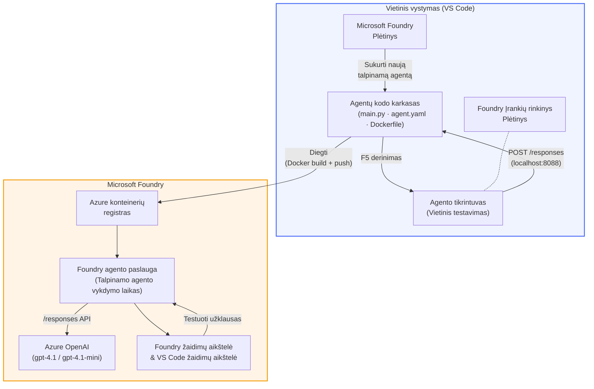

# Foundry įrankių rinkinys + Foundry talpinamų agentų dirbtuvės

[](https://www.python.org/)
[](https://github.com/microsoft/agents)
[](https://learn.microsoft.com/azure/ai-foundry/agents/concepts/hosted-agents/)
[](https://ai.azure.com/)
[](https://learn.microsoft.com/azure/ai-services/openai/)
[](https://learn.microsoft.com/cli/azure/install-azure-cli)
[](https://learn.microsoft.com/azure/developer/azure-developer-cli/install-azd)
[](https://www.docker.com/)
[](https://marketplace.visualstudio.com/items?itemName=ms-windows-ai-studio.windows-ai-studio)
[](LICENSE)

Kurkite, testuokite ir diegkite DI agentus į **Microsoft Foundry agentų tarnybą** kaip **talpinamus agentus** – visiškai iš VS Code naudojant **Microsoft Foundry plėtinį** ir **Foundry įrankių rinkinį**.

> **Talpinami agentai šiuo metu yra peržiūros (preview) stadijoje.** Palaikomos ribotos regionų vietos – žr. [regionų prieinamumą](https://learn.microsoft.com/azure/foundry/agents/concepts/hosted-agents#region-availability).

> Kiekvieno užsiėmimo viduje esantis `agent/` aplankas yra **automatiškai sukuriamas** naudojant Foundry plėtinį – tuomet pritaikote kodą, testuojate lokaliai ir diegiate.

<!-- CO-OP TRANSLATOR LANGUAGES TABLE START -->
[Arabic](../ar/README.md) | [Bengali](../bn/README.md) | [Bulgarian](../bg/README.md) | [Burmese (Myanmar)](../my/README.md) | [Chinese (Simplified)](../zh-CN/README.md) | [Chinese (Traditional, Hong Kong)](../zh-HK/README.md) | [Chinese (Traditional, Macau)](../zh-MO/README.md) | [Chinese (Traditional, Taiwan)](../zh-TW/README.md) | [Croatian](../hr/README.md) | [Czech](../cs/README.md) | [Danish](../da/README.md) | [Dutch](../nl/README.md) | [Estonian](../et/README.md) | [Finnish](../fi/README.md) | [French](../fr/README.md) | [German](../de/README.md) | [Greek](../el/README.md) | [Hebrew](../he/README.md) | [Hindi](../hi/README.md) | [Hungarian](../hu/README.md) | [Indonesian](../id/README.md) | [Italian](../it/README.md) | [Japanese](../ja/README.md) | [Kannada](../kn/README.md) | [Khmer](../km/README.md) | [Korean](../ko/README.md) | [Lithuanian](./README.md) | [Malay](../ms/README.md) | [Malayalam](../ml/README.md) | [Marathi](../mr/README.md) | [Nepali](../ne/README.md) | [Nigerian Pidgin](../pcm/README.md) | [Norwegian](../no/README.md) | [Persian (Farsi)](../fa/README.md) | [Polish](../pl/README.md) | [Portuguese (Brazil)](../pt-BR/README.md) | [Portuguese (Portugal)](../pt-PT/README.md) | [Punjabi (Gurmukhi)](../pa/README.md) | [Romanian](../ro/README.md) | [Russian](../ru/README.md) | [Serbian (Cyrillic)](../sr/README.md) | [Slovak](../sk/README.md) | [Slovenian](../sl/README.md) | [Spanish](../es/README.md) | [Swahili](../sw/README.md) | [Swedish](../sv/README.md) | [Tagalog (Filipino)](../tl/README.md) | [Tamil](../ta/README.md) | [Telugu](../te/README.md) | [Thai](../th/README.md) | [Turkish](../tr/README.md) | [Ukrainian](../uk/README.md) | [Urdu](../ur/README.md) | [Vietnamese](../vi/README.md)

> **Pirmenybę teikiate klonavimui lokaliai?**
>
> Šis saugyklos (repository) turinys turi virš 50 kalbų vertimų, kurie gerokai padidina atsisiuntimo dydį. Norėdami klonuoti be vertimų, naudokite ploną patikrinimą (sparse checkout):
>
> **Bash / macOS / Linux:**
> ```bash
> git clone --filter=blob:none --sparse https://github.com/microsoft-foundry/Foundry_Toolkit_for_VSCode_Lab.git
> cd Foundry_Toolkit_for_VSCode_Lab
> git sparse-checkout set --no-cone '/*' '!translations' '!translated_images'
> ```
>
> **CMD (Windows):**
> ```cmd
> git clone --filter=blob:none --sparse https://github.com/microsoft-foundry/Foundry_Toolkit_for_VSCode_Lab.git
> cd Foundry_Toolkit_for_VSCode_Lab
> git sparse-checkout set --no-cone "/*" "!translations" "!translated_images"
> ```
>
> Tai suteikia viską, ko reikia kursui, bet su gerokai greitesniu atsisiuntimu.
<!-- CO-OP TRANSLATOR LANGUAGES TABLE END -->

---

## Architektūra


**Srautas:** Foundry plėtinys sukuria agentą → jūs pritaikote kodą ir instrukcijas → testuojate lokaliai su Agent Inspector → diegiate į Foundry (Docker atvaizdas nusiųstas į ACR) → patikrinimas Playground aplinkoje.

---

## Ką jūs kursite

| Užsiėmimas | Aprašymas | Būsena |
|-----|-------------|--------|
| **Užsiėmimas 01 – Vienas agentas** | Sukurkite **"Paaiškinkite, kaip vadovui" agentą**, testuokite jį lokaliai ir diekite į Foundry | ✅ Pasiekiamas |
| **Užsiėmimas 02 – Daugiagentinis darbo eiga** | Sukurkite **"CV → Darbo tinkamumo vertintojas"** - 4 agentai bendradarbiauja vertindami CV ir kuriant mokymosi planą | ✅ Pasiekiamas |

---

## Susipažinkite su vadovaujančiuoju agentu

Šiose dirbtuvėse jūs kursite **"Paaiškinkite, kaip vadovui" agentą** – DI agentą, kuris sudėtingą techninį žargoną paverčia ramiais, valdybos salei tinkamais santraukomis. Nes tiesa, niekas C lygmens vadovų nenori girdėti apie „gijų telkinio išsekimą, sukeltą sinchroninių kvietimų v3.2 versijoje.“

Šį agentą sukūriau po per daug atvejų, kai mano puikiai parengtas post-mortemas sulaukdavo atsakymo: *„Tai… ar svetainė neveikia, ar veikia?“*

### Kaip tai veikia

Jūs pateikiate techninį atnaujinimą. Jis pateikia vadovaujančią santrauką – tris svarbiausius punktus, be žargono, be steko išrašų, be egzistencinės baimės. Tik **kas įvyko**, **verslo poveikis** ir **kitas žingsnis**.

### Pamatykite veikiant

**Jūs sakote:**
> „API delsą padidino gijų telkinio išsekimas, sukeltas sinchroninių kvietimų, pristatytų v3.2.“

**Agentas atsako:**

> **Vadovaujanti santrauka:**
> - **Kas įvyko:** Po naujausio išleidimo sistema sulėtėjo.
> - **Verslo poveikis:** Kai kurie vartotojai patyrė delsą naudodamiesi paslauga.
> - **Kitas žingsnis:** Pakeitimas buvo atšauktas ir ruošiama pataisa prieš diegimą iš naujo.

### Kodėl šis agentas?

Tai labai paprastas, vienos paskirties agentas – puikus, norintiems išmokti talpinamų agentų darbo eigą nuo pradžios iki pabaigos, neįstringant į sudėtingas įrankių grandines. Ir tiesa? Kiekvienai inžinerinei komandai tokio reikėtų.

---

## Dirbtuvių struktūra

```
📂 Foundry_Toolkit_for_VSCode_Lab/
├── 📄 README.md                      ← You are here
├── 📂 ExecutiveAgent/                ← Standalone hosted agent project
│   ├── agent.yaml
│   ├── Dockerfile
│   ├── main.py
│   └── requirements.txt
└── 📂 workshop/
    ├── 📂 lab01-single-agent/        ← Full lab: docs + agent code
    │   ├── README.md                 ← Hands-on lab instructions
    │   ├── 📂 docs/                  ← Step-by-step tutorial modules
    │   │   ├── 00-prerequisites.md
    │   │   ├── 01-install-foundry-toolkit.md
    │   │   ├── 02-create-foundry-project.md
    │   │   ├── 03-create-hosted-agent.md
    │   │   ├── 04-configure-and-code.md
    │   │   ├── 05-test-locally.md
    │   │   ├── 06-deploy-to-foundry.md
    │   │   ├── 07-verify-in-playground.md
    │   │   └── 08-troubleshooting.md
    │   └── 📂 agent/                 ← Reference solution (auto-scaffolded by Foundry extension)
    │       ├── agent.yaml
    │       ├── Dockerfile
    │       ├── main.py
    │       └── requirements.txt
    └── 📂 lab02-multi-agent/         ← Resume → Job Fit Evaluator
        ├── README.md                 ← Hands-on lab instructions (end-to-end)
        ├── 📂 docs/                  ← Step-by-step tutorial modules
        │   ├── 00-prerequisites.md
        │   ├── 01-understand-multi-agent.md
        │   ├── 02-scaffold-multi-agent.md
        │   ├── 03-configure-agents.md
        │   ├── 04-orchestration-patterns.md
        │   ├── 05-test-locally.md
        │   ├── 06-deploy-to-foundry.md
        │   ├── 07-verify-in-playground.md
        │   └── 08-troubleshooting.md
        └── 📂 PersonalCareerCopilot/ ← Reference solution (multi-agent workflow)
            ├── agent.yaml
            ├── Dockerfile
            ├── main.py
            └── requirements.txt
```

> **Pastaba:** Kiekvieno užsiėmimo viduje esantis `agent/` aplankas yra tas, kurį sukuria **Microsoft Foundry plėtinys**, kai komandų paletėje paleidžiate `Microsoft Foundry: Create a New Hosted Agent`. Failai vėliau pritaikomi jūsų agento nurodymais, įrankiais ir konfigūracija. Užsiėmime 01 žingsnis po žingsnio pateikiama, kaip tai sukurti nuo nulio.

---

## Pradžia

### 1. Klonuokite saugyklą

```bash
git clone https://github.com/microsoft-foundry/Foundry_Toolkit_for_VSCode_Lab.git
cd Foundry_Toolkit_for_VSCode_Lab
```

### 2. Sukurkite Python virtualią aplinką

```bash
python -m venv venv
```

Aktyvinkite ją:

- **Windows (PowerShell):**
  ```powershell
  .\venv\Scripts\Activate.ps1
  ```
- **macOS / Linux:**
  ```bash
  source venv/bin/activate
  ```

### 3. Įdiekite būtinas bibliotekas

```bash
pip install -r workshop/lab01-single-agent/agent/requirements.txt
```

### 4. Konfigūruokite aplinkos kintamuosius

Nukopijuokite pavyzdinį `.env` failą agentų aplanke ir užpildykite savo reikšmes:

```bash
cp workshop/lab01-single-agent/agent/.env.example workshop/lab01-single-agent/agent/.env
```

Redaguokite `workshop/lab01-single-agent/agent/.env`:

```env
AZURE_AI_PROJECT_ENDPOINT=https://<your-account>.services.ai.azure.com/api/projects/<your-project>
MODEL_DEPLOYMENT_NAME=<your-model-deployment-name>
```

### 5. Vadovaukitės dirbtuvių užsiėmimais

Kiekvienas užsiėmimas yra savarankiškas su savo moduliais. Pradėkite nuo **Užsiėmimo 01**, kad išmoktumėte pagrindus, tada tęskite į **Užsiėmimą 02** daugiagentiniams darbo srautams.

#### Užsiėmimas 01 – Vienas agentas ([pilnos instrukcijos](workshop/lab01-single-agent/README.md))

| # | Modulis | Nuoroda |
|---|--------|------|
| 1 | Perskaitykite reikalavimus | [00-prerequisites.md](workshop/lab01-single-agent/docs/00-prerequisites.md) |
| 2 | Įdiekite Foundry įrankių rinkinį ir Foundry plėtinį | [01-install-foundry-toolkit.md](workshop/lab01-single-agent/docs/01-install-foundry-toolkit.md) |
| 3 | Sukurkite Foundry projektą | [02-create-foundry-project.md](workshop/lab01-single-agent/docs/02-create-foundry-project.md) |
| 4 | Sukurkite talpinamą agentą | [03-create-hosted-agent.md](workshop/lab01-single-agent/docs/03-create-hosted-agent.md) |
| 5 | Konfigūruokite instrukcijas ir aplinką | [04-configure-and-code.md](workshop/lab01-single-agent/docs/04-configure-and-code.md) |
| 6 | Testuokite lokaliai | [05-test-locally.md](workshop/lab01-single-agent/docs/05-test-locally.md) |
| 7 | Diegkite į Foundry | [06-deploy-to-foundry.md](workshop/lab01-single-agent/docs/06-deploy-to-foundry.md) |
| 8 | Patikrinkite playground aplinkoje | [07-verify-in-playground.md](workshop/lab01-single-agent/docs/07-verify-in-playground.md) |
| 9 | Gedimų šalinimas | [08-troubleshooting.md](workshop/lab01-single-agent/docs/08-troubleshooting.md) |

#### Užsiėmimas 02 – Daugiagentinis darbo srautas ([pilnos instrukcijos](workshop/lab02-multi-agent/README.md))

| # | Modulis | Nuoroda |
|---|--------|------|
| 1 | Reikalavimai (Užsiėmimas 02) | [00-prerequisites.md](workshop/lab02-multi-agent/docs/00-prerequisites.md) |
| 2 | Supraskite daugiagentinę architektūrą | [01-understand-multi-agent.md](workshop/lab02-multi-agent/docs/01-understand-multi-agent.md) |
| 3 | Sukurkite daugiagentinį projektą | [02-scaffold-multi-agent.md](workshop/lab02-multi-agent/docs/02-scaffold-multi-agent.md) |
| 4 | Konfigūruokite agentus ir aplinką | [03-configure-agents.md](workshop/lab02-multi-agent/docs/03-configure-agents.md) |
| 5 | Orkestravimo šablonai | [04-orchestration-patterns.md](workshop/lab02-multi-agent/docs/04-orchestration-patterns.md) |
| 6 | Testuokite lokaliai (daugiagentinis) | [05-test-locally.md](workshop/lab02-multi-agent/docs/05-test-locally.md) |
| 7 | Diegti į Foundry | [06-deploy-to-foundry.md](workshop/lab02-multi-agent/docs/06-deploy-to-foundry.md) |
| 8 | Patikrinti žaidimų aikštelėje | [07-verify-in-playground.md](workshop/lab02-multi-agent/docs/07-verify-in-playground.md) |
| 9 | Trikčių šalinimas (daugiaagentinis) | [08-troubleshooting.md](workshop/lab02-multi-agent/docs/08-troubleshooting.md) |

---

## Prižiūrėtojas

<table>
<tr>
    <td align="center"><a href="https://github.com/ShivamGoyal03">
        <br />
        <sub><b>Shivam Goyal</b></sub>
    </a><br />
    </td>
</tr>
</table>

---

## Reikalingos teisės (greita nuoroda)

| Scenarijus | Reikalingos rolės |
|------------|-------------------|
| Sukurti naują Foundry projektą | **Azure AI Owner** prie Foundry ištekliaus |
| Diegti į esamą projektą (nauji ištekliai) | **Azure AI Owner** + **Contributor** prenumeratoje |
| Diegti į visiškai sukonfigūruotą projektą | **Reader** paskyroje + **Azure AI User** projekte |

> **Svarbu:** Azure `Owner` ir `Contributor` rolės apima tik *valdymo* teises, bet ne *kūrimo* (duomenų veiksmų) teises. Norint kurti ir diegti agentus, reikia **Azure AI User** arba **Azure AI Owner**.

---

## Nuorodos

- [Greitasis pradžios vadovas: Įdiekite pirmąjį talpinamą agentą (VS Code)](https://learn.microsoft.com/azure/foundry/agents/quickstarts/quickstart-hosted-agent)
- [Kas yra talpinami agentai?](https://learn.microsoft.com/azure/foundry/agents/concepts/hosted-agents)
- [Sukurti talpinamo agente darbo eigas VS Code](https://learn.microsoft.com/azure/foundry/agents/how-to/vs-code-agents-workflow-pro-code)
- [Įdiegti talpinamą agentą](https://learn.microsoft.com/azure/foundry/agents/how-to/deploy-hosted-agent)
- [RBAC Microsoft Foundry](https://learn.microsoft.com/azure/foundry/concepts/rbac-foundry)
- [Architektūros peržiūros agento pavyzdys](https://github.com/Azure-Samples/agent-architecture-review-sample) - Realus talpinamas agentas su MCP įrankiais, Excalidraw diagramomis ir dvigubu diegimu

---


## Licencija

[MIT](../../LICENSE)

---

<!-- CO-OP TRANSLATOR DISCLAIMER START -->
**Atsakomybės atsisakymas**:  
Šis dokumentas buvo išverstas naudojant dirbtinio intelekto vertimo paslaugą [Co-op Translator](https://github.com/Azure/co-op-translator). Nors stengiamės užtikrinti tikslumą, prašome atkreipti dėmesį, kad automatiniai vertimai gali turėti klaidų ar netikslumų. Originalus dokumentas jo gimtąja kalba laikomas autoritetingu šaltiniu. Svarbiai informacijai rekomenduojamas profesionalus žmogaus vertimas. Mes neatsakome už bet kokius nesusipratimus ar klaidingas interpretacijas, kylančias naudojant šį vertimą.
<!-- CO-OP TRANSLATOR DISCLAIMER END -->