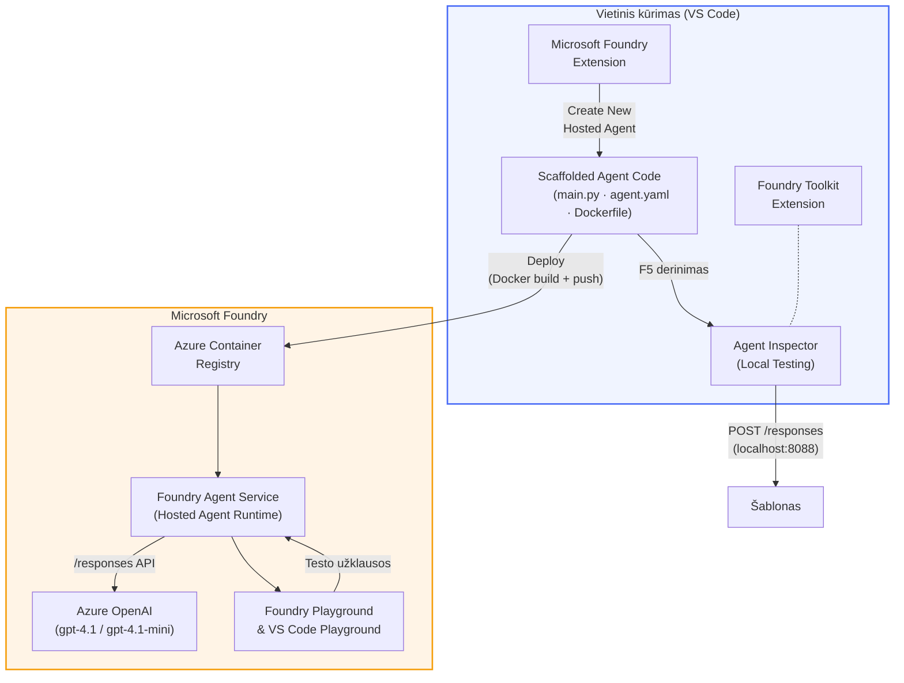

# Foundry Toolkit + Foundry Hosted Agents dirbtuvės

[](https://www.python.org/)
[](https://github.com/microsoft/agents)
[](https://learn.microsoft.com/azure/foundry/agents/concepts/hosted-agents)
[](https://ai.azure.com/)
[](https://learn.microsoft.com/azure/ai-services/openai/)
[](https://learn.microsoft.com/cli/azure/install-azure-cli)
[](https://learn.microsoft.com/azure/developer/azure-developer-cli/install-azd)
[](https://www.docker.com/)
[](https://marketplace.visualstudio.com/items?itemName=ms-windows-ai-studio.windows-ai-studio)
[](LICENSE)

Kurkite, testuokite ir diekite DI agentus į **Microsoft Foundry Agent Service** kaip **Hosted Agents** – visiškai naudodami VS Code su **Microsoft Foundry plėtiniu** ir **Foundry Toolkit**.

> **Hosted Agents šiuo metu yra peržiūros stadijoje.** Palaikomos regionų apribotos - žr. [regionų prieinamumą](https://learn.microsoft.com/azure/foundry/agents/concepts/hosted-agents#region-availability).

> Kiekvieno laboratorinio darbo aplanke `agent/` yra **automatiškai sukurta** Foundry plėtinio – jūs tuomet suasmeninate kodą, testuojate vietoje ir diegiate.

### 🌐 Daugiakalbė palaikymas

#### Palaikoma per GitHub veiksmą (Automatizuota ir visada atnaujinta)

<!-- CO-OP TRANSLATOR LANGUAGES TABLE START -->
[Arabic](../ar/README.md) | [Bengali](../bn/README.md) | [Bulgarian](../bg/README.md) | [Burmese (Myanmar)](../my/README.md) | [Chinese (Simplified)](../zh-CN/README.md) | [Chinese (Traditional, Hong Kong)](../zh-HK/README.md) | [Chinese (Traditional, Macau)](../zh-MO/README.md) | [Chinese (Traditional, Taiwan)](../zh-TW/README.md) | [Croatian](../hr/README.md) | [Czech](../cs/README.md) | [Danish](../da/README.md) | [Dutch](../nl/README.md) | [Estonian](../et/README.md) | [Finnish](../fi/README.md) | [French](../fr/README.md) | [German](../de/README.md) | [Greek](../el/README.md) | [Hebrew](../he/README.md) | [Hindi](../hi/README.md) | [Hungarian](../hu/README.md) | [Indonesian](../id/README.md) | [Italian](../it/README.md) | [Japanese](../ja/README.md) | [Kannada](../kn/README.md) | [Khmer](../km/README.md) | [Korean](../ko/README.md) | [Lithuanian](./README.md) | [Malay](../ms/README.md) | [Malayalam](../ml/README.md) | [Marathi](../mr/README.md) | [Nepali](../ne/README.md) | [Nigerian Pidgin](../pcm/README.md) | [Norwegian](../no/README.md) | [Persian (Farsi)](../fa/README.md) | [Polish](../pl/README.md) | [Portuguese (Brazil)](../pt-BR/README.md) | [Portuguese (Portugal)](../pt-PT/README.md) | [Punjabi (Gurmukhi)](../pa/README.md) | [Romanian](../ro/README.md) | [Russian](../ru/README.md) | [Serbian (Cyrillic)](../sr/README.md) | [Slovak](../sk/README.md) | [Slovenian](../sl/README.md) | [Spanish](../es/README.md) | [Swahili](../sw/README.md) | [Swedish](../sv/README.md) | [Tagalog (Filipino)](../tl/README.md) | [Tamil](../ta/README.md) | [Telugu](../te/README.md) | [Thai](../th/README.md) | [Turkish](../tr/README.md) | [Ukrainian](../uk/README.md) | [Urdu](../ur/README.md) | [Vietnamese](../vi/README.md)

> **Norite kopijuoti vietoje?**
>
> Šis saugykla turi daugiau nei 50 kalbų vertimų, kurie žymiai padidina atsisiuntimo dydį. Norėdami nukopijuoti be vertimų, naudokite ribotą atsisiuntimą:
>
> **Bash / macOS / Linux:**
> ```bash
> git clone --filter=blob:none --sparse https://github.com/microsoft-foundry/Foundry_Toolkit_for_VSCode_Lab.git
> cd Foundry_Toolkit_for_VSCode_Lab
> git sparse-checkout set --no-cone '/*' '!translations' '!translated_images'
> ```
>
> **CMD (Windows):**
> ```cmd
> git clone --filter=blob:none --sparse https://github.com/microsoft-foundry/Foundry_Toolkit_for_VSCode_Lab.git
> cd Foundry_Toolkit_for_VSCode_Lab
> git sparse-checkout set --no-cone "/*" "!translations" "!translated_images"
> ```
>
> Tai suteikia viską, ko reikia kursui užbaigti, su daug greitesniu atsisiuntimu.
<!-- CO-OP TRANSLATOR LANGUAGES TABLE END -->

---

## Architektūra


```mermaid
flowchart TB
    subgraph Local["Vietinis kūrimas (VS Code)"]
        direction TB
        FE["Microsoft Foundry
        Extension"]
        FoundryToolkit["Foundry Toolkit
        Extension"]
        Scaffold["Scaffolded Agent Code
        (main.py · agent.yaml · Dockerfile)"]
        Inspector["Agent Inspector
        (Local Testing)"]
        FE -- "Create New
        Hosted Agent" --> Scaffold
        Scaffold -- "F5 derinimas" --> Inspector
        FoundryToolkit -.- Inspector
    end

    subgraph Cloud["Microsoft Foundry"]
        direction TB
        ACR["Azure Container
        Registry"]
        AgentService["Foundry Agent Service
        (Hosted Agent Runtime)"]
        Model["Azure OpenAI
        (gpt-4.1 / gpt-4.1-mini)"]
        Playground["Foundry Playground
        & VS Code Playground"]
        ACR --> AgentService
        AgentService -- "/responses API" --> Model
        AgentService --> Playground
    end

    Scaffold -- "Deploy
    (Docker build + push)" --> ACR
    Inspector -- "POST /responses
    (localhost:8088)" --> Šablonas
    Playground -- "Testo užklausos" --> AgentService

    style Local fill:#f0f4ff,stroke:#4a6cf7,stroke-width:2px
    style Cloud fill:#fff4e6,stroke:#f59e0b,stroke-width:2px
```

**Srautas:** Foundry plėtinys sukuria agentą → jūs suasmeninate kodą ir nurodymus → testuojate vietoje su Agent Inspector → diegiate į Foundry (Docker atvaizdas siunčiamas į ACR) → patikrinimas Playground.

---

## Ką kursite

| Darbas | Aprašymas | Būsena |
|-----|-------------|--------|
| **Laboratorija 01 - Vienas agentas** | Sukurkite **„Paaiškinkite kaip vadovui“ agentą**, testuokite jį vietoje ir diegkite į Foundry | ✅ Galima |
| **Laboratorija 02 - Daugiagentinis darbas** | Sukurkite **„CV → Darbo tinkamumo vertintojas“** - 4 agentai bendradarbiauja vertindami CV tinkamumą ir generuodami mokymosi planą | ✅ Galima |

---

## Susipažinkite su Executive agentu

Šiose dirbtuvėse kursite **„Paaiškinkite kaip vadovui“ agentą** – DI agentą, kuris sudėtingą techninį žargoną verčia į ramius, tinkamus valdybos posėdžiui santraukas. Nes, tiesą sakant, niekas C-lygyje nenori girdėti apie „vijos valdymo išsekimą, kurį sukėlė sinchroniniai kvietimai, pridėti v3.2 versijoje“.

Šį agentą sukūriau po dar vieno incidento, kai mano kruopščiai paruoštą postmortem atsakymas buvo: *„Tai... ar svetainė neveikia ar veikia?“*

### Kaip tai veikia

Įvedate techninį atnaujinimą. Agentas grąžina vadovo santrauką - tris punktus, be žargono, be steko išklotinės, be egzistencinio nerimo. Tik **kas nutiko**, **verslo poveikis** ir **kitas žingsnis**.

### Pamatykite veikiant

**Jūs sakote:**
> „API vėlavimas padidėjo dėl vijos valdymo išsekimo, kurį sukėlė sinchroniniai kvietimai pridėti v3.2 versijoje.“

**Agentas atsako:**

> **Vadybinio lygmens santrauka:**
> - **Kas nutiko:** Po naujausio išleidimo sistema sulėtėjo.
> - **Verslo poveikis:** Kai kurie naudotojai patyrė vėlavimus naudodamiesi paslauga.
> - **Kitas žingsnis:** Pakeitimas buvo atšauktas ir ruošiamas taisymas prieš pakartotinį diegimą.

### Kodėl šis agentas?

Tai paprastas, vienos paskirties agentas – puikus būdas išmokti hostingų agentų darbo eigą nuo pradžios iki pabaigos be sudėtingų priemonių grandinių. Ir tiesą sakant? Kiekviena inžinerinė komanda galėtų tokį turėti.

---

## Dirbtuvių struktūra

```
📂 Foundry_Toolkit_for_VSCode_Lab/
├── 📄 README.md                      ← You are here
└── 📂 workshop/
    ├── 📂 lab01-single-agent/        ← Full lab: docs + agent code
    │   ├── README.md                 ← Hands-on lab instructions
    │   ├── 📂 docs/                  ← Step-by-step tutorial modules
    │   │   ├── 00-prerequisites.md
    │   │   ├── 01-setup.md
    │   │   ├── 02-create-hosted-agent.md
    │   │   ├── 03-configure-and-code.md
    │   │   ├── 04-test-locally.md
    │   │   ├── 05-deploy-to-foundry.md
    │   │   ├── 06-verify-in-playground.md
    │   │   ├── 07-summary.md
    │   │   └── 08-troubleshooting.md
    │   └── 📂 agent/                 ← Reference solution (auto-scaffolded by Foundry extension)
    │       ├── agent.yaml
    │       ├── Dockerfile
    │       ├── main.py
    │       └── requirements.txt
    └── 📂 lab02-multi-agent/         ← Resume → Job Fit Evaluator
        ├── README.md                 ← Hands-on lab instructions (end-to-end)
        ├── 📂 docs/                  ← Step-by-step tutorial modules
        │   ├── 00-prerequisites.md
        │   ├── 01-understand-multi-agent.md
        │   ├── 02-scaffold-multi-agent.md
        │   ├── 03-configure-agents.md
        │   ├── 04-orchestration-patterns.md
        │   ├── 05-test-locally.md
        │   ├── 06-deploy-to-foundry.md
        │   ├── 07-verify-in-playground.md
        │   └── 08-troubleshooting.md
        └── 📂 PersonalCareerCopilot/ ← Reference solution (multi-agent workflow)
            ├── agent.yaml
            ├── Dockerfile
            ├── main.py
            └── requirements.txt
```

> **Pastaba:** Kiekvienos laboratorijos aplanke `agent/` yra tai, ką sugeneruoja **Microsoft Foundry plėtinys**, kai vykdote komandą `Microsoft Foundry: Create a New Hosted Agent` Komandų paletėje. Failai tuomet suasmeninami su jūsų agento nurodymais, įrankiais ir konfigūracija. Laboratorija 01 žingsnis po žingsnio padeda sukurti tai iš naujo.

---

## Pradžia

### 1. Nukopijuokite saugyklą

```bash
git clone https://github.com/microsoft-foundry/Foundry_Toolkit_for_VSCode_Lab.git
cd Foundry_Toolkit_for_VSCode_Lab
```

### 2. Sukurkite Python virtualią aplinką

```bash
python -m venv venv
```

Aktyvuokite ją:

- **Windows (PowerShell):**
  ```powershell
  .\venv\Scripts\Activate.ps1
  ```
- **macOS / Linux:**
  ```bash
  source venv/bin/activate
  ```

### 3. Įdiekite priklausomybes

```bash
pip install -r workshop/lab01-single-agent/agent/requirements.txt
```

### 4. Sukonfigūruokite aplinkos kintamuosius

Nukopijuokite pavyzdinį `.env` failą agento aplanke ir užpildykite savo reikšmes:

```bash
cp workshop/lab01-single-agent/agent/.env.example workshop/lab01-single-agent/agent/.env
```

Redaguokite `workshop/lab01-single-agent/agent/.env`:

```env
AZURE_AI_PROJECT_ENDPOINT=https://<your-account>.services.ai.azure.com/api/projects/<your-project>
AZURE_AI_MODEL_DEPLOYMENT_NAME=<your-model-deployment-name>
```

### 5. Sekite dirbtuvių laboratorijomis

Kiekviena laboratorija yra savarankiška su savo moduliais. Pradėkite nuo **Laboratorijos 01**, kad išmoktumėte pagrindus, tada pereikite prie **Laboratorijos 02** daugiaagentėms darbo eigoms.

#### Laboratorija 01 - Vienas agentas ([pilnos instrukcijos](workshop/lab01-single-agent/README.md))

| # | Modulis | Nuoroda |
|---|--------|------|
| 1 | Perskaitykite išankstines sąlygas | [00-prerequisites.md](workshop/lab01-single-agent/docs/00-prerequisites.md) |
| 2 | Įdiekite Foundry Toolkit ir Foundry plėtinį | [01-setup.md](workshop/lab01-single-agent/docs/01-setup.md) |
| 3 | Sukurkite Foundry projektą | [01-setup.md](workshop/lab01-single-agent/docs/01-setup.md) |
| 4 | Sukurkite hostingų agentą | [02-create-hosted-agent.md](workshop/lab01-single-agent/docs/02-create-hosted-agent.md) |
| 5 | Sukonfigūruokite nurodymus ir aplinką | [03-configure-and-code.md](workshop/lab01-single-agent/docs/03-configure-and-code.md) |
| 6 | Testuokite vietoje | [04-test-locally.md](workshop/lab01-single-agent/docs/04-test-locally.md) |
| 7 | Diegkite į Foundry | [05-deploy-to-foundry.md](workshop/lab01-single-agent/docs/05-deploy-to-foundry.md) |
| 8 | Patikrinkite Playground | [06-verify-in-playground.md](workshop/lab01-single-agent/docs/06-verify-in-playground.md) |
| 9 | Gedimų šalinimas | [08-troubleshooting.md](workshop/lab01-single-agent/docs/08-troubleshooting.md) |

#### Laboratorija 02 - Daugiagentinis darbas ([pilnos instrukcijos](workshop/lab02-multi-agent/README.md))

| # | Modulis | Nuoroda |
|---|--------|------|
| 1 | Išankstinės sąlygos (Laboratorija 02) | [00-prerequisites.md](workshop/lab02-multi-agent/docs/00-prerequisites.md) |
| 2 | Supraskite daugiagentės architektūrą | [01-understand-multi-agent.md](workshop/lab02-multi-agent/docs/01-understand-multi-agent.md) |
| 3 | Sukurkite daugiaagentį projektą | [02-scaffold-multi-agent.md](workshop/lab02-multi-agent/docs/02-scaffold-multi-agent.md) |
| 4 | Suprogramuokite agentus ir aplinką | [03-configure-agents.md](workshop/lab02-multi-agent/docs/03-configure-agents.md) |
| 5 | Orkestracijos modeliai | [04-orchestration-patterns.md](workshop/lab02-multi-agent/docs/04-orchestration-patterns.md) |
| 6 | Testuokite vietoje (daugiagentis) | [05-test-locally.md](workshop/lab02-multi-agent/docs/05-test-locally.md) |

| 7 | Diegti į Foundry | [06-deploy-to-foundry.md](workshop/lab02-multi-agent/docs/06-deploy-to-foundry.md) |
| 8 | Patikrinti žaidimų aikštelėje | [07-verify-in-playground.md](workshop/lab02-multi-agent/docs/07-verify-in-playground.md) |
| 9 | Trikčių šalinimas (daugiaagentinis) | [08-troubleshooting.md](workshop/lab02-multi-agent/docs/08-troubleshooting.md) |

---

## Priežiūros asmuo

<table>
<tr>
    <td align="center"><a href="https://github.com/ShivamGoyal03">
        <br />
        <sub><b>Shivam Goyal</b></sub>
    </a><br />
    </td>
</tr>
</table>

---

## Reikalingos teisės (greita nuoroda)

| Scenarijus | Reikalingos rolės |
|----------|---------------|
| Sukurti naują Foundry projektą | **Azure AI Owner** prie Foundry ištekliaus |
| Diegti į esamą projektą (nauji ištekliai) | **Azure AI Owner** + **Contributor** prenumeratoje |
| Diegti į visiškai sukonfigūruotą projektą | **Reader** paskyroje + **Azure AI User** projekte |

> **Svarbu:** Azure `Owner` ir `Contributor` rolės apima tik *valdymo* teises, ne *kūrimo* (duomenų veiksmų) teises. Jums reikia **Azure AI User** arba **Azure AI Owner** teisių, kad galėtumėte kurti ir diegti agentus.

---

## Nuorodos

- [Greitas startas: Diegti savo pirmąjį talpinamą agentą (VS Code)](https://learn.microsoft.com/azure/foundry/agents/quickstarts/quickstart-hosted-agent)
- [Kas yra talpinami agentai?](https://learn.microsoft.com/azure/foundry/agents/concepts/hosted-agents)
- [Kurti talpinamų agentų darbo eigas VS Code](https://learn.microsoft.com/azure/foundry/agents/how-to/vs-code-agents-workflow-pro-code)
- [Diegti talpinamą agentą](https://learn.microsoft.com/azure/foundry/agents/how-to/deploy-hosted-agent)
- [RBAC Microsoft Foundry](https://learn.microsoft.com/azure/foundry/concepts/rbac-foundry)
- [Architektūros peržiūros agente pavyzdys](https://github.com/Azure-Samples/agent-architecture-review-sample) - realaus pasaulio talpinamas agentas su MCP įrankiais, Excalidraw diagramomis ir dvigubu diegimu

---


## Licencija

[MIT](../../LICENSE)

---

<!-- CO-OP TRANSLATOR DISCLAIMER START -->
**Atsakomybės apribojimas**:
Šis dokumentas buvo išverstas naudojant dirbtinio intelekto vertimo paslaugą [Co-op Translator](https://github.com/Azure/co-op-translator). Nors siekiame tikslumo, prašome atkreipti dėmesį, kad automatiniai vertimai gali turėti klaidų ar netikslumų. Originalus dokumentas jo gimtąja kalba laikomas autoritetingu šaltiniu. Svarbiai informacijai rekomenduojama naudoti profesionalų žmogiškąjį vertimą. Mes neatsakome už jokius nesusipratimus ar neteisingą interpretaciją, kilusią naudojantis šiuo vertimu.
<!-- CO-OP TRANSLATOR DISCLAIMER END -->