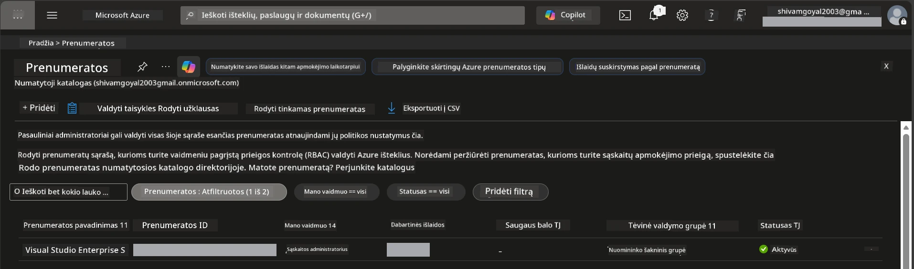

# Modulis 0 - Išankstiniai reikalavimai

Prieš pradedant dirbtuves, įsitikinkite, kad turite šiuos įrankius, prieigą ir aplinką paruoštą. Sekite kiekvieną žemiau pateiktą žingsnį – nepraleiskite.

---

## 1. Azure paskyra ir prenumerata

### 1.1 Sukurkite arba patikrinkite savo Azure prenumeratą

1. Atidarykite naršyklę ir eikite į [https://azure.microsoft.com/free/](https://azure.microsoft.com/free/).
2. Jei neturite Azure paskyros, spustelėkite **Start free** ir sekite registracijos procesą. Reikės Microsoft paskyros (arba ją sukurkite) ir kreditinės kortelės tapatybės patvirtinimui.
3. Jei jau turite paskyrą, prisijunkite adresu [https://portal.azure.com](https://portal.azure.com).
4. Portale spustelėkite kairėje pusėje esančią **Subscriptions** skiltį (arba paieškoje viršuje įrašykite „Subscriptions“).
5. Patikrinkite, ar matote bent vieną **Active** prenumeratą. Užsirašykite **Subscription ID** – jo prireiks vėliau.



### 1.2 Supraskite reikalingas RBAC roles

[Hosted Agent](https://learn.microsoft.com/azure/foundry/agents/concepts/hosted-agents) diegimui reikalingos **duomenų veiksmų** teisės, kurių standartinės Azure `Owner` ir `Contributor` rolės **neturi**. Jums reikės vienos iš šių [rolės kombinacijų](https://learn.microsoft.com/azure/foundry/concepts/rbac-foundry#built-in-roles):

| Scenarijus | Reikalaujamos rolės | Kur jas priskirti |
|------------|---------------------|-------------------|
| Sukurti naują Foundry projektą | **Azure AI Owner** Foundry resursui | Foundry resursas Azure portale |
| Diegti į esamą projektą (nauji resursai) | **Azure AI Owner** + **Contributor** prenumeratai | Prenumerata + Foundry resursas |
| Diegti į visiškai sukonfigūruotą projektą | **Reader** paskyrai + **Azure AI User** projektui | Paskyra + Projektas Azure portale |

> **Svarbu:** Azure `Owner` ir `Contributor` rolės apima tik *valdymo* teises (ARM operacijos). Jums reikalinga [**Azure AI User**](https://learn.microsoft.com/azure/foundry/concepts/rbac-foundry#built-in-roles) (ar aukštesnė) rolė *duomenų veiksmams* vykdyti, pvz., `agents/write`, kuri būtina agentų kūrimui ir diegimui. Šias roles priskirsite [Modulyje 2](02-create-foundry-project.md).

---

## 2. Įdiekite vietinius įrankius

Įdiekite kiekvieną žemiau nurodytą įrankį. Įdiegus, patikrinkite, ar jis veikia vykdydami patikros komandą.

### 2.1 Visual Studio Code

1. Nueikite į [https://code.visualstudio.com/](https://code.visualstudio.com/).
2. Atsisiųskite diegimo programą pagal savo OS (Windows/macOS/Linux).
3. Paleiskite diegimo programą su numatytosiomis nustatymais.
4. Atidarykite VS Code ir įsitikinkite, kad programa paleidžiama.

### 2.2 Python 3.10+

1. Nueikite į [https://www.python.org/downloads/](https://www.python.org/downloads/).
2. Atsisiųskite Python 3.10 arba naujesnę versiją (rekomenduojama 3.12+).
3. **Windows:** Diegimo metu pirmame lange pažymėkite **"Add Python to PATH"**.
4. Atidarykite terminalą ir patikrinkite:

   ```powershell
   python --version
   ```

   Tikėtinas išvestis: `Python 3.10.x` arba naujesnė.

### 2.3 Azure CLI

1. Eikite į [https://learn.microsoft.com/cli/azure/install-azure-cli](https://learn.microsoft.com/cli/azure/install-azure-cli).
2. Vadovaukitės diegimo instrukcijomis savo OS.
3. Patikrinkite:

   ```powershell
   az --version
   ```

   Tikėtina versija: `azure-cli 2.80.0` arba naujesnė.

4. Prisijunkite:

   ```powershell
   az login
   ```

### 2.4 Azure Developer CLI (azd)

1. Eikite į [https://learn.microsoft.com/azure/developer/azure-developer-cli/install-azd](https://learn.microsoft.com/azure/developer/azure-developer-cli/install-azd).
2. Vadovaukitės diegimo instrukcijomis savo OS. Windows:

   ```powershell
   winget install microsoft.azd
   ```

3. Patikrinkite:

   ```powershell
   azd version
   ```

   Tikėtina versija: `azd version 1.x.x` arba naujesnė.

4. Prisijunkite:

   ```powershell
   azd auth login
   ```

### 2.5 Docker Desktop (pasirinktinai)

Docker reikalingas tik, jei norite vietoje sukurti ir išbandyti konteinerio atvaizdą prieš diegiant. Foundry plėtinys automatiškai atlieka konteinerio kūrimą diegimo metu.

1. Eikite į [https://docs.docker.com/get-docker/](https://docs.docker.com/get-docker/).
2. Atsisiųskite ir įdiekite Docker Desktop savo OS.
3. **Windows:** Diegimo metu pasirinkite WSL 2 backend.
4. Paleiskite Docker Desktop ir palaukite, kol sistemos dėklo ikona rodys **„Docker Desktop is running“**.
5. Atidarykite terminalą ir patikrinkite:

   ```powershell
   docker info
   ```

   Turėtų būti atspausdinta Docker sistemos informacija be klaidų. Jei matote pranešimą `Cannot connect to the Docker daemon`, palaukite dar kelias sekundes, kol Docker pilnai paleidžiamas.

---

## 3. Įdiekite VS Code plėtinius

Jums reikia trijų plėtinių. Įdiekite juos **prieš** dirbtuves.

### 3.1 Microsoft Foundry for VS Code

1. Atidarykite VS Code.
2. Paspauskite `Ctrl+Shift+X`, kad atidarytumėte Plėtinių skiltį.
3. Paieškos laukelyje įrašykite **"Microsoft Foundry"**.
4. Raskite **Microsoft Foundry for Visual Studio Code** (leidėjas: Microsoft, ID: `TeamsDevApp.vscode-ai-foundry`).
5. Spustelėkite **Install**.
6. Įdiegus, turėtumėte matyti **Microsoft Foundry** ikoną veiklos juostoje (kairiajame šone).

### 3.2 Foundry Toolkit

1. Plėtinių skiltyje (`Ctrl+Shift+X`) ieškokite **"Foundry Toolkit"**.
2. Raskite **Foundry Toolkit** (leidėjas: Microsoft, ID: `ms-windows-ai-studio.windows-ai-studio`).
3. Spustelėkite **Install**.
4. **Foundry Toolkit** ikona turėtų pasirodyti veiklos juostoje.

### 3.3 Python

1. Plėtinių skiltyje ieškokite **"Python"**.
2. Raskite **Python** (leidėjas: Microsoft, ID: `ms-python.python`).
3. Spustelėkite **Install**.

---

## 4. Prisijunkite prie Azure iš VS Code

[Microsoft Agent Framework](https://learn.microsoft.com/agent-framework/overview/) naudoja [`DefaultAzureCredential`](https://learn.microsoft.com/azure/developer/python/sdk/authentication/credential-chains#defaultazurecredential-overview) autentifikacijai. Jums reikia būti prisijungusiam prie Azure VS Code.

### 4.1 Prisijunkite per VS Code

1. Pažvelkite į apatini kairį VS Code kampą ir spustelėkite **Accounts** ikoną (žmogaus siluetas).
2. Spustelėkite **Sign in to use Microsoft Foundry** (arba **Sign in with Azure**).
3. Atsidarys naršyklės langas – prisijunkite naudodami Azure paskyrą, turinčią prieigą prie prenumeratos.
4. Grįžkite į VS Code. Apačioje kairėje turėtumėte matyti savo paskyros vardą.

### 4.2 (Pasirinktinai) Prisijunkite per Azure CLI

Jei įdiegėte Azure CLI ir norite naudoti CLI autentifikaciją:

```powershell
az login
```

Tai atidarys naršyklę prisijungimui. Prisijungę nustatykite tinkamą prenumeratą:

```powershell
az account set --subscription "<your-subscription-id>"
```

Patikrinkite:

```powershell
az account show --query "{name:name, id:id, state:state}" --output table
```

Turėtumėte matyti savo prenumeratos pavadinimą, ID ir būseną = `Enabled`.

### 4.3 (Alternatyva) Paslaugų pagrindinis naudotojas (service principal) autentifikacija

CI/CD ar bendrinamoms aplinkoms nustatykite šiuos aplinkos kintamuosius vietoje:

```powershell
$env:AZURE_TENANT_ID = "<your-tenant-id>"
$env:AZURE_CLIENT_ID = "<your-client-id>"
$env:AZURE_CLIENT_SECRET = "<your-client-secret>"
```

---

## 5. Peržiūros apribojimai

Prieš tęsiant, žinokite apie esamus apribojimus:

- [**Hosted Agents**](https://learn.microsoft.com/azure/foundry/agents/concepts/hosted-agents) šiuo metu yra **viešoje peržiūroje** – nerekomenduojama naudoti gamybos darbams.
- **Palaikomų regionų skaičius ribotas** – prieš kuriant resursus pasitikrinkite [regiono prieinamumą](https://learn.microsoft.com/azure/foundry/agents/concepts/hosted-agents#region-availability). Jei pasirinksite nepalaikomą regioną, diegimas nepavyks.
- Paketas `azure-ai-agentserver-agentframework` yra priešleidimo (`1.0.0b16`) versija – API gali keistis.
- Mastelio ribos: hosted agentai palaiko 0-5 kopijas (įskaitant mastelio mažinimą iki nulio).

---

## 6. Prieš startą – patikros sąrašas

Pereikite kiekvieną žemiau esančią užduotį. Jei kur nors įvyko klaida, grįžkite ir ištaisykite prieš tęsiant.

- [ ] VS Code atsidaro be klaidų
- [ ] Python 3.10+ yra jūsų PATH (komanda `python --version` atspausdina `3.10.x` arba naujesnę)
- [ ] Azure CLI įdiegtas (komanda `az --version` atspausdina `2.80.0` arba naujesnę)
- [ ] Azure Developer CLI įdiegtas (komanda `azd version` atspausdina versijos informaciją)
- [ ] Microsoft Foundry plėtinys įdiegtas (matomas piktograma veiklos juostoje)
- [ ] Foundry Toolkit plėtinys įdiegtas (matomas piktograma veiklos juostoje)
- [ ] Python plėtinys įdiegtas
- [ ] Prisijungta prie Azure VS Code (patikrinkite Accounts piktogramą apatiniame kairiajame kampe)
- [ ] Komanda `az account show` grąžina jūsų prenumeratą
- [ ] (Pasirinktinai) Docker Desktop veikia (komanda `docker info` grąžina sistemos informaciją be klaidų)

### Patikros taškas

Atidarykite VS Code Veiklos juostą ir įsitikinkite, kad matote tiek **Foundry Toolkit**, tiek **Microsoft Foundry** šoninės juostos peržiūras. Spustelėkite kiekvieną, kad patikrintumėte, ar jos užsikrauna be klaidų.

---

**Toliau:** [01 - Įdiegti Foundry Toolkit ir Foundry plėtinį →](01-install-foundry-toolkit.md)

---

<!-- CO-OP TRANSLATOR DISCLAIMER START -->
**Atsakomybės apribojimas**:  
Šis dokumentas buvo išverstas naudojant dirbtinio intelekto vertimo paslaugą [Co-op Translator](https://github.com/Azure/co-op-translator). Nors siekiame tikslumo, prašome atkreipti dėmesį, kad automatizuoti vertimai gali turėti klaidų ar netikslumų. Originalus dokumentas gimtąja kalba turėtų būti laikomas autoritetingu šaltiniu. Svarbiai informacijai rekomenduojama naudoti profesionalią žmogaus atliktą vertimą. Mes neatsakome už bet kokius nesusipratimus ar klaidingus aiškinimus, kylančius iš šio vertimo naudojimo.
<!-- CO-OP TRANSLATOR DISCLAIMER END -->