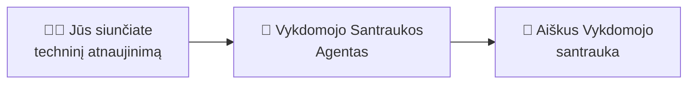

# Modulis 0 - Įvadas

⏱️ ~10 min

> [!WARNING]
> **Peržiūra ir apribojimai:** [Talpinami agentai](https://learn.microsoft.com/azure/foundry/agents/concepts/hosted-agents) šiuo metu yra **viešos peržiūros** stadijoje – nerekomenduojama naudoti gamybos darbo krūviams. Atkreipkite dėmesį į šiuos dalykus:
> - **Palaikomos sritys yra ribotos** – prieš kuriant išteklius patikrinkite [regiono prieinamumą](https://learn.microsoft.com/azure/foundry/agents/concepts/hosted-agents#region-availability). Jei pasirinksite nepalaikomą regioną, diegimas nepavyks.
> - `azure-ai-agentserver-agentframework` paketas yra pirminės versijos – API gali keistis tarp versijų.
> - Skalės limitai: talpinami agentai palaiko 0–5 kopijas (įskaitant skalavimą iki nulio).
> - Kai kurios šio seminaro metu rodomos funkcijos gali keistis, nes paslauga juda link GA.

## Ką kursite

Šiame seminare kursite **„Paaiškinkite kaip vadovui“** agentą – talpinamą DI agentą, kuris sudėtingus techninius atnaujinimus perrašo į paprastą anglų kalbos santrauką vadovams.

```mermaid
flowchart LR
    A["🧑‍💻 Jūs siunčiate\ntechninį atnaujinimą"] --> B["🤖 Vykdomojo Santraukos\nAgentas"]
    B --> C["📝 Aiškus Vykdomojo\nsantrauka"]
```

**Agentas naudoja:**
- **Microsoft Agent Framework** – agento logikai ir struktūrai
- **Foundry Toolkit for VS Code** – kad sukurtų, testuotų vietoje ir diegtų
- **DI modelį** (pvz., `gpt-4.1-mini/gpt-5-mini`) – santraukų generavimui

Šio laboratorinio darbo pabaigoje turėsite veikiančią agentą, kurią galėsite testuoti vietoje per Agent Inspector ir, jei norite, diegti į debesį.

---

## Kas yra talpinami agentai?

**Talpinamas agentas** yra DI agentas, veikiantis kaip valdomoji paslauga Microsoft Foundry. Vietoj to, kad valdytumėte savo infrastruktūrą, jūs paketuojate agento kodą į konteinerį, o Foundry rūpinasi jo skalavimu, talpinimu ir prieiga per standartinį HTTP galinį tašką.

| Sąvoka | Reikšmė |
|---------|--------------|
| **Agentas** | Jūsų Python kodas, kuris gauna naudotojo žinutę, kviečia DI modelį ir grąžina struktūruotą atsakymą |
| **Talpinamas** | Foundry paleidžia jūsų konteinerį – nereikia VM, Kubernetes ar infrastruktūros valdymo |
| **Atsakymų protokolas** | Standartinis HTTP API (`POST /responses`), kurį gali naudoti bet kuris klientas bendraujant su jūsų agentu |
| **Agent Inspector** | Vietinis testavimo UI (įtrauktas į Foundry Toolkit), leidžiantis bendrauti su agentu prieš diegiant |

Šiame seminare pradėsite nuo nulio ir padarysite pilnai talpinamą agentą – arba galite sustoti ties vietiniu testavimu, jei taip pasirinksite.

---

## Pasirinkite savo kelią

> ⚠️ **Prieš tęsdami, pasirinkite vieną kelią.** Jūsų pasirinkimas nulems, kokias priemones įdiegti ir kokie moduliai galioja. Vėliau galite pereiti iš B kelio į A, jei gausite prenumeratą.

<strong>🅰️ A kelias – Azure debesies aplinka (reikia Azure prenumeratos)</strong>

| | Išsamiau |
|---|---|
| **Kam skirtas?** | Turite aktyvią Azure prenumeratą ir galite kurti Foundry išteklius |
| **Modelis** | Azure OpenAI per Foundry (pvz., `gpt-4.1-mini/gpt-5-mini`) |
| **Padengti moduliai** | Visi moduliai (00–07) |
| **Diegti į debesį?** | ✅ Taip – pilnas nuoseklus diegimas |

<strong>🅱️ B kelias – vietinis / nemokamas lygis (nereikia Azure prenumeratos)</strong>

| | Išsamiau |
|---|---|
| **Kam skirtas?** | MVP, studentams ar tiems, kurie neturi prieigos prie Azure |
| **Modelis** | **Foundry Local** (nemokamas, veikia jūsų kompiuteryje) |
| **Padengti moduliai** | Moduliai 00–04 (neįtraukiant diegimo ir debesies patikrinimo) |
| **Diegti į debesį?** | ❌ Ne – tik vietinis testavimas per Agent Inspector |

---

## Visiems keliams: Privalomi įrankiai

Įdiekite kiekvieną įrankį žemiau. Įdiegę patikrinkite jų veikimą vykdydami patikros komandą.

| # | Įrankis | Versija | Diegimas | Patikra (tikėtinas rezultatas) |
|---|------|---------|---------|---------------------------|
| 1 | **Visual Studio Code** | Naujausia | [code.visualstudio.com](https://code.visualstudio.com/) | Atsidaro be klaidų |
| 2 | **Python** | 3.12 ar naujesnė | [python.org/downloads](https://www.python.org/downloads/) | `python --version` $\rightarrow$ `Python 3.12.x` |
| 3 | **Foundry Toolkit for VS Code** | Naujausia | Plėtinio ID: `ms-windows-ai-studio.windows-ai-studio` | Foundry piktograma veiksmų juostoje |
| 4 | **Python plėtinys VS Code** | Naujausia | Plėtinio ID: `ms-python.python` | Įdiegtas plėtinių skydelyje |

> [!TIP]
> **Diegimo patarimai:**
> - **Python PATH (Windows):** Visada pažymėkite **„Add Python to PATH“** pirmame Python diegimo ekrane. Be to, `python` neatpažins jūsų terminale.
> - **Kelios Python versijos:** Jei turite įdiegtą Python 3.10 ir 3.12, naudokite `python3.12 -m venv .venv`, kad užtikrintumėte tinkamą versiją virtualioje aplinkoje.
> - **Docker WSL 2 (Windows):** Diegiant Docker Desktop, būtinai pasirinkite **WSL 2 backend**. Docker su Hyper-V veikia lėčiau ir gali sukelti problemų su Foundry konteinerių kūrimu.
> - **Docker nesikrauna?** Palaukite 30–60 sekundžių nuo Docker Desktop paleidimo. Vykdykite `docker info` – jei matote „Cannot connect to the Docker daemon“, Docker vis dar inicijuojasi.
> - **VS Code plėtiniai nesikrauna?** Po plėtinių įdiegimo perkraukite langą: `Ctrl+Shift+P` → `Developer: Reload Window`.

> **Windows naudotojams:** Pažymėkite **„Add Python to PATH“** Python diegimo metu.

**Toliau:** [01 - Sąranka →](01-setup.md)

---

<!-- CO-OP TRANSLATOR DISCLAIMER START -->
**Atsakomybės apribojimas**:
Šis dokumentas buvo išverstas naudojant dirbtinio intelekto vertimo paslaugą [Co-op Translator](https://github.com/Azure/co-op-translator). Nors siekiame tikslumo, prašome atkreipti dėmesį, kad automatiniai vertimai gali turėti klaidų ar netikslumų. Originalus dokumentas jo gimtąja kalba laikomas autoritetingu šaltiniu. Svarbiai informacijai rekomenduojama naudoti profesionalų žmogiškąjį vertimą. Mes neatsakome už jokius nesusipratimus ar neteisingą interpretaciją, kilusią naudojantis šiuo vertimu.
<!-- CO-OP TRANSLATOR DISCLAIMER END -->