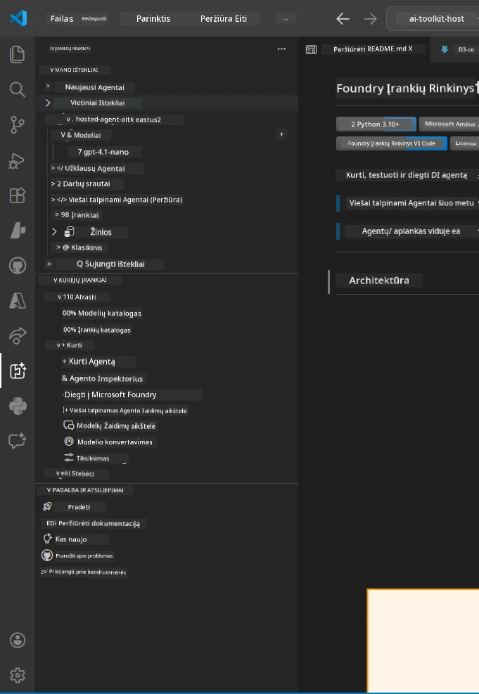
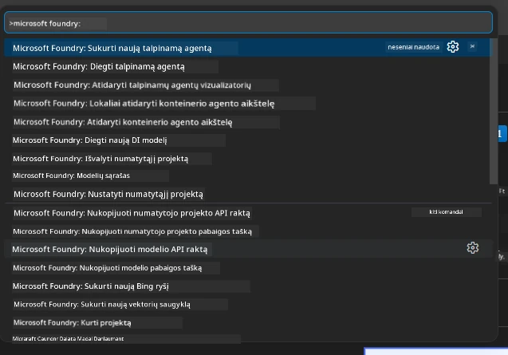

# 1 modulis – įdiekite Foundry Toolkit ir Foundry plėtinį

Šis modulis padės jums įdiegti ir patikrinti du pagrindinius VS Code plėtinius šiam dirbtuvių užsiėmimui. Jei jau juos įdiegėte [0 modulyje](00-prerequisites.md), šį modulį naudokite norėdami patikrinti, ar jie veikia tinkamai.

---

## 1 žingsnis: Įdiekite Microsoft Foundry plėtinį

**Microsoft Foundry for VS Code** plėtinys yra pagrindinis įrankis, skirtas kurti Foundry projektus, diegti modelius, kurti talpinamus agentus ir diegti tiesiogiai iš VS Code.

1. Atidarykite VS Code.
2. Paspauskite `Ctrl+Shift+X`, kad atidarytumėte **Plėtinių** skydelį.
3. Viršuje esančiame paieškos lauke įveskite: **Microsoft Foundry**
4. Suraskite rezultatą pavadinimu **Microsoft Foundry for Visual Studio Code**.
   - Leidėjas: **Microsoft**
   - Plėtinio ID: `TeamsDevApp.vscode-ai-foundry`
5. Spustelėkite mygtuką **Install**.
6. Palaukite, kol įdiegimas bus baigtas (matysite nedidelį progreso indikatorius).
7. Po įdiegimo pažvelkite į **Veiklos juostą** (vertikali piktogramų juosta kairėje VS Code pusėje). Turėtumėte pamatyti naują **Microsoft Foundry** piktogramą (atrodo kaip deimantas/AI piktograma).
8. Spustelėkite **Microsoft Foundry** piktogramą, kad atidarytumėte šoninės juostos rodinį. Turėtumėte matyti skyrius:
   - **Resources** (arba Projektais)
   - **Agents**
   - **Models**

> **Jei piktograma nematoma:** Pabandykite perkrauti VS Code (`Ctrl+Shift+P` → `Developer: Reload Window`).

---

## 2 žingsnis: Įdiekite Foundry Toolkit plėtinį

**Foundry Toolkit** plėtinys suteikia [**Agent Inspector**](https://learn.microsoft.com/azure/foundry/agents/how-to/vs-code-agents-workflow-pro-code) – vizualią sąsają agentų lokaliniam testavimui ir derinimui, taip pat siūlo žaidimų aikštelę, modelių valdymą ir vertinimo įrankius.

1. Plėtinių skydelyje (`Ctrl+Shift+X`) išvalykite paieškos lauką ir įveskite: **Foundry Toolkit**
2. Suraskite **Foundry Toolkit** rezultatuose.
   - Leidėjas: **Microsoft**
   - Plėtinio ID: `ms-windows-ai-studio.windows-ai-studio`
3. Spustelėkite **Install**.
4. Po įdiegimo **Foundry Toolkit** piktograma pasirodys Veiklos juostoje (atrodo kaip robotas/žėrinti piktograma).
5. Spustelėkite **Foundry Toolkit** piktogramą, kad atidarytumėte šoninės juostos rodinį. Turėtumėte pamatyti Foundry Toolkit pradžios ekraną su pasirinkimais:
   - **Models**
   - **Playground**
   - **Agents**

---

## 3 žingsnis: Patikrinkite, ar abu plėtiniai veikia

### 3.1 Patikrinkite Microsoft Foundry plėtinį

1. Spustelėkite **Microsoft Foundry** piktogramą Veiklos juostoje.
2. Jei esate prisijungę prie Azure (iš 0 modulio), turėtumėte matyti savo projektus po skyriaus **Resources**.
3. Jei paprašys prisijungti, spustelėkite **Sign in** ir vykdykite autentifikacijos veiksmus.
4. Įsitikinkite, kad šoninė juosta atsidaro be klaidų.

### 3.2 Patikrinkite Foundry Toolkit plėtinį

1. Spustelėkite **Foundry Toolkit** piktogramą Veiklos juostoje.
2. Įsitikinkite, kad pradžios vaizdas arba pagrindinis skydelis atsidaro be klaidų.
3. Šiuo metu nereikia nieko konfigūruoti – **Agent Inspector** naudosime [5 modulyje](05-test-locally.md).

### 3.3 Patikrinkite per komandų paletę

1. Paspauskite `Ctrl+Shift+P`, kad atidarytumėte Komandų paletę.
2. Įveskite **"Microsoft Foundry"** – turėtumėte matyti tokias komandas kaip:
   - `Microsoft Foundry: Create a New Hosted Agent`
   - `Microsoft Foundry: Deploy Hosted Agent`
   - `Microsoft Foundry: Open Model Catalog`
3. Paspauskite `Escape`, kad uždarytumėte Komandų paletę.
4. Vėl atidarykite Komandų paletę ir įveskite **"Foundry Toolkit"** – turėtumėte matyti komandas:
   - `Foundry Toolkit: Open Agent Inspector`

> Jei nematote šių komandų, plėtiniai gali būti netinkamai įdiegti. Pabandykite juos pašalinti ir įdiegti iš naujo.

---

## Ką šie plėtiniai daro šiame dirbtuvėje

| Plėtinys | Ką daro | Kada naudosite |
|-----------|-------------|-------------------|
| **Microsoft Foundry for VS Code** | Kuria Foundry projektus, diegia modelius, **kūria [talpinamus agentus](https://learn.microsoft.com/azure/foundry/agents/concepts/hosted-agents)** (automatiškai generuoja `agent.yaml`, `main.py`, `Dockerfile`, `requirements.txt`), diegia į [Foundry Agent Service](https://learn.microsoft.com/azure/foundry/agents/overview) | 2, 3, 6, 7 moduliai |
| **Foundry Toolkit** | Agent Inspector lokaliniam testavimui/derinimui, žaidimų aikštelė, modelių valdymas | 5, 7 moduliai |

> **Foundry plėtinys yra svarbiausias įrankis šiame dirbtuvėje.** Jis valdo visą gyvavimo ciklą: scaffold → konfigūruoti → diegti → patikrinti. Foundry Toolkit papildo jį vizualiu Agent Inspector lokaliniam testavimui.

---

### Kontrolinis sąrašas

- [ ] Veiklos juostoje matoma Microsoft Foundry piktograma
- [ ] Paspaudus ją, šoninė juosta atsidaro be klaidų
- [ ] Veiklos juostoje matoma Foundry Toolkit piktograma
- [ ] Paspaudus ją, šoninė juosta atsidaro be klaidų
- [ ] `Ctrl+Shift+P` → įvedus "Microsoft Foundry", rodomos komandos
- [ ] `Ctrl+Shift+P` → įvedus "Foundry Toolkit", rodomos komandos

---

**Ankstesnis:** [00 - Prerequisites](00-prerequisites.md) · **Kitas:** [02 - Create Foundry Project →](02-create-foundry-project.md)

---

<!-- CO-OP TRANSLATOR DISCLAIMER START -->
**Atsakomybės atsisakymas**:
Šis dokumentas buvo išverstas naudojant dirbtinio intelekto vertimo paslaugą [Co-op Translator](https://github.com/Azure/co-op-translator). Nors siekiame tikslumo, prašome atkreipti dėmesį, kad automatiniai vertimai gali turėti klaidų ar netikslumų. Originalus dokumentas gimtąja kalba turėtų būti laikomas autoritetingu šaltiniu. Esant svarbiai informacijai, rekomenduojamas profesionalus žmogaus atliktas vertimas. Mes neatsakome už bet kokius nesusipratimus ar neteisingus aiškinimus, kylančius dėl šio vertimo naudojimo.
<!-- CO-OP TRANSLATOR DISCLAIMER END -->