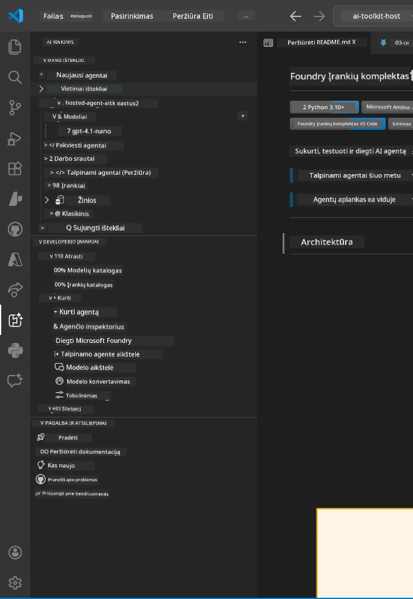
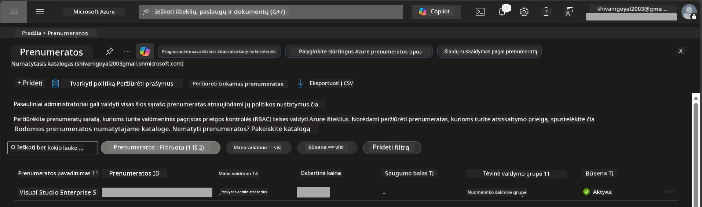
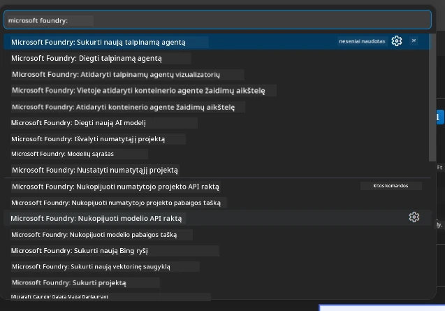
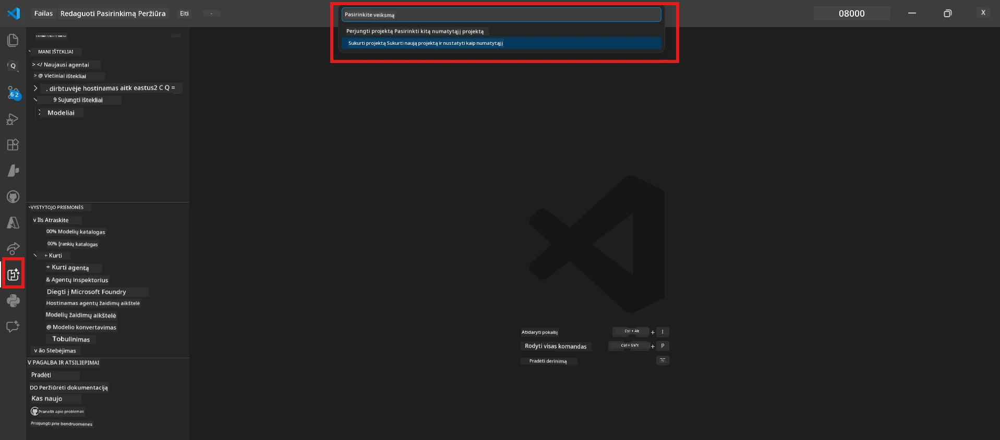
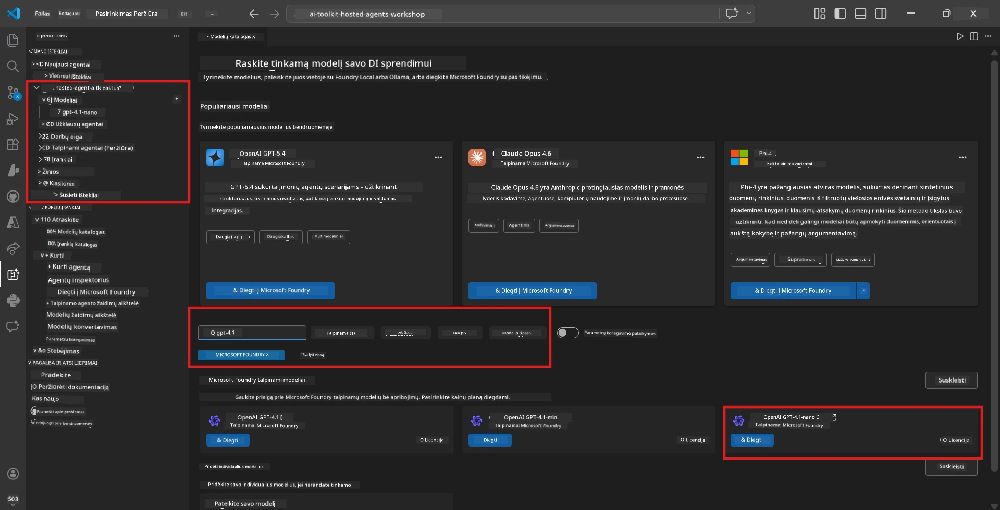
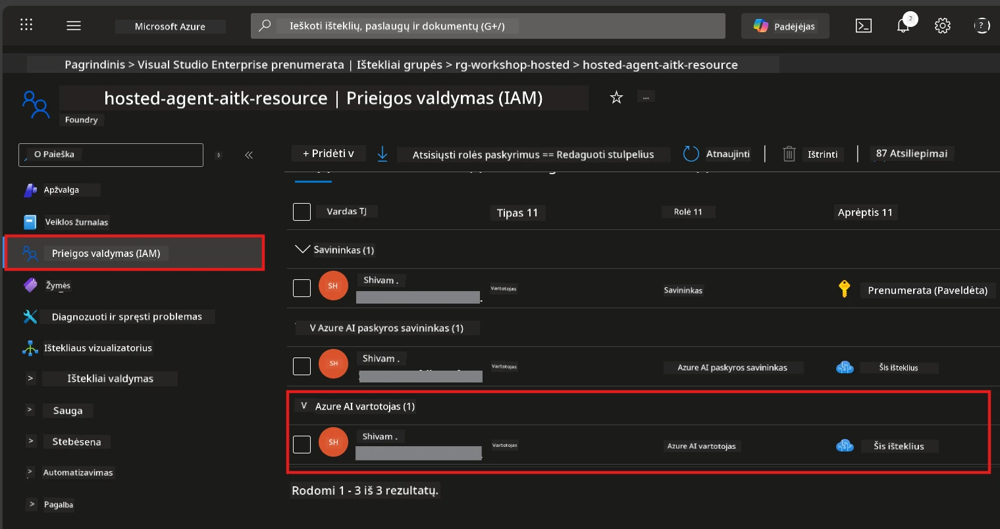

# Sąranka: plėtinys, projektas ir modelis

⏱️ ~15 min

Šiame modulyje diegsite ir patikrinsite Foundry Toolkit plėtinį, sukursite (arba prisijungsite prie) Foundry projektą ir įdiegsite modelį, kurį naudos jūsų agentas.

## 1 žingsnis: Įdiekite Foundry Toolkit

**Foundry Toolkit for VS Code** yra pagrindinis šio seminaro plėtinys. Jis suteikia projekto kūrimą, modelio diegimą, agentų karkaso kūrimą, vietinį testavimą (Agent Inspector) ir debesų diegimą – viską iš VS Code.

1. Atidarykite VS Code, tada paspauskite `Ctrl+Shift+X`, kad atidarytumėte **Extensions** skydelį.
2. Ieškokite **Foundry Toolkit**.
3. Įdiekite **Foundry Toolkit for VS Code** (platintojas: Microsoft, ID: `ms-windows-ai-studio.windows-ai-studio`).
4. Įdiegus, **Foundry Toolkit** piktograma pasirodys Veiklos juostoje (kairėje šoninėje juostoje).

> *Pastaba: Senesnėse plėtinių versijose Veiklos juostoje gali būti rodoma "AI TOOLKIT". Funkcionalumas yra identiškas.*



## 2 žingsnis: Sąranka pagal jūsų prieigą

> **Pasirinkite savo kelią:** Išskleiskite žemiau esantį skyrių, kuris atitinka jūsų sąranką. Jums reikia atlikti tik **vieną** kelią.

<details>
<summary><strong>🅰️ A kelias – Azure debesies paslauga (reikalinga Azure prenumerata)</strong></summary>

### Azure CLI

1. Įdiekite iš [learn.microsoft.com/cli/azure/install-azure-cli](https://learn.microsoft.com/cli/azure/install-azure-cli).
2. Patikrinkite: `az --version` (tikimasi 2.80.0+).
3. Prisijunkite: `az login`

### Autentifikavimo galimybės

[Microsoft Agent Framework](https://learn.microsoft.com/agent-framework/overview/) naudoja [`DefaultAzureCredential`](https://learn.microsoft.com/azure/developer/python/sdk/authentication/credential-chains#defaultazurecredential-overview), kuris bando kelis autentifikavimo būdus iš eilės. Pasirinkite jums tinkamiausią:

#### 1 variantas: VS Code paskyros (rekomenduojama seminarams)
1. Paspauskite **Accounts** piktogramą (žmogaus siluetą) apatiniame VS Code kairiajame kampe.
2. Pasirinkite **Sign in to use Microsoft Foundry** (arba **Sign in with Azure**).
3. Atidaromas naršyklės langas – prisijunkite su Azure paskyra, turinčia prieigą prie jūsų prenumeratos.
4. Grįžkite į VS Code. Apatiniame kairiajame kampe turėtumėte matyti savo paskyros vardą.

#### 2 variantas: Azure CLI
```bash
az login
az account set --subscription "<your-subscription-id>"
```

#### 3 variantas: Tarnybinis principalas (Enterprise/CI)
Užrakintose aplinkose ar CI/CD vamzdynuose nustatykite šiuos aplinkos kintamuosius savo `.env` faile:
```env
AZURE_TENANT_ID=<your-tenant-id>
AZURE_CLIENT_ID=<your-client-id>
AZURE_CLIENT_SECRET=<your-client-secret>
```

> **Kaip veikia `DefaultAzureCredential`:** Jis pirmiausia bando aplinkos kintamuosius, paskui valdomą tapatybę, tada VS Code prisijungimą, po to Azure CLI – ir naudojasi pirmu sėkmingu metodu. Daugiau informacijos žr. [credential chain dokumentacijoje](https://learn.microsoft.com/azure/developer/python/sdk/authentication/credential-chains#defaultazurecredential-overview).

### Azure Developer CLI (azd)

1. Įdiekite: `winget install microsoft.azd` (Windows) arba žr. [įdiegimo dokumentaciją](https://learn.microsoft.com/azure/developer/azure-developer-cli/install-azd).
2. Patikrinkite: `azd version`
3. Prisijunkite: `azd auth login`

### Docker Desktop (pasirinktinai)

Docker reikalingas tik tuo atveju, jei norite kurti konteinerius vietoje. Foundry plėtinys automatiškai atlieka kūrimą diegimo metu.

1. Įdiekite iš [docs.docker.com/get-docker](https://docs.docker.com/get-docker/).
2. Patikrinkite: `docker info`

### Azure prenumerata ir RBAC

1. Prisijunkite prie [portal.azure.com](https://portal.azure.com).
2. Nueikite į **Subscriptions** ir patikrinkite, kad bent viena būtų **Aktyvi**.
3. Užsirašykite savo **Prenumeratos ID** – jo reikės Modulyje 01.



#### RBAC scenarijų lentelė

[Hosted Agent](https://learn.microsoft.com/azure/foundry/agents/concepts/hosted-agents) diegimui reikia **duomenų veiksmų** leidimų, kurių standartinės Azure `Owner` ir `Contributor` rolės NETURI. Naudokite žemiau esančią lentelę, kad nustatytumėte, kokių rolės jums reikia:

| Scenarijus | Reikalingos rolės | Kur priskirti |
|----------|---------------|----------------------|
| Sukurti naują Foundry projektą | **Azure AI Owner** ant Foundry išteklių | Foundry ištekliai Azure portale |
| Diegti į esamą projektą (nauji ištekliai) | **Azure AI Owner** + **Contributor** prenumeratoje | Prenumerata + Foundry išteklius |
| Diegti į visiškai sukonfigūruotą projektą | **Reader** paskyroje + **Azure AI User** projekte | Paskyra + Projektas Azure portale |
| Tik vietiniams testavimams (be diegimo) | **Azure AI User** projekte | Projektas Azure portale |

> **Svarbu:** Azure `Owner` ir `Contributor` rolės apima tik *valdymo* leidimus (ARM operacijas). Jums reikia [**Azure AI User**](https://learn.microsoft.com/azure/foundry/concepts/rbac-foundry#built-in-roles) (ar aukštesnės), kad būtų leidžiami *duomenų veiksmai* kaip `agents/write`, reikalingi agentams kurti ir diegti.

## Prisijunkite arba sukurkite Foundry projektą



1. Paspauskite `Ctrl+Shift+P` → įveskite **Foundry Toolkit: Create Project** → pasirinkite.
2. Pasirinkite savo **Azure prenumeratą** iš išskaidymo sąrašo.
3. Pasirinkite arba sukurkite **išteklių grupę** (pvz., `rg-hosted-agents-workshop`).
4. Pasirinkite regioną, palaikantį hostintus agentus: `East US`, `West US 2` arba `Sweden Central`. Žr. [regiono prieinamumą](https://learn.microsoft.com/azure/foundry/agents/concepts/hosted-agents#region-availability).
5. Įveskite projekto pavadinimą (pvz., `workshop-agents`).
6. Palaukite 2–5 minutes, kol sukonfigūruos. Progreso pranešimas pasirodys VS Code.
7. Baigus konfigūravimą, jūsų projektas pasirodys **Foundry Toolkit** šoninėje juostoje po **MY RESOURCES**.



## Įdiekite modelį ir priskirkite RBAC

Jūsų hostintam agentui reikia AI modelio atsakymams generuoti.

#### Modelių pasirinkimo matrica
Priklausomai nuo poreikių, galite rinktis skirtingas modelių kategorijas:

| Modelis | Geriausia | Kaina | Pastabos |
|-------|----------|------|-------|
| `gpt-4.1` | Aukštos kokybės, niuansuoti atsakymai | Didelė | Geriausi rezultatai, rekomenduojama galutiniam testavimui |
| `gpt-4.1-mini/gpt-5-mini` | Greitas iteravimas, mažesnė kaina | Mažesnė | Tinka seminaro vystymui ir greitiems testams |
| `gpt-4.1-nano` | Lengvi uždaviniai | Mažiausia | Ekonomiškiausias, bet paprastesni atsakymai |

1. Paspauskite `Ctrl+Shift+P` → **Foundry Toolkit: Open Model Catalog** (arba kairėje šoninėje juostoje DEVELOPER TOOLS → Model Catalog).
2. Ieškokite **gpt-4.1** kataloge.
3. Raskite **OpenAI GPT-4.1-mini** (arba `gpt-5-mini` geresnei kokybei) ir spustelėkite **Deploy**.



4. Diegimo konfigūracijoje:
   - **Diegimo pavadinimas:** Palikite numatytąjį arba įveskite savo pavadinimą. **Įsiminkite šį pavadinimą.**
   - **Tikslas:** Pasirinkite **Deploy to Foundry Toolkit** → pasirinkite savo projektą.
5. Spustelėkite **Deploy** ir palaukite 1–3 minutes.

> **Rekomendacija:** Seminarui naudokite `gpt-4.1-mini/gpt-5-mini` – greita, pigu ir duoda gerus rezultatus.

### Užsirašykite reikšmes

Po diegimo užsirašykite šias dvi reikšmes (jos reikalingos Modulyje 03):

| Reikšmė | Kur rasti |
|-------|-----------------|
| **Projekto galinis taškas** | Spustelėkite savo projektą šoninėje juostoje → detalių rodinyje pamatysite URL (pvz., `https://<account>.services.ai.azure.com/api/projects/<project>`) |
| **Modelio diegimo pavadinimas** | Išplėskite projektą → **Models** → pavadinimas šalia jūsų įdiegto modelio (pvz., `gpt-4.1-mini/gpt-5-mini`) |

### Priskirkite RBAC vaidmenį

> ⚠️ **Tai dažniausiai praleidžiamas žingsnis.** Be teisingo vaidmens, diegimas Modulyje 05 nepavyks.

#### Koks vaidmuo man reikalingas?
Priklausomai nuo scenarijaus, jums reikalingos šios vaidmenų kombinacijos:

| Scenarijus | Reikalingos rolės | Kur priskirti |
|----------|---------------|----------------------|
| Sukurti naują Foundry projektą | **Azure AI Owner** ant Foundry išteklių | Foundry išteklius Azure portale |
| Diegti į esamą projektą (nauji ištekliai) | **Azure AI Owner** + **Contributor** prenumeratoje | Prenumerata + Foundry išteklius |
| Diegti į visiškai sukonfigūruotą projektą | **Reader** paskyroje + **Azure AI User** projekte | Paskyra + Projektas Azure portale |

**Svarbu:** Azure `Owner` ir `Contributor` rolės apima tik *valdymo* leidimus. Jums reikia **Azure AI User** (ar aukštesnio) dėl *duomenų veiksmų*, pvz., `agents/write`, reikalingų agentams kurti ir diegti.

1. Atidarykite [portal.azure.com](https://portal.azure.com).
2. Ieškokite savo **Foundry projekto** pavadinimo → spustelėkite rezultatą, kurio tipas **"Foundry Toolkit project"** (NE tėvinę paskyrą).
3. Kairėje naršymo juostoje pasirinkite **Access control (IAM)**.
4. Spustelėkite **+ Add** → **Add role assignment**.
5. **Role skirtukas:** Ieškokite **Azure AI User**, pasirinkite jį, spustelėkite **Next**.
6. **Members skirtukas:** Pasirinkite **User, group, or service principal** → spustelėkite **+ Select members** → suraskite ir pasirinkite save → spustelėkite **Select**.
7. Spustelėkite **Review + assign** → dar kartą **Review + assign**.
8. **Palaukite 1–2 minutes**, kol pakeitimai įsigalios.

> **Kodėl šis vaidmuo?** Azure `Owner`/`Contributor` suteikia tik valdymo leidimus. **Azure AI User** vaidmuo suteikia `agents/write` duomenų veiksmų leidimą, reikalingą agentams kurti ir diegti. Žr. [Foundry RBAC dokumentaciją](https://learn.microsoft.com/azure/foundry/concepts/rbac-foundry#built-in-roles).



</details>

<details>
<summary><strong>🅱️ B kelias – Vietinis / nemokamas lygis (nereikia Azure prenumeratos)</strong></summary>

### Foundry Local

Foundry Local leidžia paleisti AI modelius savo kompiuteryje – nereikia debesies paskyros. Galite pasiekti Foundry Local modelius naudodami Foundry Toolkit per modelių katalogą taip:

1. Eikite į Foundry Toolkit plėtinį.
2. Foundry Toolkit naršyklėje eikite į **Developer Tools** > ir pasirinkite **Model Catalog**.
3. Naujo lange pasirinkite **local** naršymo juostoje.
4. Slinkite žemyn iki **Phi 4 Mini**, spustelėkite **pridėjimo mygtuką** – pasirodys pranešimas, kad modelis yra siunčiamas.
5. Kai modelis bus atsisiųstas, galite tęsti kitą žingsnį.

</details>

### ✅ Kontrolinis taškas


- [ ] `Ctrl+Shift+P` → "Foundry Toolkit" rodo galimas komandas
- [ ] Foundry Toolkit plėtinys įdiegtas ir šoninė juosta veikia be klaidų
- [ ] VS Code atsidaro ir veikia tinkamai
- [ ] `python --version` rodo 3.10+
- [ ] Foundry Toolkit piktograma matoma VS Code Veiklos juostoje
- [ ] **A kelias:** `az login` sėkmingas, prenumerata yra aktyvi
- [ ] **B kelias:** Foundry Local veikia (`foundry local status`)
- [ ] **A kelias:** Foundry projektas matomas šoninėje juostoje, modelis įdiegtas, priskirtas Azure AI User vaidmuo
- [ ] **B kelias:** Foundry Local veikia su modeliu
- [ ] Užsirašėte savo **galo taško** ir **modelio diegimo pavadinimą**


**Ankstesnis:** [00 - Prireikimai](00-prerequisites.md) · **Kitas:** [02 - Sukurti hostintą agentą →](02-create-hosted-agent.md)

---

<!-- CO-OP TRANSLATOR DISCLAIMER START -->
**Atsakomybės apribojimas**:
Šis dokumentas buvo išverstas naudojant dirbtinio intelekto vertimo paslaugą [Co-op Translator](https://github.com/Azure/co-op-translator). Nors siekiame tikslumo, prašome atkreipti dėmesį, kad automatiniai vertimai gali turėti klaidų ar netikslumų. Originalus dokumentas jo gimtąja kalba laikomas autoritetingu šaltiniu. Svarbiai informacijai rekomenduojama naudoti profesionalų žmogiškąjį vertimą. Mes neatsakome už jokius nesusipratimus ar neteisingą interpretaciją, kilusią naudojantis šiuo vertimu.
<!-- CO-OP TRANSLATOR DISCLAIMER END -->