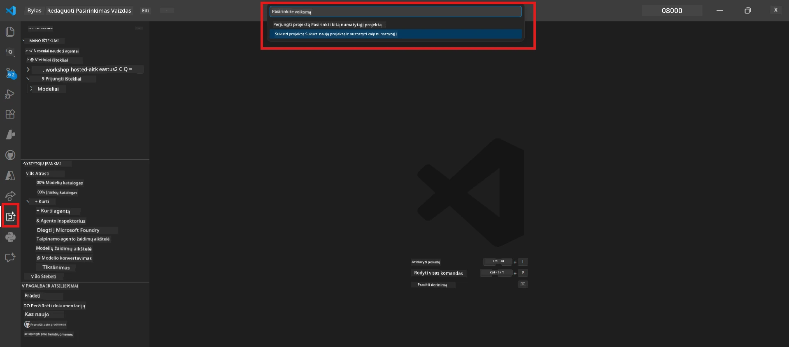
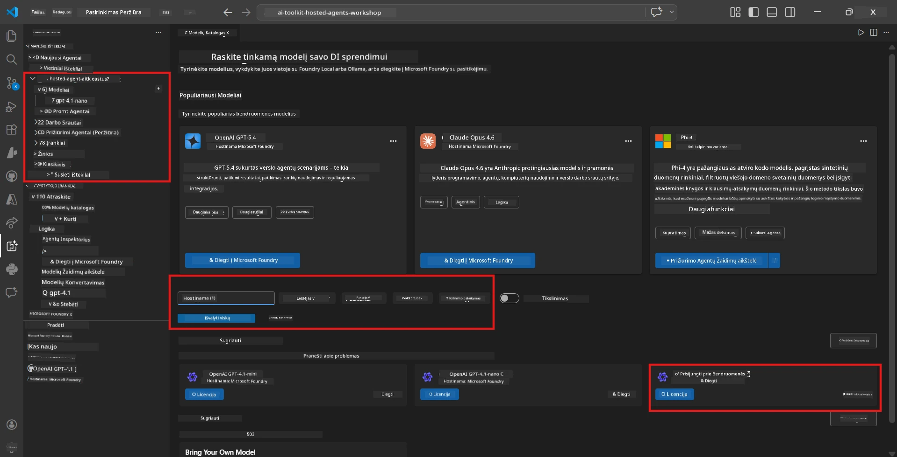
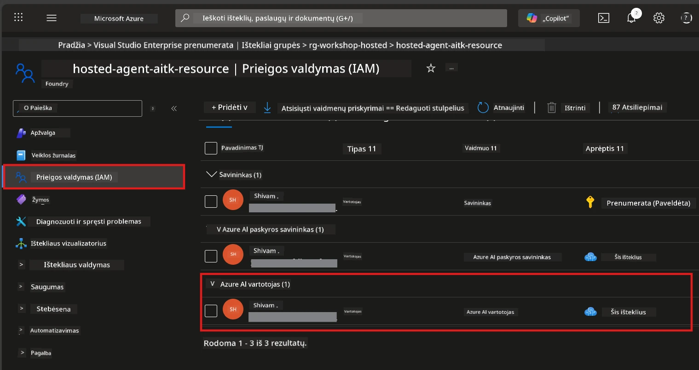

# 2 modulis – Sukurkite Foundry projektą ir įdiekite modelį

Šiame modulyje sukursite (arba pasirenkate) Microsoft Foundry projektą ir įdiegsime agentui naudojamą modelį. Kiekvienas žingsnis yra aiškiai aprašytas – atlikite juos paeiliui.

> Jei jau turite Foundry projektą su įdiegtu modeliu, pereikite prie [3 modulio](03-create-hosted-agent.md).

---

## 1 žingsnis: Sukurkite Foundry projektą iš VS Code

Naudosite Microsoft Foundry papildinį, kad sukurtumėte projektą neišeidami iš VS Code.

1. Paspauskite `Ctrl+Shift+P`, kad atidarytumėte **komandų paletę**.
2. Įveskite: **Microsoft Foundry: Create Project** ir pasirinkite.
3. Atsidarys išskleidžiamasis sąrašas – pasirinkite savo **Azure prenumeratą**.
4. Jums bus paprašyta pasirinkti arba sukurti **išteklių grupę**:
   - Norėdami sukurti naują: įveskite pavadinimą (pvz., `rg-hosted-agents-workshop`) ir paspauskite Enter.
   - Norėdami naudoti esamą: pasirinkite ją iš sąrašo.
5. Pasirinkite **regioną**. **Svarbu:** Pasirinkite regioną, kuris palaiko talpinamus agentus. Patikrinkite [regiono prieinamumą](https://learn.microsoft.com/azure/foundry/agents/concepts/hosted-agents#region-availability) – dažniausiai pasirenkami `East US`, `West US 2` arba `Sweden Central`.
6. Įveskite Foundry projekto **pavadinimą** (pvz., `workshop-agents`).
7. Paspauskite Enter ir palaukite, kol bus įvykdyta sąranka.

> **Sąrankos užtrunka 2-5 minutes.** VS Code apatiniame dešiniajame kampe matysite progreso pranešimą. Nepalikite VS Code sąrankos metu.

8. Baigus, panelėje **Microsoft Foundry** pamatysite savo naują projektą skiltyje **Resources**.
9. Spustelėkite projekto pavadinimą, kad išplėstumėte, ir įsitikinkite, jog matote skyrius, tokius kaip **Models + endpoints** ir **Agents**.



### Alternatyva: sukurkite per Foundry portalą

Jei norite naudoti naršyklę:

1. Atidarykite [https://ai.azure.com](https://ai.azure.com) ir prisijunkite.
2. Pradžios puslapyje spustelėkite **Create project**.
3. Įveskite projekto pavadinimą, pasirinkite prenumeratą, išteklių grupę ir regioną.
4. Spustelėkite **Create** ir palaukite, kol bus sukurta.
5. Kai projektas bus sukurtas, grįžkite į VS Code – po atnaujinimo projekto pavadinimas turėtų pasirodyti Foundry skiltyje (spustelėkite atnaujinimo piktogramą).

---

## 2 žingsnis: Įdiekite modelį

Jūsų [talpinamasis agentas](https://learn.microsoft.com/azure/foundry/agents/concepts/hosted-agents) reikalingas Azure OpenAI modelis atsakymams generuoti. Dabar [įdiegsite modelį](https://learn.microsoft.com/azure/ai-foundry/openai/how-to/create-resource#deploy-a-model).

1. Paspauskite `Ctrl+Shift+P`, kad atidarytumėte **komandų paletę**.
2. Įveskite: **Microsoft Foundry: Open [Model Catalog](https://learn.microsoft.com/azure/ai-foundry/openai/concepts/models)** ir pasirinkite.
3. VS Code atsivers Modelių katalogas. Naršykite arba naudokite paieškos juostą ir raskite **gpt-4.1**.
4. Spustelėkite **gpt-4.1** modelio kortelę (arba `gpt-4.1-mini`, jei pageidaujate mažesnių kaštų).
5. Spustelėkite **Deploy**.


6. Diegimo konfigūracijoje:
   - **Deployment name**: Palikite numatytąją (pvz., `gpt-4.1`) arba įveskite pasirinktą pavadinimą. **Įsiminkite šį pavadinimą** – jis reikalingas 4 modulyje.
   - **Target**: Pasirinkite **Deploy to Microsoft Foundry** ir nurodykite ką tik sukurtą projektą.
7. Spustelėkite **Deploy** ir palaukite, kol diegimas bus baigtas (1–3 minutės).

### Modelio pasirinkimas

| Modelis | Tinka | Kaina | Pastabos |
|---------|-------|-------|----------|
| `gpt-4.1` | Aukštos kokybės, niuansuoti atsakymai | Aukštesnė | Geriausi rezultatai, rekomenduojama galutiniam testavimui |
| `gpt-4.1-mini` | Greiti iteravimai, mažesnė kaina | Žemesnė | Puiku dirbant dirbtuvėse ir greitam testavimui |
| `gpt-4.1-nano` | Lengvi uždaviniai | Žemiausia | Ekonomiškiausia, bet paprastesni atsakymai |

> **Rekomendacija šiam seminarui:** naudokite `gpt-4.1-mini` kūrimui ir testavimui. Tai greita, pigu ir tinka pratimams.

### Patikrinkite modelio diegimą

1. **Microsoft Foundry** šoninėje juostoje išplėskite savo projektą.
2. Pažiūrėkite skyriuje **Models + endpoints** (ar panašioje vietoje).
3. Turėtumėte matyti įdiegtą modelį (pvz., `gpt-4.1-mini`) su būsena **Succeeded** arba **Active**.
4. Spustelėkite modelio diegimą, kad pamatytumėte detales.
5. **Užsirašykite** šias dvi reikšmes – jos reikalingos 4 modulyje:

   | Nustatymas | Kur rasti | Pavyzdinė reikšmė |
   |------------|------------|-------------------|
   | **Project endpoint** | Spustelėkite projekto pavadinimą Foundry šoninėje juostoje. Galite matyti endpoint URL detalių rodinyje. | `https://<account>.services.ai.azure.com/api/projects/<project>` |
   | **Model deployment name** | Pavadinimas, rodomas šalia įdiegto modelio. | `gpt-4.1-mini` |

---

## 3 žingsnis: Priskirkite būtinus RBAC vaidmenis

Tai yra **dažniausiai praleidžiamas žingsnis**. Neturint tinkamų vaidmenų, 6 modulyje diegimas nepavyks dėl leidimų klaidos.

### 3.1 Priskirkite sau Azure AI User vaidmenį

1. Atidarykite naršyklę ir eikite į [https://portal.azure.com](https://portal.azure.com).
2. Viršutinėje paieškos juostoje įveskite savo **Foundry projekto** pavadinimą ir spustelėkite jį rezultatuose.
   - **Svarbu:** Eikite į **projekto** išteklių (tipas: "Microsoft Foundry project"), o ne į tėvinį account/hub išteklių.
3. Projektų kairėje naršymo juostoje spustelėkite **Access control (IAM)**.
4. Spustelėkite viršuje mygtuką **+ Add** → pasirinkite **Add role assignment**.
5. Skiltyje **Role** raskite ir pasirinkite [**Azure AI User**](https://learn.microsoft.com/azure/foundry/concepts/rbac-foundry#built-in-roles). Spustelėkite **Next**.
6. Skiltyje **Members**:
   - Pasirinkite **User, group or service principal**.
   - Spustelėkite **+ Select members**.
   - Ieškokite savo vardo ar el. pašto, pasirinkite save ir spustelėkite **Select**.
7. Spustelėkite **Review + assign** → vėl **Review + assign**, kad patvirtintumėte.



### 3.2 (Pasirinktinai) Priskirkite Azure AI Developer vaidmenį

Jei reikia kurti papildomus išteklius projekte arba valdyti diegimus programiškai:

1. Kartokite anksčiau nurodytus veiksmus, bet 5 žingsnyje pasirinkite **Azure AI Developer**.
2. Priskirkite šį vaidmenį **Foundry ištekliui (account lygyje)**, ne tik projektui.

### 3.3 Patikrinkite savo vaidmenų priskyrimus

1. Projekto puslapyje **Access control (IAM)** spustelėkite skirtuką **Role assignments**.
2. Ieškokite savo vardo.
3. Turėtumėte matyti nors vieną įrašą su vaidmeniu **Azure AI User** projekto ribose.

> **Kodėl tai svarbu:** Vaidmuo [`Azure AI User`](https://learn.microsoft.com/azure/foundry/concepts/rbac-foundry#built-in-roles) suteikia `Microsoft.CognitiveServices/accounts/AIServices/agents/write` leidimą. Be jo diegimo metu gausite šią klaidą:
>
> ```
> Error: lacks the required data action 
> Microsoft.CognitiveServices/accounts/AIServices/agents/write 
> to perform POST /api/projects/{projectName}/assistants operation.
> ```
>
> Daugiau informacijos rasite [8 modulyje – trikčių šalinimas](08-troubleshooting.md).

---

### Kontrolinis taškas

- [ ] Foundry projektas yra sukurtas ir matomas Microsoft Foundry pasirinktiniame lange VS Code
- [ ] Bent vienas modelis įdiegtas (pvz., `gpt-4.1-mini`) su būsena **Succeeded**
- [ ] Uždėmėte **projekto endpoint** URL ir **modelio diegimo pavadinimą**
- [ ] Jums priskirtas **Azure AI User** vaidmuo projekto lygyje (patikrinkite Azure portale → IAM → Role assignments)
- [ ] Projektas yra [palaikomame regione](https://learn.microsoft.com/azure/foundry/agents/concepts/hosted-agents#region-availability) talpinamiems agentams

---

**Ankstesnis:** [01 – Įdiekite Foundry įrankių rinkinį](01-install-foundry-toolkit.md) · **Kitas:** [03 – Sukurkite talpinamą agentą →](03-create-hosted-agent.md)

---

<!-- CO-OP TRANSLATOR DISCLAIMER START -->
**Atsakomybės apribojimas**:  
Šis dokumentas buvo išverstas naudojant AI vertimo paslaugą [Co-op Translator](https://github.com/Azure/co-op-translator). Nors siekiame tikslumo, prašome atkreipti dėmesį, kad automatizuoti vertimai gali turėti klaidų ar netikslumų. Originalus dokumentas gimtąja kalba turėtų būti laikomas autoritetingu šaltiniu. Kritinei informacijai rekomenduojamas profesionalus žmogiškas vertimas. Mes neatsakome už bet kokius nesusipratimus ar neteisingas interpretacijas, kylančias iš šio vertimo naudojimo.
<!-- CO-OP TRANSLATOR DISCLAIMER END -->