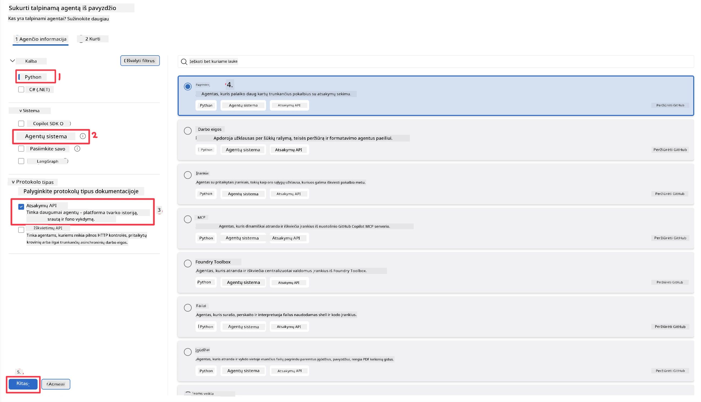
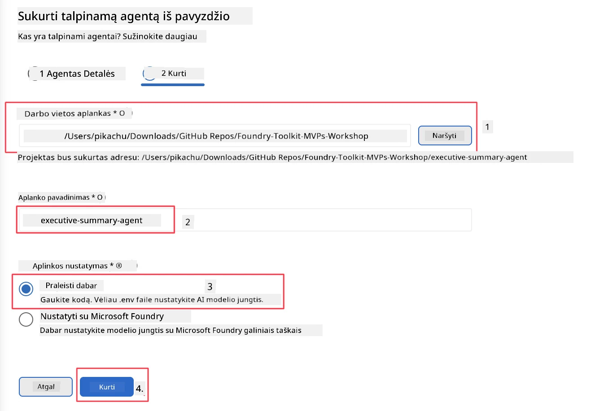

# Modulis 2 - Sukurkite naują talpinamą agentą

⏱️ ~5 min

Šiame modulyje naudojate Foundry Toolkit, kad **sukurtumėte talpinamo agento projektą**. Ši struktūra sugeneruoja visą projekto struktūrą - `agent.yaml`, `main.py`, `Dockerfile`, `requirements.txt` ir VS Code derinimo konfigūraciją - todėl galite sutelkti dėmesį į agento elgesio pritaikymą.

> **Svarbi sąvoka:** Šio laboratorinio darbo aplankas `agent/` yra pavyzdys to, ką sugeneruoja Foundry Toolkit. Jums nereikia rašyti šių failų nuo nulio.

### Aptarnavimo vedlio eiga

```mermaid
flowchart LR
    A["Command Palette:
    Create new Hosted Agent"] --> B["Language:
    Python"]
    B --> C["API type:
    Response API"]
    C --> D["Template:
    Basic - Agent Framework"]
    D --> E["Pasirinkite modelį"]
    E --> F["Workspace folder
    & agent name"]
    F --> G["Sugeneruotas projektas"]

    style A fill:#4A90D9,color:#fff
    style B fill:#7B68EE,color:#fff
    style C fill:#7B68EE,color:#fff
    style D fill:#7B68EE,color:#fff
    style E fill:#7B68EE,color:#fff
    style F fill:#7B68EE,color:#fff
    style G fill:#27AE60,color:#fff
```



---

## 1 žingsnis: Atidarykite Create Hosted Agent vedlį

1. Paspauskite `Ctrl+Shift+P`, kad atidarytumėte **Command Palette**.
2. Įveskite: **Foundry Toolkit: Create new Hosted Agent** ir pasirinkite jį.

> **Alternatyva: Sukurkite per Foundry Portal**
> Jei norite dirbti naršyklėje, projektą galite sukurti adresu [https://ai.azure.com](https://ai.azure.com). Kai projektas bus sukurtas, grįžkite į VS Code ir naudokite **Foundry Toolkit** šoninę juostą, kad prisijungtumėte prie jo.

> **Alternatyva:** Spustelėkite **+** piktogramą šalia **Hosted Agents (Preview)** Foundry Toolkit šoninėje juostoje.

## 2 žingsnis: Pasirinkite nustatymus



1. Kairiojoje naršymo/parinkčių dalyje pasirinkite šiuos nustatymus:

| Meniu | Pasirinkimas | Pastabos |
|--------|-----------|-------|
| **Language** | Python | Palaikomas ir C# |
| **Framework** | Agent Framework | Paprasta pradžia naudojant Agent Framework SDK |
| **API type** | Response API | `POST /responses` - pokalbio API su platformos istorijos valdymu |
| **Template** | Basic | Paprasta pradžia naudojant Agent Framework SDK |

2. Pasirinkę spauskite **Next**



3. Kitame lange pasirinkite šiuos nustatymus:

| Meniu | Pasirinkimas | Pastabos |
|--------|-----------|-------|
| **Workspace folder** | Pasirinkite norimą aplanką | pvz., `/workspace/Foundry_Toolkit_for_VSCode_Lab/` arba poaplankis šiame repo |
| **Agent name** | Įveskite pavadinimą | pvz., `executive-summary-agent` |
| **Environment Setup** | šiuo metu praleiskite aplinkos paruošimą |  |

Spauskite **create**, kad sukurtumėte savo agentą. Bus sukurtas naujas aplankas su talpinamo agento pavadinimu.

## 3 žingsnis: Patikrinkite sugeneruotą projektą

Užbaigus struktūros sukūrimą, patikrinkite, ar Explorer (`Ctrl+Shift+E`) matote šiuos failus:

```
📂 my-agent/
├── .env                ← Environment variables (placeholders)
├── .vscode/
│   ├── launch.json     ← Debug config (F5 → run + Agent Inspector)
│   └── tasks.json      ← VS Code task definitions
├── agent.yaml          ← Agent definition (kind: hosted)
├── Dockerfile          ← Container config for deployment
├── main.py             ← Agent entry point (your main code)
└── requirements.txt    ← Python dependencies
```

### Svarbiausių failų paaiškinimai

| Failas | Paskirtis |
|------|---------|
| `agent.yaml` | Nurodo agentą kaip `kind: hosted`, susieja aplinkos kintamuosius, apibrėžia `/responses` protokolą |
| `main.py` | Sukuria `FoundryChatClient` → apsupa jį `Agent` su instrukcijomis → aptarnauja per `ResponsesHostServer` 8088 prievade |
| `Dockerfile` | Naudoja `python:3.12-slim`, įdiegia priklausomybes, atveria 8088 prievadą, vykdo `main.py` |
| `requirements.txt` | `agent-framework-foundry`, `agent-framework-foundry-hosting`, `mcp`, `debugpy` |

> **Svarbu:** Atidarykite sugeneruotą agento aplanką tiesiogiai VS Code (patį `agent/` aplanką), kad `.vscode/launch.json` ir `tasks.json` veiktų tinkamai F5 derinimui.

---

### ✅ Kontrolinis taškas

- [ ] Sukurta struktūra su visais laukiamais failais
- [ ] `agent.yaml` rodo `kind: hosted` ir `protocol: responses`
- [ ] `main.py` importuoja `Agent`, `FoundryChatClient`, `ResponsesHostServer`
- [ ] Agent atidarytas VS Code kaip darbo aplanko šaknis

---

**Ankstesnis:** [01 - Setup](01-setup.md) · **Kitas:** [03 - Configure & Code →](03-configure-and-code.md)

---

<!-- CO-OP TRANSLATOR DISCLAIMER START -->
**Atsakomybės apribojimas**:
Šis dokumentas buvo išverstas naudojant dirbtinio intelekto vertimo paslaugą [Co-op Translator](https://github.com/Azure/co-op-translator). Nors siekiame tikslumo, prašome atkreipti dėmesį, kad automatiniai vertimai gali turėti klaidų ar netikslumų. Originalus dokumentas jo gimtąja kalba laikomas autoritetingu šaltiniu. Svarbiai informacijai rekomenduojama naudoti profesionalų žmogiškąjį vertimą. Mes neatsakome už jokius nesusipratimus ar neteisingą interpretaciją, kilusią naudojantis šiuo vertimu.
<!-- CO-OP TRANSLATOR DISCLAIMER END -->