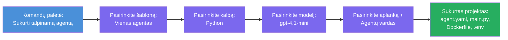

# Modulis 3 - Sukurti naują talpinamą agentą (automatiškai sukurtas naudojant Foundry plėtinį)

Šiame modulyje naudosite Microsoft Foundry plėtinį, kad **sukurtumėte naują [talpinamo agento](https://learn.microsoft.com/azure/foundry/agents/concepts/hosted-agents) projektą**. Plėtinys sugeneruoja visą projekto struktūrą už jus - įskaitant `agent.yaml`, `main.py`, `Dockerfile`, `requirements.txt`, `.env` failą ir VS Code derinimo konfigūraciją. Po sukūrimo pritaikysite šiuos failus su savo agento instrukcijomis, įrankiais ir konfigūracija.

> **Pagrindinė sąvoka:** Šioje užduotyje `agent/` aplankas yra pavyzdys to, ką sugeneruoja Foundry plėtinys, kai vykdote šią komandą. Jūs nerašote šių failų nuo nulio - plėtinys juos sukuria, o jūs juos modifikuojate.

### Kūrimo vedlio eiga


---

## 1 žingsnis: Atidarykite Naujo talpinamo agento kūrimo vedlį

1. Paspauskite `Ctrl+Shift+P`, kad atidarytumėte **Komandų paletę**.
2. Įrašykite: **Microsoft Foundry: Create a New Hosted Agent** ir pasirinkite šią komandą.
3. Atsidarys talpinamo agento kūrimo vedlys.

> **Alternatyvus kelias:** Taip pat galite pasiekti šį vedlį iš Microsoft Foundry šoninės juostos → spauskite **+** ikoną šalia **Agents** arba dešiniuoju pelės klavišu spustelėkite ir pasirinkite **Create New Hosted Agent**.

---

## 2 žingsnis: Pasirinkite šabloną

Vedlys paprašys pasirinkti šabloną. Matysite tokias parinktis:

| Šablonas | Aprašymas | Kada naudoti |
|----------|------------|--------------|
| **Vienas agentas** | Vienas agentas su savo modeliu, instrukcijomis ir pasirenkamais įrankiais | Ši dirbtuvė (Modulis 01) |
| **Daugiagentinis darbo srautas** | Keli agentai, kurie bendradarbiauja paeiliui | Modulis 02 |

1. Pasirinkite **Vienas agentas**.
2. Spauskite **Next** (arba pasirinkimas įvyksta automatiškai).

---

## 3 žingsnis: Pasirinkite programavimo kalbą

1. Pasirinkite **Python** (rekomenduojama šiai dirbtuvei).
2. Spauskite **Next**.

> **Taip pat palaikoma C#**, jei pageidaujate .NET. Kūrimo struktūra yra panaši (naudojamas `Program.cs` vietoje `main.py`).

---

## 4 žingsnis: Pasirinkite modelį

1. Vedlys parodys modelius, įdėtus į jūsų Foundry projektą (iš Modulis 2).
2. Pasirinkite modelį, kurį įdiegėte – pvz., **gpt-4.1-mini**.
3. Spauskite **Next**.

> Jei nematote jokių modelių, grįžkite į [Modulis 2](02-create-foundry-project.md) ir pirmiausia įdiekite modelį.

---

## 5 žingsnis: Pasirinkite aplanko vietą ir agente pavadinimą

1. Atsidarys failų pasirinkimo dialogas - pasirinkite **tikslinį aplanką**, kuriame bus sukurtas projektas. Šiai dirbtuvei:
   - Jei pradedate nuo nulio: pasirinkite bet kurį aplanką (pvz., `C:\Projects\my-agent`)
   - Jei dirbate dirbtuvių repozitorijoje: sukurkite naują poaplapį `workshop/lab01-single-agent/agent/` aplanke
2. Įveskite **pavadinimą** talpinamam agentui (pvz., `executive-summary-agent` arba `my-first-agent`).
3. Spauskite **Create** (arba paspauskite Enter).

---

## 6 žingsnis: Palaukite, kol kūrimas baigsis

1. VS Code atvers **naują langą** su sukurtu projektu.
2. Palaukite kelias sekundes, kol projektas pilnai užsikraus.
3. Explorer lange (`Ctrl+Shift+E`) turėtumėte matyti šiuos failus:

```
📂 my-first-agent/
├── .env                ← Environment variables (auto-generated with placeholders)
├── .vscode/
│   └── launch.json     ← Debug configuration (F5 to run + Agent Inspector)
├── agent.yaml          ← Agent definition (kind: hosted)
├── Dockerfile          ← Container configuration for deployment
├── main.py             ← Agent entry point (your main code file)
└── requirements.txt    ← Python dependencies
```

> **Tai ta pati struktūra, kaip `agent/` aplankas šiame užduotyje.** Foundry plėtinys automatiškai sugeneruoja šiuos failus – jų rankiniu būdu kurti nereikia.

> **Dirbtuvių užrašas:** Šiame dirbtuvių repozitorijoje `.vscode/` aplankas yra **darbo vietos šaknyje** (ne kiekviename projekte atskirai). Jame yra bendras `launch.json` ir `tasks.json` su dviem derinimo konfiguracijomis - **"Lab01 - Single Agent"** ir **"Lab02 - Multi-Agent"** - kiekviena nurodo teisingą atitinkamo modulio `cwd`. Paspaudę F5, pasirinkite tinkamą konfiguraciją iš iškrentančio sąrašo pagal atliekamą modulį.

---

## 7 žingsnis: Supraskite kiekvieną sugeneruotą failą

Skirkite laiko apžvelgti kiekvieną failą, kurį sugeneravo vedlys. Jų supratimas svarbus Modulyje 4 (tobulinimas).

### 7.1 `agent.yaml` - Agentų apibrėžimas

Atidarykite `agent.yaml`. Jis atrodo taip:

```yaml
# yaml-language-server: $schema=https://raw.githubusercontent.com/microsoft/AgentSchema/refs/heads/main/schemas/v1.0/ContainerAgent.yaml

kind: hosted
name: my-first-agent
description: >
  A hosted agent deployed to Microsoft Foundry Agent Service.
metadata:
  authors:
    - Microsoft
  tags:
    - Azure AI AgentServer
    - Microsoft Agent Framework
    - Hosted Agent
protocols:
  - protocol: responses
    version: v1
environment_variables:
  - name: AZURE_AI_PROJECT_ENDPOINT
    value: ${PROJECT_ENDPOINT}
  - name: AZURE_AI_MODEL_DEPLOYMENT_NAME
    value: ${MODEL_DEPLOYMENT_NAME}
dockerfile_path: Dockerfile
resources:
  cpu: '0.25'
  memory: 0.5Gi
```

**Pagrindiniai laukai:**

| Laukas | Paskirtis |
|--------|-----------|
| `kind: hosted` | Nurodo, kad tai talpinamas agentas (pagrįstas konteineriu, įdiegtas į [Foundry Agent Service](https://learn.microsoft.com/azure/foundry/agents/overview)) |
| `protocols: responses v1` | Agentas pateikia OpenAI suderinamą `/responses` HTTP pabaigos tašką |
| `environment_variables` | Susieja `.env` reikšmes su konteinerio aplinkos kintamaisiais diegimo metu |
| `dockerfile_path` | Nurodo Dockerfile, naudojamą konteinerio atvaizdui kurti |
| `resources` | CPU ir atminties skyrimas konteineriui (0.25 CPU, 0.5Gi atminties) |

### 7.2 `main.py` - Agento įėjimo taškas

Atidarykite `main.py`. Tai pagrindinis Python failas, kuriame yra jūsų agento logika. Kūrimo šablone yra:

```python
from agent_framework.azure import AzureAIAgentClient
from azure.ai.agentserver.agentframework import from_agent_framework
from azure.identity.aio import DefaultAzureCredential
```

**Pagrindiniai importai:**

| Importas | Paskirtis |
|----------|-----------|
| `AzureAIAgentClient` | Jungiama su jūsų Foundry projektu ir sukuria agentus per `.as_agent()` |
| [`DefaultAzureCredential`](https://learn.microsoft.com/azure/developer/python/sdk/authentication/credential-chains#defaultazurecredential-overview) | Tvarko autentifikaciją (Azure CLI, VS Code prisijungimą, valdomą identitetą arba paslaugų principalų) |
| `from_agent_framework` | Apvynioja agentą kaip HTTP serverį, kuris pateikia `/responses` pabaigos tašką |

Pagrindinė eiga yra:
1. Sukurti kredencialą → sukurti klientą → iškviesti `.as_agent()` gauti agentą (asinchroninis konteksto valdymas) → apvynioti į serverį → paleisti

### 7.3 `Dockerfile` - Konteinerio atvaizdas

```dockerfile
FROM python:3.14-slim

WORKDIR /app

COPY ./ .

RUN pip install --upgrade pip && \
    if [ -f requirements.txt ]; then \
        pip install -r requirements.txt; \
    else \
        echo "No requirements.txt found" >&2; exit 1; \
    fi

EXPOSE 8088

CMD ["python", "main.py"]
```

**Pagrindinės detalės:**
- Naudoja `python:3.14-slim` kaip pagrindinį atvaizdą.
- Nukopijuoja visus projekto failus į `/app`.
- Atnaujina `pip`, įdiegia priklausomybes iš `requirements.txt` ir greitai baigia darbą, jei trūksta šio failo.
- **Atverčia prievadą 8088** - tai būtinas prievadas talpinamiems agentams. Jo nekeiskite.
- Paleidžia agentą su `python main.py`.

### 7.4 `requirements.txt` - Priklausomybės

```
agent-framework-azure-ai==1.0.0rc3
agent-framework-core==1.0.0rc3
azure-ai-agentserver-agentframework==1.0.0b16
azure-ai-agentserver-core==1.0.0b16
debugpy
agent-dev-cli
```

| Paketas | Paskirtis |
|---------|-----------|
| `agent-framework-azure-ai` | Azure AI integracija Microsoft Agent Framework |
| `agent-framework-core` | Pagrindinė vykdymo aplinka agentų kūrimui (įtraukia `python-dotenv`) |
| `azure-ai-agentserver-agentframework` | Talpinamo agento serverio vykdymas Foundry Agent Service |
| `azure-ai-agentserver-core` | Pagrindinės agento serverio abstrakcijos |
| `debugpy` | Python derinimo palaikymas (leidžia F5 derinimą VS Code) |
| `agent-dev-cli` | Vietinis kūrimo CLI agentų testavimui (naudojama derinimo/paleidimo konfiguracijoje) |

---

## Agento protokolo supratimas

Talpinami agentai bendrauja naudojant **OpenAI Responses API** protokolą. Veikiantis (vietoje arba debesyje) agentas pateikia vieną HTTP pabaigos tašką:

```
POST http://localhost:8088/responses
Content-Type: application/json

{
  "input": "Your prompt here",
  "stream": false
}
```

Foundry Agent Service kviečia šį pabaigos tašką, kad siųstų naudotojų užklausas ir gautų agento atsakymus. Tai tas pats protokolas, kurį naudoja OpenAI API, todėl jūsų agentas suderinamas su bet kokia kliento programa, kuri naudoja OpenAI Responses formatą.

---

### Kontrolinis taškas

- [ ] Kūrimo vedlys sėkmingai baigėsi ir atsidarė **naujas VS Code langas**
- [ ] Matote visus 5 failus: `agent.yaml`, `main.py`, `Dockerfile`, `requirements.txt`, `.env`
- [ ] Egzistuoja `.vscode/launch.json` failas (įjungia F5 derinimą - šiame dirbtuvių projekte jis yra darbo vietos šaknyje su moduliams pritaikytomis konfigūracijomis)
- [ ] Perskaitėte kiekvieną failą ir supratote jo paskirtį
- [ ] Suprantate, kad prievadas `8088` yra būtinas ir `/responses` pabaigos taškas yra protokolas

---

**Ankstesnis:** [02 - Sukurti Foundry projektą](02-create-foundry-project.md) · **Kitas:** [04 - Konfigūruoti & Rašyti kodą →](04-configure-and-code.md)

---

<!-- CO-OP TRANSLATOR DISCLAIMER START -->
**Atsakomybės apribojimas**:  
Šis dokumentas buvo išverstas naudojant dirbtinio intelekto vertimo paslaugą [Co-op Translator](https://github.com/Azure/co-op-translator). Nors stengiamės užtikrinti tikslumą, prašome atkreipti dėmesį, kad automatiniai vertimai gali turėti klaidų ar netikslumų. Originalus dokumentas gimtąja kalba turėtų būti laikomas autoritetingu šaltiniu. Kritinei informacijai rekomenduojama naudoti profesionalų žmogaus vertimą. Mes neatsakome už bet kokius nesusipratimus ar neteisingus interpretavimus, kylančius dėl šio vertimo naudojimo.
<!-- CO-OP TRANSLATOR DISCLAIMER END -->