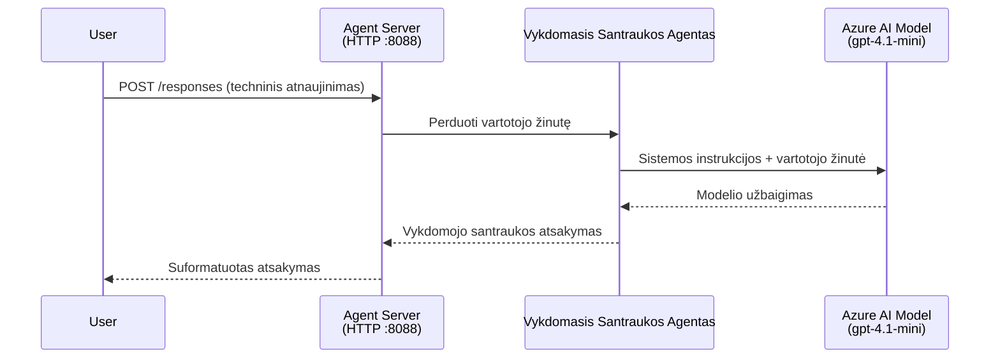
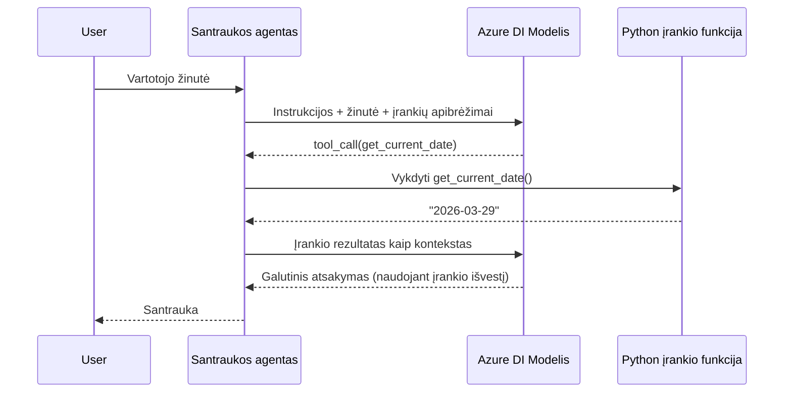

# Modulis 4 – Konfigūruokite nurodymus, aplinką ir įdiekite priklausomybes

Šiame modulyje pritaikote automatiškai sugeneruotus agento failus iš 3 modulio. Čia jūs paverčiate bendrą karkasą į **jūsų** agentą – rašydami nurodymus, nustatydami aplinkos kintamuosius, pasirinktinai pridėdami įrankių ir įdiegiant priklausomybes.

> **Primename:** Foundry plėtinys automatiškai sugeneravo jūsų projekto failus. Dabar jūs juos modifikuojate. Peržiūrėkite [`agent/`](../../../../../workshop/lab01-single-agent/agent) katalogą, kuriame yra pilnas pritaikyto agento veikiančio pavyzdys.

---

## Kaip komponentai dera tarpusavyje

### Užklausos gyvavimo ciklas (vienas agentas)


> **Su įrankiais:** jei agentas turi registruotų įrankių, modelis gali grąžinti įrankio kvietimą vietoje tiesioginio atsakymo. Sistema vietoje įvykdo įrankį, rezultatus grąžina modeliui, o modelis tada sugeneruoja galutinį atsakymą.


---

## 1 žingsnis: konfigūruokite aplinkos kintamuosius

Karkasas sukūrė `.env` failą su laikinais duomenimis. Jums reikia užpildyti realius duomenis iš 2 modulio.

1. Atidarykite karkaso projekte esantį **`.env`** failą (jis yra projekto šakniniame kataloge).
2. Pakeiskite laikinuosius duomenis realiais Foundry projekto duomenimis:

   ```env
   PROJECT_ENDPOINT=https://<your-account>.services.ai.azure.com/api/projects/<your-project>
   MODEL_DEPLOYMENT_NAME=gpt-4.1-mini
   ```

3. Išsaugokite failą.

### Kur rasti šias reikšmes

| Reikšmė | Kur rasti |
|---------|-----------|
| **Projekto pabaigos taškas** | Atidarykite **Microsoft Foundry** šoninį meniu VS Code → spustelėkite savo projektą → detalių rodinyje matysite pabaigos taško URL. Atrodo maždaug taip: `https://<account-name>.services.ai.azure.com/api/projects/<project-name>` |
| **Modelio diegimo pavadinimas** | Foundry meniu išskleiskite savo projektą → po **Models + endpoints** → šalia įdiegto modelio pamatysite jo pavadinimą (pvz., `gpt-4.1-mini`) |

> **Sauga:** niekada neįtraukite `.env` failo į versijų kontrolę. Jis jau pagal nutylėjimą įtrauktas į `.gitignore`. Jei ne – pridėkite:
> ```
> .env
> ```

### Kaip sklinda aplinkos kintamieji

Srautas yra toks: `.env` → `main.py` (skaito per `os.getenv`) → `agent.yaml` (priskiria konteinerio aplinkos kintamiesiems diegimo metu).

`main.py` karkasas skaito šias reikšmes taip:

```python
PROJECT_ENDPOINT = os.getenv("AZURE_AI_PROJECT_ENDPOINT") or os.getenv("PROJECT_ENDPOINT")
MODEL_DEPLOYMENT_NAME = os.getenv("AZURE_AI_MODEL_DEPLOYMENT_NAME", os.getenv("MODEL_DEPLOYMENT_NAME", "gpt-4.1-mini"))
```

Priimami tiek `AZURE_AI_PROJECT_ENDPOINT`, tiek `PROJECT_ENDPOINT` (agent.yaml naudoja `AZURE_AI_*` prefiksą).

---

## 2 žingsnis: Parašykite agento nurodymus

Tai svarbiausias pritaikymo etapas. Nurodymai apibrėžia jūsų agento asmenybę, elgesį, atsakymų formatą ir saugumo apribojimus.

1. Atidarykite `main.py` savo projekte.
2. Suraskite nurodymų eilutę (karkasas pateikia numatytąjį/bendrinį pavyzdį).
3. Pakeiskite ją detaliais, struktūrizuotais nurodymais.

### Ką turėtų apimti geri nurodymai

| Komponentas | Paskirtis | Pavyzdys |
|-------------|-----------|----------|
| **Vaidmuo** | Kas agentas yra ir ką daro | "Esate vykdomosios santraukos agentas" |
| **Tikslinė auditorija** | Kam skirti atsakymai | "Vyresniajai vadovybei su ribotomis techninėmis žiniomis" |
| **Įvesties apibrėžimas** | Kokius užklausimus apdoroja | "Techninių incidentų ataskaitos, operatyvūs atnaujinimai" |
| **Išvesties formatas** | Tikslus atsakymų struktūravimas | "Vykdomoji santrauka: - Kas įvyko: ... - Verslo poveikis: ... - Kitas žingsnis: ..." |
| **Taisyklės** | Apribojimai ir atsisakymo sąlygos | "NEĮTRAUKITE informacijos, kurios nebuvo pateikta" |
| **Saugumas** | Užkirsti kelią piktnaudžiavimui ir haliucinacijoms | "Jei įvestis neaiški, prašykite patikslinimo" |
| **Pavyzdžiai** | Įvesties ir išvesties poros elgesiui nurodyti | Įtraukite 2-3 pavyzdžius su skirtingomis įvestimis |

### Pavyzdys: Vykdomosios santraukos agento nurodymai

Štai nurodymai, naudojami dirbtuvėse [`agent/main.py`](../../../../../workshop/lab01-single-agent/agent/main.py):

```python
AGENT_INSTRUCTIONS = """You are an "Explain Like I'm an Executive" agent.

Purpose:
Your job is to translate complex technical or operational information into
clear, concise, and outcome-focused summaries that can be easily understood
by non-technical executives.

Audience:
Senior leaders with limited technical background who care about impact,
risk, and what happens next.

What you must do:
- Rephrase the input so it is understandable to a non-technical audience
- Prioritize clarity, brevity, and outcomes over technical accuracy
- Remove technical jargon, logs, metrics, stack traces, and deep root-cause details
- Translate technical causes into simple cause-and-effect statements
- Explicitly call out business impact
- Always include a clear next step or action
- Maintain a neutral, factual, and calm executive tone
- Do NOT add new facts or speculate beyond the input

Standard Output Structure (always use this wording):

Executive Summary:
- What happened: <plain-language description>
- Business impact: <clear, non-technical impact>
- Next step: <clear action or mitigation>

Rules:
- Keep responses under 100 words
- Do NOT add facts beyond the input
- If input is unclear, ask for clarification
"""
```

4. Pakeiskite esamus nurodymus `main.py` savo pasirinktais.
5. Išsaugokite failą.

---

## 3 žingsnis: (Pasirinktinai) Pridėkite pasirinktinius įrankius

Talpinami agentai gali vykdyti **vietines Python funkcijas** kaip [įrankius](https://learn.microsoft.com/azure/foundry/agents/concepts/tool-catalog). Tai pagrindinis pranašumas prieš tik tekstinius agentus – jūsų agentas gali vykdyti bet kokią serverio logiką.

### 3.1 Apibrėžkite įrankio funkciją

Pridėkite įrankio funkciją į `main.py`:

```python
from agent_framework import tool

@tool
def get_current_date() -> str:
    """Returns the current date in YYYY-MM-DD format."""
    from datetime import date
    return str(date.today())
```

Dekoratorius `@tool` paverčia įprastą Python funkciją agento įrankiu. Dokumentacija tampa įrankio aprašymu, kurį mato modelis.

### 3.2 Užregistruokite įrankį su agentu

Kuriant agentą per `.as_agent()` kontekstų tvarkyklę, perduokite įrankį per `tools` parametrą:

```python
async with AzureAIAgentClient(
    project_endpoint=PROJECT_ENDPOINT,
    model_deployment_name=MODEL_DEPLOYMENT_NAME,
    credential=credential,
).as_agent(
    name="my-agent",
    instructions=AGENT_INSTRUCTIONS,
    tools=[get_current_date],
) as agent:
    server = from_agent_framework(agent)
    await server.run_async()
```

### 3.3 Kaip veikia įrankio kvietimai

1. Vartotojas siunčia užklausą.
2. Modelis nusprendžia, ar reikalingas įrankis (remiantis užklausa, nurodymais ir įrankių aprašymais).
3. Jei reikalingas, sistema vietoje iškviečia jūsų Python funkciją (konteineryje).
4. Įrankio rezultatas grąžinamas modeliui kaip kontekstas.
5. Modelis sugeneruoja galutinį atsakymą.

> **Įrankiai veikia serverio pusėje** – jie vykdomi viduje jūsų konteinerio, ne vartotojo naršyklėje ar modelyje. Tai leidžia pasiekti duomenų bazes, API, failų sistemas ar bet kokias Python bibliotekas.

---

## 4 žingsnis: Sukurkite ir suaktyvinkite virtualią aplinką

Prieš diegiant priklausomybes, sukurkite izoliuotą Python aplinką.

### 4.1 Sukurkite virtualią aplinką

Atidarykite terminalą VS Code (`` Ctrl+` ``) ir vykdykite:

```powershell
python -m venv .venv
```

Tai sukurs `.venv` katalogą jūsų projekto direktorijoje.

### 4.2 Suaktyvinkite virtualią aplinką

**PowerShell (Windows):**

```powershell
.\.venv\Scripts\Activate.ps1
```

**Komandinė eilutė (Windows):**

```cmd
.venv\Scripts\activate.bat
```

**macOS/Linux (Bash):**

```bash
source .venv/bin/activate
```

Turėtumėte matyti `(.venv)` terminalo užrašo pradžioje – tai reiškia, kad virtuali aplinka aktyvi.

### 4.3 Įdiekite priklausomybes

Su suaktyvinta virtualia aplinka įdiekite reikiamus paketus:

```powershell
pip install -r requirements.txt
```

Tai įdiegia:

| Paketas | Paskirtis |
|---------|-----------|
| `agent-framework-azure-ai==1.0.0rc3` | Azure AI integracija [Microsoft Agent Framework](https://learn.microsoft.com/agent-framework/overview/) |
| `agent-framework-core==1.0.0rc3` | Pagrindinė agentų kūrimo sistema (įtraukia `python-dotenv`) |
| `azure-ai-agentserver-agentframework==1.0.0b16` | Talpinamo agento serverio vykdymo sistema [Foundry Agent Service](https://learn.microsoft.com/azure/foundry/agents/overview) |
| `azure-ai-agentserver-core==1.0.0b16` | Pagrindinės agentų serverio abstrakcijos |
| `debugpy` | Python derinimo įrankis (leidžia F5 derinimą VS Code) |
| `agent-dev-cli` | Vietinis kūrimo CLI agentų testavimui |

### 4.4 Patikrinkite įdiegimą

```powershell
pip list | Select-String "agent-framework|agentserver"
```

Tikėtina išvestis:
```
agent-framework-azure-ai   1.0.0rc3
agent-framework-core       1.0.0rc3
azure-ai-agentserver-agentframework 1.0.0b16
azure-ai-agentserver-core  1.0.0b16
```

---

## 5 žingsnis: Patikrinkite autentifikaciją

Agentas naudoja [`DefaultAzureCredential`](https://learn.microsoft.com/azure/developer/python/sdk/authentication/credential-chains#defaultazurecredential-overview), kuri bando įvairius autentifikacijos būdus šia tvarka:

1. **Aplinkos kintamieji** – `AZURE_CLIENT_ID`, `AZURE_TENANT_ID`, `AZURE_CLIENT_SECRET` (tarnybinis pagrindas)
2. **Azure CLI** – naudoja jūsų `az login` sesiją
3. **VS Code** – naudoja paskyrą, su kuria prisijungėte prie VS Code
4. **Managed Identity** – naudojama vykdant Azureje (diegimo metu)

### 5.1 Patikra vietiniam kūrimui

Bent viena iš šių turėtų veikti:

**A variantas: Azure CLI (rekomenduojama)**

```powershell
az account show --query "{name:name, id:id}" --output table
```

Tikėtina: parodys jūsų prenumeratos pavadinimą ir ID.

**B variantas: prisijungimas per VS Code**

1. Pažvelkite į apatiniame kairiajame VS Code kampelyje esantį **Paskyros** piktogramą.
2. Jei matote savo paskyros vardą, esate autentifikuotas.
3. Jei ne, spustelėkite piktogramą → **Prisijungti, kad naudotumėte Microsoft Foundry**.

**C variantas: tarnybinis pagrindas (CI/CD)**

```powershell
$env:AZURE_TENANT_ID = "<your-tenant-id>"
$env:AZURE_CLIENT_ID = "<your-client-id>"
$env:AZURE_CLIENT_SECRET = "<your-client-secret>"
```

### 5.2 Dažna autentifikacijos problema

Jeigu esate prisijungę prie kelių Azure paskyrų, įsitikinkite, kad pasirinkta teisinga prenumerata:

```powershell
az account set --subscription "<your-subscription-id>"
```

---

### Patikros punktai

- [ ] `.env` faile yra galiojantys `PROJECT_ENDPOINT` ir `MODEL_DEPLOYMENT_NAME` (ne laikinos reikšmės)
- [ ] Agentų nurodymai pritaikyti `main.py` faile – apibrėžia vaidmenį, auditoriją, atsakymo formatą, taisykles ir saugumo apribojimus
- [ ] (Pasirinktinai) Pasirinktiniai įrankiai apibrėžti ir užregistruoti
- [ ] Virtuali aplinka sukurta ir suaktyvinta (`(.venv)` matomas terminalo užraše)
- [ ] `pip install -r requirements.txt` įvykdytas sėkmingai be klaidų
- [ ] `pip list | Select-String "azure-ai-agentserver"` parodytas įdiegtas paketas
- [ ] Autentifikacija galioja – `az account show` grąžina prenumeratą ARBA esate prisijungę į VS Code

---

**Ankstesnis:** [03 – Sukurti talpinamą agentą](03-create-hosted-agent.md) · **Kitas:** [05 – Testuoti vietoje →](05-test-locally.md)

---

<!-- CO-OP TRANSLATOR DISCLAIMER START -->
**Atsakomybės apribojimas**:  
Šis dokumentas buvo išverstas naudojant dirbtinio intelekto vertimo paslaugą [Co-op Translator](https://github.com/Azure/co-op-translator). Nors stengiamės užtikrinti tikslumą, prašome atkreipti dėmesį, kad automatiniai vertimai gali turėti klaidų ar netikslumų. Originalus dokumentas gimtąja kalba turėtų būti laikomas autoritetingu šaltiniu. Svarbiai informacijai rekomenduojamas profesionalus žmogaus vertimas. Mes neatsakome už jokius nesusipratimus ar klaidingus aiškinimus, kylančius naudojant šį vertimą.
<!-- CO-OP TRANSLATOR DISCLAIMER END -->