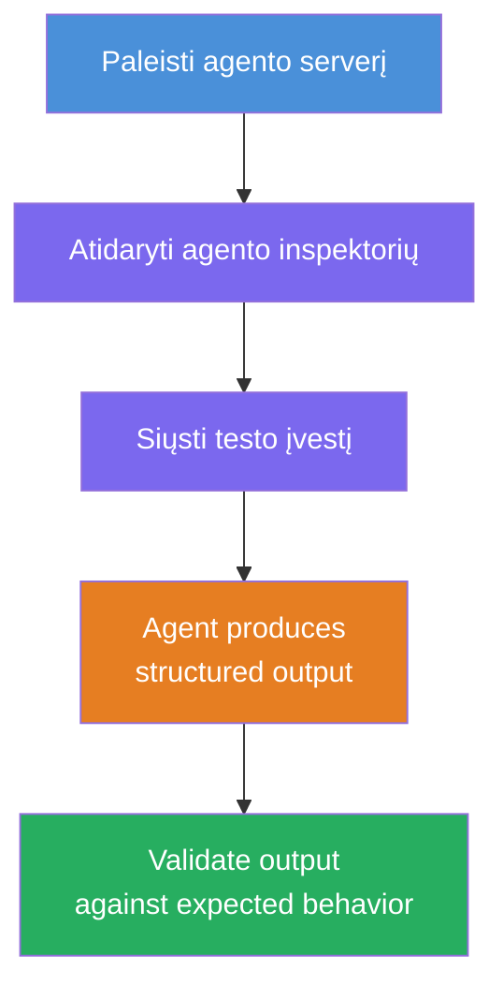
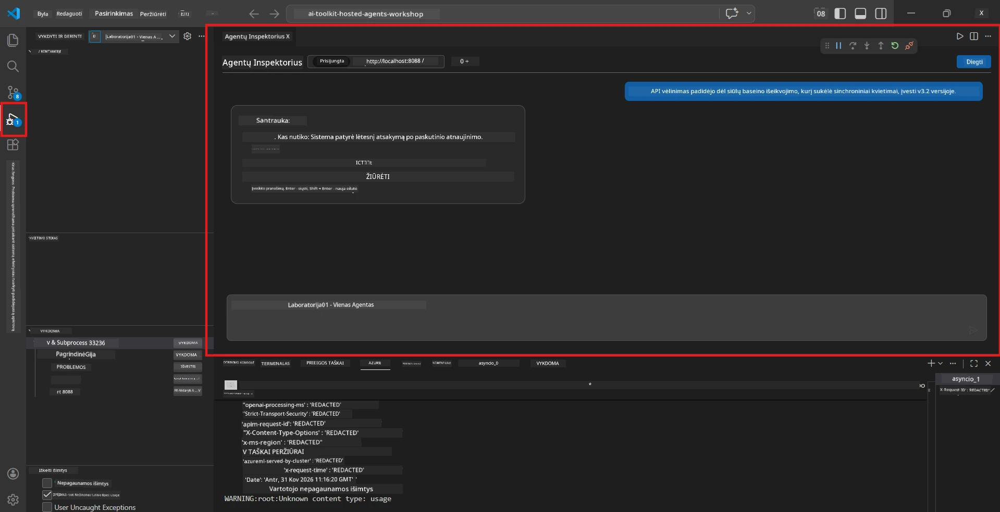
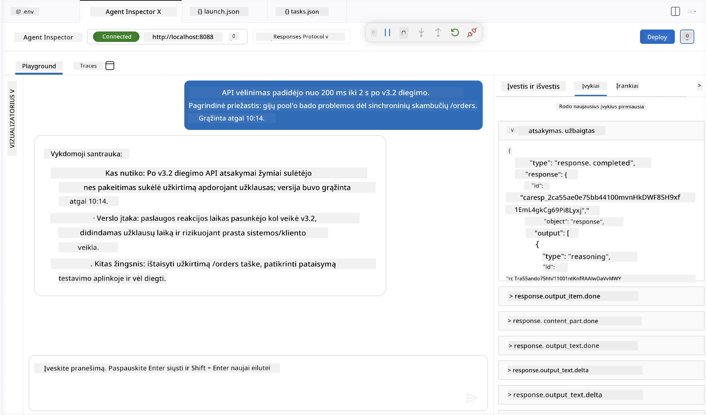

# 4 modulis - Vietinis testavimas

⏱️ ~10 min

Šiame modulyje jūs vykdote savo agentą vietoje ir patikrinate, ar jis tinkamai veikia naudodami **sėkmingo scenarijaus funkcinius testus**. Naudosite Agent Inspector (grafinę sąsają) arba tiesioginius HTTP užklausimus, kad patvirtintumėte, jog agentas pateikia struktūruotus, tikslius atsakymus.

### Vietinio testavimo eiga



---

## 1 variantas: Paspauskite F5 - Derinkite su Agent Inspector (rekomenduojama)

### Paleiskite derintuvą

1. Atidarykite **executive-summary-agent/** katalogą tiesiogiai VS Code (`Failas → Atidaryti katalogą`).
2. Atidarykite **Paleidimo ir derinimo** skydelį (`Ctrl+Shift+D`).
3. Išskleidžiamajame meniu pasirinkite **Debug Local Agent Server**.
4. Paspauskite **F5** (arba spustelėkite ▶ Paleisti derinimą).

> ⚠️ **Labai svarbu: Pasirinkite savo Python interpretatorių**
> Jei gaunate klaidą "ModuleNotFoundError" arba derintuvas nepasileidžia, turite nurodyti VS Code naudoti savo virtualią aplinką:
  > 1. Paspauskite `Ctrl+Shift+P` $\rightarrow$ įveskite **Python: Select Interpreter**.
  > 2. Pasirinkite interpretatorių, esantį jūsų projekto `.venv` kataloge (pvz., `.\.venv\Scripts\python.exe` Windows sistemoje).
  > 3. Perkraukite derinimo sesiją.
> Jei vis dar gaunate klaidų, rankiniu būdu atnaujinkite savo failą `tasks.json` taip:
  > 1. Atidarykite `.vscode/tasks.json` failą
  > 2. Suraskite komandą pavadinimu: `Run Agent/Workflow HTTP Server`
  > 3. Atnaujinkite komandos reikšmę taip: `"value": "${workspaceFolder}/.venv/bin/python",`

### Kas vyksta

1. HTTP serveris paleidžiamas adresu `http://localhost:8088/responses`.
2. Automatiškai atsidaro **Agent Inspector** skydelis – vizualinė pokalbių sąsaja testavimui.
3. Pertraukimai (`breakpoints`) aktyvuojami faile `main.py`.

Stebėkite Terminalą:
```
Starting executive summary hosted agent
Executive agent server running on http://localhost:8088
```

> **Jei Agent Inspector neatsidaro:** Paspauskite `Ctrl+Shift+P` → **Foundry Toolkit: Open Agent Inspector**.



> *Ekrano nuotraukoje gali būti senesnė 'AI TOOLKIT' ženklo versija iš ankstesnės plėtinio versijos.*

---

## 2 variantas: Testavimas per Terminalą (alternatyva)

Paleiskite agentą viename terminale, siųskite užklausas iš kito:

```bash
# Terminalas 1: Paleisti agentą
cd executive-summary-agent/
source .venv/bin/activate
python main.py
```

```bash
# Terminalas 2: Siųsti testą (curl)
curl -sS -X POST http://localhost:8088/responses \
  -H "Content-Type: application/json" \
  -d '{"input": "The API latency increased due to thread pool exhaustion caused by sync calls in v3.2.", "stream": false}'
```

---

## Scenarijų testai: sėkmingo kelio funkcijų patikra

Vykdykite **visus tris** žemiau nurodytus scenarijus. Jie patikrina, ar jūsų agentas pateikia teisingą, struktūruotą išvestį realioms įvestims.



### 1 scenarijus: IT incidentas - API delsos piką

**Įvestis:**
```
The API latency increased from 200ms to 2s after deploying v3.2.
Root cause: thread pool starvation from synchronous calls in /orders.
Rolled back at 10:14.
```

**Numatomas elgesys:**
- ✅ Laikosi "Vykdomos santraukos" struktūros (Kas nutiko / Verslo poveikis / Sekantis žingsnis)
- ✅ Nėra techninio žargono (nėra "thread pool", nėra "/orders", nėra "v3.2")
- ✅ Aiškiai nurodo verslo poveikį (pvz., vartotojai patyrė vėlavimus)
- ✅ Yra įtrauktas kitas žingsnis (pvz., patobulinimas įdiegtas, vykdoma stebėsena)

---

### 2 scenarijus: Duomenų vamzdis - ETL klaida

**Įvestis:**
```
The nightly ETL job failed because the upstream schema changed. APAC dashboards show missing data.
```

**Numatomas elgesys:**
- ✅ Apibendrina duomenų atnaujinimo gedimą aiškia kalba
- ✅ Paminimas APAC valdymo skydelio poveikis
- ✅ Įrašytas pataisos kitas žingsnis
- ✅ NEMINIMA "ETL", "schema" ar kiti techniniai terminai

---

### 3 scenarijus: Saugumas - Atskleisti prisijungimo duomenys

**Įvestis:**
```
Static analysis flagged a hardcoded secret in the repository.
The secret may have been exposed in commit history.
```

**Numatomas elgesys:**
- ✅ Aprašo prisijungimo/ saugumo problemą vadovui suprantama kalba
- ✅ Nurodo galimą riziką (neautorizuota prieiga)
- ✅ Nurodo pataisos veiksmus (prisijungimo duomenų pasikeitimas, auditavimas)
- ✅ NĖRA terminų kaip "statiška analizė", "komitų istorija", "įkoduota"

---

## Patikrinimo kriterijai

Kiekvienam scenarijui patikrinkite:

| # | Kriterijus | Praeina, jei |
|---|----------|---------------|
| 1 | **Struktūra** | Atsakymas naudoja "Vykdomos santraukos" formatą su visais trim punktais |
| 2 | **Aiški kalba** | Nėra techninio žargono, kurio vadovas nesuprastų |
| 3 | **Tikslumas** | Santrauka atitinka įvestį – nėra išgalvotų detalių |
| 4 | **Trumpumas** | Atsakymas trumpesnis nei 100 žodžių |
| 5 | **Kitas žingsnis** | Aiškiai nurodytas veiksmas arba prevencija |

---

## Derinimo patarimai

| Problema | Sprendimas |
|-------|-----|
| Agentas nepaleidžiamas | Patikrinkite `.env` reikšmes, įsitikinkite, kad venv aktyvuotas, vykdykite `pip install -r requirements.txt` |
| Tuščias arba bendrinis atsakymas | Peržiūrėkite nurodymus faile `main.py` – įsitikinkite, kad nurodytas išvesties formatas |
| Atsakyme yra žargono | Sustiprinkite taisykles dėl techninių terminų pašalinimo nurodymuose |
| Agent Inspector neatsidaro | `Ctrl+Shift+P` → **Foundry Toolkit: Open Agent Inspector** |
| Modelio klaidos Terminale | Patikrinkite, ar `AZURE_AI_MODEL_DEPLOYMENT_NAME` tiksliai atitinka (didžiosios / mažosios raidės svarbios) |

---

### ✅ Kontrolinis taškas

- [ ] Agentas paleidžiamas vietoje be klaidų
- [ ] Agent Inspector atsidaro ir rodo pokalbių sąsają (jei naudojate F5)
- [ ] **1 scenarijus** (IT incidentas) – struktūruota Vykdomos santraukos formą, be žargono
- [ ] **2 scenarijus** (duomenų vamzdis) – aktuali santrauka su verslo poveikiu
- [ ] **3 scenarijus** (saugumo įspėjimas) – tinkama rizikos komunikacija
- [ ] Visi atsakymai atitinka apibrėžtą išvesties struktūrą

> **Išsaugokite savo atsakymus** (nukopijuokite arba padarykite ekrano nuotrauką) – palyginsite juos su debesies rezultatais 6 modulyje.

---

**Ankstesnis:** [03 - Konfigūruoti ir programuoti](03-configure-and-code.md) · **Kitas:** [05 - Diegti į Foundry →](05-deploy-to-foundry.md)

---

<!-- CO-OP TRANSLATOR DISCLAIMER START -->
**Atsakomybės apribojimas**:
Šis dokumentas buvo išverstas naudojant dirbtinio intelekto vertimo paslaugą [Co-op Translator](https://github.com/Azure/co-op-translator). Nors siekiame tikslumo, prašome atkreipti dėmesį, kad automatiniai vertimai gali turėti klaidų ar netikslumų. Originalus dokumentas jo gimtąja kalba laikomas autoritetingu šaltiniu. Svarbiai informacijai rekomenduojama naudoti profesionalų žmogiškąjį vertimą. Mes neatsakome už jokius nesusipratimus ar neteisingą interpretaciją, kilusią naudojantis šiuo vertimu.
<!-- CO-OP TRANSLATOR DISCLAIMER END -->