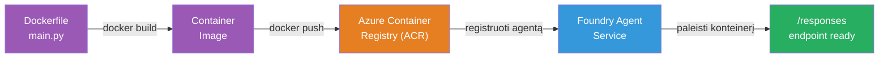
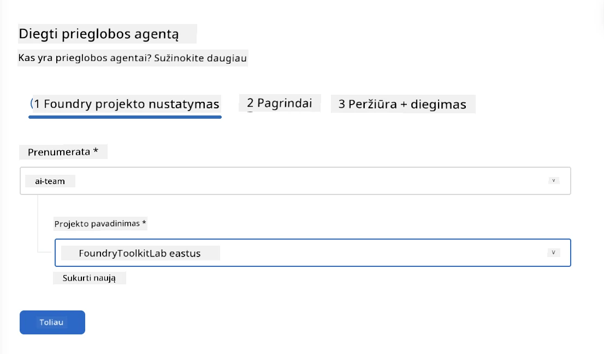
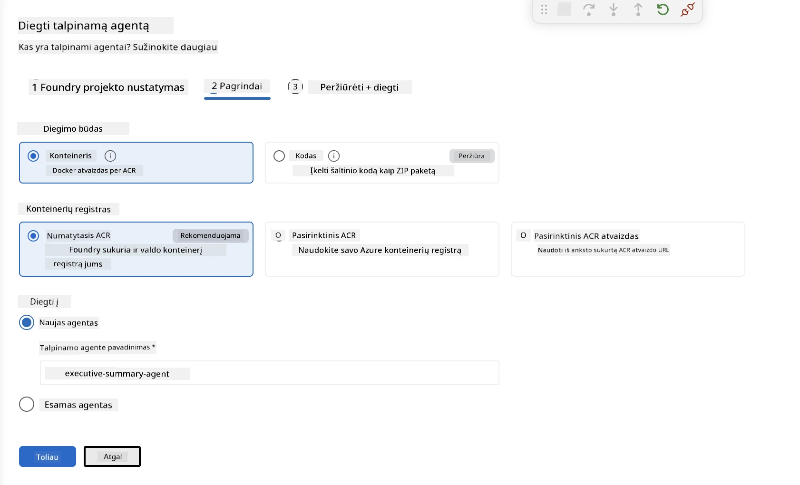
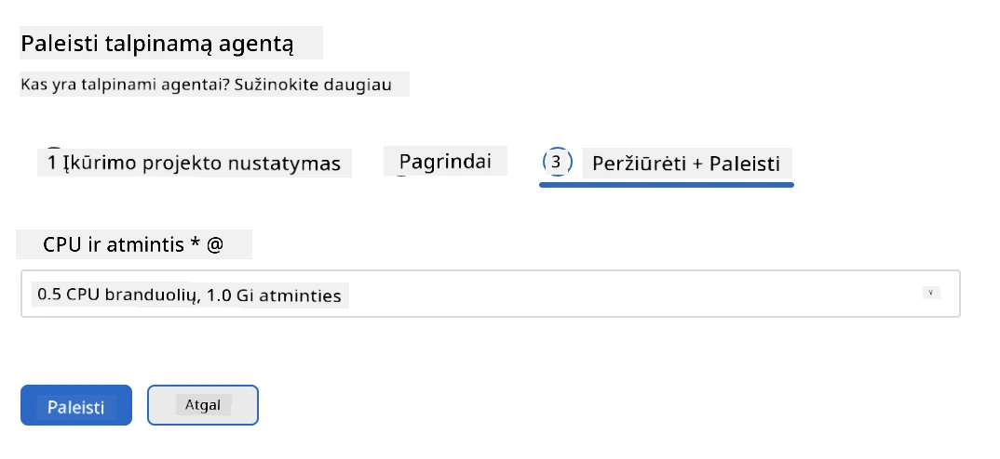
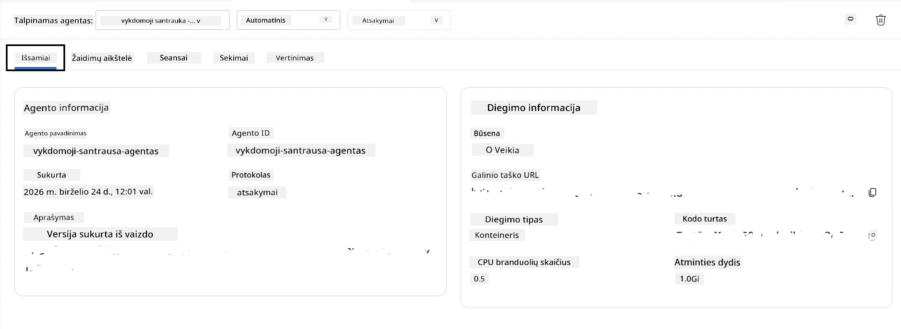

# 5 modulis – Diegimas į Foundry agentų tarnybą

⏱️ ~10 min

> ⚠️ **B kelio vartotojams:** Šiam moduliui reikalinga Foundry prenumerata. Jei naudojate Foundry Local, pereikite prie [07 modulio – Santrauka](07-summary.md). Jūs sėkmingai užbaigėte vietinio kūrimo darbo eigą!

Šiame modulyje jūs įdiegiate vietoje išbandytą agentą į Microsoft Foundry kaip **talpinamą agentą**. Diegimo metu kuriamas konteinerio atvaizdas, siunčiamas į Azure Container Registry ir paleidžiamas agentas Foundry valdomoje infrastruktūroje.

### Diegimo pipeline'as

---

## Išankstinis reikalavimų patikrinimas

Prieš diegiant, įsitikinkite:

- [ ] Agentas praeina visus 3 vietinius scenarijus iš [04 modulio](04-test-locally.md)
- [ ] Turite **Azure AI vartotojo** vaidmenį projekte ([01 modulis, RBAC priskyrimas](01-setup.md#deploy-a-model--assign-rbac))
- [ ] Esate prisijungę prie Azure per VS Code (Paskyrų piktograma rodo jūsų vardą)

---

## 1 žingsnis: Pradėkite diegimą

### A variantas: Diegimas iš Agent Inspector (rekomenduojama)

Jei Agent Inspector yra atidarytas (iš testavimo):
1. Spustelėkite mygtuką **Deploy** viršutiniame dešiniajame kampe (debesis su rodykle ↑).

### B variantas: Diegimas per komandų paletę

1. Paspauskite `Ctrl+Shift+P` → **Foundry Toolkit: Deploy Hosted Agent**.

---

## 2 žingsnis: Konfigūruokite diegimą

Vedlys paprašys:

| Klausimas | Pasirinkimas |
|--------|-----------|
| **Prenumerata** | Jūsų Azure prenumerata |
| **Tikslinis projektas** | Jūsų Foundry projektas (pvz., `workshop-agents`) |

Spustelėkite **next**, kad konfigūruotumėte agentą.

| Klausimas | Pasirinkimas |
|--------|-----------|
| **Diegimo būdas** | Konteineris |
| **Konteinerių saugykla** | **Numatytoji ACR** (Microsoft Foundry sukuria ir valdo ją už jus) |
| **Diegti į** | Naują agentą (pavadinimas, `executive-summary-agent`) |

Spustelėkite **next**, kad peržiūrėtumėte ir diegtumėte agentą.

| Klausimas | Pasirinkimas |
|--------|-----------|
| **CPU ir atmintis** | **0.25 CPU branduoliai, 0.5 Gi atminties** (užtenka dirbtuvių darbui) |

---

## 3 žingsnis: Diekite ir stebėkite

1. Spustelėkite **Deploy**.
2. Stebėkite **Output** skydelį (pasirinkite **Microsoft Foundry** iš išskleidžiamojo sąrašo).
3. Diegimas vyksta šiais etapais:
   - **Docker build** – sukuria konteinerį iš jūsų Dockerfile
   - **Docker push** – siunčia atvaizdą į ACR (pirmą diegimą užtrunka 1–3 min)
   - **Agent registration** – sukuria talpinamą agentą Foundry sistemoje
   - **Container start** – paleidžia konteinerį su sistemos valdomu identitetu

4. Baigus, pasirodo pranešimas:
   > **my-agent sėkmingai įdiegtas.** `Peržiūrėti žurnalus` `Paleisti agentą`

5. Spustelėkite **Run agent** norėdami atidaryti Agent Playground.

### Diegimo būsenos reikšmės

| Būsena | Reiškia |
|--------|---------|
| **Running** | Konteineris paruoštas, agentas atsako |
| **Pending** | Konteineris pradeda veikti – palaukite 30–60 sekundžių |
| **Failed** | Patikrinkite žurnalus (žr. toliau trikčių šalinimą) |

---

## Dažnos diegimo klaidos

| Klaida | Pagrindinė priežastis | Sprendimas |
|-------|-----------|-----|
| Leidimas `agents/write` atmestas | Trūksta **Azure AI vartotojo** vaidmens projekte | [01 modulis, RBAC priskyrimas](01-setup.md#deploy-a-model--assign-rbac) |
| Docker neveikia | Docker Desktop nepaleistas | Paleiskite Docker Desktop → patikrinkite komandą `docker info` |
| ACR autorizacija | Valdomas identitetas negali atsisiųsti atvaizdo | Žr. [08 modulis – Trikčių šalinimas](08-troubleshooting.md) |

---

### ✅ Kontrolinis taškas

- [ ] Diegimas baigtas be klaidų
- [ ] Agentas matomas po **Talpinamų agentų (peržiūra)** skiltyje Foundry šoniniame meniu
- [ ] Konteinerio būsena rodoma kaip **Running**
- [ ] Atidaryta Agent Playground kortelė, rodanti agente informaciją ir galinio taško URL

---

**Ankstesnis:** [04 - Testavimas vietoje](04-test-locally.md) · **Kitas:** [06 - Patikra Playground →](06-verify-in-playground.md)

---

<!-- CO-OP TRANSLATOR DISCLAIMER START -->
**Atsakomybės apribojimas**:
Šis dokumentas buvo išverstas naudojant dirbtinio intelekto vertimo paslaugą [Co-op Translator](https://github.com/Azure/co-op-translator). Nors siekiame tikslumo, prašome atkreipti dėmesį, kad automatiniai vertimai gali turėti klaidų ar netikslumų. Originalus dokumentas jo gimtąja kalba laikomas autoritetingu šaltiniu. Svarbiai informacijai rekomenduojama naudoti profesionalų žmogiškąjį vertimą. Mes neatsakome už jokius nesusipratimus ar neteisingą interpretaciją, kilusią naudojantis šiuo vertimu.
<!-- CO-OP TRANSLATOR DISCLAIMER END -->