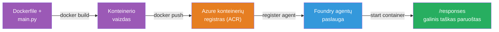
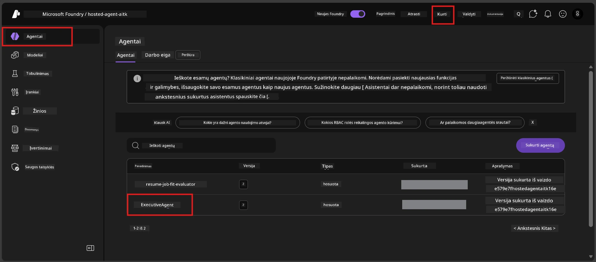

# Module 6 - Diegimas į Foundry Agent Service

Šiame modulyje diegiate savo vietoje išbandytą agentą į Microsoft Foundry kaip [**Talpinamą Agentą**](https://learn.microsoft.com/azure/foundry/agents/concepts/hosted-agents). Diegimo procesas sukuria Docker konteinerio vaizdą iš jūsų projekto, įkelia jį į [Azure Container Registry (ACR)](https://learn.microsoft.com/azure/container-registry/container-registry-intro) ir sukuria talpinamo agento versiją [Foundry Agent Service](https://learn.microsoft.com/azure/foundry/agents/overview).

### Diegimo kanalas


---

## Priešdiegiamos sąlygos

Prieš diegiant, patikrinkite kiekvieną žemiau išvardytą punktą. Šių žingsnių praleidimas yra dažniausia diegimo nesėkmių priežastis.

1. **Agentas praėjo vietinius trumpus testus:**
   - Įvykdėte visus 4 testus [5 modulyje](05-test-locally.md) ir agentas atsakė teisingai.

2. **Turite [Azure AI User](https://learn.microsoft.com/azure/foundry/concepts/rbac-foundry#built-in-roles) vaidmenį:**
   - Tai buvo priskirta 2 modulio 3 žingsnyje (02-create-foundry-project.md). Jei nesate tikri, patikrinkite dabar:
   - Azure Portal → jūsų Foundry **projekto** išteklius → **Access control (IAM)** → **Role assignments** skirtukas → ieškokite savo vardo → įsitikinkite, kad yra nurodytas **Azure AI User**.

3. **Prietaisas yra prisijungęs prie Azure per VS Code:**
   - Patikrinkite paskyrų piktogramą apatiniame kairiajame VS Code kampe. Turite matyti savo paskyros vardą.

4. **(Pasirinktinai) Docker Desktop veikia:**
   - Docker reikalingas tik tuo atveju, kai Foundry plėtinys prašo atlikti vietinį kūrimą. Daugeliu atvejų plėtinys automatiškai atlieka konteinerio kūrimus diegimo metu.
   - Jei Docker įdiegtas, patikrinkite, kad jis veikia: `docker info`

---

## 1 žingsnis: Pradėkite diegimą

Yra du būdai diegti - abu veda prie to paties rezultato.

### A variantas: Diegti iš Agent Inspector (rekomenduojama)

Jei paleidžiate agentą su derintuvu (F5) ir Agent Inspector yra atidarytas:

1. Pažvelkite į **viršutinį dešinį** Agent Inspector lango kampą.
2. Spustelėkite mygtuką **Deploy** (debesis su rodykle į viršų ↑).
3. Atidarysite diegimo vedlį.

### B variantas: Diegti per Komandų Paletę

1. Paspauskite `Ctrl+Shift+P`, kad atidarytumėte **Command Palette**.
2. Įveskite: **Microsoft Foundry: Deploy Hosted Agent** ir pasirinkite.
3. Atsidarys diegimo vedlys.

---

## 2 žingsnis: Konfigūruokite diegimą

Diengimo vedlys padės jums sukonfigūruoti. Užpildykite kiekvieną lauką:

### 2.1 Pasirinkite tikslinį projektą

1. Išskleidžiamajame sąraše matysite savo Foundry projektus.
2. Pasirinkite projektą, kurį sukūrėte 2 modulyje (pvz., `workshop-agents`).

### 2.2 Pasirinkite konteinerio agento failą

1. Bus paprašyta pasirinkti agento įėjimo tašką.
2. Pasirinkite **`main.py`** (Python) – šis failas naudojamas vedlio agento projekto identifikavimui.

### 2.3 Konfigūruokite išteklius

| Nustatymas | Rekomenduojama reikšmė | Pastabos |
|------------|-------------------------|----------|
| **CPU**    | `0.25`                  | Numatytoji, pakankama darbo dirbtuvėms. Didinkite produkciniams apkrovimams |
| **Atmintis** | `0.5Gi`                | Numatytoji, pakankama darbo dirbtuvėms |

Šie parametrai atitinka reikšmes `agent.yaml` faile. Galite priimti numatytąsias.

---

## 3 žingsnis: Patvirtinkite ir diekite

1. Vedlys parodys diegimo santrauką su:
   - Tikslo projekto pavadinimu
   - Agento pavadinimu (iš `agent.yaml`)
   - Konteinerio failu ir ištekliais
2. Peržvelkite santrauką ir spauskite **Confirm and Deploy** (arba **Deploy**).
3. Stebėkite eigą VS Code.

### Kas vyksta diegimo metu (žingsnis po žingsnio)

Diegimas yra kelių etapų procesas. Stebėkite VS Code **Output** panelę (pasirinkite "Microsoft Foundry" iš išskleidžiamo sąrašo):

1. **Docker build** – VS Code sukuria Docker konteinerio vaizdą iš jūsų `Dockerfile`. Matysite Docker sluoksnių pranešimus:
   ```
   Step 1/6 : FROM python:<version>-slim
   Step 2/6 : WORKDIR /app
   ...
   Successfully built abc123def456
   ```

2. **Docker push** – Vaizdas įkeltas į **Azure Container Registry (ACR)**, susieto su jūsų Foundry projektu. Tai gali užtrukti 1-3 minutes pirmojo diegimo metu (pagrindinis vaizdas yra virš 100MB).

3. **Agento registracija** – Foundry Agent Service sukuria naują talpinamą agentą (arba naują versiją, jei agentas jau egzistuoja). Naudojama agento metaduomenys iš `agent.yaml`.

4. **Konteinerio paleidimas** – Konteineris paleidžiamas Foundry valdomoje infrastruktūroje. Platforma priskiria [sistemos valdomą tapatybę](https://learn.microsoft.com/azure/foundry/agents/concepts/agent-identity) ir atskleidžia `/responses` galinį tašką.

> **Pirmas diegimas yra lėtesnis** (Docker turi įkelti visus sluoksnius). Vėlesni diegimai yra greitesni, nes Docker talpina nepakitusius sluoksnius.

---

## 4 žingsnis: Patikrinkite diegimo būseną

Kai diegimo komanda baigs darbą:

1. Atidarykite **Microsoft Foundry** šoninę juostą spustelėdami Foundry ikoną Activity Bar'e.
2. Išplėskite **Hosted Agents (Preview)** skyrių po savo projektu.
3. Turėtumėte matyti savo agente pavadinimą (pvz., `ExecutiveAgent` arba pavadinimą iš `agent.yaml`).
4. **Spustelėkite agente pavadinimą**, kad jį išplėstumėte.
5. Matysite vieną ar kelias **versijas** (pvz., `v1`).
6. Spustelėkite versiją, kad pamatytumėte **Konteinerio Detales**.
7. Patikrinkite **Statuso** lauką:

   | Statusas     | Reikšmė                                      |
   |--------------|----------------------------------------------|
   | **Started** arba **Running** | Konteineris veikia, agentas paruoštas |
   | **Pending**               | Konteineris paleidžiamas (palaukite 30-60 sek.) |
   | **Failed**                | Konteinerio paleidimas nepavyko (peržiūrėkite žurnalus – žiūrėkite trikčių šalinimą žemiau) |



> **Jei „Pending“ matote ilgiau nei 2 minutes:** Konteineris gali traukti pagrindinį vaizdą. Palaukite šiek tiek ilgiau. Jei būklė išlieka, patikrinkite konteinerio žurnalus.

---

## Dažniausios diegimo klaidos ir sprendimai

### Klaida 1: Leidimo atsisakymas - `agents/write`

```
Error: lacks the required data action 
Microsoft.CognitiveServices/accounts/AIServices/agents/write 
to perform POST /api/projects/{projectName}/assistants operation.
```

**Pagrindinė priežastis:** Neturite `Azure AI User` vaidmens **projekto** lygyje.

**Sprendimas žingsnis po žingsnio:**

1. Atidarykite [https://portal.azure.com](https://portal.azure.com).
2. Paieškos juostoje įveskite savo Foundry **projekto** pavadinimą ir spustelėkite jį.
   - **Svarbu:** Įsitikinkite, kad einate į **projekto** išteklių (tipas: "Microsoft Foundry project"), o ne į aukštesnio lygio paskyros/hub išteklius.
3. Kairėje navigacijoje spustelėkite **Access control (IAM)**.
4. Spustelėkite **+ Add** → **Add role assignment**.
5. Skiltyje **Role** ieškokite [**Azure AI User**](https://learn.microsoft.com/azure/foundry/concepts/rbac-foundry#built-in-roles) ir pasirinkite jį. Spustelėkite **Next**.
6. Skiltyje **Members** pasirinkite **User, group, or service principal**.
7. Spustelėkite **+ Select members**, suraskite savo vardą/el. paštą, pažymėkite save, spustelėkite **Select**.
8. Spustelėkite **Review + assign** → dar kartą **Review + assign**.
9. Palaukite 1-2 minutes, kol vaidmens priskyrimas pasiskirstys.
10. **Pakartokite diegimą** nuo 1 žingsnio.

> Vaidmuo turi būti priskirtas **projekto** sferoje, ne tik paskyros lygyje. Tai pats dažniausias diegimų nesėkmių šaltinis.

### Klaida 2: Docker neveikia

```
Error: Docker build failed / Cannot connect to Docker daemon
```

**Sprendimas:**
1. Paleiskite Docker Desktop (raskite jį Pradžios meniu arba sistemos dėkle).
2. Palaukite, kol rodys „Docker Desktop is running“ (30-60 sek.).
3. Patikrinkite: `docker info` terminale.
4. **Windows specifika:** Įsitikinkite, kad Docker Desktop nustatymuose yra įjungtas WSL 2 backend → **General** → **Use the WSL 2 based engine**.
5. Pakartokite diegimą.

### Klaida 3: ACR leidimai - `AcrPullUnauthorized`

```
Error: AcrPullUnauthorized
```

**Pagrindinė priežastis:** Foundry projekto valdomoji tapatybė neturi teisių traukti iš konteinerių registro.

**Sprendimas:**
1. Azure Portal’e eikite į savo **[Container Registry](https://learn.microsoft.com/azure/container-registry/container-registry-intro)** (ta pati išteklių grupė kaip ir Foundry projektas).
2. Eikite į **Access control (IAM)** → **Add** → **Add role assignment**.
3. Pasirinkite **[AcrPull](https://learn.microsoft.com/azure/container-registry/container-registry-roles)** vaidmenį.
4. Skiltyje Members pasirinkite **Managed identity** → suraskite Foundry projekto valdomą tapatybę.
5. **Review + assign**.

> Paprastai tai nustatoma automatiškai per Foundry plėtinį. Jei matote šią klaidą, gali būti, kad automatinis nustatymas nepavyko.

### Klaida 4: Kontainerio platformos neatitikimas (Apple Silicon)

Jei diegiate iš Apple Silicon Mac (M1/M2/M3), konteineris turi būti sukurtas `linux/amd64` platformai:

```bash
docker build --platform linux/amd64 -t myagent:v1 .
```

> Foundry plėtinys šią situaciją daugeliui naudotojų tvarko automatiškai.

---

### Kontrolinis punktas

- [ ] Diegimo komanda sėkmingai baigėsi be klaidų VS Code
- [ ] Agentas matomas po **Hosted Agents (Preview)** Foundry šoninėje juostoje
- [ ] Paspaudėte agento pavadinimą → pasirinkote versiją → matėte **Konteinerio Detales**
- [ ] Konteinerio būsena rodoma kaip **Started** arba **Running**
- [ ] (Jei buvo klaidų) Nustatėte klaidą, pritaikėte sprendimą ir sėkmingai perdiegtote

---

**Ankstesnis:** [05 - Test Locally](05-test-locally.md) · **Kitas:** [07 - Verify in Playground →](07-verify-in-playground.md)

---

<!-- CO-OP TRANSLATOR DISCLAIMER START -->
**Atsakomybės apribojimas**:
Šis dokumentas buvo išverstas naudojant dirbtinio intelekto vertimo paslaugą [Co-op Translator](https://github.com/Azure/co-op-translator). Nors stengiamės užtikrinti tikslumą, prašome atkreipti dėmesį, kad automatizuoti vertimai gali turėti klaidų ar netikslumų. Originalus dokumentas jo gimtąja kalba turėtų būti laikomas pagrindiniu šaltiniu. Kritinei informacijai rekomenduojama naudoti profesionalų žmogaus vertimą. Mes neprisiimame atsakomybės už bet kokius nesusipratimus ar netinkamą interpretaciją, kylančią dėl šio vertimo naudojimo.
<!-- CO-OP TRANSLATOR DISCLAIMER END -->