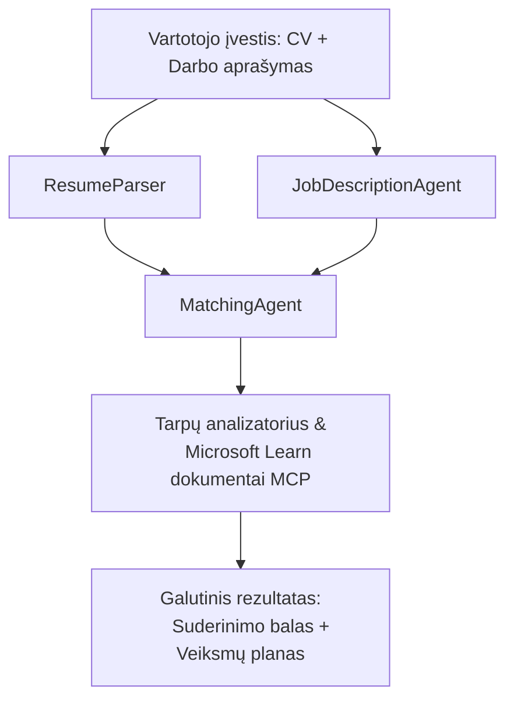

# PersonalCareerCopilot - Gyvenimo aprašymo ir darbo atitikimo vertintojas

Daugiaveiksmių agentų darbo eiga, kuri įvertina, kaip gerai gyvenimo aprašymas atitinka darbo aprašymą, tuomet generuoja personalizuotą mokymosi kelią, padedantį užpildyti spragas.

---

## Agentai

| Agentas | Vaidmuo | Įrankiai |
|---------|---------|---------|
| **ResumeParser** | Ištraukia struktūrizuotus įgūdžius, patirtį, sertifikatus iš gyvenimo aprašymo teksto | - |
| **JobDescriptionAgent** | Ištraukia reikalingus/ pageidaujamus įgūdžius, patirtį, sertifikatus iš darbo aprašymo | - |
| **MatchingAgent** | Palygina profilį su reikalavimais → atitikimo balas (0-100) + atitikę/trūkstami įgūdžiai | - |
| **GapAnalyzer** | Sudaro personalizuotą mokymosi planą su Microsoft Learn ištekliais | `search_microsoft_learn_for_plan` (MCP) |

## Darbo eiga


---

## Greitas pradėjimas

### 1. Sukurkite aplinką

```powershell
cd workshop\lab02-multi-agent\PersonalCareerCopilot
python -m venv .venv
.\.venv\Scripts\Activate.ps1          # Windows PowerShell
# source .venv/bin/activate            # macOS / Linux
pip install -r requirements.txt
```

### 2. Sužymėkite prisijungimo duomenis

Nukopijuokite pavyzdinį env failą ir užpildykite savo Foundry projekto duomenis:

```powershell
cp .env.example .env
```

Redaguokite `.env`:

```env
PROJECT_ENDPOINT=https://<your-account>.services.ai.azure.com/api/projects/<your-project>
MODEL_DEPLOYMENT_NAME=gpt-4.1-mini
```

| Reikšmė | Kur rasti |
|---------|-----------|
| `PROJECT_ENDPOINT` | Microsoft Foundry šoninė juosta VS Code → dešiniuoju pelės klavišu spustelėkite projektą → **Copy Project Endpoint** |
| `MODEL_DEPLOYMENT_NAME` | Foundry šoninė juosta → išplėskite projektą → **Models + endpoints** → diegimo pavadinimas |

### 3. Paleiskite lokaliai

```powershell
python -m debugpy --listen 127.0.0.1:5679 -m agentdev run main.py --verbose --port 8088
```

Arba naudokite VS Code užduotį: `Ctrl+Shift+P` → **Tasks: Run Task** → **Run Lab02 HTTP Server**.

### 4. Testuokite su Agent Inspector

Atidarykite Agent Inspector: `Ctrl+Shift+P` → **Foundry Toolkit: Open Agent Inspector**.

Įklijuokite šį testinį užklausą:

```
Resume:
Jane Doe
Senior Software Engineer with 5 years of experience in Python, Django, and AWS.
Built microservices handling 10K+ requests/second. Led a team of 4 developers.
Certifications: AWS Solutions Architect Associate.
Education: B.S. Computer Science, State University.

Job Description:
Senior Cloud Engineer at Contoso Ltd.
Required: Python, Azure, Kubernetes, Terraform, CI/CD pipelines.
Preferred: Go, monitoring (Prometheus/Grafana), cost optimization.
Experience: 5+ years in cloud infrastructure.
Certifications: Azure Solutions Architect Expert preferred.
```

**Tikėtina:** Atitikimo balas (0-100), atitikę/trūkstami įgūdžiai ir personalizuotas mokymosi kelias su Microsoft Learn URL.

### 5. Diegimas į Foundry

`Ctrl+Shift+P` → **Microsoft Foundry: Deploy Hosted Agent** → pasirinkite savo projektą → patvirtinkite.

---

## Projekto struktūra

```
PersonalCareerCopilot/
├── .env.example        ← Template for environment variables
├── .env                ← Your credentials (git-ignored)
├── agent.yaml          ← Hosted agent definition (name, resources, env vars)
├── Dockerfile          ← Container image for Foundry deployment
├── main.py             ← 4-agent workflow (instructions, MCP tool, WorkflowBuilder)
└── requirements.txt    ← Python dependencies
```

## Pagrindiniai failai

### `agent.yaml`

Apibrėžia paskelbtą agentą Foundry Agent Service:
- `kind: hosted` - veikia kaip valdomas konteineris
- `protocols: [responses v1]` - suteikia `/responses` HTTP galinį tašką
- `environment_variables` - `PROJECT_ENDPOINT` ir `MODEL_DEPLOYMENT_NAME` įterpiami įdiegimo metu

### `main.py`

Sudėtyje:
- **Agento nurodymai** - keturi `*_INSTRUCTIONS` konstantai, po vieną kiekvienam agentui
- **MCP įrankis** - `search_microsoft_learn_for_plan()` naudoja `https://learn.microsoft.com/api/mcp` per Streamable HTTP
- **Agento kūrimas** - `create_agents()` konteksto valdiklis, naudojantis `AzureAIAgentClient.as_agent()`
- **Darbo eigos grafikas** - `create_workflow()` naudoja `WorkflowBuilder` agentų jungimui su išskleidimo/ susijungimo/ sekos modeliais
- **Serverio paleidimas** - `from_agent_framework(agent).run_async()` prievade 8088

### `requirements.txt`

| Paketas | Versija | Paskirtis |
|---------|---------|-----------|
| `agent-framework-azure-ai` | `1.0.0rc3` | Azure AI integracija Microsoft Agent Framework |
| `agent-framework-core` | `1.0.0rc3` | Pagrindinė vykdymo aplinka (įskaitant WorkflowBuilder) |
| `azure-ai-agentserver-agentframework` | `1.0.0b16` | Paskelbto agento serverio vykdymas |
| `azure-ai-agentserver-core` | `1.0.0b16` | Pagrindinės serverio agento abstrakcijos |
| `debugpy` | naujausia | Python derinimas (F5 VS Code) |
| `agent-dev-cli` | `--pre` | Vietinis kūrimo CLI + Agent Inspector backend |

---

## Gedimų šalinimas

| Problema | Sprendimas |
|----------|------------|
| `RuntimeError: Missing required environment variable(s)` | Sukurkite `.env` su `PROJECT_ENDPOINT` ir `MODEL_DEPLOYMENT_NAME` |
| `ModuleNotFoundError: No module named 'agent_framework'` | Aktyvuokite venv ir paleiskite `pip install -r requirements.txt` |
| Microsoft Learn URL neatsiranda rezultate | Patikrinkite interneto prieigą prie `https://learn.microsoft.com/api/mcp` |
| Rodoma tik 1 spragos kortelė (trumpinama) | Patikrinkite, ar `GAP_ANALYZER_INSTRUCTIONS` apima `CRITICAL:` bloką |
| Prievadas 8088 užimtas | Sustabdykite kitus serverius: `netstat -ano \| findstr :8088` |

Išsamesniam gedimų šalinimui žiūrėkite [Module 8 - Troubleshooting](../docs/08-troubleshooting.md).

---

**Pilnas vadovas:** [Lab 02 Docs](../docs/README.md) · **Atgal į:** [Lab 02 README](../README.md) · [Dirbtuvės pradžia](../../../README.md)

---

<!-- CO-OP TRANSLATOR DISCLAIMER START -->
**Atsakomybės apribojimas**:  
Šis dokumentas buvo išverstas naudojant dirbtinio intelekto vertimo paslaugą [Co-op Translator](https://github.com/Azure/co-op-translator). Nors siekiame tikslumo, atkreipkite dėmesį, kad automatizuoti vertimai gali turėti klaidų ar netikslumų. Originalus dokumentas jo gimtąja kalba turėtų būti laikomas pagrindiniu šaltiniu. Kritiniais atvejais rekomenduojamas profesionalus žmogaus atliktas vertimas. Mes neatsakome už jokius nesusipratimus ar neteisingus aiškinimus, kylančius naudojant šį vertimą.
<!-- CO-OP TRANSLATOR DISCLAIMER END -->