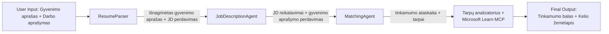

# PersonalCareerCopilot - gyvenimo aprašymo → darbo atitikties vertintojas

Darbo eigos pagrindu sukurta daugiavektoriaus programa, vertinanti, kaip gerai gyvenimo aprašymas atitinka darbo aprašymą, ir generuojanti suasmenintą mokymosi kelią spragoms užpildyti.

---

## Agentai

| Agentas | Vaidmuo | Įrankiai |
|-------|------|-------|
| **ResumeParser** | Išskiria struktūrizuotus įgūdžius, patirtį, sertifikatus iš gyvenimo aprašymo teksto | - |
| **JobDescriptionAgent** | Išskiria reikiamus/pageidaujamus įgūdžius, patirtį, sertifikatus iš darbo aprašymo | - |
| **MatchingAgent** | Lygina profilį su reikalavimais → atitikties balas (0-100) + surasti/trūkstami įgūdžiai | - |
| **GapAnalyzer** | Kuria suasmenintą mokymosi planą su Microsoft Learn ištekliais | `search_microsoft_learn_for_plan` (MCP) |

## Darbo eiga


```mermaid
flowchart LR
    UserInput["User Input: Gyvenimo aprašas + Darbo aprašymas"] --> ResumeParser
    ResumeParser -- "išnagrinėtas gyvenimo aprašas + JD perdavimas" --> JobDescriptionAgent
    JobDescriptionAgent -- "JD reikalavimai + gyvenimo aprašymo perdavimas" --> MatchingAgent
    MatchingAgent -- "tinkamumo ataskaita + tarpai" --> GapAnalyzerMCP["Tarpų analizatorius +\nMicrosoft Learn MCP"]
    GapAnalyzerMCP --> FinalOutput["Final Output:\nTinkamumo balas + Kelio žemėlapis"]
```

---

## Greitas pradėjimas

### 1. Paruoškite aplinką

Šis aplankas yra nuorodos realizacija darbo eigos pagrindu Lab 02 karkasui. Jo `main.py` naudoja esamus promptų blokus ir `WorkflowBuilder`, kad sujungtų keturis agentus.

```powershell
cd workshop\lab02-multi-agent\PersonalCareerCopilot
python -m venv .venv
.\.venv\Scripts\Activate.ps1          # Windows PowerShell
# source .venv/bin/activate            # macOS / Linux
pip install -r requirements.txt
```

### 2. Konfigūruokite prisijungimus

Sukurkite `.env` failą šiame aplanke:

```powershell
copy .env .env.bak 2>$null; echo $null > .env
```

Redaguokite `.env`:

```env
FOUNDRY_PROJECT_ENDPOINT=https://<your-account>.services.ai.azure.com/api/projects/<your-project>
AZURE_AI_MODEL_DEPLOYMENT_NAME=gpt-4.1-mini
```

| Reikšmė | Kur rasti |
|-------|------------------|
| `FOUNDRY_PROJECT_ENDPOINT` | Foundry Toolkit šoninė juosta → dešiniuoju pelės klavišu spustelėkite savo projektą → **Copy Project Endpoint** |
| `AZURE_AI_MODEL_DEPLOYMENT_NAME` | Foundry šoninė juosta → išplėsti projektą → **Models + endpoints** → diegimo pavadinimas |

### 3. Paleiskite lokaliai

```powershell
python -m debugpy --listen 127.0.0.1:5679 main.py --port 8088
```

Arba naudokite VS Code užduotį: `Ctrl+Shift+P` → **Tasks: Run Task** → **Run Agent HTTP Server**.

Debuginimui F5, naudokite **Debug Local Agent HTTP Server**.

### 4. Testuokite su Agent Inspector

Atidarykite Agent Inspector: `Ctrl+Shift+P` → **Foundry Toolkit: Open Agent Inspector**.

Įklijuokite šį testinį promptą:

```
Resume:
Jane Doe
Senior Software Engineer with 5 years of experience in Python, Django, and AWS.
Built microservices handling 10K+ requests/second. Led a team of 4 developers.
Certifications: AWS Solutions Architect Associate.
Education: B.S. Computer Science, State University.

Job Description:
Senior Cloud Engineer at Contoso Ltd.
Required: Python, Azure, Kubernetes, Terraform, CI/CD pipelines.
Preferred: Go, monitoring (Prometheus/Grafana), cost optimization.
Experience: 5+ years in cloud infrastructure.
Certifications: Azure Solutions Architect Expert preferred.
```

**Laukiama:** atitikties balas (0-100), surasti/trūkstami įgūdžiai ir suasmenintas mokymosi kelias su Microsoft Learn nuorodomis.

### 5. Diegimas į Foundry

`Ctrl+Shift+P` → **Foundry Toolkit: Deploy Hosted Agent** → pasirinkite savo projektą → patvirtinkite.

---

## Projekto struktūra

```
PersonalCareerCopilot/
├── .env                ← Your credentials (git-ignored)
├── agent.yaml          ← Hosted agent definition (name, resources, env vars)
├── Dockerfile          ← Container image for Foundry deployment
├── main.py             ← 4-agent workflow (instructions, MCP tool, WorkflowBuilder)
└── requirements.txt    ← Python dependencies
```

## Pagrindiniai failai

### `agent.yaml`

Apibrėžia Hosted agentą Foundry Agent Service:
- `kind: hosted` - paleidžiamas kaip valdomas konteineris
- `protocols` - `responses` protokolas su `version: 1.0.0`, atveriančiu `/responses` HTTP galinį tašką
- `environment_variables` - čia deklaruojamas `AZURE_AI_MODEL_DEPLOYMENT_NAME`; `FOUNDRY_PROJECT_ENDPOINT` automatiškai įterpiamas diegimo metu

### `main.py`

Turinys:
- **Agentų instrukcijos** - keturi `*_INSTRUCTIONS` konstantos, po vieną kiekvienam agentui
- **MCP įrankis** - `search_microsoft_learn_for_plan()` kviečia `https://learn.microsoft.com/api/mcp` per Streamable HTTP
- **Agentų kūrimas** - keturi `Agent()` + `AgentExecutor()` egzemplioriai naudojantys vieną `FoundryChatClient`
- **Darbo eigos grafas** - `WorkflowBuilder` sujungia agentus sekvencine grandine: ResumeParser → JD Agent → MatchingAgent → GapAnalyzer
- **Serverio paleidimas** - `ResponsesHostServer` veikia 8088 prievade

### `requirements.txt`

| Paketas | Paskirtis |
|---------|----------|
| `agent-framework-foundry` | Pagrindinė aplinka: `Agent`, `AgentExecutor`, `WorkflowBuilder`, `@tool`, `FoundryChatClient` |
| `agent-framework-foundry-hosting` | `ResponsesHostServer` + Foundry hosting integracija |
| `mcp<2,>=1.24.0` | MCP klientas GapAnalyzer (`streamable_http_client`) |
| `debugpy` | Python derinimas (F5 VS Code) |

---

## Trikčių šalinimas

| Problema | Sprendimas |
|-------|-----|
| `KeyError: 'FOUNDRY_PROJECT_ENDPOINT'` arba `KeyError: 'AZURE_AI_MODEL_DEPLOYMENT_NAME'` | Sukurkite `.env` su abiem reikšmėmis `FOUNDRY_PROJECT_ENDPOINT` ir `AZURE_AI_MODEL_DEPLOYMENT_NAME` |
| `ModuleNotFoundError: No module named 'agent_framework'` | Aktyvinkite venv ir paleiskite `pip install -r requirements.txt` |
| Nėra Microsoft Learn URL išvestyje | Patikrinkite interneto ryšį su `https://learn.microsoft.com/api/mcp` |
| Tik 1 spragos kortelė (sutrumpinta) | Įsitikinkite, kad `GAP_ANALYZER_INSTRUCTIONS` apima `CRITICAL:` bloką |
| 8088 prievadas yra užimtas | Sustabdykite kitus serverius: `netstat -ano \| findstr :8088` |

Daugiau trikčių šalinimo informacijos žr. [8 modulis - trikčių šalinimas](../docs/08-troubleshooting.md).

---

**Visas vadovas:** [Lab 02 Docs](../docs/README.md) · **Atgal į:** [Lab 02 README](../README.md) · [Darbo namai](../../../README.md)

---

<!-- CO-OP TRANSLATOR DISCLAIMER START -->
**Atsakomybės apribojimas**:
Šis dokumentas buvo išverstas naudojant dirbtinio intelekto vertimo paslaugą [Co-op Translator](https://github.com/Azure/co-op-translator). Nors siekiame tikslumo, prašome atkreipti dėmesį, kad automatiniai vertimai gali turėti klaidų ar netikslumų. Originalus dokumentas jo gimtąja kalba laikomas autoritetingu šaltiniu. Svarbiai informacijai rekomenduojama naudoti profesionalų žmogiškąjį vertimą. Mes neatsakome už jokius nesusipratimus ar neteisingą interpretaciją, kilusią naudojantis šiuo vertimu.
<!-- CO-OP TRANSLATOR DISCLAIMER END -->