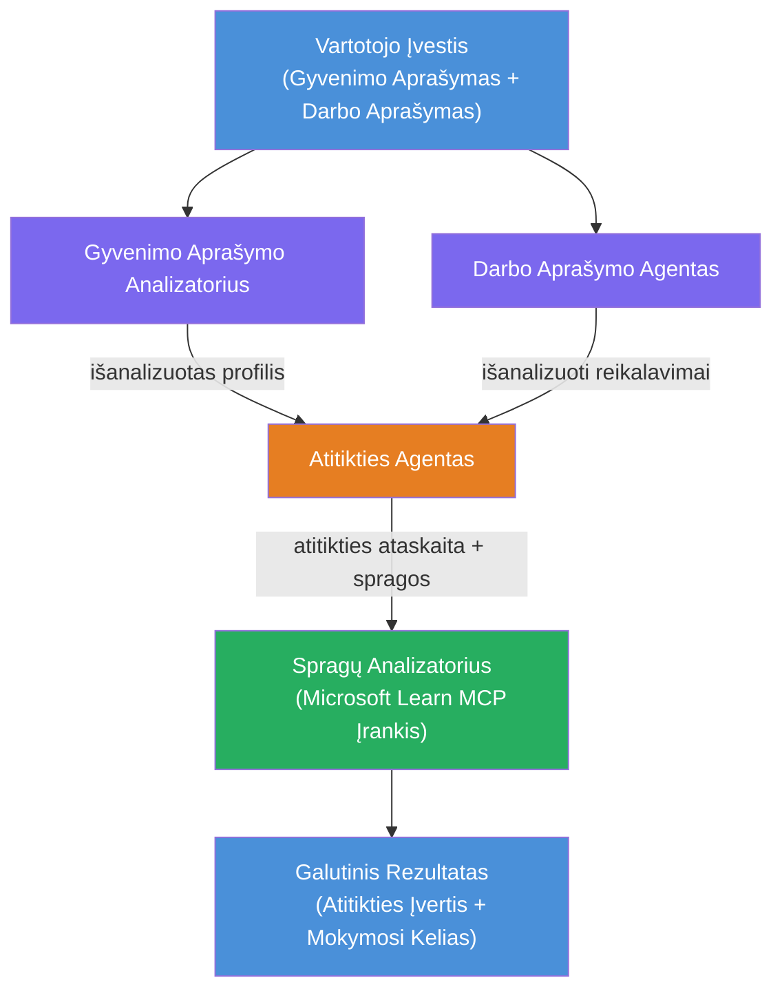

# Laboratorija 02 - Daugiaagentis Darbo Srautas: CV → Darbo Atitikimo Vertintojas

---

## Ką kursite

**CV → Darbo Atitikimo Vertintojas** - daugiaagentis darbo srautas, kuriame keturi specializuoti agentai bendradarbiauja vertindami, kaip gerai kandidato CV atitinka darbo aprašymą, o tada generuoja suasmenintą mokymosi planą spręsti spragas.

### Agentai

| Agentas | Vaidmuo |
|---------|---------|
| **CV Parseris** | Ištraukia struktūrizuotas įgūdžių, patirties, sertifikatų dalis iš CV teksto |
| **Darbo Aprašymo Agentas** | Ištraukia reikalaujamus/pageidaujamus įgūdžius, patirtį, sertifikatus iš DA |
| **Atitikimo Agentas** | Lygina profilį su reikalavimais → atitikties balas (0-100) + atitinkantys/trūkstami įgūdžiai |
| **Spragų Analizatorius** | Sudaro suasmenintą mokymosi planą su ištekliais, laikotarpiais ir greitų pergalių projektais |

### Demonstravimo eiga

Įkelkite **CV + darbo aprašymą** → gaukite **atitikties balą + trūkstamus įgūdžius** → gausite **suasmenintą mokymosi planą**.

### Darbo srauto architektūra

> Violetinė = lygiagretūs agentai | Oranžinė = duomenų apjungimo taškas | Žalia = galutinis agentas su įrankiais. Žr. [1 modulis - Suprasti architektūrą](docs/01-understand-multi-agent.md) ir [4 modulis - Orkestracijos modeliai](docs/04-orchestration-patterns.md) išsamioms schemoms ir duomenų srautui.

### Aptariamos temos

- Daugiaagentės darbo srauto kūrimas naudojant **WorkflowBuilder**
- Agentų vaidmenų ir orkestracijos srauto apibrėžimas (lygiagretus + sekos)
- Taragentinė komunikacija ir jos modeliai
- Vietinis testavimas su Agent Inspector įrankiu
- Daugiaagentės darbo srauto diegimas Foundry Agent Service platformoje

---

## Reikalavimai

Pirmiausia užbaigti Laboratoriją 01:

- [Laboratorija 01 - Vienas Agentas](../lab01-single-agent/README.md)

---

## Pradėkite

Visą diegimo instrukcijų apžvalgą, kodo peržiūrą ir testavimo komandas rasite:

- [Laboratorija 2 Dokumentacija - Reikalavimai](docs/00-prerequisites.md)
- [Laboratorija 2 Dokumentacija - Pilnas Mokymosi Kelias](docs/README.md)
- [PersonalCareerCopilot vykdymo vadovas](PersonalCareerCopilot/README.md)

## Orkestracijos modeliai (agentiniai alternatyvos)

Laboratorijoje 2 yra numatytasis **lygiagretus → duomenų apjungėjas → planuotojas** srautas, o dokumentacija taip pat aprašo alternatyvius modelius, kad parodytų stipresnį agentinį elgesį:

- **Fan-out/Fan-in su svorinėta konsensuso paieška**
- **Recenzento/kritiko peržiūra prieš galutinį planą**
- **Sąlyginis maršrutizatorius** (kelio pasirinkimas remiantis atitikties balu ir trūkstamais įgūdžiais)

Žr. [docs/04-orchestration-patterns.md](docs/04-orchestration-patterns.md).

---

**Ankstesnis:** [Laboratorija 01 - Vienas Agentas](../lab01-single-agent/README.md) · **Grįžti į:** [Dirbtuvių Pradžia](../../README.md)

---

<!-- CO-OP TRANSLATOR DISCLAIMER START -->
**Atsakomybės apribojimas**:
Šis dokumentas buvo išverstas naudojant dirbtinio intelekto vertimo paslaugą [Co-op Translator](https://github.com/Azure/co-op-translator). Nors siekiame tikslumo, atkreipkite dėmesį, kad automatiniai vertimai gali turėti klaidų ar netikslumų. Originalus dokumentas gimtąja kalba turėtų būti laikomas patikimiausiu šaltiniu. Kritiniais atvejais rekomenduojamas profesionalus žmogaus vertimas. Mes neatsakome už bet kokius nesusipratimus ar klaidingus aiškinimus, kilusius dėl šio vertimo naudojimo.
<!-- CO-OP TRANSLATOR DISCLAIMER END -->