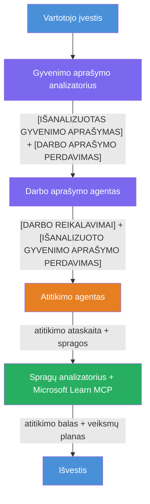

# Laboratorinis darbas 02 - Daugiaagentis darbo eiga: CV → Darbo tinkamumo vertintojas

## Apžvalga

Šiame praktiniame užsiėmime kursite **darbo eigą pirmiausia orientuotą daugiaagentę programėlę** naudodami Foundry Toolkit VS Code aplinkoje ir paskelbsite ją Microsoft Foundry Agent paslaugoje.

**Ką kursite:** CV → Darbo tinkamumo vertintojas, kuris analizuoja CV ir darbo aprašymą, įvertina atitikimą ir sukuria suasmenintą mokymosi planą naudojant Microsoft Learn išteklius.

---

## Architektūra

```mermaid
flowchart TD
    A["Vartotojo įvestis"] --> B["Gyvenimo aprašymo analizatorius"]
    B -->|"[IŠANALIZUOTAS GYVENIMO APRAŠYMAS] + [DARBO APRAŠYMO PERDAVIMAS]"| C["Darbo aprašymo agentas"]
    C -->|"[DARBO REIKALAVIMAI] + [IŠANALIZUOTO GYVENIMO APRAŠYMO PERDAVIMAS]"| D["Atitikimo agentas"]
    D -->|atitikimo ataskaita + spragos| E["Spragų analizatorius + Microsoft Learn MCP"]
    E -->|atitikimo balas + veiksmų planas| F["Išvestis"]

    style A fill:#4A90D9,color:#fff
    style B fill:#7B68EE,color:#fff
    style C fill:#7B68EE,color:#fff
    style D fill:#E67E22,color:#fff
    style E fill:#27AE60,color:#fff
    style F fill:#4A90D9,color:#fff
```

**Kaip tai veikia:**
1. Vartotojas įklijuoja CV ir darbo aprašymą.
2. **ResumeParser** analizuoja CV ir nukopijuoja darbo aprašymą tiksliai į `[JOB DESCRIPTION PASS-THROUGH]` skyrių.
3. **JD Agent** ištraukia struktūrizuotus reikalavimus iš perduoto teksto, tada perduoda `[PARSED RESUME]` kaip `[PARSED RESUME PASS-THROUGH]`.
4. **MatchingAgent** palygina `[PARSED RESUME PASS-THROUGH]` su `[JD REQUIREMENTS]` ir apskaičiuoja tinkamumo balą.
5. **GapAnalyzer** paverčia spragas į praktišką veiksmų planą ir gauna tikras Microsoft Learn nuorodas per MCP.

---

## Išankstinės sąlygos

Pirmiausia užbaikite Laboratorinį darbą 01:

- [Laboratorinis darbas 01 - Vienas agentas](../lab01-single-agent/README.md)

---

## 1 dalis: Skaitykite modulius iš eilės

Pilną mokymosi kelią rasite:

- [Laboratorijos 2 dokumentai - Išankstinės sąlygos](docs/00-prerequisites.md)
- [Laboratorijos 2 dokumentai - Pilnas mokymosi kelias](docs/README.md)
- [PersonalCareerCopilot paleidimo vadovas](PersonalCareerCopilot/README.md)

---

## 2 dalis: Kurkite ir testuokite darbo eigą

1. Naudokite Foundry Toolkit vedlį, kad sukurtumėte darbo eigos pagrindu veikiančią programėlę.
2. Nukopijuokite užklausų blokus ir darbo eigos schemą iš `PersonalCareerCopilot/main.py` į savo darbo aplinką.
3. Paleiskite vietoje su Agent Inspector ir patikrinkite visus keturis agentus bei MCP įrankį.
4. Kai vietinis testavimas praeina, diegkite agentą Foundry platformoje.

---

## Orkestracijos modeliai

Laboratoriniame darbe 02 taikoma numatytoji **fan-out → fan-in → nuosekli** eiga, o dokumentai taip pat aprašo alternatyvius orkestracijos modelius eksperimentams.

- **Fan-out/Fan-in su svoriniu konsensusu**
- **Peržiūrėtojo/ kritikų peržiūra prieš galutinį veiksmų planą**
- **Sąlyginis maršrutizatorius** remiantis tinkamumo balu ir trūkstamais įgūdžiais

Žr. [docs/04-orchestration-patterns.md](docs/04-orchestration-patterns.md).

---

**Ankstesnis:** [Laboratorinis darbas 01 - Vienas agentas](../lab01-single-agent/README.md) · **Atgal į:** [Dirbtuvių pagrindinį puslapį](../../README.md)

---

<!-- CO-OP TRANSLATOR DISCLAIMER START -->
**Atsakomybės apribojimas**:
Šis dokumentas buvo išverstas naudojant dirbtinio intelekto vertimo paslaugą [Co-op Translator](https://github.com/Azure/co-op-translator). Nors siekiame tikslumo, prašome atkreipti dėmesį, kad automatiniai vertimai gali turėti klaidų ar netikslumų. Originalus dokumentas jo gimtąja kalba laikomas autoritetingu šaltiniu. Svarbiai informacijai rekomenduojama naudoti profesionalų žmogiškąjį vertimą. Mes neatsakome už jokius nesusipratimus ar neteisingą interpretaciją, kilusią naudojantis šiuo vertimu.
<!-- CO-OP TRANSLATOR DISCLAIMER END -->