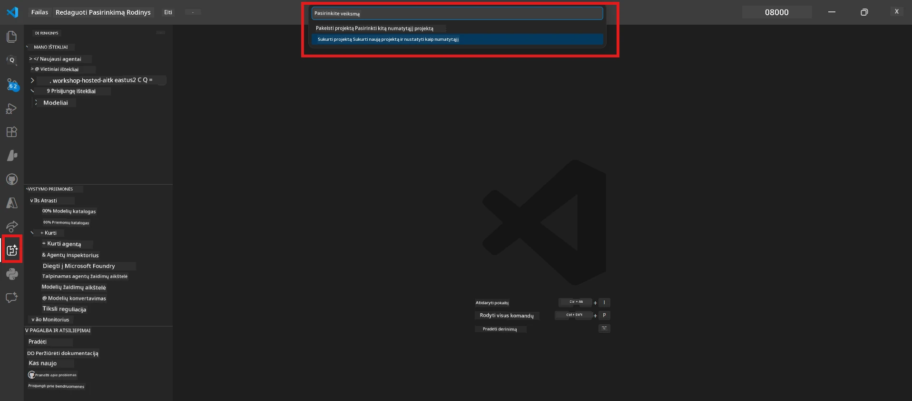

# Modulis 0 - Priešmokymai

Prieš pradedant Laboratoriją 02, įsitikinkite, kad atlikote šiuos veiksmus. Ši laboratorija tiesiogiai remiasi Laboratorija 01 – nepraleiskite jos.

---

## 1. Baigti Laboratoriją 01

Laboratorija 02 daroma prielaida, kad jūs jau:

- [x] Užbaigėte visus 8 modulius [Laboratorijoje 01 - Vienas agentas](../../lab01-single-agent/README.md)
- [x] Sėkmingai įdiegėte vieną agentą į Foundry Agent Service
- [x] Patikrinote, kad agentas veikia tiek vietiniame Agent Inspectoriuje, tiek Foundry Playground

Jei dar nebaigėte Laboratorijos 01, grįžkite ir užbaikite ją dabar: [Laboratorijos 01 dokumentacija](../../lab01-single-agent/docs/00-prerequisites.md)

---

## 2. Patikrinkite esamą nustatymą

Visi įrankiai iš Laboratorijos 01 turėtų būti vis dar įdiegti ir veikiantys. Atlikite šiuos greitus patikrinimus:

### 2.1 Azure CLI

```powershell
az account show --query "{name:name, id:id}" --output table
```

Laukta: Rodo jūsų prenumeratos pavadinimą ir ID. Jei nepavyksta, paleiskite [`az login`](https://learn.microsoft.com/cli/azure/authenticate-azure-cli-interactively).

### 2.2 VS Code plėtiniai

1. Paspauskite `Ctrl+Shift+P` → įveskite **"Microsoft Foundry"** → patikrinkite, ar matote komandas (pvz., `Microsoft Foundry: Create a New Hosted Agent`).
2. Paspauskite `Ctrl+Shift+P` → įveskite **"Foundry Toolkit"** → patikrinkite, ar matote komandas (pvz., `Foundry Toolkit: Open Agent Inspector`).

### 2.3 Foundry projektas ir modelis

1. Spustelėkite **Microsoft Foundry** piktogramą VS Code veiklos juostoje.
2. Patikrinkite, ar jūsų projektas yra sąraše (pvz., `workshop-agents`).
3. Išskleiskite projektą → patikrinkite, ar yra įdiegta modelis (pvz., `gpt-4.1-mini`) su statusu **Succeeded**.

> **Jei jūsų modelio diegimas pasibaigė:** Kai kurie nemokamo lygio diegimai automatiškai pasibaigia. Pereikite į [Modelių katalogą](https://learn.microsoft.com/azure/foundry/foundry-models/concepts/models-sold-directly-by-azure) ir įdiekite iš naujo (`Ctrl+Shift+P` → **Microsoft Foundry: Open Model Catalog**).



### 2.4 RBAC vaidmenys

Patikrinkite, ar turite **Azure AI User** vaidmenį savo Foundry projekte:

1. [Azure portalas](https://portal.azure.com) → jūsų Foundry **projekto** šaltinis → **Prieigos valdymas (IAM)** → **[Vaidmenų paskyrimai](https://learn.microsoft.com/azure/foundry/concepts/rbac-foundry)** skirtukas.
2. Paieškokite savo vardo → patikrinkite, ar yra nurodytas **[Azure AI User](https://aka.ms/foundry-ext-project-role)**.

---

## 3. Supraskite daugiagentines koncepcijas (nauja Laboratorijoje 02)

Laboratorija 02 pristato koncepcijas, kurių nebuvo Laboratorijoje 01. Perskaitykite jas prieš tęsdami:

### 3.1 Kas yra daugiagentinis darbo eiga?

Vietoje vieno agento, kuris atsako už viską, **daugiagentinė darbo eiga** paskirsto darbą keliems specializuotiems agentams. Kiekvienas agentas turi:

- Savo **instrukcijas** (sistemos promptą)
- Savo **vaidmenį** (už ką jis atsakingas)
- Pasirinktinus **įrankius** (funkcijas, kurias jis gali iškviesti)

Agentai bendrauja per **orkestracijos grafiką**, kuris apibrėžia, kaip tarp jų teka duomenys.

### 3.2 WorkflowBuilder

[`WorkflowBuilder`](https://learn.microsoft.com/agent-framework/workflows/agents-in-workflows) klasė iš `agent_framework` yra SDK komponentas, kuris sujungia agentus:

```python
from agent_framework import WorkflowBuilder

workflow = (
    WorkflowBuilder(
        name="MyWorkflow",
        start_executor=agent_a,
        output_executors=[agent_d],
    )
    .add_edge(agent_a, agent_b)
    .add_edge(agent_a, agent_c)
    .add_edge(agent_b, agent_d)
    .add_edge(agent_c, agent_d)
    .build()
)
```

- **`start_executor`** - Pirmasis agentas, gaunantis vartotojo įvestį
- **`output_executors`** - Agentas(-ai), kurio išvestis tampa galutiniu atsaku
- **`add_edge(source, target)`** - Apibrėžia, kad `target` gauna `source` išvestį

### 3.3 MCP (Model Context Protocol) įrankiai

Laboratorija 02 naudoja **MCP įrankį**, kuris kviečia Microsoft Learn API siekiant gauti mokymosi išteklius. [MCP (Model Context Protocol)](https://modelcontextprotocol.io/introduction) yra standartizuotas protokolas, jungiantis DI modelius su išoriniais duomenų šaltiniais ir įrankiais.

| Terminas | Apibrėžtis |
|----------|------------|
| **MCP serveris** | Paslauga, teikianti įrankius/išteklius per [MCP protokolą](https://learn.microsoft.com/azure/foundry/agents/how-to/tools/model-context-protocol) |
| **MCP klientas** | Jūsų agente naudojamas kodas, kuris jungiasi prie MCP serverio ir kviečia jo įrankius |
| **[Streamable HTTP](https://learn.microsoft.com/agent-framework/agents/tools/hosted-mcp-tools)** | Transportavimo būdas, naudojamas bendrauti su MCP serveriu |

### 3.4 Kaip Laboratorija 02 skiriasi nuo Laboratorijos 01

| Aspektas | Laboratorija 01 (Vienas agentas) | Laboratorija 02 (Daugiagentinis) |
|----------|---------------------------------|-----------------------------------|
| Agentai  | 1                               | 4 (specializuoti vaidmenys)       |
| Orkestracija | Nėra                        | WorkflowBuilder (lygiagretus + nuoseklus) |
| Įrankiai | Pasirinktinai `@tool` funkcija  | MCP įrankis (išorinis API kvietimas) |
| Sudėtingumas | Paprastas promptas → atsakymas | CV + darbo aprašymas → atitikimo įvertinimas → veiksmų planas |
| Konteksto srautas | Tiesioginis             | Agentas-agentui perdavimas |

---

## 4. Laboratorijos 02 darbo suvestinės struktūra

Įsitikinkite, kur yra Laboratorijos 02 failai:

```
workshop/
└── lab02-multi-agent/
    ├── README.md                       ← Lab overview
    ├── docs/                           ← You are here
    │   ├── README.md                   ← Learning path index
    │   ├── 00-prerequisites.md         ← This file
    │   ├── 01-understand-multi-agent.md
    │   ├── ...
    │   └── 08-troubleshooting.md
    └── PersonalCareerCopilot/          ← The agent project
        ├── agent.yaml                  ← Agent definition
        ├── main.py                     ← 4-agent workflow code
        ├── Dockerfile                  ← Container configuration
        └── requirements.txt            ← Python dependencies
```

---

### Patikros taškas

- [ ] Laboratorija 01 pilnai užbaigta (visi 8 moduliai, agentas įdiegtas ir patikrintas)
- [ ] `az account show` grąžina jūsų prenumeratą
- [ ] Įdiegti ir veikia Microsoft Foundry ir Foundry Toolkit plėtiniai
- [ ] Foundry projekte yra įdiegtas modelis (pvz., `gpt-4.1-mini`)
- [ ] Turite **Azure AI User** vaidmenį projekte
- [ ] Perskaitėte aukščiau pateiktą daugiagentinių koncepcijų skyrių ir suprantate WorkflowBuilder, MCP bei agentų orkestraciją

---

**Toliau:** [01 - Suprasti daugiagentinę architektūrą →](01-understand-multi-agent.md)

---

<!-- CO-OP TRANSLATOR DISCLAIMER START -->
**Atsakomybės apribojimas**:  
Šis dokumentas buvo išverstas naudojant dirbtinio intelekto vertimo paslaugą [Co-op Translator](https://github.com/Azure/co-op-translator). Nors siekiame tikslumo, prašome atkreipti dėmesį, kad automatiniai vertimai gali turėti klaidų ar netikslumų. Originalus dokumentas gimtąja kalba turi būti laikomas autoritetingu šaltiniu. Kritinei informacijai rekomenduojamas profesionalus žmogaus vertimas. Mes neatsakome už bet kokius nesusipratimus ar neteisingas interpretacijas, kylančias dėl šio vertimo naudojimo.
<!-- CO-OP TRANSLATOR DISCLAIMER END -->