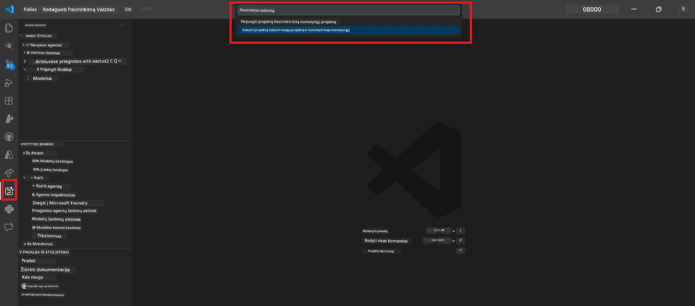

# Modulis 0 - Įvadas

⏱️ ~10 min

> [!WARNING]
> **Peržiūra ir apribojimai:** [Hostinami agentai](https://learn.microsoft.com/azure/foundry/agents/concepts/hosted-agents) šiuo metu yra **viešoje peržiūroje** - nerekomenduojama naudoti gamybos darbams. Kai kurios šio seminaro metu pateiktos funkcijos gali keistis, kai paslauga judės link GA.

## Ką kursite

Šiame laborotoriuje išplėsite vieno agento įgūdžius iš 01 laboratorinio darbo, kad sukurtumėte **daugiagentinį darbo eigą** - gyvenimo aprašymas → darbo tinkamumo vertintojas.

Įklijuojate **gyvenimo aprašymą** ir **darbo aprašymą**. Keturi specializuoti agentai sekiškai apdoroja įvestį ir pateikia:
- Tinkamumo balą (0–100 su balų išskaidymu)
- Įgūdžių ir sertifikavimo trūkumų sąrašą
- Personalizuotą mokymosi planą su tikromis Microsoft Learn nuorodomis kiekvienam trūkumui

**Darbo eiga naudoja:**
- **Microsoft Agent Framework** - `WorkflowBuilder` sekvinei eiliniam valdymui
- **Foundry Toolkit for VS Code** - karkasas, lokalus testavimas, diegimas
- **AI modelį** (pvz., `gpt-4.1-mini`) - naudojamas visų keturių agentų
- **Microsoft Learn MCP serverį** - teikia tikras mokymosi išteklių nuorodas kiekvienam įgūdžių trūkumui

---

## Pasirinkite savo kelią

> ⚠️ **Tęskite tuo pačiu keliu, kurį naudojote 01 laboratoriniame darbe.**

<details open>
<summary><strong>🅰️ A kelias - Azure debesys (reikia Azure prenumeratos)</strong></summary>

| | Detalės |
|---|---|
| **Kam skirtas?** | Baigėte 01 laboratorinį darbą naudodami Azure prenumeratą |
| **Modelis** | Azure OpenAI per Foundry (pvz., `gpt-4.1-mini`) |
| **Dengti moduliai** | Visi moduliai (00–09) |
| **Diegti į debesį?** | ✅ Taip - pilnas galinis diegimas |

</details>

<details open>
<summary><strong>🅱️ B kelias - Foundry vietinis (nereikia Azure prenumeratos)</strong></summary>

| | Detalės |
|---|---|
| **Kam skirtas?** | Baigėte 01 laboratorinį darbą naudodami Foundry vietinį |
| **Modelis** | Foundry vietinis (nemokamas, veikia jūsų kompiuteryje) |
| **Dengti moduliai** | Moduliai 00–05 (praleiskite 06–07 - diegimas ir debesies patikra) |
| **Diegti į debesį?** | ❌ Ne - tik lokalus testavimas per Agent Inspector |

</details>

---

## 01 laboratorinio darbo patikra

02 laboratorinis darbas tiesiogiai remiasi 01 laboratoriniu darbu. Baigkite 01 laboratorinį darbą prieš pradėdami čia.

Dar nepradėjote 01 laboratorinio darbo? Pradėkite čia: [01 laboratorinis darbas - Įvadas](../../lab01-single-agent/docs/00-prerequisites.md)

<details open>
<summary><strong>🅰️ A kelias - Azure debesys</strong></summary>

```powershell
az account show --query "{name:name, id:id}" --output table
```

Jei nepavyksta, paleiskite `az login`. Tada patikrinkite VS Code:

1. `Ctrl+Shift+P` → įveskite **Foundry Toolkit** → patvirtinkite, kad komandos rodomos.
2. Spustelėkite **Foundry Toolkit** piktogramą → jūsų projektas ir diegiamas modelis rodomi kaip **Sėkmingai**.



> **RBAC:** Jūs priskyrėte **Foundry User** 01 laboratoriniame darbe. Jei reikia perpriskirti, žiūrėkite [01 laboratorinis darbas, Modulis 1](../../lab01-single-agent/docs/01-setup.md#deploy-a-model--assign-rbac). Rolė anksčiau vadinosi **Azure AI User** - tos pačios teisės.

</details>

<details open>
<summary><strong>🅱️ B kelias - Foundry vietinis</strong></summary>

```powershell
Invoke-WebRequest -Uri "http://localhost:5273/v1/health" -UseBasicParsing | Select-Object StatusCode
```

Tikėtina: `StatusCode: 200`. Jei ne, iš naujo paleiskite Foundry vietinį iš Foundry Toolkit šoninės juostos.

> Visa spėliojimo eiga vyksta jūsų kompiuteryje. Vienintelis išeinantis kvietimas yra MCP įrankiui adresu `https://learn.microsoft.com/api/mcp`.

</details>

---

## Kas naujo 02 laboratoriniame darbe

| | 01 laboratorinis darbas | 02 laboratorinis darbas |
|--|--------|--------|
| Agentai | 1 | 4 (susieti su WorkflowBuilder) |
| Karkaso šablonas | Pagrindinis - Agent Framework | Darbo eigos - Agent Framework |
| Nauja paketas | - | `mcp` |
| Valdymas | Vienas pokalbio agentas | Sekvencinė eiga (WorkflowBuilder) |
| Nauja priemonė | - | `search_microsoft_learn_for_plan` (MCP) |

---

**Toliau:** [01 - Suprasti architektūrą →](01-understand-multi-agent.md)

---

<!-- CO-OP TRANSLATOR DISCLAIMER START -->
**Atsakomybės apribojimas**:
Šis dokumentas buvo išverstas naudojant dirbtinio intelekto vertimo paslaugą [Co-op Translator](https://github.com/Azure/co-op-translator). Nors siekiame tikslumo, prašome atkreipti dėmesį, kad automatiniai vertimai gali turėti klaidų ar netikslumų. Originalus dokumentas jo gimtąja kalba laikomas autoritetingu šaltiniu. Svarbiai informacijai rekomenduojama naudoti profesionalų žmogiškąjį vertimą. Mes neatsakome už jokius nesusipratimus ar neteisingą interpretaciją, kilusią naudojantis šiuo vertimu.
<!-- CO-OP TRANSLATOR DISCLAIMER END -->