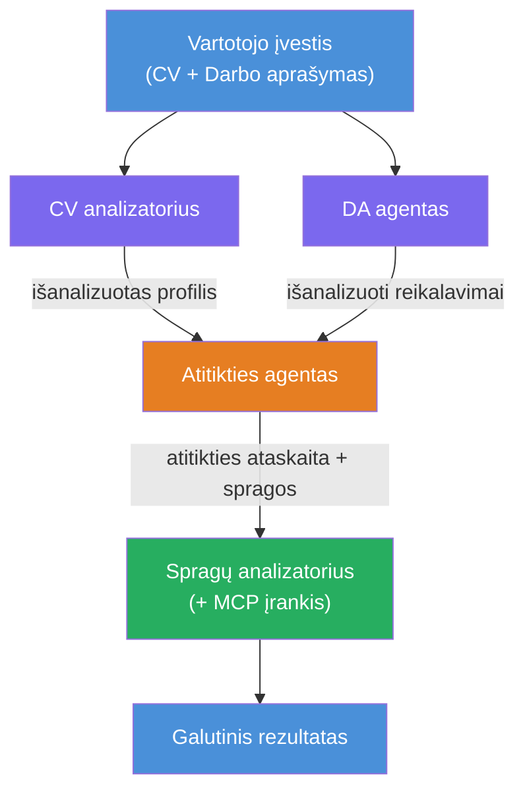
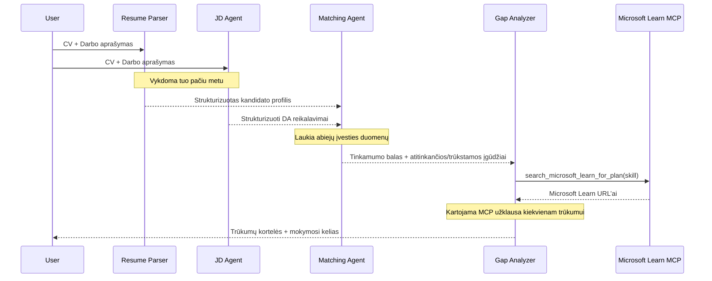
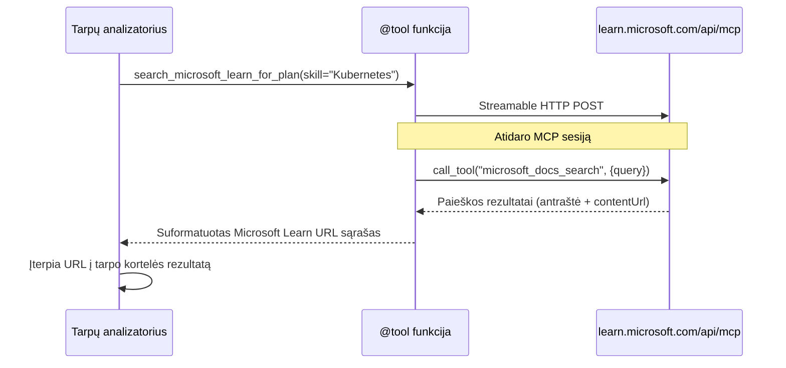

# Modulis 1 – Suprasti daugiamačių agentų architektūrą

Šiame modulyje išmoksite sudėlioti architektūrą Resume → Darbo atitikimo vertintojui, prieš rašydami bet kokį kodą. Suprasti orkestracijos grafiką, agentų vaidmenis ir duomenų srautą yra labai svarbu derinimui ir [daugiamentorių procesų](https://learn.microsoft.com/azure/architecture/ai-ml/idea/multiple-agent-workflow-automation) išplėtimui.

---

## Problema, kurią sprendžia

Tinkamumo įvertinimas tarp gyvenimo aprašymo ir darbo aprašymo reikalauja kelių skirtingų įgūdžių:

1. **Analizė** – Ištraukti struktūruotus duomenis iš nestruktūruoto teksto (gyvenimo aprašymo)
2. **Reikalavimų išskyrimas** – Išgauti reikalavimus iš darbo aprašymo
3. **Palyginimas** – Įvertinti suderinamumą tarp dviejų
4. **Planavimas** – Sudaryti mokymosi planą spragoms užpildyti

Vienas agentas, atliekantis visus keturis uždavinius viename užklausoje, dažnai sukuria:
- Nepilną ištraukimą (nes skuba per analizę, kad greičiau pateiktų įvertinimą)
- Paviršutinišką vertinimą (be įrodymų pagrįsto išskaidymo)
- Bendro pobūdžio mokymosi planus (nepritaikytus konkrečioms spragoms)

Padalinus į **keturis specializuotus agentus**, kiekvienas fokusuoja į savo užduotį su specializuotomis instrukcijomis, kas leidžia kiekviename etape sukurti aukštesnės kokybės rezultatus.

---

## Keturi agentai

Kiekvienas agentas yra pilnas [Microsoft Foundry](https://learn.microsoft.com/azure/foundry/agents/concepts/hosted-agents) agentas, sukurtas naudojant `AzureAIAgentClient.as_agent()`. Jie naudoja tą patį modelio diegimą, bet turi skirtingas instrukcijas ir (pasirinktinai) skirtingus įrankius.

| # | Agento pavadinimas | Vaidmuo | Įvestis | Išvestis |
|---|--------------------|---------|---------|----------|
| 1 | **ResumeParser** | Ištraukia struktūruotą profilį iš gyvenimo aprašymo teksto | Žalias gyvenimo aprašymo tekstas (iš vartotojo) | Kandidato profilis, Techniniai įgūdžiai, Minkštieji įgūdžiai, Sertifikatai, Srities patirtis, Pasiekimai |
| 2 | **JobDescriptionAgent** | Ištraukia struktūruotus reikalavimus iš darbo aprašymo | Žalias darbo aprašymo tekstas (iš vartotojo, perduotas per ResumeParser) | Rolės apžvalga, Būtini įgūdžiai, Pageidaujami įgūdžiai, Patirtis, Sertifikatai, Išsilavinimas, Atsakomybės |
| 3 | **MatchingAgent** | Apskaičiuoja įrodymų pagrindu pagrįstą atitikimo balą | Rezultatai iš ResumeParser + JobDescriptionAgent | Atitikimo balas (0-100 su išskaidymu), Sutapę įgūdžiai, Trūkstami įgūdžiai, Spragos |
| 4 | **GapAnalyzer** | Sudaro personalizuotą mokymosi planą | Rezultatas iš MatchingAgent | Spragų kortelės (pagal įgūdį), Mokymosi tvarka, Laiko grafikas, Microsoft Learn ištekliai |

---

## Orkestracijos grafikas

Darbų eiga naudoja **lygiagrečią išsklaidą** ir po to **sekinę agregaciją**:


> **Paaiškinimai:** violetinė = lygiagrečių agentų dalis, oranžinė = agregacijos taškas, žalia = galutinis agentas su įrankiais

### Kaip teka duomenys


1. **Vartotojas siunčia** žinutę su gyvenimo aprašymu ir darbo aprašymu.
2. **ResumeParser** gauna visą vartotojo įvestį ir ištraukia struktūruotą kandidato profilį.
3. **JobDescriptionAgent** lygiagrečiai gauna vartotojo įvestį ir ištraukia struktūruotus reikalavimus.
4. **MatchingAgent** gauna išvestis iš **abu agentų** (konstruktas laukia kol abu baigs, tada vykdo MatchingAgent).
5. **GapAnalyzer** gauna MatchingAgent rezultatą ir kviečia **Microsoft Learn MCP įrankį** realiems mokymosi ištekliams gauti.
6. **Galutinis rezultatas** yra GapAnalyzer atsakymas, apimantis atitikimo balą, spragų korteles ir visą mokymosi planą.

### Kodėl svarbi lygiagrečioji išsklaida

ResumeParser ir JobDescriptionAgent veikia **lygiagrečiai**, nes nei vienas nepriklauso nuo kito. Tai:
- Mažina bendrą laukimo laiką (veikia tuo pačiu metu, o ne paeiliui)
- Natūrali užduočių padalijimo schema (gyvenimo aprašymo analizė ir darbo aprašymo analizė yra nepriklausomos užduotys)
- Iliustruoja dažną daugiagentės sistemos modelį: **išsklaida → agregacija → veiksmas**

---

## WorkflowBuilder kode

Štai kaip aukščiau pateiktas grafikas atitinka [`WorkflowBuilder`](https://learn.microsoft.com/agent-framework/workflows/agents-in-workflows) API kvietimus faile `main.py`:

```python
from agent_framework import WorkflowBuilder

workflow = (
    WorkflowBuilder(
        name="ResumeJobFitEvaluator",
        start_executor=resume_parser,       # Pirmasis agentas, gavęs vartotojo įvestį
        output_executors=[gap_analyzer],     # Galutinis agentas, kurio išvestis grąžinama
    )
    .add_edge(resume_parser, jd_agent)      # ResumeParser → Darbo aprašymo agentas
    .add_edge(resume_parser, matching_agent) # ResumeParser → Suderinimo agentas
    .add_edge(jd_agent, matching_agent)      # Darbo aprašymo agentas → Suderinimo agentas
    .add_edge(matching_agent, gap_analyzer)  # Suderinimo agentas → Tarpų analizatorius
    .build()
)
```

**Kantų (edges) paaiškinimas:**

| Kraštas | Reikšmė |
|---------|----------|
| `resume_parser → jd_agent` | JD agentas gauna ResumeParser išvestį |
| `resume_parser → matching_agent` | MatchingAgent gauna ResumeParser išvestį |
| `jd_agent → matching_agent` | MatchingAgent taip pat gauna JD agento išvestį (laukiama abiejų) |
| `matching_agent → gap_analyzer` | GapAnalyzer gauna MatchingAgent rezultatą |

Kadangi `matching_agent` turi **du įeinančius kraštus** (`resume_parser` ir `jd_agent`), sistema automatiškai laukia abiejų baigimo prieš vykdydama MatchingAgent.

---

## MCP įrankis

GapAnalyzer agentas turi vieną įrankį: `search_microsoft_learn_for_plan`. Tai yra **[MCP įrankis](https://learn.microsoft.com/agent-framework/agents/tools/hosted-mcp-tools)**, kuris kviečia Microsoft Learn API siekdamas surasti atrinktus mokymosi išteklius.

### Kaip tai veikia

```python
@tool
async def search_microsoft_learn_for_plan(
    skill: str, role: str = "", max_results: int = 5
) -> str:
    """Search Microsoft Learn MCP and return curated official links."""
    # Prisijungia prie https://learn.microsoft.com/api/mcp per srautinį HTTP
    # Iškviečia „microsoft_docs_search“ įrankį MCP serveryje
    # Grąžina suformatuotą Microsoft Learn URL sąrašą
```

### MCP kvietimų eiga


1. GapAnalyzer nusprendžia, kad reikia mokymosi išteklių konkrečiam įgūdžiui (pvz., „Kubernetes“)
2. Sistema kviečia `search_microsoft_learn_for_plan(skill="Kubernetes")`
3. Funkcija atidaro [Streamable HTTP](https://learn.microsoft.com/agent-framework/agents/tools/hosted-mcp-tools) ryšį į `https://learn.microsoft.com/api/mcp`
4. Kvietimas siunčiamas `microsoft_docs_search` įrankiui [MCP serveryje](https://learn.microsoft.com/azure/foundry/agents/how-to/tools/model-context-protocol)
5. MCP serveris grąžina paieškos rezultatus (pavadinimas + URL)
6. Funkcija suformatuoja rezultatus ir grąžina juos eilutės pavidalu
7. GapAnalyzer naudoja grąžintus URL savo spragos kortelių išvestyje

### Numatyti MCP žurnalo įrašai

Įrankio vykdymo metu pamatysite tokius žurnalų įrašus:

```
GET https://learn.microsoft.com/api/mcp → 405 (Method Not Allowed)
POST https://learn.microsoft.com/api/mcp → 200
DELETE https://learn.microsoft.com/api/mcp → 405 (Method Not Allowed)
```

**Tai yra normalu.** MCP klientas inicijavimo metu siunčia GET ir DELETE užklausas – 405 atsakymai yra laukiamas elgesys. Tik POST užklausų klaidos yra svarbios.

---

## Agento kūrimo modelis

Kiekvienas agentas kuriamas naudojant **[`AzureAIAgentClient.as_agent()`](https://learn.microsoft.com/python/api/overview/azure/ai-agents-readme) asinchroninį kontekstų valdymą**. Tai Foundry SDK modelis agentams kurti, kurie automatiškai išvalomi:

```python
async with (
    get_credential() as credential,
    AzureAIAgentClient(
        project_endpoint=PROJECT_ENDPOINT,
        model_deployment_name=MODEL_DEPLOYMENT_NAME,
        credential=credential,
    ).as_agent(
        name="ResumeParser",
        instructions=RESUME_PARSER_INSTRUCTIONS,
    ) as resume_parser,
    # ... kartokite kiekvienam agentui ...
):
    # Čia egzistuoja visi 4 agentai
    workflow = create_workflow(resume_parser, jd_agent, matching_agent, gap_analyzer)
```

**Svarbūs punktai:**
- Kiekvienas agentas gauna savo `AzureAIAgentClient` instanciją (SDK reikalauja, kad agentas būtų susietas su klientu)
- Visi agentai naudoja tą patį `credential`, `PROJECT_ENDPOINT` ir `MODEL_DEPLOYMENT_NAME`
- `async with` blokas užtikrina, kad agentai bus išvalyti serveriui užsidarius
- GapAnalyzer papildomai gauna `tools=[search_microsoft_learn_for_plan]`

---

## Serverio paleidimas

Sukūrus agentus ir sudėjus darbų eigą, serveris paleidžiamas:

```python
from azure.ai.agentserver.agentframework import from_agent_framework

agent = create_workflow(resume_parser, jd_agent, matching_agent, gap_analyzer)
await from_agent_framework(agent).run_async()
```

`from_agent_framework()` supakuoja darbų eigą į HTTP serverį, kuris iš exposes `/responses` galinį tašką 8088 porte. Tai tas pats šablonas kaip Lab 01, bet dabar „agentas“ yra visas [darbo eigos grafikas](https://learn.microsoft.com/agent-framework/workflows/as-agents).

---

### Kontrolinis taškas

- [ ] Jūs suprantate 4 agentų architektūrą ir kiekvieno agento vaidmenį
- [ ] Galite sekti duomenų srautą: Vartotojas → ResumeParser → (lygiagrečiai) JD agentas + MatchingAgent → GapAnalyzer → Rezultatas
- [ ] Suprantate, kodėl MatchingAgent laukia tiek ResumeParser, tiek JD agento (du įeinantys kraštai)
- [ ] Suprantate MCP įrankį: ką jis daro, kaip kviečiamas, ir kad GET 405 žurnalų įrašai yra normalūs
- [ ] Suprantate `AzureAIAgentClient.as_agent()` modelį ir kodėl kiekvienas agentas turi atskirą klientą
- [ ] Galite skaityti `WorkflowBuilder` kodą ir susieti jį su vizualiu grafiku

---

**Ankstesnis:** [00 – Pradinės sąlygos](00-prerequisites.md) · **Kitas:** [02 – Daugiagentės projekto struktūros kūrimas →](02-scaffold-multi-agent.md)

---

<!-- CO-OP TRANSLATOR DISCLAIMER START -->
**Atsakomybės apribojimas**:  
Šis dokumentas buvo išverstas naudojant dirbtinio intelekto vertimo paslaugą [Co-op Translator](https://github.com/Azure/co-op-translator). Nors siekiame tikslumo, prašome atkreipti dėmesį, kad automatiniai vertimai gali turėti klaidų ar netikslumų. Originalus dokumentas jo gimtąja kalba turi būti laikomas autoritetingu šaltiniu. Kritinei informacijai rekomenduojamas profesionalus žmogaus atliekamas vertimas. Mes neatsakome už bet kokį nesusipratimą ar klaidingą interpretaciją, kylančią iš šio vertimo naudojimo.
<!-- CO-OP TRANSLATOR DISCLAIMER END -->