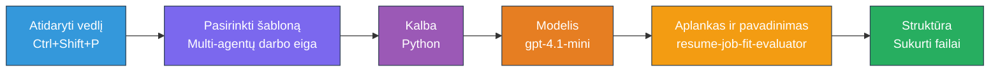
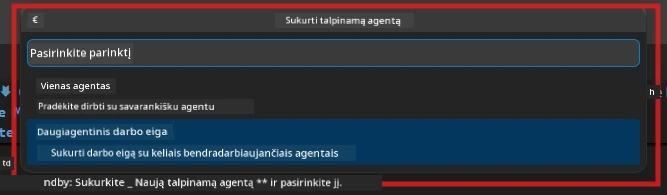

# Modulis 2 - Sukurti daugiaagentį projektą

Šiame modulyje naudojate [Microsoft Foundry plėtinį](https://marketplace.visualstudio.com/items?itemName=TeamsDevApp.vscode-ai-foundry), kad **sukurtumėte daugiaagentį darbo eigos projektą**. Šis plėtinys sukuria visą projekto struktūrą - `agent.yaml`, `main.py`, `Dockerfile`, `requirements.txt`, `.env` ir derinimo konfigūraciją. Vėliau Moduliuose 3 ir 4 pritaikysite šiuos failus.

> **Pastaba:** `PersonalCareerCopilot/` aplankas šiame laboratoriniame darbo pavyzdyje yra visiškas, veikiančio pritaikyto daugiaagentio projekto pavyzdys. Galite arba sukurti naują projektą (rekomenduojama mokymuisi), arba tiesiogiai išnagrinėti esamą kodą.

---

## 1 žingsnis: Atidarykite Create Hosted Agent vedlį


1. Paspauskite `Ctrl+Shift+P`, kad atidarytumėte **Komandų paletę**.
2. Įveskite: **Microsoft Foundry: Create a New Hosted Agent** ir pasirinkite.
3. Atsidarys vedlys, skirtas kurti hostinamą agentą.

> **Alternatyva:** Spustelėkite **Microsoft Foundry** piktogramą veiklos juostoje → spustelėkite **+** šalia **Agents** → **Create New Hosted Agent**.

---

## 2 žingsnis: Pasirinkite daugiaagentės darbo eigos šabloną

Vedlys paprašys pasirinkti šabloną:

| Šablonas | Aprašymas | Kada naudoti |
|----------|-----------|--------------|
| Vienas agentas | Vienas agentas su instrukcijomis ir pasirenkamais įrankiais | Laboratorija 01 |
| **Daugiaagentė darbo eiga** | Keli agentai bendradarbiauja per WorkflowBuilder | **Ši laboratorija (Laboratorija 02)** |

1. Pasirinkite **Daugiaagentė darbo eiga**.
2. Spustelėkite **Next**.



---

## 3 žingsnis: Pasirinkite programavimo kalbą

1. Pasirinkite **Python**.
2. Spustelėkite **Next**.

---

## 4 žingsnis: Pasirinkite modelį

1. Vedlys parodys modelius, įdiegus jūsų Foundry projekte.
2. Pasirinkite tą patį modelį, kurį naudojote Laboratorijoje 01 (pvz., **gpt-4.1-mini**).
3. Spustelėkite **Next**.

> **Patariu:** [`gpt-4.1-mini`](https://learn.microsoft.com/azure/foundry/foundry-models/concepts/models-sold-directly-by-azure#gpt-41-series) rekomenduojamas kūrimui – jis greitas, pigus ir gerai palaiko daugiaagentes darbo eigas. Galite pereiti prie `gpt-4.1` galutiniam gamybiniam įdiegimui, jei norite aukštesnės kokybės išvesties.

---

## 5 žingsnis: Pasirinkite aplanko vietą ir agente pavadinimą

1. Atsidarys failų dialogas. Pasirinkite tikslinį aplanką:
   - Jei dirbate su workshop repozitorija: eikite į `workshop/lab02-multi-agent/` ir sukurkite naują poaplankį
   - Jei pradedate nuo nulio: pasirinkite bet kurį aplanką
2. Įveskite **hostinamo agente** pavadinimą (pvz., `resume-job-fit-evaluator`).
3. Spustelėkite **Create**.

---

## 6 žingsnis: Palaukite, kol baigsis projekto kūrimas

1. VS Code atidarys naują langą (arba atnaujins esamą) su sukurtu projektu.
2. Turėtumėte matyti tokią failų struktūrą:

```
resume-job-fit-evaluator/
├── .env                ← Environment variables (placeholders)
├── .vscode/
│   └── launch.json     ← Debug configuration
├── agent.yaml          ← Agent definition (kind: hosted)
├── Dockerfile          ← Container configuration
├── main.py             ← Multi-agent workflow code (scaffold)
└── requirements.txt    ← Python dependencies
```

> **Workshop pastaba:** workshop repozitorijoje `.vscode/` aplankas yra **darbo vietos šaknyje** su bendrais `launch.json` ir `tasks.json`. Laboratorijų 01 ir 02 derinimo konfigūracijos abu įtrauktos. Paspaudę F5, iš sąrašo pasirinkite **"Lab02 - Multi-Agent"**.

---

## 7 žingsnis: Susipažinkite su sukurtais failais (daugiaagentės specifika)

Daugiaagentė projekto struktūra nuo vieno agente projekto skiriasi keletu svarbių aspektų:

### 7.1 `agent.yaml` - Agento aprašymas

```yaml
kind: hosted
name: resume-job-fit-evaluator
description: >
  A multi-agent workflow that evaluates resume-to-job fit.
metadata:
  authors:
    - Microsoft
  tags:
    - Multi-Agent Workflow
    - Resume Evaluator
protocols:
  - protocol: responses
    version: v1
environment_variables:
  - name: PROJECT_ENDPOINT
    value: ${PROJECT_ENDPOINT}
  - name: MODEL_DEPLOYMENT_NAME
    value: ${MODEL_DEPLOYMENT_NAME}
```

**Pagrindinis skirtumas nuo Laboratorijos 01:** `environment_variables` skyriuje gali būti papildomi kintamieji MCP galiniams taškams ar kitos įrankių konfigūracijos. `name` ir `description` yra pritaikyti daugiaagentės paskirties atveju.

### 7.2 `main.py` - Daugiaagentė darbo eiga

Šablonas apima:
- **Kelias agentų instrukcijų eilutes** (po vieną konstantą kiekvienam agentui)
- **Kelių [`AzureAIAgentClient.as_agent()`](https://learn.microsoft.com/python/api/overview/azure/ai-agents-readme) kontekstų tvarkyklius** (po vieną kiekvienam agentui)
- **[`WorkflowBuilder`](https://learn.microsoft.com/agent-framework/workflows/agents-in-workflows)**, skirtą sujungti agentus
- **`from_agent_framework()`** pateikti darbo eigą kaip HTTP galinį tašką

```python
from agent_framework import WorkflowBuilder, tool
from agent_framework.azure import AzureAIAgentClient
from azure.ai.agentserver.agentframework import from_agent_framework
```

Papildoma importacija [`WorkflowBuilder`](https://learn.microsoft.com/agent-framework/workflows/agents-in-workflows) yra nauja palyginus su Laboratorija 01.

### 7.3 `requirements.txt` - Papildomos priklausomybės

Daugiaagentis projektas naudoja tuos pačius pagrindinius paketus kaip Laboratorija 01, bei papildomus MCP susijusius paketus:

```
agent-framework-azure-ai==1.0.0rc3
agent-framework-core==1.0.0rc3
azure-ai-agentserver-agentframework==1.0.0b16
azure-ai-agentserver-core==1.0.0b16
debugpy
agent-dev-cli --pre
```

> **Svarbus versijos pastebėjimas:** `agent-dev-cli` paketas reikalauja `--pre` žymos `requirements.txt`, kad būtų įdiegta naujausia peržiūros versija. Tai būtina, kad Agent Inspector veiktų su `agent-framework-core==1.0.0rc3`. Versijų detales rasite [Modulis 8 – Trikčių šalinimas](08-troubleshooting.md).

| Paketas | Versija | Funkcija |
|---------|---------|----------|
| [`agent-framework-azure-ai`](https://learn.microsoft.com/agent-framework/overview/) | `1.0.0rc3` | Azure AI integracija [Microsoft Agent Framework](https://github.com/microsoft/agent-framework) |
| [`agent-framework-core`](https://learn.microsoft.com/agent-framework/overview/) | `1.0.0rc3` | Pagrindinis vykdymo variklis (įskaitant WorkflowBuilder) |
| `azure-ai-agentserver-agentframework` | `1.0.0b16` | Hostinamų agentų serverio vykdymo variklis |
| `azure-ai-agentserver-core` | `1.0.0b16` | Pagrindinės agente serverio abstrakcijos |
| `debugpy` | naujausia | Python derinimas (F5 VS Code) |
| `agent-dev-cli` | `--pre` | Vietinis kūrimo CLI + Agent Inspector serveris |

### 7.4 `Dockerfile` - Tas pats kaip Laboratorijoje 01

Dockerfile yra identiškas Laboratorijos 01 – kopijuoja failus, įdiegia priklausomybes iš `requirements.txt`, atveria 8088 prievadą ir paleidžia `python main.py`.

```dockerfile
FROM python:3.14-slim
WORKDIR /app
COPY ./ .
RUN pip install --upgrade pip && \
    if [ -f requirements.txt ]; then \
        pip install -r requirements.txt; \
    else \
      echo "No requirements.txt found" >&2; exit 1; \
    fi
EXPOSE 8088
CMD ["python", "main.py"]
```

---

### Kontrolinis sąrašas

- [ ] Užbaigtas scaffold vedlys → matoma nauja projekto struktūra
- [ ] Matomi visi failai: `agent.yaml`, `main.py`, `Dockerfile`, `requirements.txt`, `.env`
- [ ] `main.py` yra `WorkflowBuilder` importas (patvirtina, kad pasirinktas daugiaagentis šablonas)
- [ ] `requirements.txt` yra įtraukti ir `agent-framework-core`, ir `agent-framework-azure-ai`
- [ ] Suprantate, kaip daugiaagentis šablonas skiriasi nuo vieno agente projekto (daug agentų, WorkflowBuilder, MCP įrankiai)

---

**Ankstesnis:** [01 - Suprasti daugiaagentę architektūrą](01-understand-multi-agent.md) · **Kitas:** [03 - Konfigūruoti agentus ir aplinką →](03-configure-agents.md)

---

<!-- CO-OP TRANSLATOR DISCLAIMER START -->
**Atsakomybės apribojimas**:
Šis dokumentas buvo išverstas naudojant dirbtinio intelekto vertimo paslaugą [Co-op Translator](https://github.com/Azure/co-op-translator). Nors siekiame tikslumo, atkreipkite dėmesį, kad automatiniai vertimai gali turėti klaidų ar netikslumų. Originalus dokumentas gimtąja kalba turėtų būti laikomas autoritetingu šaltiniu. Esant kritinei informacijai, rekomenduojama naudoti profesionalią žmogaus atliktą vertimą. Mes neatsakome už bet kokius nesusipratimus ar klaidingus aiškinimus, kilusius naudojant šį vertimą.
<!-- CO-OP TRANSLATOR DISCLAIMER END -->