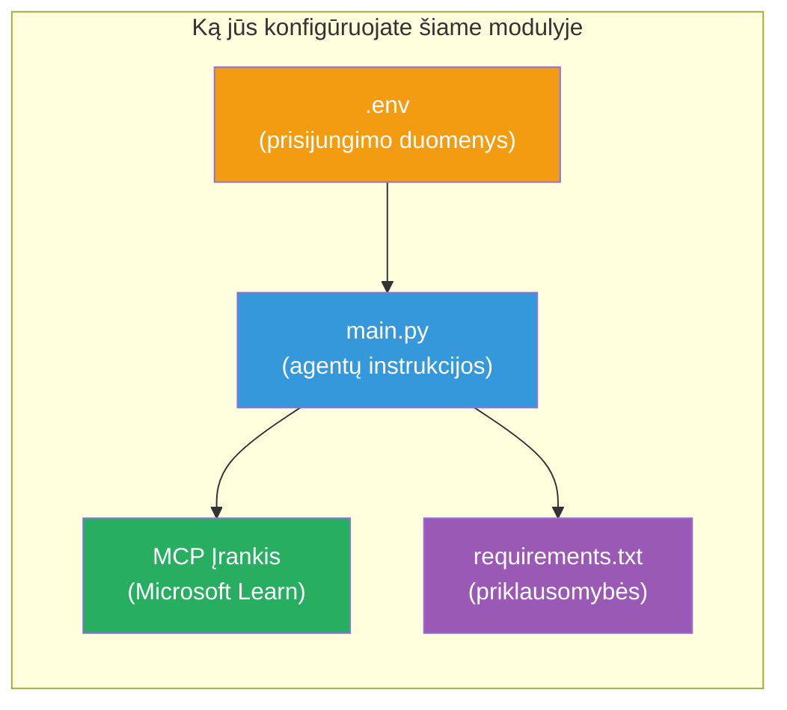

# Modulis 3 - Agentų, MCP įrankio ir aplinkos konfigūravimas

Šiame modulyje suasmeninsite sukurtą daugiaprieigos projektą. Parašysite nurodymus visiems keturiems agentams, nustatysite MCP įrankį Microsoft Learn, sukonfigūruosite aplinkos kintamuosius ir įdiegsit priklausomybes.


> **Nuoroda:** Pilnas veikiantis kodas yra faile [`PersonalCareerCopilot/main.py`](../../../../../workshop/lab02-multi-agent/PersonalCareerCopilot/main.py). Naudokite jį kaip atskaitos tašką kurdami savo.

---

## 1 žingsnis: Aplinkos kintamųjų konfigūravimas

1. Atidarykite failą **`.env`** savo projekto šaknyje.
2. Užpildykite savo Foundry projekto duomenis:

   ```env
   PROJECT_ENDPOINT=https://<your-account>.services.ai.azure.com/api/projects/<your-project>
   MODEL_DEPLOYMENT_NAME=gpt-4.1-mini
   ```

3. Išsaugokite failą.

### Kur rasti šias reikšmes

| Reikšmė | Kaip rasti |
|---------|------------|
| **Projekto galinis taškas** | Microsoft Foundry šoninė juosta → spustelėkite savo projektą → galinio taško URL detalių peržiūroje |
| **Modelio diegimo pavadinimas** | Foundry šoninė juosta → išplėskite projektą → **Models + endpoints** → vardas šalia diegto modelio |

> **Saugumas:** Niekada nekeiskite `.env` į versijų kontrolę. Jei dar neįtraukta, pridėkite ją prie `.gitignore`.

### Aplinkos kintamųjų susiejimas

Daugiaprieigos `main.py` skaito tiek standartinius, tiek workshop specifinius aplinkos kintamųjų pavadinimus:

```python
PROJECT_ENDPOINT = os.getenv("AZURE_AI_PROJECT_ENDPOINT") or os.getenv("PROJECT_ENDPOINT")
MODEL_DEPLOYMENT_NAME = os.getenv(
    "AZURE_AI_MODEL_DEPLOYMENT_NAME",
    os.getenv("MODEL_DEPLOYMENT_NAME", "gpt-4.1-mini"),
)
MICROSOFT_LEARN_MCP_ENDPOINT = os.getenv(
    "MICROSOFT_LEARN_MCP_ENDPOINT", "https://learn.microsoft.com/api/mcp"
)
```

MCP galinis taškas turi prasmingą numatytąją reikšmę – jo nereikia nustatyti `.env`, nebent norite jį perrašyti.

---

## 2 žingsnis: Parašykite agentų nurodymus

Tai svarbiausias žingsnis. Kiekvienam agentui reikia atsargiai paruoštų nurodymų, nurodančių jo vaidmenį, išvesties formatą ir taisykles. Atidarykite `main.py` ir sukurkite (arba redaguokite) nurodymų konstantas.

### 2.1 Resume Parser Agentas

```python
RESUME_PARSER_INSTRUCTIONS = """\
You are the Resume Parser.
Extract resume text into a compact, structured profile for downstream matching.

Output exactly these sections:
1) Candidate Profile
2) Technical Skills (grouped categories)
3) Soft Skills
4) Certifications & Awards
5) Domain Experience
6) Notable Achievements

Rules:
- Use only explicit or strongly implied evidence.
- Do not invent skills, titles, or experience.
- Keep concise bullets; no long paragraphs.
- If input is not a resume, return a short warning and request resume text.
"""
```

**Kodėl šios skiltys?** MatchingAgent'ui reikalingi struktūruoti duomenys vertinimui. Nuoseklios skiltys užtikrina patikimą perėjimą tarp agentų.

### 2.2 Job Description Agentas

```python
JOB_DESCRIPTION_INSTRUCTIONS = """\
You are the Job Description Analyst.
Extract a structured requirement profile from a JD.

Output exactly these sections:
1) Role Overview
2) Required Skills
3) Preferred Skills
4) Experience Required
5) Certifications Required
6) Education
7) Domain / Industry
8) Key Responsibilities

Rules:
- Keep required vs preferred clearly separated.
- Only use what the JD states; do not invent hidden requirements.
- Flag vague requirements briefly.
- If input is not a JD, return a short warning and request JD text.
"""
```

**Kodėl atskirti privalomus ir pageidaujamus?** MatchingAgent naudoja skirtingus svorius kiekvienam (Reikalingi įgūdžiai = 40 taškų, Pageidaujami įgūdžiai = 10 taškų).

### 2.3 Matching Agentas

```python
MATCHING_AGENT_INSTRUCTIONS = """\
You are the Matching Agent.
Compare parsed resume output vs JD output and produce an evidence-based fit report.

Scoring (100 total):
- Required Skills 40
- Experience 25
- Certifications 15
- Preferred Skills 10
- Domain Alignment 10

Output exactly these sections:
1) Fit Score (with breakdown math)
2) Matched Skills
3) Missing Skills
4) Partially Matched
5) Experience Alignment
6) Certification Gaps
7) Overall Assessment

Rules:
- Be objective and evidence-only.
- Keep partial vs missing separate.
- Keep Missing Skills precise; it feeds roadmap planning.
"""
```

**Kodėl aiškus vertinimas?** Pakartotinas vertinimas leidžia palyginti paleidimus ir trikčių diagnostiką. 100 taškų skalė yra lengvai suprantama galutiniams vartotojams.

### 2.4 Gap Analyzer Agentas

```python
GAP_ANALYZER_INSTRUCTIONS = """\
You are the Gap Analyzer and Roadmap Planner.
Create a practical upskilling plan from the matching report.

Microsoft Learn MCP usage (required):
- For EVERY High and Medium priority gap, call tool `search_microsoft_learn_for_plan`.
- Use returned Learn links in Suggested Resources.
- Prefer Microsoft Learn for free resources.

CRITICAL: You MUST produce a SEPARATE detailed gap card for EVERY skill listed in
the Missing Skills and Certification Gaps sections of the matching report. Do NOT
skip or combine gaps. Do NOT summarize multiple gaps into one card.

Output format:
1) Personalized Learning Roadmap for [Role Title]
2) One DETAILED card per gap (produce ALL cards, not just the first):
   - Skill
   - Priority (High/Medium/Low)
   - Current Level
   - Target Level
   - Suggested Resources (include Learn URL from tool results)
   - Estimated Time
   - Quick Win Project
3) Recommended Learning Order (numbered list)
4) Timeline Summary (week-by-week)
5) Motivational Note

Rules:
- Produce every gap card before writing the summary sections.
- Keep it specific, realistic, and actionable.
- Tailor to candidate's existing stack.
- If fit >= 80, focus on polish/interview readiness.
- If fit < 40, be honest and provide a staged path.
"""
```

**Kodėl „KRITIŠKAS“ akcentas?** Be aiškių nurodymų pateikti VISAS spragų korteles, modelis dažniausiai sukuria tik 1-2 korteles ir apibendrina likusias. „KRITIŠKAS“ blokas neleidžia tai sutrumpinti.

---

## 3 žingsnis: Apibrėžkite MCP įrankį

GapAnalyzer naudoja įrankį, kuris kviečia [Microsoft Learn MCP serverį](https://learn.microsoft.com/azure/foundry/agents/how-to/tools/model-context-protocol). Pridėkite tai į `main.py`:

```python
import json
from agent_framework import tool
from mcp.client.session import ClientSession
from mcp.client.streamable_http import streamable_http_client

@tool
async def search_microsoft_learn_for_plan(
    skill: str, role: str = "", max_results: int = 5
) -> str:
    """Search Microsoft Learn MCP and return curated official links for roadmap planning."""
    query = " ".join(part for part in [skill, role, "learning path module"] if part).strip()
    query = query or "job skills learning path"

    try:
        async with streamable_http_client(MICROSOFT_LEARN_MCP_ENDPOINT) as (
            read_stream, write_stream, _,
        ):
            async with ClientSession(read_stream, write_stream) as session:
                await session.initialize()
                result = await session.call_tool(
                    "microsoft_docs_search", {"query": query}
                )

        if not result.content:
            return (
                "No results returned from Microsoft Learn MCP. "
                "Fallback: https://learn.microsoft.com/training/support/catalog-api"
            )

        payload_text = getattr(result.content[0], "text", "")
        data = json.loads(payload_text) if payload_text else {}
        items = data.get("results", [])[:max(1, min(max_results, 10))]

        if not items:
            return f"No direct Microsoft Learn results found for '{skill}'."

        lines = [f"Microsoft Learn resources for '{skill}':"]
        for i, item in enumerate(items, start=1):
            title = item.get("title") or item.get("url") or "Microsoft Learn Resource"
            url = item.get("url") or item.get("link") or ""
            lines.append(f"{i}. {title} - {url}".rstrip(" -"))
        return "\n".join(lines)
    except Exception as ex:
        return (
            f"Microsoft Learn MCP lookup unavailable. Reason: {ex}. "
            "Fallbacks: https://learn.microsoft.com/api/mcp"
        )
```

### Kaip veikia įrankis

| Žingsnis | Kas vyksta |
|----------|------------|
| 1 | GapAnalyzer nusprendžia, kad reikalingi ištekliai tam tikram įgūdžiui (pvz., „Kubernetes“) |
| 2 | Framework kviečia `search_microsoft_learn_for_plan(skill="Kubernetes")` |
| 3 | Funkcija atidaro [Streamable HTTP](https://learn.microsoft.com/agent-framework/agents/tools/hosted-mcp-tools) ryšį su `https://learn.microsoft.com/api/mcp` |
| 4 | Kviečia `microsoft_docs_search` [MCP serveryje](https://learn.microsoft.com/azure/foundry/agents/how-to/tools/model-context-protocol) |
| 5 | MCP serveris grąžina paieškos rezultatus (pavadinimą + URL) |
| 6 | Funkcija formatuoja rezultatus numeruotu sąrašu |
| 7 | GapAnalyzer įtraukia URL į spragų kortelę |

### MCP priklausomybės

MCP kliento bibliotekos yra įtrauktos per [`agent-framework-core`](https://learn.microsoft.com/agent-framework/overview/). Jų **nereikia** atskirai pridėti į `requirements.txt`. Jei gaunate importo klaidų, patikrinkite:

```powershell
pip list | Select-String "mcp"
```

Tikėtina: įdiegta `mcp` paketas (versija 1.x arba naujesnė).

---

## 4 žingsnis: Sujunkite agentus ir darbo eigą

### 4.1 Sukurkite agentus su konteksto tvarkyklėmis

```python
from contextlib import asynccontextmanager

@asynccontextmanager
async def create_agents():
    async with (
        get_credential() as credential,
        AzureAIAgentClient(
            project_endpoint=PROJECT_ENDPOINT,
            model_deployment_name=MODEL_DEPLOYMENT_NAME,
            credential=credential,
        ).as_agent(
            name="ResumeParser",
            instructions=RESUME_PARSER_INSTRUCTIONS,
        ) as resume_parser,
        AzureAIAgentClient(
            project_endpoint=PROJECT_ENDPOINT,
            model_deployment_name=MODEL_DEPLOYMENT_NAME,
            credential=credential,
        ).as_agent(
            name="JobDescriptionAgent",
            instructions=JOB_DESCRIPTION_INSTRUCTIONS,
        ) as jd_agent,
        AzureAIAgentClient(
            project_endpoint=PROJECT_ENDPOINT,
            model_deployment_name=MODEL_DEPLOYMENT_NAME,
            credential=credential,
        ).as_agent(
            name="MatchingAgent",
            instructions=MATCHING_AGENT_INSTRUCTIONS,
        ) as matching_agent,
        AzureAIAgentClient(
            project_endpoint=PROJECT_ENDPOINT,
            model_deployment_name=MODEL_DEPLOYMENT_NAME,
            credential=credential,
        ).as_agent(
            name="GapAnalyzer",
            instructions=GAP_ANALYZER_INSTRUCTIONS,
            tools=[search_microsoft_learn_for_plan],
        ) as gap_analyzer,
    ):
        yield resume_parser, jd_agent, matching_agent, gap_analyzer
```

**Pagrindiniai punktai:**
- Kiekvienas agentas turi savo `AzureAIAgentClient` egzempliorių
- Tik GapAnalyzer gauna `tools=[search_microsoft_learn_for_plan]`
- `get_credential()` grąžina [`ManagedIdentityCredential`](https://learn.microsoft.com/python/api/overview/azure/identity-readme#managed-identity-support) Azure aplinkoje, [`DefaultAzureCredential`](https://learn.microsoft.com/azure/developer/python/sdk/authentication/credential-chains#defaultazurecredential-overview) lokaliai

### 4.2 Sukurkite darbo eigos grafiką

```python
def create_workflow(resume_parser, jd_agent, matching_agent, gap_analyzer):
    workflow = (
        WorkflowBuilder(
            name="ResumeJobFitEvaluator",
            start_executor=resume_parser,
            output_executors=[gap_analyzer],
        )
        .add_edge(resume_parser, jd_agent)
        .add_edge(resume_parser, matching_agent)
        .add_edge(jd_agent, matching_agent)
        .add_edge(matching_agent, gap_analyzer)
        .build()
    )
    return workflow.as_agent()
```

> Žr. [Darbo eigos kaip agentai](https://learn.microsoft.com/agent-framework/workflows/as-agents), kad suprastumėte `.as_agent()` modelį.

### 4.3 Paleiskite serverį

```python
async def main() -> None:
    validate_configuration()
    async with create_agents() as (resume_parser, jd_agent, matching_agent, gap_analyzer):
        agent = create_workflow(resume_parser, jd_agent, matching_agent, gap_analyzer)
        from azure.ai.agentserver.agentframework import from_agent_framework
        await from_agent_framework(agent).run_async()

if __name__ == "__main__":
    asyncio.run(main())
```

---

## 5 žingsnis: Sukurkite ir aktyvuokite virtualią aplinką

### 5.1 Sukurkite aplinką

```powershell
cd workshop\lab02-multi-agent\PersonalCareerCopilot
python -m venv .venv
```

### 5.2 Aktyvuokite ją

**PowerShell (Windows):**
```powershell
.\.venv\Scripts\Activate.ps1
```

**macOS/Linux:**
```bash
source .venv/bin/activate
```

### 5.3 Įdiekite priklausomybes

```powershell
pip install -r requirements.txt
```

> **Pastaba:** Eilutė `agent-dev-cli --pre` faile `requirements.txt` užtikrina, kad įdiegiama naujausia peržiūros versija. Tai būtina suderinamumui su `agent-framework-core==1.0.0rc3`.

### 5.4 Patikrinkite diegimą

```powershell
pip list | Select-String "agent-framework|agentserver|agent-dev"
```

Tikėtinas išvestis:
```
agent-dev-cli                  0.0.1b260316
agent-framework-azure-ai       1.0.0rc3
agent-framework-core            1.0.0rc3
azure-ai-agentserver-agentframework 1.0.0b16
azure-ai-agentserver-core      1.0.0b16
```

> **Jei `agent-dev-cli` rodoma senesnė versija** (pvz., `0.0.1b260119`), Agent Inspector nepavyks su 403/404 klaidomis. Atnaujinkite: `pip install agent-dev-cli --pre --upgrade`

---

## 6 žingsnis: Patikrinkite autentifikavimą

Paleiskite tą patį autentifikacijos patikrinimą kaip Laboratorijoje 01:

```powershell
az account show --query "{name:name, id:id}" --output table
```

Jei nepavyksta, paleiskite [`az login`](https://learn.microsoft.com/cli/azure/authenticate-azure-cli-interactively).

Daugiaprieigos darbo eigoje visi keturi agentai naudoja tą pačią kredencialą. Jei autentifikacija veikia vienam, veiks visiems.

---

### Kontrolinis taškas

- [ ] `.env` turi galiojančias `PROJECT_ENDPOINT` ir `MODEL_DEPLOYMENT_NAME` reikšmes
- [ ] Visos 4 agentų nurodymų konstantos apibrėžtos `main.py` (ResumeParser, JD Agent, MatchingAgent, GapAnalyzer)
- [ ] `search_microsoft_learn_for_plan` MCP įrankis apibrėžtas ir užregistruotas su GapAnalyzer
- [ ] `create_agents()` sukuria visus 4 agentus su atskirais `AzureAIAgentClient` egzemplioriais
- [ ] `create_workflow()` konstruoja teisingą grafiką su `WorkflowBuilder`
- [ ] Sukurta ir aktyvuota virtuali aplinka (`(.venv)` matoma)
- [ ] `pip install -r requirements.txt` baigiasi be klaidų
- [ ] `pip list` parodo visas laukiamas paketas teisingomis versijomis (rc3 / b16)
- [ ] `az account show` pateikia jūsų prenumeratą

---

**Ankstesnis:** [02 - Scaffold Multi-Agent Project](02-scaffold-multi-agent.md) · **Kitas:** [04 - Orchestration Patterns →](04-orchestration-patterns.md)

---

<!-- CO-OP TRANSLATOR DISCLAIMER START -->
**Atsakomybės apribojimas**:
Šis dokumentas buvo išverstas naudojant dirbtinio intelekto vertimo paslaugą [Co-op Translator](https://github.com/Azure/co-op-translator). Nors siekiame tikslumo, prašome atkreipti dėmesį, kad automatiniai vertimai gali turėti klaidų ar netikslumų. Originalus dokumentas jo gimtąja kalba turėtų būti laikomas autoritetingu šaltiniu. Svarbiai informacijai rekomenduojamas profesionalus žmogaus vertimas. Mes neatsakome už bet kokius nesusipratimus ar klaidingą interpretavimą, kylančią dėl šio vertimo naudojimo.
<!-- CO-OP TRANSLATOR DISCLAIMER END -->