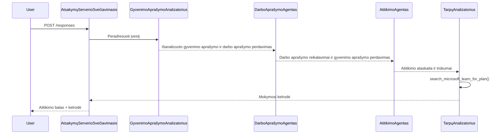

# 3 modulis – Sukonfigūruokite instrukcijas, aplinką ir įdiekite priklausomybes

⏱️ ~15 min

Šiame modulyje jūs paversite paruoštą skeletą į **jūsų** daugiaagentinį darbo procesą – nustatydami aplinkos kintamuosius, rašydami agentų instrukcijas, pridėdami MCP įrankį, sujungdami darbo proceso grafą ir įdiegiant priklausomybes.

> **Nuoroda:** Visa veikianti kodo versija yra faile [`PersonalCareerCopilot/main.py`](../../../../../workshop/lab02-multi-agent/PersonalCareerCopilot/main.py). Naudokite ją kaip pavyzdį statydami savo darbo proceso grafiką ir užklausų blokus.

---

## Kaip keturi agentai dera kartu


```mermaid
sequenceDiagram
    participant User
    participant Server as AtsakymųServerioSvečiavimasis
    participant RP as GyvenimoAprašymoAnalizatorius
    participant JD as DarboAprašymoAgentas
    participant MA as AtitikimoAgentas
    participant GA as TarpųAnalizatorius

    User->>Server: POST /responses
    Server->>RP: Peradresuoti įvestį
    RP-->>JD: Išanalizuoto gyvenimo aprašymo ir darbo aprašymo perdavimas
    JD-->>MA: Darbo aprašymo reikalavimai ir gyvenimo aprašymo perdavimas
    MA-->>GA: Atitikimo ataskaita ir trūkumai
    GA->>GA: search_microsoft_learn_for_plan()
    GA-->>Server: Mokymosi kelrodė
    Server-->>User: Atitikimo balas + kelrodė
```

---

## 1 žingsnis: sukonfigūruokite aplinkos kintamuosius

1. Atidarykite **`.env`** failą savo projekto šakniniame kataloge (sukurtą darbo vedlio).
2. Pakeiskite žymeklius tikraisiais *Lab 01* duomenimis.

<details open>
<summary><strong>🅰️ A kelias – Foundry prenumerata</strong></summary>

```env
FOUNDRY_PROJECT_ENDPOINT=https://<your-account>.services.ai.azure.com/api/projects/<your-project>
AZURE_AI_MODEL_DEPLOYMENT_NAME=gpt-4.1-mini
```

> **Kur rasti reikšmes:** žr. [Lab 01, 1 modulis](../../lab01-single-agent/docs/01-setup.md#deploy-a-model--assign-rbac).

</details>

<details open>
<summary><strong>🅱️ B kelias – Foundry Local</strong></summary>

```env
FOUNDRY_PROJECT_ENDPOINT=http://localhost:5273/v1
AZURE_AI_MODEL_DEPLOYMENT_NAME=phi-4-mini
```

> Visa išvada vykdoma jūsų įrenginyje – jokių duomenų neišvyksta iš jūsų aparato. Paleiskite `foundry model list`, kad patvirtintumėte tikslią modelio aliase. Vienintelis išeinantis užklausimas yra MCP įrankio kvietimas adresu `https://learn.microsoft.com/api/mcp`.

> **Kur rasti reikšmes:** žr. [Lab 01, 1 modulis – vietinis kelias](../../lab01-single-agent/docs/01-setup.md#step-2-set-up-based-on-your-access).

</details>

> **Saugumas:** Niekada neįtraukite `.env` į versijų valdymą (git). Jis jau turėtų būti įtrauktas į `.gitignore`.

---

## 2 žingsnis: parašykite agentų instrukcijas

Instrukcijos apibrėžia kiekvieno agente vaidmenį, išvesties formatą ir taisykles. Atidarykite `main.py` ir apibrėžkite (arba pakeiskite) keturias instrukcijų konstantas – pilni tekstai yra faile [`PersonalCareerCopilot/main.py`](../../../../../workshop/lab02-multi-agent/PersonalCareerCopilot/main.py).

### 2.1 `RESUME_PARSER_INSTRUCTIONS`
Išanalizuoja gyvenimo aprašymą į struktūrizuotą kandidato profilį **ir** tiksliai nukopijuoja darbo aprašymą į `[JOB DESCRIPTION PASS-THROUGH]`. Abi žymėtos sekcijos privalo būti išvestyje.

> **Kodėl tarpiniam perdavimui?** Su `context_mode="last_agent"`, ResumeParser yra **vienintelis** agentas, kuris mato originalų vartotojo pranešimą. Jei jis neperduoda darbo aprašymo toliau, kiti agentai jo nemato.

### 2.2 `JOB_DESCRIPTION_INSTRUCTIONS`
Skaito `[PARSED RESUME]` ir `[JOB DESCRIPTION PASS-THROUGH]` iš ResumeParser išvesties. Išveda `[JD REQUIREMENTS]` (struktūrizuoti reikalavimai) ir `[PARSED RESUME PASS-THROUGH]` (tiksli gyvenimo aprašymo kopija MatchingAgent).

### 2.3 `MATCHING_AGENT_INSTRUCTIONS`
Skaito `[JD REQUIREMENTS]` ir `[PARSED RESUME PASS-THROUGH]`. Sukuria įvertintą atitikties ataskaitą (0–100) su matematiniais skaidymais, suderintais įgūdžiais, trūkstamais įgūdžiais ir patirties suderinamumu.

### 2.4 `GAP_ANALYZER_INSTRUCTIONS`
Skaito atitikties ataskaitą. Kiekvienam trūkstamam įgūdžiui kviečia `search_microsoft_learn_for_plan`, kad paimtų Microsoft Learn išteklius. Sukuria po išsamią trūkumo kortelę kiekvienam įgūdžiui ir savaitinį mokymosi planą.

---

## 3 žingsnis: pridėkite MCP įrankį

GapAnalyzer kviečia [Microsoft Learn MCP serverį](https://learn.microsoft.com/azure/foundry/agents/how-to/tools/model-context-protocol), kad gautų realius mokymosi išteklius kiekvienam įgūdžių trūkumui. Visas `search_microsoft_learn_for_plan` funkcijos kodas yra faile [`PersonalCareerCopilot/main.py`](../../../../../workshop/lab02-multi-agent/PersonalCareerCopilot/main.py).

Užregistruokite įrankį GapAnalyzer kuriant agentą:

```python
gap_analyzer = Agent(
    client=client,
    instructions=GAP_ANALYZER_INSTRUCTIONS,
    name="GapAnalyzer",
    tools=[search_microsoft_learn_for_plan],
)
```

> Žr. faile [`PersonalCareerCopilot/main.py`](../../../../../workshop/lab02-multi-agent/PersonalCareerCopilot/main.py) pilną `WorkflowBuilder` grafiką su `FoundryChatClient`, `AgentExecutor` ir visais `add_edge()` iškvietimais.

---

## 4 žingsnis: sukurkite virtualią aplinką ir įdiekite priklausomybes

> ⚠️ **Nepraleiskite šio žingsnio.** Be priklausomybių įdiegimo, F5 derinimas neveiks.

### 4.1 Sukurkite virtualią aplinką

```powershell
python -m venv .venv
```

### 4.2 Aktyvuokite ją

| OS | Komanda |
|----|---------|
| **Windows (PowerShell)** | `.\.venv\Scripts\Activate.ps1` |
| **Windows (CMD)** | `.venv\Scripts\activate.bat` |
| **macOS / Linux** | `source .venv/bin/activate` |

Turėtumėte matyti `(.venv)` savo terminalo kvietimo eilutėje.

### 4.3 Įdiekite priklausomybes

```powershell
pip install -r requirements.txt
```

### 4.4 Patikrinkite

```powershell
pip list | Select-String "agent-framework|mcp|debugpy"
```

Tikėtina: sąraše matomi `agent-framework-foundry`, `agent-framework-foundry-hosting`, `mcp` ir `debugpy`.

---

## 5 žingsnis: patikrinkite autentifikaciją

<details open>
<summary><strong>🅰️ A kelias – Azure kredencialas</strong></summary>

```powershell
az account show --query "{name:name, id:id}" --output table
```

Jei nepavyksta, paleiskite komandą [`az login`](https://learn.microsoft.com/cli/azure/authenticate-azure-cli-interactively).

Visi keturi agentai naudoja vieną `FoundryChatClient` ir vieną `DefaultAzureCredential`. Jei autentifikacija veikia vienam, veikia visiems.

</details>

<details open>
<summary><strong>🅱️ B kelias – Foundry Local</strong></summary>

Vietiniam testavimui autentifikacija nereikalinga.

</details>

---

### ✅ Patikros taškas

> Nevykite į Modulį 04 iki tol, kol nevykdysite: **(1)** `(.venv)` matosi jūsų kvietime IR (2) `pip install -r requirements.txt` sėkmingai baigtas.

- [ ] `.env` turi galiojančius galinio taško ir modelio diegimo pavadinimus (nereikia žymeklių)
- [ ] Visos 4 agentų instrukcijų konstantos apibrėžtos `main.py` (ResumeParser, JD Agent, MatchingAgent, GapAnalyzer)
- [ ] `search_microsoft_learn_for_plan` MCP įrankis apibrėžtas ir užregistruotas GapAnalyzer
- [ ] sukurtos `FoundryChatClient` + 4 `Agent` + 4 `AgentExecutor` objektai `main()`
- [ ] `WorkflowBuilder` sukuria teisingą sekveninį grafą su visais 3 `add_edge()` iškvietimais
- [ ] sukurta ir aktyvuota virtuali aplinka (`(.venv)` matosi kvietime)
- [ ] `pip install -r requirements.txt` baigtas be klaidų
- [ ] **A kelias:** `az account show` sėkmingas ARBA VS Code Accounts ikonėlė rodo prisijungusį paskyrą

---

**Ankstesnis:** [02 - Skeleton daugiaagentiniam projektui](02-scaffold-multi-agent.md) · **Kitas:** [04 - Orkestracijos modeliai →](04-orchestration-patterns.md)

---

<!-- CO-OP TRANSLATOR DISCLAIMER START -->
**Atsakomybės apribojimas**:
Šis dokumentas buvo išverstas naudojant dirbtinio intelekto vertimo paslaugą [Co-op Translator](https://github.com/Azure/co-op-translator). Nors siekiame tikslumo, prašome atkreipti dėmesį, kad automatiniai vertimai gali turėti klaidų ar netikslumų. Originalus dokumentas jo gimtąja kalba laikomas autoritetingu šaltiniu. Svarbiai informacijai rekomenduojama naudoti profesionalų žmogiškąjį vertimą. Mes neatsakome už jokius nesusipratimus ar neteisingą interpretaciją, kilusią naudojantis šiuo vertimu.
<!-- CO-OP TRANSLATOR DISCLAIMER END -->