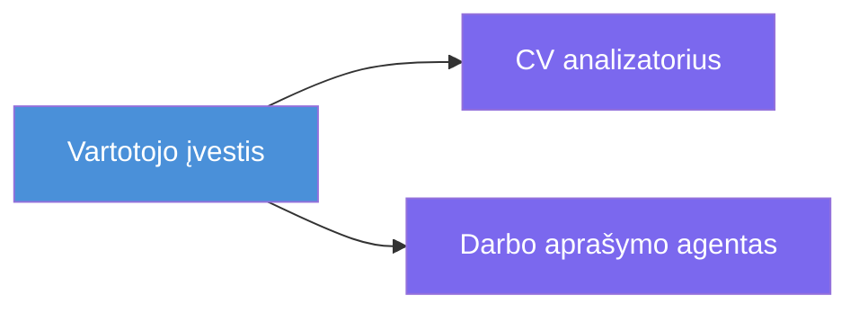
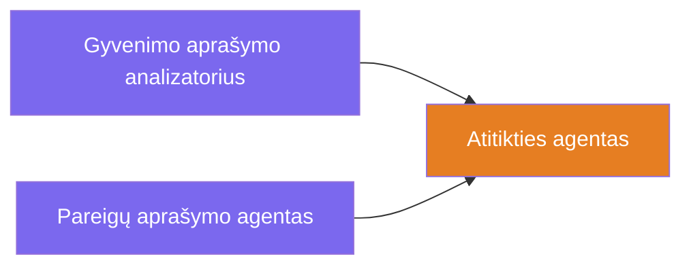
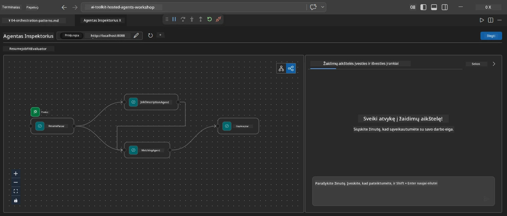
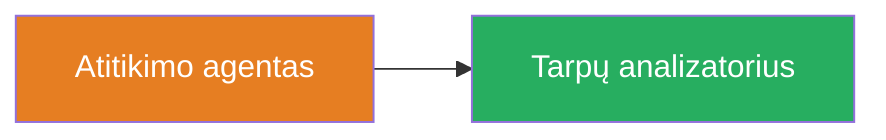
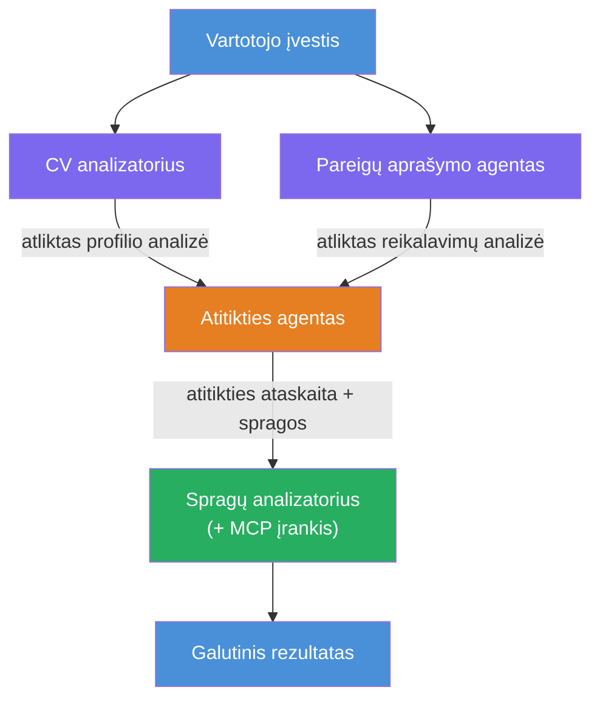
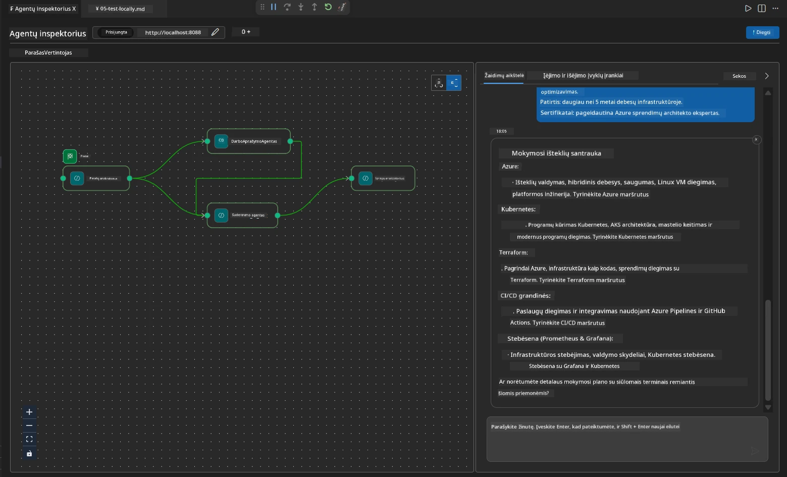

# 4 modulis – Orkestravimo šablonai

Šiame modulyje susipažinsite su orkestravimo šablonais, naudojamais darbo patirties tinkamumo vertintojui, ir išmoksite, kaip skaityti, modifikuoti ir išplėsti darbo eigos grafiką. Šių šablonų supratimas yra būtinas, norint derinti duomenų srauto problemas ir kurti savo [daugiaveiksmių darbo eigos](https://learn.microsoft.com/agent-framework/workflows/).

---

## Šablonas 1: Fan-out (lygiagretus skaidymas)

Pirmasis darbo eigos šablonas yra **fan-out** – vienas įvesties signalas vienu metu siunčiamas keliems agentams.


Kodo lygmenyje tai vyksta todėl, kad `resume_parser` yra `start_executor` – jis pirmas gauna naudotojo žinutę. Kadangi tiek `jd_agent`, tiek `matching_agent` turi kraštus iš `resume_parser`, sistema nukreipia `resume_parser` išvestį abiem agentams:

```python
.add_edge(resume_parser, jd_agent)         # ResumeParser išvestis → JD agentas
.add_edge(resume_parser, matching_agent)   # ResumeParser išvestis → MatchingAgentas
```

**Kodėl tai veikia:** ResumeParser ir JD Agent apdoroja skirtingus to paties įvesties aspektus. Jie paleidžiami lygiagrečiai, todėl sumažėja bendras delsos laikas, palyginti su jų seka.

### Kada naudoti fan-out

| Naudojimo atvejis | Pavyzdys |
|-------------------|----------|
| Nepriklausomos subtakos | Reziumės analizė ir JD analizė |
| Atsargumas / balsavimas | Du agentai analizuoja tuos pačius duomenis, trečiasis parenka geriausią atsakymą |
| Daugiapakopis formatas | Vienas agentas generuoja tekstą, kitas – struktūruotą JSON |

---

## Šablonas 2: Fan-in (rinkimas)

Antrasis šablonas yra **fan-in** – kelių agentų išvestys surenkamos ir perduodamos vienam agentui.


Kodu:

```python
.add_edge(resume_parser, matching_agent)   # ResumeParser išvestis → MatchingAgent
.add_edge(jd_agent, matching_agent)        # JD Agent išvestis → MatchingAgent
```

**Pagrindinė elgsena:** kai agentas turi **du ar daugiau įeinančių kraštų**, sistema automatiškai laukia, kol visi aukštesnio lygio agentai baigs darbą, prieš vykdydama žemiau esantį agentą. MatchingAgent nepaleidžiamas, kol nebaigia darbą tiek ResumeParser, tiek JD Agent.

### Ką gauna MatchingAgent

Sistema sujungia įėjimus iš visų aukštesnio lygio agentų. MatchingAgent įvestis atrodo taip:

```
[ResumeParser output]
---
Candidate Profile:
  Name: Jane Doe
  Technical Skills: Python, Azure, Kubernetes, ...
  ...

[JobDescriptionAgent output]
---
Role Overview: Senior Cloud Engineer
Required Skills: Python, Azure, Terraform, ...
...
```

> **Pastaba:** Tikslus sujungimo formatas priklauso nuo sistemos versijos. Agentui skirtos instrukcijos turi būti parašytos taip, kad galėtų apdoroti tiek struktūruotus, tiek nestruktūruotus aukštesnio lygio išvestis.



---

## Šablonas 3: Sekanti grandinė

Trečiasis šablonas yra **sekanti grandinė** – vieno agento išvestis tiesiogiai perduodama kitam.


Kodu:

```python
.add_edge(matching_agent, gap_analyzer)    # MatchingAgent išvestis → GapAnalyzer
```

Tai paprasčiausias šablonas. GapAnalyzer gauna MatchingAgent įvertinimą, atitiktis/trūkstamus įgūdžius ir spragas. Tada jis iškviečia [MCP įrankį](https://learn.microsoft.com/azure/foundry/agents/how-to/tools/model-context-protocol) kiekvienai spragai, kad gautų Microsoft Learn išteklius.

---

## Pilnas grafikas

Sujungus visus tris šablonus, gaunama visa darbo eiga:


### Vykdymo laiko linija

```mermaid
gantt
    title Agento Vykdymo Laikotarpis
    dateFormat X
    axisFormat %s

    section Lygiagretus
    Resume Parser       :rp, 0, 3
    JD Agent            :jd, 0, 2

    section Nuoseklus
    Matching Agent      :ma, 3, 5
    Gap Analyzer        :ga, 5, 9
```


> Bendras realaus laiko vykdymo trukmė yra maždaug `max(ResumeParser, JD Agent) + MatchingAgent + GapAnalyzer`. GapAnalyzer dažniausiai yra lėčiausias, nes daro kelis MCP įrankio kvietimus (po vieną kiekvienai spragai).

---

## Kaip skaityti WorkflowBuilder kodą

Čia pateikiama visa `create_workflow()` funkcija iš `main.py`, su komentarais:

```python
def create_workflow(resume_parser, jd_agent, matching_agent, gap_analyzer):
    workflow = (
        WorkflowBuilder(
            name="ResumeJobFitEvaluator",

            # Pirmasis agentas, kuris gauna vartotojo įvestį
            start_executor=resume_parser,

            # Agentas(-ai), kurių išvestis tampa galutiniu atsakymu
            output_executors=[gap_analyzer],
        )
        # Išsisklaidymas: ResumeParser išvestis siunčiama tiek JD agentui, tiek MatchingAgent
        .add_edge(resume_parser, jd_agent)
        .add_edge(resume_parser, matching_agent)

        # Susijungimas: MatchingAgent laukia tiek ResumeParser, tiek JD agento
        .add_edge(jd_agent, matching_agent)

        # Sekos tvarka: MatchingAgent išvestis perduodama GapAnalyzer
        .add_edge(matching_agent, gap_analyzer)

        .build()
    )
    return workflow.as_agent()
```

### Kraštų santraukos lentelė

| # | Kraštas | Šablonas | Poveikis |
|---|---------|----------|----------|
| 1 | `resume_parser → jd_agent` | Fan-out | JD Agent gauna ResumeParser išvestį (ir pradinę naudotojo įvestį) |
| 2 | `resume_parser → matching_agent` | Fan-out | MatchingAgent gauna ResumeParser išvestį |
| 3 | `jd_agent → matching_agent` | Fan-in | MatchingAgent taip pat gauna JD Agent išvestį (laukiama abiejų) |
| 4 | `matching_agent → gap_analyzer` | Sekanti grandinė | GapAnalyzer gauna įvertinimo ataskaitą ir spragų sąrašą |

---

## Grafiko keitimas

### Naujo agento pridėjimas

Norint pridėti penktą agentą (pvz., **InterviewPrepAgent**, kuris generuoja interviu klausimus pagal spragų analizę):

```python
# 1. Apibrėžkite instrukcijas
INTERVIEW_PREP_INSTRUCTIONS = """\
You are the Interview Prep Agent.
Given a gap analysis and fit report, generate 10 targeted interview questions
the candidate should prepare for.
"""

# 2. Sukurkite agentą (viduje async with bloke)
AzureAIAgentClient(
    project_endpoint=PROJECT_ENDPOINT,
    model_deployment_name=MODEL_DEPLOYMENT_NAME,
    credential=credential,
).as_agent(
    name="InterviewPrepAgent",
    instructions=INTERVIEW_PREP_INSTRUCTIONS,
) as interview_prep,

# 3. Pridėkite briaunas funkcijoje create_workflow()
.add_edge(matching_agent, interview_prep)   # gauna pritaikymo ataskaitą
.add_edge(gap_analyzer, interview_prep)     # taip pat gauna spragų korteles

# 4. Atnaujinkite output_executors
output_executors=[interview_prep],  # dabar galutinis agentas
```

### Vykdymo eiliškumo keitimas

Norint, kad JD Agent veiktų **po** ResumeParser (seka, o ne lygiagrečiai):

```python
# Pašalinti: .add_edge(resume_parser, jd_agent)  ← jau yra, palikite
# Pašalinkite implicitinį paralelizmą, NENAUDODAMI jd_agent tiesiogiai gaunant vartotojo įvestį
# start_executor pirmiausia siunčia į resume_parser, o jd_agent gauna tik
# resume_parser išvestį per kraštą. Tai daro juos sekos tvarka.
```

> **Svarbu:** `start_executor` yra vienintelis agentas, kuris gauna neapdorotą naudotojo įvestį. Kiti agentai gauna išvestį iš savo aukštesnio lygio kraštų. Jei norite, kad agentas taip pat gautų neapdorotą įvestį, jis turi turėti kraštą iš `start_executor`.

---

## Dažnos klaidos grafike

| Klaida | Simptomas | Sprendimas |
|--------|-----------|------------|
| Trūksta krašto į `output_executors` | Agentas veikia, bet rezultatas tuščias | Užtikrinkite, kad būtų kelias nuo `start_executor` iki kiekvieno agento `output_executors` |
| Apskritas priklausomumas | Begalinis ciklas arba laiko limitas | Patikrinkite, kad nėra agento, kuris grįžta į aukštesnio lygio agentą |
| Agentas `output_executors` be įeinančio krašto | Tuščia išvestis | Pridėkite bent vieną `add_edge(source, that_agent)` |
| Keletas `output_executors` be fan-in | Išvestyje yra tik vieno agento atsakymas | Naudokite vieną agentą, rinktį arba priimkite kelias išvestis |
| Trūksta `start_executor` | `ValueError` derinimo metu | Visada nurodykite `start_executor` `WorkflowBuilder()` |

---

## Grafiko derinimas

### Naudojant Agent Inspector

1. Paleiskite agentą lokaliai (F5 arba terminalas – žr. [5 modulis](05-test-locally.md)).
2. Atidarykite Agent Inspector (`Ctrl+Shift+P` → **Foundry Toolkit: Open Agent Inspector**).
3. Siųskite testinę žinutę.
4. Inspectoriaus atsakymo lange ieškokite **srautinės išvesties** – ji rodo kiekvieno agento įnašą paeiliui.



### Naudojant žurnalavimą

Pridėkite žurnalavimą į `main.py`, kad sektumėte duomenų srautą:

```python
import logging
logger = logging.getLogger("resume-job-fit")

# Funkcijoje create_workflow(), po kūrimo:
logger.info("Workflow graph built with edges: RP→JD, RP→MA, JD→MA, MA→GA")
```

Serverio žurnaluose matomas agentų vykdymo eiliškumas ir MCP įrankių kvietimai:

```
INFO:resume-job-fit:Starting Resume -> Job Fit Evaluator HTTP server...
INFO:resume-job-fit:Server running on http://localhost:8088
INFO:agent_framework:Executing agent: ResumeParser
INFO:agent_framework:Executing agent: JobDescriptionAgent
INFO:agent_framework:Waiting for upstream agents: ResumeParser, JobDescriptionAgent
INFO:agent_framework:Executing agent: MatchingAgent
INFO:agent_framework:Executing agent: GapAnalyzer
INFO:agent_framework:Tool call: search_microsoft_learn_for_plan(skill="Kubernetes")
POST https://learn.microsoft.com/api/mcp → 200
INFO:agent_framework:Tool call: search_microsoft_learn_for_plan(skill="Terraform")
POST https://learn.microsoft.com/api/mcp → 200
```

---

### Kontrolinis sąrašas

- [ ] Galite identifikuoti tris orkestravimo šablonus darbo eigoje: fan-out, fan-in ir sekanti grandinė
- [ ] Suprantate, kad agentai su keliomis įeinančiomis kraštinėmis laukia, kol visi aukštesnio lygio agentai baigs darbą
- [ ] Galite skaityti `WorkflowBuilder` kodą ir susieti kiekvieną `add_edge()` kvietimą su vizualiu grafiku
- [ ] Suprantate vykdymo laiko liniją: lygiagrečiai veikiantys agentai pirmiausia, tada agregavimas, tada seka
- [ ] Žinote, kaip pridėti naują agentą grafike (apibrėžti instrukcijas, sukurti agentą, pridėti kraštus, atnaujinti išvestį)
- [ ] Galite atpažinti dažnas grafiko klaidas ir jų simptomus

---

**Ankstesnis:** [03 – Nustatyti agentus ir aplinką](03-configure-agents.md) · **Kitas:** [05 – Testuoti lokaliai →](05-test-locally.md)

---

<!-- CO-OP TRANSLATOR DISCLAIMER START -->
**Atsakomybės apribojimas**:  
Šis dokumentas buvo išverstas naudojant dirbtinio intelekto vertimo paslaugą [Co-op Translator](https://github.com/Azure/co-op-translator). Nors stengiamės užtikrinti tikslumą, prašome atkreipti dėmesį, kad automatiniai vertimai gali turėti klaidų ar netikslumų. Pradinė dokumento versija gimtąja kalba turėtų būti laikoma autoritetingu šaltiniu. Kritiniais atvejais rekomenduojama naudoti profesionalų žmogaus vertimą. Mes neatsakome už bet kokius nesusipratimus ar neteisingus aiškinimus, kylančius naudojant šį vertimą.
<!-- CO-OP TRANSLATOR DISCLAIMER END -->