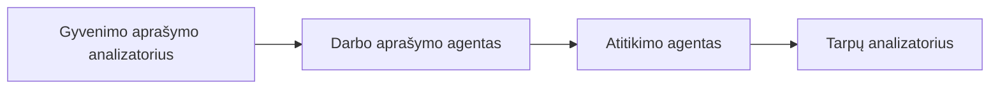
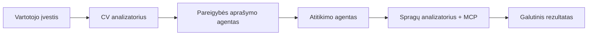

# 4 modulis – Orkestravimo modeliai

⏱️ ~10 min

Šiame modulyje tyrinėjate orkestravimo modelius, naudojamus Resume Job Fit Evaluator, ir mokotės skaityti, keisti bei plėsti darbo eigos grafiką. Šių modelių supratimas yra būtinas duomenų srauto problemų derinimui ir savo [daugiaprogramių darbo eigų](https://learn.microsoft.com/agent-framework/workflows/) kūrimui.

---

## Modelis 1: Sekvencinė grandinė

Pagrindinis darbo eigos modelis yra **sekvencinė grandinė** – kiekvieno agento išvestis tiesiogiai patenka kitam.


```mermaid
flowchart LR
    RP[Gyvenimo aprašymo analizatorius] --> JD[Darbo aprašymo agentas]
    JD --> MA[Atitikimo agentas]
    MA --> GA[Tarpų analizatorius]
```

Kode, kiekvienas `add_edge()` kvietimas sukuria vieną grandinės žingsnį:

```python
.add_edge(resume_executor, jd_executor)       # ResumeParser išvestis → JD Agentas
.add_edge(jd_executor, matching_executor)     # JD Agentas išvestis → MatchingAgentas
.add_edge(matching_executor, gap_executor)    # MatchingAgentas išvestis → GapAnalyzeris
```

> **Kodėl sekvencinė, o ne fan-out/fan-in?** `WorkflowBuilder` naudoja **ARBA-semantiką** įeinančioms kraštinėms: žemyn srovėje vykdytojas aktyvuojamas kai tik **bet kuris** pirmtakų baigia darbą. Jei `matching_executor` turėtų dvi įeinančias kraštines (iš `resume_executor` ir `jd_executor`), jis būtų įjungtas du kartus – vieną kartą baigus ResumeParser ir dar kartą baigus JD agentui – dėl to GapAnalyzer taip pat veikti du kartus, o išvestis būtų rodoma dukart. Sekvencinė linija tai visiškai išvengia.

## Modelis 2: Turinys perduodamas

Kadangi `context_mode="last_agent"` reiškia, kad kiekvienas vykdytojas mato tik savo **tiesioginio pirmtako išvestį**, agentai sekvencinėje grandinėje turi aiškiai perduoti toliau visus duomenis, kurių reikia žemyn srovės agentams.

Šioje darbo eiga:
- **ResumeParser** nukopijuoja JD žodžiui žodį į `[JOB DESCRIPTION PASS-THROUGH]` (kad JD agentas galėtų jį rasti).
- **JD agentas** nukopijuoja `[PARSED RESUME]` žodžiui žodį į `[PARSED RESUME PASS-THROUGH]` (kad MatchingAgent galėtų palyginti abi profilio dalis).

```
ResumeParser output
└─ [PARSED RESUME]               ← extracted by JD Agent
└─ [JOB DESCRIPTION PASS-THROUGH] ← extracted by JD Agent

JD Agent output
└─ [JD REQUIREMENTS]             ← extracted by MatchingAgent
└─ [PARSED RESUME PASS-THROUGH]  ← extracted by MatchingAgent
```

Kiekviena perdavimo dalis turi būti nukopijuota **tiksliai** – apibendrinimas ar perdavimas kitaip sugadintų žemyn srovės agentą, kuris nuo to priklauso.

---

## Visas grafas

Kombinavus sekvencinę grandinę ir turinio perdavimo modelius gaunamas visas darbo eiga:


```mermaid
flowchart LR
    U[Vartotojo įvestis] --> RP[CV analizatorius]
    RP --> JD[Pareigybės aprašymo agentas]
    JD --> MA[Atitikimo agentas]
    MA --> GA[Spragų analizatorius + MCP]
    GA --> O[Galutinis rezultatas]
```

Agentų inspektorius rodo tą pačią grafinę struktūrą, kai agentas veikia vietoje. Nuoroda į [5 modulis – Testavimas vietoje](05-test-locally.md) su ekrano vaizdais.

---

## Skaitymas WorkflowBuilder kode

Visa `create_workflow()` funkcija yra [`PersonalCareerCopilot/main.py`](../../../../../workshop/lab02-multi-agent/PersonalCareerCopilot/main.py). Trys `add_edge()` kvietimai sukuria sekvencinę liniją:

| # | Kraštinė | Poveikis |
|---|----------|----------|
| 1 | `resume_executor → jd_executor` | JD agentas gauna `[PARSED RESUME]` + `[JOB DESCRIPTION PASS-THROUGH]` |
| 2 | `jd_executor → matching_executor` | MatchingAgent gauna `[JD REQUIREMENTS]` + `[PARSED RESUME PASS-THROUGH]` |
| 3 | `matching_executor → gap_executor` | GapAnalyzer gauna atitikties ataskaitą + spragų sąrašą |

---

## Grafiko keitimas

### Naujo agente pridėjimas

Norint pridėti penktą agentą (pvz., **InterviewPrepAgent** po GapAnalyzer):

1. Apibrėžkite `INTERVIEW_PREP_INSTRUCTIONS` konstantą.
2. Sukurkite `Agent` + `AgentExecutor` objektus (tokiu pačiu modeliu kaip ir dabar naudojamieji keturi).
3. Įtraukite `.add_edge(gap_executor, interview_exec)` į `WorkflowBuilder`.
4. Atnaujinkite `output_executors=[interview_exec]`.

> **Svarbu:** `start_executor` yra vienintelis agentas, kuris gauna žalią vartotojo įvestį. Visi kiti agentai gauna išvestį iš savo aukštesnės kraštinės.

---

## Dažnos grafiko klaidos

| Klaida | Simptomai | Sprendimas |
|---------|---------|-----|
| Trūksta kraštinės iki `output_executors` | Agentas veikia, bet išvestis tuščia | Užtikrinkite, kad yra kelias nuo `start_executor` iki kiekvieno agente `output_executors` |
| Užburtas ratas | Begalinis ciklas arba prasisukimas | Patikrinkite, kad joks agentas negrįžta atgal į aukštesnį agentą |
| Agentas `output_executors` be įeinančios kraštinės | Išvestis tuščia | Pridėkite bent vieną `add_edge(source, that_agent)` |
| Daug `output_executors` be fan-in | Išvestis apima tik vieno agento atsakymą | Naudokite vieną išeinančią agentą, kuris agreguoja, arba priimkite kelias išvestis |
| Trūksta `start_executor` | `ValueError` kūrimo metu | Visada nurodykite `start_executor` `WorkflowBuilder()` |

---

## Grafiko derinimas

### Naudojant Agent Inspector

1. Paleiskite agentą vietoje naudodami F5.
2. Atidarykite Agent Inspector (`Ctrl+Shift+P` → **Foundry Toolkit: Open Agent Inspector**).
3. Siųskite testinį pranešimą.
4. Inspektoriaus atsakymo skydelyje pažiūrėkite į **tiesioginę išvestį** – ji parodo kiekvieno agento indėlį iš eilės.


### Naudojant žurnalą

Pridėkite žurnalą į `main.py`, kad sektumėte duomenų srautą:

```python
import logging
logger = logging.getLogger("resume-job-fit")

# Funkcijoje main(), po darbo eigos sukūrimo:
logger.info("Workflow graph built with edges: RP→JD, JD→MA, MA→GA")
```

Serverio žurnalai rodo agentų vykdymo tvarką ir MCP įrankių kvietimus:

```
INFO:agent_framework:Executing agent: ResumeParser
INFO:agent_framework:Executing agent: JobDescriptionAgent
INFO:agent_framework:Executing agent: MatchingAgent
INFO:agent_framework:Executing agent: GapAnalyzer
INFO:agent_framework:Tool call: search_microsoft_learn_for_plan(skill="Kubernetes")
POST https://learn.microsoft.com/api/mcp → 200
INFO:agent_framework:Tool call: search_microsoft_learn_for_plan(skill="Terraform")
POST https://learn.microsoft.com/api/mcp → 200
```

---

### Kontrolinis taškas

- [ ] Jūs galite atpažinti du orkestravimo modelius darbo eigoje: sekvencinę grandinę ir turinio perdavimą
- [ ] Suprantate, kodėl `context_mode="last_agent"` reikalauja aiškaus duomenų perdavimo tarp agentų
- [ ] Galite perskaityti `WorkflowBuilder` kodą ir priskirti kiekvieną `add_edge()` kvietimą vizualiam grafui
- [ ] Žinote, kaip pridėti naują agentą prie linijos pabaigos
- [ ] Galite atpažinti dažnas grafiko klaidas ir jų požymius

---

**Ankstesnis:** [03 - Konfigūruoti agentus ir aplinką](03-configure-agents.md) · **Kitas:** [05 - Testavimas vietoje →](05-test-locally.md)

---

<!-- CO-OP TRANSLATOR DISCLAIMER START -->
**Atsakomybės apribojimas**:
Šis dokumentas buvo išverstas naudojant dirbtinio intelekto vertimo paslaugą [Co-op Translator](https://github.com/Azure/co-op-translator). Nors siekiame tikslumo, prašome atkreipti dėmesį, kad automatiniai vertimai gali turėti klaidų ar netikslumų. Originalus dokumentas jo gimtąja kalba laikomas autoritetingu šaltiniu. Svarbiai informacijai rekomenduojama naudoti profesionalų žmogiškąjį vertimą. Mes neatsakome už jokius nesusipratimus ar neteisingą interpretaciją, kilusią naudojantis šiuo vertimu.
<!-- CO-OP TRANSLATOR DISCLAIMER END -->