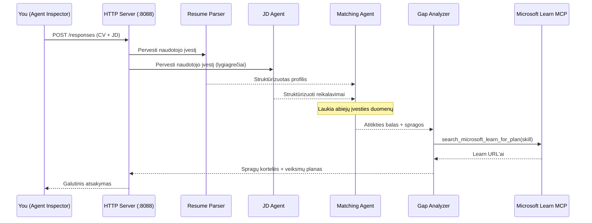
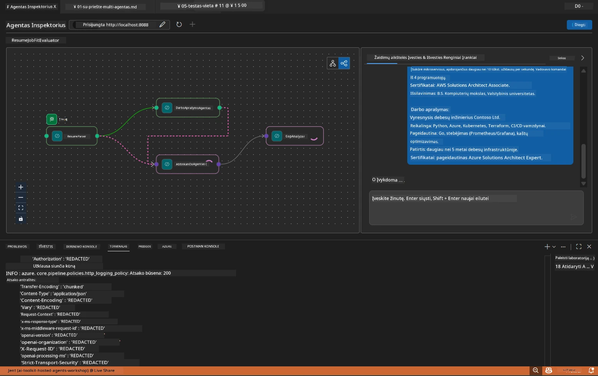

# Modulis 5 - Testavimas lokaliai (daugiagentinis)

Šiame modulyje paleisite daugiagentinį darbo eigą lokalioje aplinkoje, išbandysite ją su Agent Inspector ir patikrinsite, ar visi keturi agentai bei MCP įrankis veikia tinkamai prieš diegiant į Foundry.

### Kas vyksta lokalaus testavimo metu


---

## 1 žingsnis: Paleiskite agentų serverį

### A variantas: Naudojant VS Code užduotį (rekomenduojama)

1. Paspauskite `Ctrl+Shift+P` → įveskite **Tasks: Run Task** → pasirinkite **Run Lab02 HTTP Server**.
2. Užduotis paleidžia serverį su debugpy prijungtu prie prievado `5679` ir agentą prievade `8088`.
3. Palaukite, kol bus parodytas išėjimas:

```
INFO:resume-job-fit:Starting Resume -> Job Fit Evaluator HTTP server...
INFO:resume-job-fit:Server running on http://localhost:8088
```

### B variantas: Naudojant terminalą rankiniu būdu

```powershell
cd workshop\lab02-multi-agent\PersonalCareerCopilot
```

Aktyvuokite virtualią aplinką:

**PowerShell (Windows):**
```powershell
.\.venv\Scripts\Activate.ps1
```

**macOS/Linux:**
```bash
source .venv/bin/activate
```

Paleiskite serverį:

```powershell
python -m debugpy --listen 127.0.0.1:5679 -m agentdev run main.py --verbose --port 8088
```

### C variantas: Naudojant F5 (derinimo režimas)

1. Paspauskite `F5` arba eikite į **Run and Debug** (`Ctrl+Shift+D`).
2. Iš išskleidžiamo meniu pasirinkite **Lab02 - Multi-Agent** paleidimo konfigūraciją.
3. Serveris paleidžiamas su pilna pertraukimo taškų palaikymu.

> **Patarimas:** Derinimo režimas leidžia nustatyti pertraukimo taškus funkcijoje `search_microsoft_learn_for_plan()` MCP atsakymams tikrinti arba agentų instrukcijų eilutėse, kad matytumėte, ką gauna kiekvienas agentas.

---

## 2 žingsnis: Atidarykite Agent Inspector

1. Paspauskite `Ctrl+Shift+P` → įveskite **Foundry Toolkit: Open Agent Inspector**.
2. Agent Inspector atsidarys naršyklės lange adresu `http://localhost:5679`.
3. Turėtumėte matyti agentų sąsają, pasiruošusią priimti žinutes.

> **Jei Agent Inspector neatidaro:** Įsitikinkite, kad serveris visiškai paleistas (matote įrašą "Server running"). Jei prievadas 5679 užimtas, žr. [Modulis 8 - Klausimų sprendimas](08-troubleshooting.md).

---

## 3 žingsnis: Paleiskite paprastus testus

Vykdykite šiuos tris testus iš eilės. Kiekvienas testas tikrina vis didesnę darbo eigos dalį.

### Testas 1: Paprastas CV ir darbo aprašymas

Įklijuokite šį tekstą į Agent Inspector:

```
Resume:
Jane Doe
Senior Software Engineer with 5 years of experience in Python, Django, and AWS.
Built microservices handling 10K+ requests/second. Led a team of 4 developers.
Certifications: AWS Solutions Architect Associate.
Education: B.S. Computer Science, State University.

Job Description:
Senior Cloud Engineer at Contoso Ltd.
Required: Python, Azure, Kubernetes, Terraform, CI/CD pipelines.
Preferred: Go, monitoring (Prometheus/Grafana), cost optimization.
Experience: 5+ years in cloud infrastructure.
Certifications: Azure Solutions Architect Expert preferred.
```

**Tikėtina išvesties struktūra:**

Atsakymas turėtų turėti visų keturių agentų išėjimus paeiliui:

1. **Resume Parser išvestis** - Struktūrizuotas kandidato profilis su įgūdžiais, sugrupuotais pagal kategorijas
2. **JD Agent išvestis** - Struktūrizuoti reikalavimai, atskirti būtini ir pageidaujami įgūdžiai
3. **Matching Agent išvestis** - Atitikties balas (0-100) su detalizavimu, suderinti įgūdžiai, trūkstami įgūdžiai, spragos
4. **Gap Analyzer išvestis** - Atskirų spragų kortelės kiekvienam trūkstamam įgūdžiui, su Microsoft Learn nuorodomis



### Ką patikrinti Teste 1

| Patikrinimas | Tikėtina | Sėkmingai? |
|--------------|----------|------------|
| Atsakyme yra atitikties balas | Skaičius nuo 0 iki 100 su detalizavimu | |
| Išvardinti suderinti įgūdžiai | Python, CI/CD (dalinis), ir pan. | |
| Išvardinti trūkstami įgūdžiai | Azure, Kubernetes, Terraform ir pan. | |
| Kiekvienam trūkstamam įgūdžiui yra spragų kortelė | Po vieną kortelę | |
| Microsoft Learn nuorodos yra | Tikros `learn.microsoft.com` nuorodos | |
| Atsakyme nėra klaidų pranešimų | Švarus, struktūrizuotas išėjimas | |

### Testas 2: Patikrinkite MCP įrankio vykdymą

Vykstant Testui 1, patikrinkite **serverio terminalą** MCP įrašams:

```
GET https://learn.microsoft.com/api/mcp → 405 (Method Not Allowed)
POST https://learn.microsoft.com/api/mcp → 200
DELETE https://learn.microsoft.com/api/mcp → 405 (Method Not Allowed)
```

| Įrašo tipas | Reikšmė | Tikėtina? |
|-------------|---------|-----------|
| `GET ... → 405` | MCP klientas bando GET paleidimo metu | Taip - normalu |
| `POST ... → 200` | Faktinis įrankio kvietimas į Microsoft Learn MCP serverį | Taip - tai tikras kvietimas |
| `DELETE ... → 405` | MCP klientas bando DELETE uždarymo metu | Taip - normalu |
| `POST ... → 4xx/5xx` | Įrankio kvietimas nepavyko | Ne - žr. [Klausimų sprendimą](08-troubleshooting.md) |

> **Svarbu:** `GET 405` ir `DELETE 405` eilutės yra **normalus elgesys**. Rūpinkitės tik jei `POST` kvietimai grąžina ne 200 statusą.

### Testas 3: Kraštutinumas – aukštos atitikties kandidatas

Įklijuokite CV, kuris labai atitinka darbo aprašymą, kad patikrintumėte, kaip GapAnalyzer apdoroja aukštos atitikties scenarijus:

```
Resume:
Alex Chen
Senior Cloud Engineer with 7 years of experience.
Skills: Python, Azure (AKS, Functions, DevOps), Kubernetes, Terraform, CI/CD (GitHub Actions, Azure Pipelines), Go, Prometheus, Grafana, cost optimization.
Certifications: Azure Solutions Architect Expert, Azure DevOps Engineer Expert.
Led infrastructure migration to Azure for 3 enterprise clients.
Education: M.S. Computer Science, Tech University.

Job Description:
Senior Cloud Engineer at Contoso Ltd.
Required: Python, Azure, Kubernetes, Terraform, CI/CD pipelines.
Preferred: Go, monitoring (Prometheus/Grafana), cost optimization.
Experience: 5+ years in cloud infrastructure.
Certifications: Azure Solutions Architect Expert preferred.
```

**Tikėtinas elgesys:**
- Atitikties balas turėtų būti **80+** (dauguma įgūdžių sutampa)
- Spragų kortelės turėtų skirtis, daugiau dėmesio skirti paruošimui pokalbiui nei baziniam mokymuisi
- GapAnalyzer instrukcijos nurodo: "Jei atitikties balas >= 80, sutelkti dėmesį į paruošimą/pokalbio pasirengimą"

---

## 4 žingsnis: Patikrinkite išvesties pilnumą

Paleidus testus, patikrinkite, ar išvestis atitinka šiuos kriterijus:

### Išvesties struktūros kontrolinis sąrašas

| Sekcija | Agentas | Yra? |
|---------|---------|-------|
| Kandidato profilis | Resume Parser | |
| Techniniai įgūdžiai (sugrupuoti) | Resume Parser | |
| Pareigų apžvalga | JD Agent | |
| Būtini ir pageidaujami įgūdžiai | JD Agent | |
| Atitikties balas su detalizavimu | Matching Agent | |
| Suderinti / trūkstami / daliniai įgūdžiai | Matching Agent | |
| Spragų kortelė kiekvienam trūkstamam įgūdžiui | Gap Analyzer | |
| Microsoft Learn URL spragų kortelėse | Gap Analyzer (MCP) | |
| Mokymosi tvarka (numeruota) | Gap Analyzer | |
| Laiko juostos santrauka | Gap Analyzer | |

### Dažnos problemos šiame etape

| Problema | Priežastis | Sprendimas |
|----------|------------|------------|
| Tik 1 spragų kortelė (kitos nukirstos) | GapAnalyzer instrukcijos neturi CRITICAL bloko | Pridėkite `CRITICAL:` pastraipą į `GAP_ANALYZER_INSTRUCTIONS` - žr. [Modulis 3](03-configure-agents.md) |
| Nėra Microsoft Learn URL | MCP endpoint nepasiekiamas | Patikrinkite interneto ryšį. Įsitikinkite, kad `.env` faile `MICROSOFT_LEARN_MCP_ENDPOINT` yra `https://learn.microsoft.com/api/mcp` |
| Tuščias atsakymas | `PROJECT_ENDPOINT` arba `MODEL_DEPLOYMENT_NAME` nepriskirti | Patikrinkite `.env` reikšmes. Terminale paleiskite `echo $env:PROJECT_ENDPOINT` |
| Atitikties balas lygus 0 arba trūksta | MatchingAgent negavo duomenų iš šaltinių | Patikrinkite, ar `create_workflow()` yra `add_edge(resume_parser, matching_agent)` ir `add_edge(jd_agent, matching_agent)` |
| Agentas paleidžiamas bet tuoj pat užsidaro | Importo klaida arba trūksta priklausomybės | Vėl paleiskite `pip install -r requirements.txt`. Patikrinkite terminalą dėl klaidų |
| `validate_configuration` klaida | Trūksta env kintamųjų | Sukurkite `.env` su `PROJECT_ENDPOINT=<jūsų-endpoint>` ir `MODEL_DEPLOYMENT_NAME=<jūsų-modelis>` |

---

## 5 žingsnis: Išbandykite su savo duomenimis (pasirinktinai)

Pabandykite įklijuoti savo CV ir tikrą darbo aprašymą. Tai padeda patikrinti:

- Agentai apdoroja skirtingus CV formatus (chronologinis, funkcionalus, hibridinis)
- JD Agentas apdoroja skirtingus darbo aprašymo stilius (punktinės formos, pastraipos, struktūruoti)
- MCP įrankis pateikia aktualius išteklius tikriems įgūdžiams
- Spragų kortelės pritaikytos jūsų konkrečiai patirčiai

> **Privatumo pastaba:** Testuojant lokaliai, jūsų duomenys lieka jūsų kompiuteryje ir siunčiami tik į jūsų Azure OpenAI diegimą. Jie nėra loguojami ar saugomi dirbtuvių infrastruktūroje. Galite naudoti pavardes vietoje tikrų vardų, jei norite (pvz., "Jane Doe").

---

### Kontrolinis taškas

- [ ] Serveris sėkmingai paleistas prievade `8088` (loge matyti "Server running")
- [ ] Agent Inspector atidarytas ir prisijungęs prie agento
- [ ] Testas 1: Pilnas atsakymas su atitikties balu, suderintais/trūkstamais įgūdžiais, spragų kortelėmis ir Microsoft Learn nuorodomis
- [ ] Testas 2: MCP loguose matyti `POST ... → 200` (įrankio kvietimai pavyko)
- [ ] Testas 3: Aukštos atitikties kandidatas gauna balą 80+ su rekomendacijomis, orientuotomis į paruošimą
- [ ] Visos spragų kortelės pateiktos (viena kortelė kiekvienam trūkstamam įgūdžiui, nėra nukirsta)
- [ ] Serverio terminale nėra klaidų arba klaidų išrašų

---

**Ankstesnis:** [04 - Orkestracijos modeliai](04-orchestration-patterns.md) · **Kitas:** [06 - Diegimas į Foundry →](06-deploy-to-foundry.md)

---

<!-- CO-OP TRANSLATOR DISCLAIMER START -->
**Atsakomybės apribojimas**:
Šis dokumentas buvo išverstas naudojant dirbtinio intelekto vertimo paslaugą [Co-op Translator](https://github.com/Azure/co-op-translator). Nors siekiame tikslumo, atkreipkite dėmesį, kad automatiniai vertimai gali turėti klaidų arba netikslumų. Pirminis dokumentas gimtąja kalba turėtų būti laikomas autoritetingu šaltiniu. Svarbiai informacijai rekomenduojama naudoti profesionalų žmogaus vertimą. Mes neatsakome už jokius nesusipratimus ar klaidingas interpretacijas, kylančias dėl šio vertimo naudojimo.
<!-- CO-OP TRANSLATOR DISCLAIMER END -->