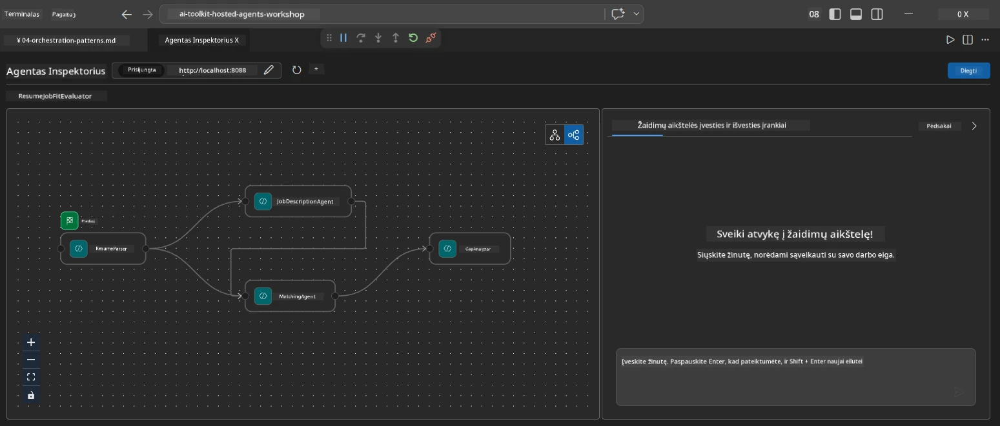
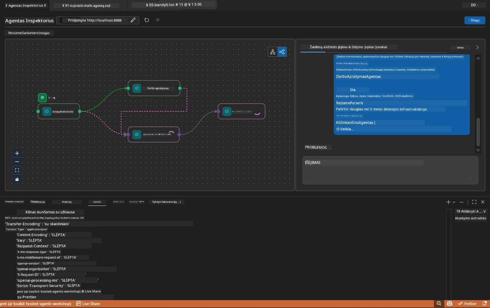
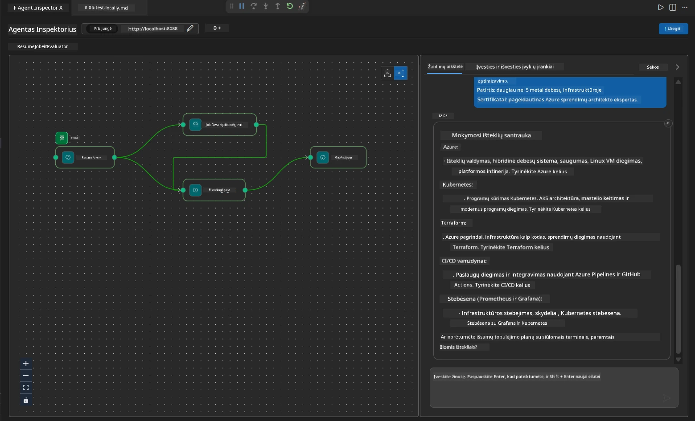

# 5 modulis - bandymas vietoje

⏱️ ~15 min

Šiame modulyje paleidžiate daugelio agentų darbo eigą vietoje, patikrinote ją su Agent Inspector ir įsitikinate, kad visi keturi agentai ir MCP įrankis veikia teisingai prieš diegdami.

---

## 1 veiksmas: Paleiskite agentų serverį

### Parinktis A: naudodami VS Code užduotį (rekomenduojama)

1. Atidarykite `workshop/lab02-multi-agent/PersonalCareerCopilot/` kaip savo VS Code aplanką.
2. Paspauskite `Ctrl+Shift+P` → įveskite **Tasks: Run Task** → pasirinkite **Run Agent HTTP Server**.
3. Užduotis paleidžia serverį su prijungtu debugpy prievade `5679` ir agentu prievade `8088`.
4. Palaukite, kol išvestyje pasirodys:

```
INFO:resume-job-fit:Starting Resume -> Job Fit Evaluator HTTP server...
INFO:resume-job-fit:Server running on http://localhost:8088
```

### Parinktis B: naudojant F5 (derinimo režimas)

1. Paspauskite `F5` → pasirinkite **Debug Local Agent HTTP Server**.
2. Serveris paleidžiamas su pilnu taškų pertraukimu – naudinga MCP atsakymų ar agentų išvesties tikrinimui.

---

## 2 veiksmas: Atidarykite Agent Inspector

1. Paspauskite `Ctrl+Shift+P` → įrašykite **Foundry Toolkit: Open Agent Inspector**.
2. Agent Inspector atsidaro kaip VS Code panelė, sujungta su `http://localhost:8088`.
3. Turėtumėte matyti agento sąsają, pasirengusią priimti žinutes.



> **Jei Agent Inspector neatidaromas:** Įsitikinkite, kad serveris pilnai paleistas (matote „Server running“ žurnalą). Jei prievadas 5679 užimtas, žr. [8 modulis - trikčių šalinimas](08-troubleshooting.md).

---

## 2b veiksmas: (Pasirinktinai) Atidarykite darbo eigos vizualizatorių

Foundry Toolkit turi realaus laiko **Workflow Visualizer**, kuris parodo, kaip agentai bendrauja vykdant grafą. Tai ypač naudinga daugiaagentiniam derinimui.

1. Paspauskite `Ctrl+Shift+P` → įveskite **Foundry Toolkit: Open Visualizer for Hosted Agents**.
2. Atsidaro naujas VS Code skirtukas su vykdomu grafu.
3. Siųsdami žinutes Agent Inspector, vizualizatorius automatiškai atnaujinamas – žalios viršūnės rodo užbaigtus agentus, o animuoti kraštai parodo duomenų srautą tarp jų.

> **Prievado konfliktas:** Jei vizualizatoriaus prievadas jau naudojamas, pakeiskite jį VS Code nustatymuose → **Extensions** → **Microsoft Foundry Configuration** → **Hosted Agents: Visualizer Port**.

---

## 3 veiksmas: Vykdykite pagrindinius testus

Atlikite šiuos tris testus paeiliui. Kiekvienas testuoja vis didesnę darbo eigos dalį.

### 1 testas: Pagrindinis gyvenimo aprašymas + darbo aprašymas

Įklijuokite šį tekstą į Agent Inspector:

```
Resume:
Jane Doe
Senior Software Engineer with 5 years of experience in Python, Django, and AWS.
Built microservices handling 10K+ requests/second. Led a team of 4 developers.
Certifications: AWS Solutions Architect Associate.
Education: B.S. Computer Science, State University.

Job Description:
Senior Cloud Engineer at Contoso Ltd.
Required: Python, Azure, Kubernetes, Terraform, CI/CD pipelines.
Preferred: Go, monitoring (Prometheus/Grafana), cost optimization.
Experience: 5+ years in cloud infrastructure.
Certifications: Azure Solutions Architect Expert preferred.
```

**Tikėtina išvesties struktūra:**

Atsakyme turėtų būti visų keturių agentų išvestis paeiliui:

1. **Gyvenimo aprašymo analizatoriaus išvestis** - Dvi pažymėtos dalys: `[PARSED RESUME]` (kandidato profilis su sugrupuotais įgūdžiais) ir `[JOB DESCRIPTION PASS-THROUGH]` (tiesioginis darbo aprašymo tekstas, perduodamas JD agentui)
2. **JD agento išvestis** - Struktūrizuoti reikalavimai, atskirtos privalomos ir pageidaujamos savybės
3. **Matching agento išvestis** - Atitikimo įvertinimas (0-100) su detalėmis, surasti įgūdžiai, trūkstami įgūdžiai, spragos
4. **Gap Analyzer išvestis** - Atskiros spragų kortelės kiekvienam trūkstamam įgūdžiui, kiekviena su Microsoft Learn nuorodomis





### Ką patikrinti 1 teste

| Patikrinimas | Tikėtina | Atlikta? |
|------------|----------|-----------|
| Atsakyme yra atitikimo įvertinimas | Skaičius nuo 0 iki 100 su detalėmis | |
| Nurodyti surasti įgūdžiai | Python, CI/CD (dalinis), ir kt. | |
| Nurodyti trūkstami įgūdžiai | Azure, Kubernetes, Terraform, ir kt. | |
| Kiekvienam trūkstamam įgūdžiui yra spragų kortelės | Po vieną kortelę kiekvienam įgūdžiui | |
| Yra Microsoft Learn nuorodos | Tikros `learn.microsoft.com` nuorodos | |
| Nėra klaidų atsakyme | Švari struktūrizuota išvestis | |

### 2 testas: Kraštutinis atvejis - aukšto lygio kandidatas

Įklijuokite gyvenimo aprašymą, kuris labai atitinka JD, kad patikrintumėte, kaip GapAnalyzer tvarko aukšto lygio atvejus:

```
Resume:
Alex Chen
Senior Cloud Engineer with 7 years of experience.
Skills: Python, Azure (AKS, Functions, DevOps), Kubernetes, Terraform, CI/CD (GitHub Actions, Azure Pipelines), Go, Prometheus, Grafana, cost optimization.
Certifications: Azure Solutions Architect Expert, Azure DevOps Engineer Expert.
Led infrastructure migration to Azure for 3 enterprise clients.
Education: M.S. Computer Science, Tech University.

Job Description:
Senior Cloud Engineer at Contoso Ltd.
Required: Python, Azure, Kubernetes, Terraform, CI/CD pipelines.
Preferred: Go, monitoring (Prometheus/Grafana), cost optimization.
Experience: 5+ years in cloud infrastructure.
Certifications: Azure Solutions Architect Expert preferred.
```

**Tikėtina elgsena:**
- Atitikimo įvertinimas turėtų būti **80+** (dauguma įgūdžių atitinka)
- Spragų kortelės turėtų būti labiau susitelkusios į tobulinimą/pokalbio pasiruošimą, o ne į pačius pagrindus
- GapAnalyzer instrukcijoje nurodyta: „Jei atitikimas >= 80, dėmesys skiriamas tobulinimui/pokalbio pasiruošimui“

---

## 4 veiksmas: Išbandykite su savo duomenimis (pasirinktinai)

Pabandykite įklijuoti savo gyvenimo aprašymą ir tikrą darbo aprašymą. Tai padės patikrinti:

- Kaip agentai tvarko skirtingus gyvenimo aprašymo formatus (chronologinį, funkcionalų, hibridinį)
- Kaip JD agentas tvarko skirtingus JD stilius (taškų sąrašai, pastraipos, struktūruotas)
- Kad MCP įrankis grąžina aktualius išteklius tikriems įgūdžiams
- Kad spragų kortelės yra personalizuotos pagal jūsų specifinę patirtį

> **Privatumas - Kelias A (Foundry debesis):** Gyvenimo aprašymo ir darbo aprašymo tekstas siunčiamas jūsų Azure OpenAI diegimui apdorojimui. Jo neregistruoja ir nelaiko dirbtuvių infrastruktūra. Jei norite, naudokite vietas laikmenoms (pvz., „Jane Doe“).
>
> **Privatumas - Kelias B (Foundry vietinis):** Visi keturi agentų apdorojimai vykdomi visiškai jūsų įrenginyje. Jūsų gyvenimo aprašymo ir darbo aprašymo tekstas **niekada neišeina iš jūsų mašinos**. Vienintelis išėjimas – MCP įrankio užklausa iš `https://learn.microsoft.com/api/mcp`; užklausoje yra tik įgūdžio pavadinimas, o ne jūsų asmeninė informacija.

---

### Kontrolinis taškas

- [ ] Serveris sėkmingai paleistas prievade `8088` (žurnale matosi „Server running“)
- [ ] Agent Inspector atidarytas ir sujungtas su agentu
- [ ] 1 testas: pilnas atsakymas su atitikimo įvertinimu, surastais/trūkstamais įgūdžiais, spragų kortelėmis ir Microsoft Learn nuorodomis
- [ ] 2 testas: aukšto lygio kandidatas gauna 80+ įvertinimą ir rekomendacijas tobulėjimui
- [ ] Visos spragų kortelės yra (po vieną kiekvienam trūkstamam įgūdžiui, be sutrumpinimų)
- [ ] Nėra klaidų ar „stack trace“ serverio terminale

---

**Ankstesnis:** [04 - Orchestration Patterns](04-orchestration-patterns.md) · **Kitas:** [06 - Deploy to Foundry →](06-deploy-to-foundry.md)

---

<!-- CO-OP TRANSLATOR DISCLAIMER START -->
**Atsakomybės apribojimas**:
Šis dokumentas buvo išverstas naudojant dirbtinio intelekto vertimo paslaugą [Co-op Translator](https://github.com/Azure/co-op-translator). Nors siekiame tikslumo, prašome atkreipti dėmesį, kad automatiniai vertimai gali turėti klaidų ar netikslumų. Originalus dokumentas jo gimtąja kalba laikomas autoritetingu šaltiniu. Svarbiai informacijai rekomenduojama naudoti profesionalų žmogiškąjį vertimą. Mes neatsakome už jokius nesusipratimus ar neteisingą interpretaciją, kilusią naudojantis šiuo vertimu.
<!-- CO-OP TRANSLATOR DISCLAIMER END -->