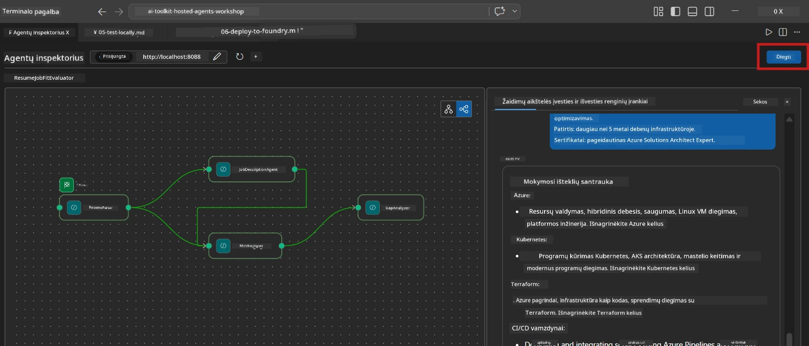
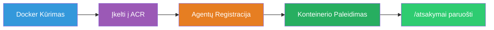
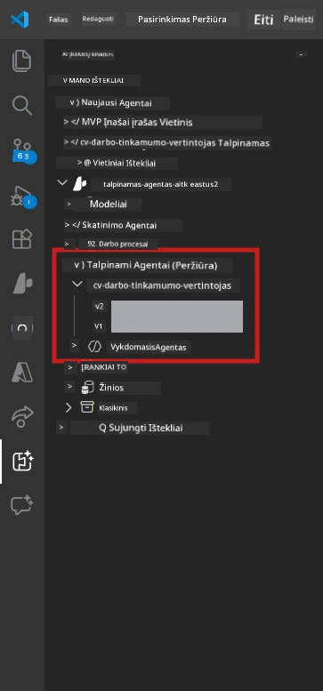

# 6 modulis – Diegimas į Foundry agentų paslaugą

Šiame modulyje diegiate savo vietoje išbandytą kelių agentų darbo eigą į [Microsoft Foundry](https://learn.microsoft.com/azure/foundry/agents/concepts/hosted-agents) kaip **Talpinamą agentą**. Diegimo procesas sukuria Docker konteinerio atvaizdą, įkelia jį į [Azure Container Registry (ACR)](https://learn.microsoft.com/azure/container-registry/container-registry-intro) ir sukuria talpinamo agento versiją [Foundry agentų paslaugoje](https://learn.microsoft.com/azure/foundry/agents/how-to/publish-agent).

> **Pagrindinis skirtumas nuo 01 laboratorijos:** Diegimo procesas yra identiškas. Foundry traktuoja jūsų kelių agentų darbo eigą kaip vieną talpinamą agentą – sudėtingumas yra konteineryje, o diegimo paviršius lieka tas pats `/responses` galinis taškas.

---

## Prieš diegdami patikrinkite

Prieš diegiant, patikrinkite kiekvieną žemiau pateiktą punktą:

1. **Agentas sėkmingai praėjo vietinius pagrindinius testus:**
   - Baigėte visus 3 testus [5 modulyje](05-test-locally.md) ir darbo eiga sugeneravo pilną išvestį su tuščių kortelių ir Microsoft Learn URL.

2. **Jūs turite [Azure AI User](https://learn.microsoft.com/azure/foundry/concepts/rbac-foundry) rolę:**
   - Paskirta [01 laboratorijoje, 2 modulyje](../../lab01-single-agent/docs/02-create-foundry-project.md). Patikrinkite:
   - [Azure portale](https://portal.azure.com) → jūsų Foundry **projekto** išteklius → **Access control (IAM)** → **Role assignments** → patvirtinkite, kad jūsų paskyrai priskirta **[Azure AI User](https://aka.ms/foundry-ext-project-role)** rolė.

3. **Prisijungėte prie Azure VS Code aplinkoje:**
   - Patikrinkite paskyrų piktogramą kairiajame apatiniame VS Code kampe. Jūsų paskyros vardas turi būti matomas.

4. **`agent.yaml` failas turi teisingas reikšmes:**
   - Atidarykite `PersonalCareerCopilot/agent.yaml` ir patikrinkite:
     ```yaml
     environment_variables:
       - name: PROJECT_ENDPOINT
         value: ${PROJECT_ENDPOINT}
       - name: MODEL_DEPLOYMENT_NAME
         value: ${MODEL_DEPLOYMENT_NAME}
     ```
   - Tai turi atitikti aplinkos kintamuosius, kuriuos naudoja jūsų `main.py`.

5. **`requirements.txt` turi teisingas versijas:**
   ```
   agent-framework-azure-ai==1.0.0rc3
   agent-framework-core==1.0.0rc3
   azure-ai-agentserver-agentframework==1.0.0b16
   azure-ai-agentserver-core==1.0.0b16
   debugpy
   agent-dev-cli --pre
   ```

---

## 1 žingsnis: Pradėkite diegimą

### A variantas: Diegimas iš Agent Inspector (rekomenduojama)

Jei agentas veikia per F5 su atidarytu Agent Inspector:

1. Pažvelkite į **viršutinį dešinį** Agent Inspector skydelio kampą.
2. Paspauskite mygtuką **Deploy** (debesies piktograma su rodykle ↑).
3. Atsidarys diegimo vedlys.



### B variantas: Diegimas per komandų paletę

1. Paspauskite `Ctrl+Shift+P`, kad atidarytumėte **Command Palette**.
2. Įveskite: **Microsoft Foundry: Deploy Hosted Agent** ir pasirinkite šią komandą.
3. Atsidarys diegimo vedlys.

---

## 2 žingsnis: Konfigūruokite diegimą

### 2.1 Pasirinkite tikslinį projektą

1. Išskleidžiamajame sąraše bus matomi jūsų Foundry projektai.
2. Pasirinkite projektą, kurį naudojote viso seminaro metu (pvz., `workshop-agents`).

### 2.2 Pasirinkite konteinerio agento failą

1. Bus paprašyta pasirinkti agento įėjimo tašką.
2. Nueikite į `workshop/lab02-multi-agent/PersonalCareerCopilot/` ir pasirinkite **`main.py`**.

### 2.3 Konfigūruokite išteklius

| Nustatymas | Rekomenduojama reikšmė | Pastabos |
|------------|------------------------|----------|
| **CPU** | `0.25` | Numatytoji. Kelių agentų darbo eigoms nereikia daugiau CPU, nes modelio užklausos yra I/O ribotos |
| **Atmintis** | `0.5Gi` | Numatytoji. Padidinkite iki `1Gi`, jei pridedate didelės apimties apdorojimo įrankius |

---

## 3 žingsnis: Patvirtinkite ir diegkite

1. Vedlyje bus rodoma diegimo santrauka.
2. Peržiūrėkite ir spustelėkite **Confirm and Deploy**.
3. Stebėkite eigą VS Code.

### Kas vyksta diegimo metu

Stebėkite VS Code **Output** skydelį (pasirinkite "Microsoft Foundry" išskleidžiamajame meniu):


1. **Docker build** – Sukuriamas konteineris iš jūsų `Dockerfile`:
   ```
   Step 1/6 : FROM python:3.14-slim
   Step 2/6 : WORKDIR /app
   ...
   Successfully built abc123def456
   ```

2. **Docker push** – Atvaizdas įkeliamas į ACR (pirmą kartą diegiant trunka 1–3 minutes).

3. **Agentų registracija** – Foundry sukuria talpinamą agentą naudodamas `agent.yaml` metaduomenis. Agentas įvardijamas kaip `resume-job-fit-evaluator`.

4. **Konteinerio paleidimas** – Konteineris paleidžiamas Foundry valdomoje infrastruktūroje su sistema valdomu identitetu.

> **Pirmas diegimas yra lėtesnis** (Docker kelia visas sluoksnius). Tolimesni diegimai naudoja talpykloje esančius sluoksnius ir vyksta greičiau.

### Pastabos, specifinės kelių agentų diegimui

- **Visi keturi agentai yra viename konteineryje.** Foundry traktuoja tai kaip vieną talpinamą agentą. WorkflowBuilder grafas veikia viduje.
- **MCP užklausos eina į išorę.** Konteineriui reikalingas interneto ryšys pasiekti `https://learn.microsoft.com/api/mcp`. Foundry valdyta infrastruktūra tai užtikrina pagal nutylėjimą.
- **[Valdomas identitetas](https://learn.microsoft.com/python/api/overview/azure/identity-readme#managed-identity-support).** Talpinamoje aplinkoje `get_credential()` `main.py` grąžina `ManagedIdentityCredential()` (nes yra nustatytas `MSI_ENDPOINT`). Tai vyksta automatiškai.

---

## 4 žingsnis: Patikrinkite diegimo būseną

1. Atidarykite **Microsoft Foundry** šoninę juostą (paspauskite Foundry ikoną veiklų juostoje).
2. Išplėskite po savo projektu esantį **Hosted Agents (Preview)**.
3. Suraskite **resume-job-fit-evaluator** (arba savo agento pavadinimą).
4. Spustelėkite agento pavadinimą → išplėskite versijas (pvz., `v1`).
5. Paspauskite versiją → patikrinkite **Container Details** → **Statusą**:



| Būsena | Reikšmė |
|--------|----------|
| **Started** / **Running** | Konteineris veikia, agentas pasirengęs |
| **Pending** | Konteineris paleidžiamas (palaukite 30–60 sekundžių) |
| **Failed** | Konteineris nepavyko paleisti (patikrinkite žurnalus – žemiau pateikta) |

> **Kelių agentų paleidimas užtrunka ilgiau**, nei vieno agento, nes konteineryje sukuriamos 4 agentų instancijos paleidimo metu. "Pending" būsena iki 2 minučių yra normalu.

---

## Dažniausios diegimo klaidos ir sprendimai

### Klaida 1: Leidimas uždraustas – `agents/write`

```
Error: lacks the required data action 
Microsoft.CognitiveServices/accounts/AIServices/agents/write
```

**Sprendimas:** Paskirkite **[Azure AI User](https://learn.microsoft.com/azure/foundry/concepts/rbac-foundry)** rolę **projekto** lygyje. Žr. [8 modulį – trikčių šalinimas](08-troubleshooting.md) su išsamiais nurodymais.

### Klaida 2: Docker neveikia

```
Error: Docker build failed / Cannot connect to Docker daemon
```

**Sprendimas:**
1. Paleiskite Docker Desktop.
2. Palaukite, kol bus rodoma „Docker Desktop is running“.
3. Patikrinkite komandą: `docker info`
4. **Windows:** Įsitikinkite, kad Docker Desktop nustatymuose įjungta WSL 2 backend.
5. Bandykite dar kartą.

### Klaida 3: pip install nepavyksta Docker build metu

```
Error: Could not find a version that satisfies the requirement agent-dev-cli
```

**Sprendimas:** `--pre` flagas `requirements.txt` apdorojamas kitaip Docker kontekste. Įsitikinkite, kad jūsų `requirements.txt` atrodo taip:
```
agent-dev-cli --pre
```

Jei Docker vis dar nepavyksta, sukurkite `pip.conf` arba perduokite `--pre` per build argumentą. Žr. [8 modulį](08-troubleshooting.md).

### Klaida 4: MCP įrankis nepavyksta talpinamame agente

Jei Gap Analyzer nustoja generuoti Microsoft Learn URL po diegimo:

**Pagrindinė priežastis:** Tinklo politika gali blokuoti išėjimą HTTPS iš konteinerio.

**Sprendimas:**
1. Dažniausiai tai nėra problema Foundry numatytos konfigūracijos atveju.
2. Jei tai nutinka, patikrinkite, ar Foundry projekto virtualus tinklas turi NSG, blokuojantį išėjimą HTTPS.
3. MCP įrankis turi įmontuotus atsarginio URL mechanizmus, todėl agentas vis tiek gamins išvestį (be aktyvių nuorodų).

---

### Patikros sąrašas

- [ ] Diegimo komanda VS Code įvykdyta be klaidų
- [ ] Agentas matomas po **Hosted Agents (Preview)** Foundry šoninėje juostoje
- [ ] Agento pavadinimas yra `resume-job-fit-evaluator` (ar pasirinktas pavadinimas)
- [ ] Konteinerio būsena rodo **Started** arba **Running**
- [ ] (Jei yra klaidų) Identifikavote klaidą, pritaikėte pataisymą ir sėkmingai persikėlėte

---

**Ankstesnis:** [05 – Testavimas vietoje](05-test-locally.md) · **Toliau:** [07 – Patikrinimas žaidimų aikštelėje →](07-verify-in-playground.md)

---

<!-- CO-OP TRANSLATOR DISCLAIMER START -->
**Atsakomybės atsisakymas**:
Šis dokumentas buvo išverstas naudojant dirbtinio intelekto vertimo paslaugą [Co-op Translator](https://github.com/Azure/co-op-translator). Nors siekiame tikslumo, atkreipkite dėmesį, kad automatizuoti vertimai gali turėti klaidų arba netikslumų. Originalus dokumentas gimtąja kalba turėtų būti laikomas autoritetingu šaltiniu. Svarbiai informacijai rekomenduojamas profesionalus žmogaus vertimas. Mes neprisiimame atsakomybės už bet kokius nesusipratimus ar klaidingus aiškinimus, kylančius dėl šio vertimo naudojimo.
<!-- CO-OP TRANSLATOR DISCLAIMER END -->