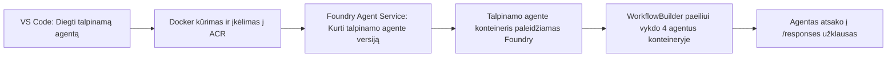
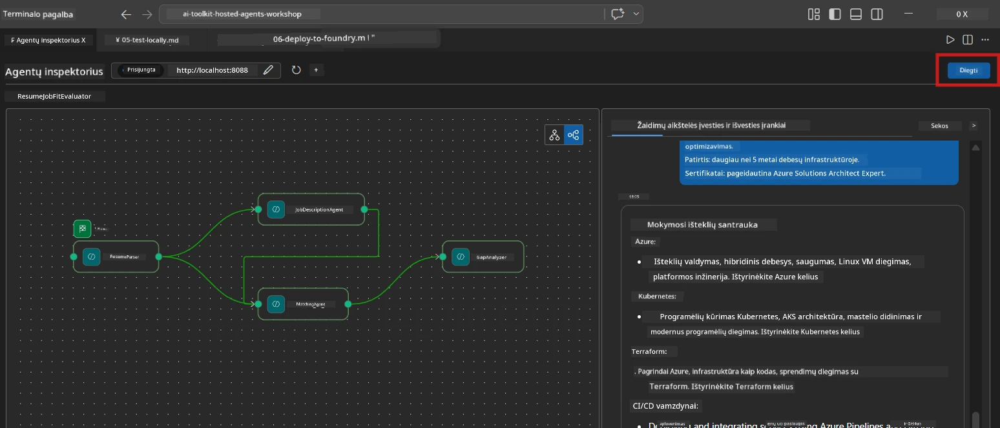
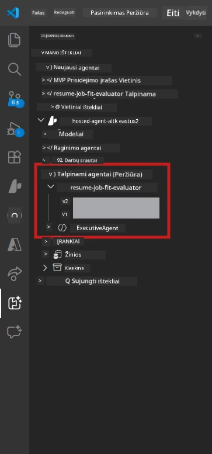

# 6 modulis – Diegimas į Foundry agentų paslaugą

⏱️ ~10 min

Šiame modulyje savo lokaliai išbandytą daugiaagentį darbo eigą diegiate į [Microsoft Foundry](https://learn.microsoft.com/azure/foundry/agents/concepts/hosted-agents) kaip **priglobtą agentą**. Diegimo procesas sukuria Docker konteinerio atvaizdą, įkelia jį į [Azure Container Registry (ACR)](https://learn.microsoft.com/azure/container-registry/container-registry-intro) ir sukuria priglobto agente versiją [Foundry agentų paslaugoje](https://learn.microsoft.com/azure/foundry/agents/how-to/publish-agent).

> **Svarbus skirtumas nuo 1 laboratorijos:** Diegimo procesas yra identiškas. Foundry traktuoją jūsų daugiaagentę darbo eigą kaip vieną priglobtą agentą – sudėtingumas yra konteineryje, bet diegimo paviršius yra tas pats `/responses` galinis taškas.

### Diegimo pipeline


```mermaid
flowchart LR
    A[VS Code: Diegti talpinamą agentą] --> B[Docker kūrimas ir įkėlimas į ACR]
    B --> C[Foundry Agent Service: Kurti talpinamo agente versiją]
    C --> D[Talpinamo agente konteineris paleidžiamas Foundry]
    D --> E[WorkflowBuilder paeiliui vykdo 4 agentus konteineryje]
    E --> F[Agentas atsako į /responses užklausas]
```

---

## Reikalavimų patikrinimas

Prieš diegdami, įsitikinkite, kad viskas žemiau yra įvykdyta:

1. **Agentas praeina lokalius greituosius testus:**
   - Jūs baigėte visus 3 testus [5 modulyje](05-test-locally.md) ir darbo eiga pateikė pilną išvestį su trūkumų kortelėmis ir Microsoft Learn URL.

2. **Jūs turite [Foundry vartotojo](https://learn.microsoft.com/azure/foundry/concepts/rbac-foundry) rolę** (diegiant reikia bent **Foundry projekto vadovo** rolės projekto lygmenyje):

   > **Pastaba:** Foundry RBAC vaidmenys neseniai buvo pervadinti – **Foundry vartotojas**, **Foundry savininkas** ir **Foundry projekto vadovas** anksčiau buvo Azure AI vartotojas, Azure AI savininkas ir Azure AI projekto vadovas. Vaidmenų ID ir leidimai nepasikeitė.

   - Patikrinkite [Azure portale](https://portal.azure.com) → jūsų Foundry **projekto** išteklį → **Priėjimo valdymas (IAM)** → **Vaidmenų priskyrimai** → patvirtinkite, kad jūsų paskyrai priskirtas **Foundry vartotojo** (ar aukštesnis) vaidmuo.

3. **Esate prisijungęs prie Azure per VS Code:**
   - Patikrinkite paskyrų ikoną apatiniame kairiajame VS Code kampe. Turėtumėte matyti savo paskyros vardą.

4. **`agent.yaml` turi tinkamas reikšmes:**
   - Atidarykite `PersonalCareerCopilot/agent.yaml` ir patikrinkite:
     ```yaml
     environment_variables:
       - name: AZURE_AI_MODEL_DEPLOYMENT_NAME
         value: ${AZURE_AI_MODEL_DEPLOYMENT_NAME}
     ```
   - `FOUNDRY_PROJECT_ENDPOINT` **nėra** čia nurodytas – Foundry jį įtraukia vykdymo metu. Reikia deklaruoti tik `AZURE_AI_MODEL_DEPLOYMENT_NAME`.

5. **`requirements.txt` turi tinkamas versijas:**
   ```
   agent-framework-foundry
   agent-framework-foundry-hosting
   mcp<2,>=1.24.0
   debugpy
   ```

---

## 1 žingsnis: Pradėkite diegimą

### A parinktis: Diegimas iš Agent Inspector (rekomenduojama)

Jei agentas vyksta per F5 su atidarytu Agent Inspector:

1. Pažvelkite į **viršutinį dešinį kampą** Agent Inspector skydelyje.
2. Spauskite **Deploy** mygtuką (debesis su rodykle ↑ į viršų).
3. Atsidaro diegimo vedlys.



### B parinktis: Diegimas per komandų paletę

1. Paspauskite `Ctrl+Shift+P`, kad atidarytumėte **Command Palette**.
2. Įveskite: **Foundry Toolkit: Deploy Hosted Agent** ir pasirinkite.
3. Atsidaro diegimo vedlys.

---

## 2 žingsnis: Konfigūruoti diegimą

### 2.1 Pasirinkite tikslinį projektą

1. Išskleidžiamajame meniu matysite savo Foundry projektus.
2. Pasirinkite projektą, kurį naudojote viso seminaro metu (pvz., `workshop-agents`).

### 2.2 Pasirinkite konteinerio agento failą

1. Būsite paprašyti pasirinkti agento įėjimo tašką.
2. Naršykite iki `workshop/lab02-multi-agent/PersonalCareerCopilot/` ir pasirinkite **`main.py`**.

### 2.3 Konfigūruokite išteklius

| Nustatymas | Rekomenduojama reikšmė | Pastabos |
|---------|------------------|-------|
| **Diegimo metodas** | **Konteineris** (rekomenduojamas) arba **Kodas** | Konteineris sukuria Docker atvaizdą; Kodas įkelia šaltinį kaip ZIP (peržiūra) |
| **Konteinerių registras** | **Numatytasis ACR** | Foundry sukuria ir valdo jį už jus |
| **CPU** | `0.25` | Numatytasis. Daugiaagentės darbo eigos nereikalauja daugiau CPU, nes modelio kvietimai yra I/O riboti |
| **Atmintis** | `0.5Gi` | Numatytasis. Padidinkite iki `1Gi`, jei pridedate sunkių duomenų apdorojimo įrankių |

---

## 3 žingsnis: Patvirtinimas ir diegimas

1. Vedlys rodo diegimo santrauką.
2. Peržiūrėkite ir spauskite **Confirm and Deploy**.
3. Stebėkite eigą VS Code.

### Kas vyksta diegimo metu

Stebėkite VS Code **Output** skydelį (pasirinkite "Microsoft Foundry" išskleidžiamajame sąraše):

1. **Docker komanda build** – sukuria konteinerį iš jūsų `Dockerfile`
   ```
   Step 1/6 : FROM python:3.12-slim
   Step 2/6 : WORKDIR /app
   ...
   Successfully built abc123def456
   ```

2. **Docker push** – įkelia atvaizdą į ACR (pirmą kartą diegiant 1–3 minutės).

3. **Agentų registracija** – Foundry sukuria priglobtą agentą naudodama `agent.yaml` metaduomenis. Agento vardas yra `resume-job-fit-evaluator`.

4. **Konteinerio paleidimas** – konteineris paleidžiamas Foundry valdomoje infrastruktūroje su sistemos valdoma tapatybe.

> **Pirmas diegimas yra lėtesnis** (Docker įkelia visas sluoksnius). Vėlesni diegimai naudoja kešuotus sluoksnius ir vyksta greičiau.

### Pastabos apie daugiaagentę specifiką

- **Visi keturi agentai yra viename konteineryje.** Foundry mato vieną priglobtą agentą. WorkflowBuilder grafas vykdomas viduje.
- **MCP kvietimai eina į išorę.** Konteineris turi turėti interneto prieigą prie `https://learn.microsoft.com/api/mcp`. Foundry valdomoji infrastruktūra tai suteikia pagal numatytuosius nustatymus.
- **[Valdoma tapatybė](https://learn.microsoft.com/azure/foundry/agents/concepts/agent-identity).** Foundry automatiškai sukuria **dedikuotą kiekvienam agentui Entra tapatybę** kiekvienam priglobtam agentui diegimo metu. Priglobtoje aplinkoje, `DefaultAzureCredential` automatiškai sprendžia šią agento tapatybę – rankinis valdytos tapatybės konfigūravimas nereikalingas.

---

## 4 žingsnis: Patikrinkite diegimo būseną

1. Atidarykite **Microsoft Foundry** šoninę juostą (paspauskite Foundry piktogramą veiklų juostoje).
2. Išplėskite **Hosted Agents (Preview)** po jūsų projektu.
3. Suraskite **resume-job-fit-evaluator** (ar jūsų agento pavadinimą).
4. Spustelėkite ant agento vardo → išplėskite versijas (pvz., `v1`).
5. Spustelėkite versiją → peržiūrėkite **Container Details** → **Status**:



| Būsena | Reikšmė |
|--------|---------|
| **active** | Agentas veikia ir yra pasiruošęs priimti užklausas |
| **creating** | Konteineris paleidžiamas (laukti 30–60 sekundžių) |
| **failed** | Konteinerio paleidimas nepavyko (peržiūrėkite žurnalus – žr. žemiau) |

> **Pastaba:** VS Code šoninė juosta gali rodyti etiketes kaip "Running" arba "Started", nors API būsenos žymi `active`/`creating`. Abi nurodo tą patį būseną.

> **Daugiaagentis paleidimas užtrunka ilgiau** nei vieno agente, nes konteineris paleidimo metu sukuria 4 agentų egzempliorius. `creating` iki 2 minučių yra normalu.

---

## Dažnos diegimo klaidos ir sprendimai

### Klaida 1: Leidimas atmestas - `agents/write`

```
Error: lacks the required data action 
Microsoft.CognitiveServices/accounts/AIServices/agents/write
```

**Sprendimas:** Priskirkite **[Foundry vartotojo](https://learn.microsoft.com/azure/foundry/concepts/rbac-foundry)** rolę (ankstesnis pavadinimas **Azure AI User**) projekto lygiu. Žr. [8 modulį – trikčių šalinimas](08-troubleshooting.md) žingsnis po žingsnio instrukcijoms.

### Klaida 2: Docker neveikia

```
Error: Docker build failed / Cannot connect to Docker daemon
```

**Sprendimas:**
1. Paleiskite Docker Desktop.
2. Palaukite, kol pasirodys "Docker Desktop is running".
3. Patikrinkite: `docker info`
4. **Windows:** Įsitikinkite, kad Docker Desktop nustatymuose įjungtas WSL 2 backend.
5. Bandykite dar kartą.

### Klaida 3: pip įdiegimas nepavyksta Docker build metu

```
Error: Could not find a version that satisfies the requirement agent-framework-foundry
```

**Sprendimas:** Patikrinkite, ar `requirements.txt` atitinka:
```
agent-framework-foundry
agent-framework-foundry-hosting
mcp<2,>=1.24.0
debugpy
```

Jei build vis dar nepavyksta, jūsų Docker tinklas gali blokuoti PyPI. Patikrinkite `docker info` dėl proxy nustatymų.

### Klaida 4: MCP įrankis nepavyksta priglobtame agente

Jei Gap Analyzer nustoja generuoti Microsoft Learn URL po diegimo:

**Pagrindinė priežastis:** Tinklo politika gali blokuoti išeinančius HTTPS prašymus iš konteinerio.

**Sprendimas:**
1. Paprastai tai nėra problema Foundry numatytajame konfigūracijoje.
2. Jei taip nutinka, patikrinkite, ar Foundry projekto virtualus tinklas neturi NSG, kuris blokuoja išeinančius HTTPS ryšius.
3. MCP įrankis turi įmontuotas atsargines URL, todėl agentas vis tiek gamins išvestį (be gyvų URL).

---

### Patikros punktas

- [ ] Diegimo komanda VS Code buvo įvykdyta be klaidų
- [ ] Agentas matomas po **Hosted Agents (Preview)** Foundry šoninėje juostoje
- [ ] Agento vardas yra `resume-job-fit-evaluator` (ar jūsų pasirinktas vardas)
- [ ] Konteinerio būsena rodo **Started** arba **Running**
- [ ] (Jei buvo klaidų) Jūs identifikavote klaidą, pritaikėte sprendimą ir sėkmingai perdiegėte

---

**Ankstesnis:** [05 - Testavimas lokaliai](05-test-locally.md) · **Kitas:** [07 - Patikrinkite Playground →](07-verify-in-playground.md)

---

<!-- CO-OP TRANSLATOR DISCLAIMER START -->
**Atsakomybės apribojimas**:
Šis dokumentas buvo išverstas naudojant dirbtinio intelekto vertimo paslaugą [Co-op Translator](https://github.com/Azure/co-op-translator). Nors siekiame tikslumo, prašome atkreipti dėmesį, kad automatiniai vertimai gali turėti klaidų ar netikslumų. Originalus dokumentas jo gimtąja kalba laikomas autoritetingu šaltiniu. Svarbiai informacijai rekomenduojama naudoti profesionalų žmogiškąjį vertimą. Mes neatsakome už jokius nesusipratimus ar neteisingą interpretaciją, kilusią naudojantis šiuo vertimu.
<!-- CO-OP TRANSLATOR DISCLAIMER END -->