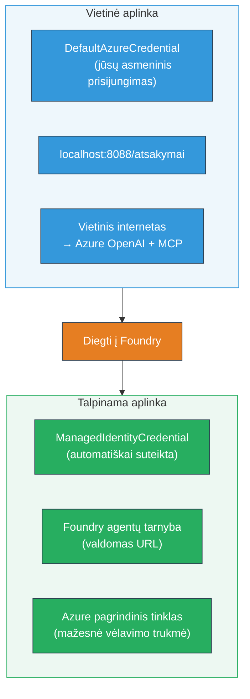

# Modulis 7 - Tikrinimas žaiskloje

Šiame modulyje išbandysite savo išdiegtą kelių agentų darbo eigą tiek **VS Code**, tiek **[Foundry portalą](https://ai.azure.com)**, patvirtindami, kad agentas elgiasi taip pat kaip lokaliai testuojant.

---

## Kodėl tikrinti po diegimo?

Jūsų kelių agentų darbo eiga vietoje veikė puikiai, tai kodėl testuoti dar kartą? Talpinama aplinka skiriasi keliais aspektais:


| Skirtumas | Lokaliai | Talpinama |
|-----------|----------|-----------|
| **Tapatybė** | [`DefaultAzureCredential`](https://learn.microsoft.com/azure/developer/python/sdk/authentication/credential-chains#defaultazurecredential-overview) (jūsų asmeninis prisijungimas) | [`ManagedIdentityCredential`](https://learn.microsoft.com/python/api/overview/azure/identity-readme#managed-identity-support) (automatiškai suteikiama) |
| **Galinis taškas** | `http://localhost:8088/responses` | [Foundry agentų tarnybos](https://learn.microsoft.com/azure/foundry/agents/concepts/hosted-agents) galinis taškas (valdomas URL) |
| **Tinklas** | Vietinis kompiuteris → Azure OpenAI + MCP išėjimas | Azure tinklas (mažesnis delsas tarp tarnybų) |
| **MCP ryšys** | Vietinis internetas → `learn.microsoft.com/api/mcp` | Konteinerio išėjimas → `learn.microsoft.com/api/mcp` |

Jei bet kuris aplinkos kintamasis neteisingai sukonfigūruotas, RBAC skiriasi arba MCP išėjimas yra užblokuotas, čia tai pastebėsite.

---

## A variantas: Testuoti VS Code žaiskloje (pirmiausia rekomenduojama)

[Foundry plėtinys](https://marketplace.visualstudio.com/items?itemName=TeamsDevApp.vscode-ai-foundry) turi integruotą žaisklą, kuris leidžia bendrauti su išdiegtu agentu neišeinant iš VS Code.

### 1 žingsnis: Eikite į savo talpinamą agentą

1. Paspauskite **Microsoft Foundry** piktogramą VS Code **Veiklos juostoje** (kairėje šoninėje juostoje), kad atidarytumėte Foundry panelę.
2. Išskleiskite savo prijungtą projektą (pvz., `workshop-agents`).
3. Išskleiskite **Hosted Agents (Preview)**.
4. Turėtumėte matyti savo agento pavadinimą (pvz., `resume-job-fit-evaluator`).

### 2 žingsnis: Pasirinkite versiją

1. Paspauskite ant agento pavadinimo, kad išskleistumėte jo versijas.
2. Paspauskite ant išdiegtos versijos (pvz., `v1`).
3. Atsidarys **išsamumo panelė** su konteinerio detalėmis.
4. Patikrinkite, ar būsena yra **Started** arba **Running**.

### 3 žingsnis: Atidarykite žaisklą

1. Išsamumo panelėje paspauskite mygtuką **Playground** (arba dešiniuoju pelės mygtuku spustelėkite versiją → **Open in Playground**).
2. Atsidarys pokalbių sąsaja VS Code skirtuke.

### 4 žingsnis: Vykdykite savo juodųjų dėmių testus

Naudokite tuos pačius 3 testus iš [Modulo 5](05-test-locally.md). Įveskite kiekvieną žinutę žaisklo įvesties lauke ir paspauskite **Send** (arba **Enter**).

#### Testas 1 – Pilnas gyvenimo aprašymas + JD (standartinis srautas)

Įklijuokite pilną gyvenimo aprašymą + JD užklausą iš Modulis 5, Testas 1 (Jane Doe + Vyresnysis debesijos inžinierius Contoso Ltd).

**Laukiama:**
- Fit balas su detalizacija (100 balų skalėje)
- Atitikimo įgūdžių skyrius
- Trūkstamų įgūdžių skyrius
- **Vienas trūkumo kortelė kiekvienam trūkstamam įgūdžiui** su Microsoft Learn URL
- Mokymosi kelias su laikotarpiu

#### Testas 2 – Greitas trumpas testas (minimalus įvestis)

```
RESUME: 3 years Python developer, knows Django and PostgreSQL, no cloud experience.

JOB: Cloud DevOps Engineer requiring AWS, Kubernetes, Terraform, CI/CD. 5 years needed.
```

**Laukiama:**
- Žemesnis fit balas (< 40)
- Sąžininga įvertinimo su etapiniu mokymosi keliu
- Kelios trūkumo kortelės (AWS, Kubernetes, Terraform, CI/CD, patirties trūkumas)

#### Testas 3 – Aukšto lygio kandidatas

```
RESUME:
10 years Azure Cloud Architect. AZ-305 certified. Expert in AKS, Terraform, Azure DevOps, 
Azure Functions, Helm, Prometheus, Grafana, Python, Go. Led platform team of 8.

JOB:
Senior Cloud Engineer. Required: AKS, Terraform, Azure DevOps, Python. Preferred: Helm, Go.
5+ years experience. AZ-305 preferred.
```

**Laukiama:**
- Aukštas fit balas (≥ 80)
- Dėmesys interviu pasirengimui ir tobulinimui
- Nedaug arba be trūkumo kortelių
- Trumpas laikotarpis pasiruošimui

### 5 žingsnis: Palyginkite su vietiniais rezultatais

Atidarykite savo užrašus arba naršyklės skirtuką iš Modulis 5, kuriame išsaugojote vietines atsakymus. Kiekvienam testui:

- Ar atsakymas turi **tą pačią struktūrą** (fit balas, trūkumo kortelės, kelias)?
- Ar jis naudoja **tą pačią balinimo skalę** (100 balų detalizacija)?
- Ar trūkumo kortelėse vis dar yra **Microsoft Learn URL**?
- Ar yra **viena trūkumo kortelė kiekvienam trūkstamam įgūdžiui** (neapkarpyta)?

> **Nedideli žodžių skirtumai yra normalūs** – modelis yra nedeterministinis. Sutelkkite dėmesį į struktūrą, balinimo nuoseklumą ir MCP įrankio panaudojimą.

---

## B variantas: Testuoti Foundry portale

[Foundry portalas](https://ai.azure.com) suteikia internetinį žaisklą, naudingą dalinantis su komandos nariais ar suinteresuotosiomis šalimis.

### 1 žingsnis: Atidarykite Foundry portalą

1. Atidarykite naršyklę ir eikite į [https://ai.azure.com](https://ai.azure.com).
2. Prisijunkite su tuo pačiu Azure paskyra, kuria naudojotės per visą dirbtuves.

### 2 žingsnis: Eikite į savo projektą

1. Pagrindiniame puslapyje pažiūrėkite į **Naujausi projektai** kairėje šoninėje juostoje.
2. Paspauskite savo projekto pavadinimą (pvz., `workshop-agents`).
3. Jei nematote, spustelėkite **Visi projektai** ir suraskite jį.

### 3 žingsnis: Suraskite savo išdiegtą agentą

1. Kairėje projekto navigacijoje spustelėkite **Build** → **Agents** (ar ieškokite skilties **Agents**).
2. Pamatysite agentų sąrašą. Suraskite savo išdiegtą agentą (pvz., `resume-job-fit-evaluator`).
3. Spustelėkite agento pavadinimą, kad atidarytumėte detalų puslapį.

### 4 žingsnis: Atidarykite žaisklą

1. Agentų detalėse žiūrėkite į viršutinę įrankių juostą.
2. Paspauskite **Open in playground** (arba **Try in playground**).
3. Atsidarys pokalbių sąsaja.

### 5 žingsnis: Vykdykite tuos pačius juodųjų dėmių testus

Kartokite visus 3 testus iš VS Code žaisklo skyriaus aukščiau. Palyginkite kiekvieną atsakymą su tiek vietiniais rezultatais (Modulis 5), tiek VS Code žaisklo rezultatais (A variantas).

---

## Kelių agentų specifinis tikrinimas

Be pagrindinio teisingumo, patikrinkite šiuos kelių agentų specifinius elgsenos aspektus:

### MCP įrankio veikimas

| Patikra | Kaip patikrinti | Praėjimo sąlyga |
|---------|-----------------|-----------------|
| MCP kvietimai sėkmingi | Trūkumo kortelėse yra `learn.microsoft.com` URL | Tikri URL, ne atsarginiai pranešimai |
| Keli MCP kvietimai | Kiekvienam didelio/vidutinio prioriteto trūkumui yra šaltiniai | Ne tik pirma trūkumo kortelė |
| MCP atsparumas | Jei URL trūksta, patikrinkite, ar yra atsarginis tekstas | Agentas vis tiek generuoja trūkumo korteles (su ar be URL) |

### Agentų koordinavimas

| Patikra | Kaip patikrinti | Praėjimo sąlyga |
|---------|-----------------|-----------------|
| Veikia visi 4 agentai | Išvestyje yra fit balas IR trūkumo kortelės | Balas iš MatchingAgent, kortelės iš GapAnalyzer |
| Paralelinis išskirstymas | Atsakymo laikas yra tinkamas (< 2 min) | Jei > 3 min, gali neveikti paralelinis vykdymas |
| Duomenų srautų vientisumas | Trūkumo kortelėse nuorodos į įgūdžius iš atitikties ataskaitos | Nėra sugalvotų įgūdžių, kurių nėra JD |

---

## Vertinimo rubrika

Naudokite šią rubriką įvertinti jūsų kelių agentų darbo eigos talpinamo elgesio kokybę:

| # | Kriterijus | Praėjimo sąlyga | Praėjo? |
|---|------------|-----------------|---------|
| 1 | **Funkcinis teisingumas** | Agentas atsako į gyvenimo aprašymą + JD su fit balu ir trūkumų analize | |
| 2 | **Balų nuoseklumas** | Fit balas naudoja 100 balų skalę ir detalizuotą skaičiavimą | |
| 3 | **Trūkumo kortelių pilnumas** | Viena kortelė kiekvienam trūkstamam įgūdžiui (neapkarpyta ar nesujungta) | |
| 4 | **MCP įrankio integracija** | Trūkumo kortelėse yra tikri Microsoft Learn URL | |
| 5 | **Struktūrinis nuoseklumas** | Išvesties struktūra sutampa tarp vietinio ir talpinamo veikimo | |
| 6 | **Atsakymo laikas** | Talpinamas agentas atsako per 2 minutes pilnam vertinimui | |
| 7 | **Jokių klaidų** | Nėra HTTP 500 klaidų, pertraukų ar tuščių atsakymų | |

> „Praėjo“ reiškia, kad visi 7 kriterijai yra įvykdyti visiems 3 juodųjų dėmių testams bent vienoje žaiskloje (VS Code arba Portale).

---

## Problemos su žaisklo įveikimas

| Simptomas | Galima priežastis | Sprendimas |
|-----------|-------------------|------------|
| Žaisklas nesikrauna | Konteinerio būsena nėra „Started“ | Grįžkite į [Modulis 6](06-deploy-to-foundry.md), patikrinkite diegimo būseną. Palaukite, jei „Pending“ |
| Agentas grąžina tuščią atsakymą | Modelio diegimo pavadinimo neatitikimas | Patikrinkite `agent.yaml` → `environment_variables` → `MODEL_DEPLOYMENT_NAME` ar atitinka išdiegtą modelį |
| Agentas grąžina klaidos pranešimą | Trūksta [RBAC](https://learn.microsoft.com/azure/foundry/concepts/rbac-foundry) leidimų | Priskirkite **[Azure AI User](https://aka.ms/foundry-ext-project-role)** projekto aprėptyje |
| Nėra Microsoft Learn URL trūkumo kortelėse | MCP išėjimas užblokuotas arba MCP serveris nepasiekiamas | Patikrinkite, ar konteineris gali pasiekti `learn.microsoft.com`. Žr. [Modulis 8](08-troubleshooting.md) |
| Tik 1 trūkumo kortelė (apkarpyta) | GapAnalyzer instrukcijose trūksta „CRITICAL“ bloko | Peržiūrėkite [Modulis 3, 2.4 žingsnis](03-configure-agents.md) |
| Fit balas labai skiriasi nuo vietinio | Išdiegtas kitas modelis ar instrukcijos | Palyginkite `agent.yaml` aplinkos kintamuosius su vietiniu `.env`. Jei reikia, perdiegtkite |
| „Agentas nerastas“ portale | Diegimas dar skleidžiamas arba nepavyko | Palaukite 2 minutes, atnaujinkite puslapį. Jei vis dar nerandate, bandykite iš naujo diegti pagal [Modulis 6](06-deploy-to-foundry.md) |

---

### Kontrolinis taškas

- [ ] Išbandytas agentas VS Code žaiskloje – visi 3 juodųjų dėmių testai praeiti
- [ ] Išbandytas agentas [Foundry portalo](https://ai.azure.com) žaiskloje – visi 3 juodųjų dėmių testai praeiti
- [ ] Atsakymai yra struktūriškai nuoseklūs su vietiniu testavimu (fit balas, trūkumo kortelės, kelias)
- [ ] Microsoft Learn URL yra trūkumo kortelėse (MCP įrankis veikia talpinamoje aplinkoje)
- [ ] Viena kortelė kiekvienam trūkstamam įgūdžiui (be apkarpymo)
- [ ] Testavimo metu nėra klaidų ar laiko limitų iškilimų
- [ ] Užpildyta vertinimo rubrika (visi 7 kriterijai praeiti)

---

**Ankstesnis:** [06 - Deploy to Foundry](06-deploy-to-foundry.md) · **Kitas:** [08 - Troubleshooting →](08-troubleshooting.md)

---

<!-- CO-OP TRANSLATOR DISCLAIMER START -->
**Atsisakymas**:  
Šis dokumentas buvo išverstas naudojant dirbtinio intelekto vertimo paslaugą [Co-op Translator](https://github.com/Azure/co-op-translator). Nors stengiamės užtikrinti tikslumą, atkreipkite dėmesį, kad automatiniai vertimai gali turėti klaidų ar netikslumų. Originalus dokumentas jo gimtąja kalba turi būti laikomas autoritetingu šaltiniu. Kritiniais atvejais rekomenduojamas profesionalus žmogiškas vertimas. Mes neatsakome už jokią painiavą ar neteisingą aiškinimą, kilusią dėl šio vertimo naudojimo.
<!-- CO-OP TRANSLATOR DISCLAIMER END -->