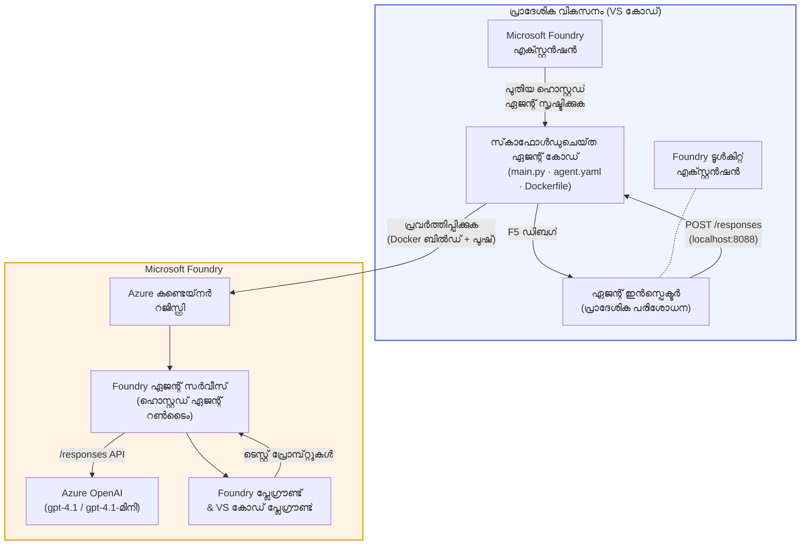

# ഫൗണ്ടറി ടൂൾകിറ്റ് + ഫൗണ്ടറി ഹോസ്റ്റഡ് ഏജന്റ്സ് വർക്ക്ഷോപ്പ്

[](https://www.python.org/)
[](https://github.com/microsoft/agents)
[](https://learn.microsoft.com/azure/ai-foundry/agents/concepts/hosted-agents/)
[](https://ai.azure.com/)
[](https://learn.microsoft.com/azure/ai-services/openai/)
[](https://learn.microsoft.com/cli/azure/install-azure-cli)
[](https://learn.microsoft.com/azure/developer/azure-developer-cli/install-azd)
[](https://www.docker.com/)
[](https://marketplace.visualstudio.com/items?itemName=ms-windows-ai-studio.windows-ai-studio)
[](LICENSE)

**Microsoft Foundry Agent Service**-ൽ **Hosted Agents** എന്ന്ബാധിച്ച് AI ഏജന്റുകൾ നിർമ്മിക്കുക, പരിശோதിക്കുക, വിന്യസിക്കുക — എല്ലാം VS Code ഉപയോഗിച്ച് **Microsoft Foundry extension** ഉം **Foundry Toolkit** ഉം ഉപയോഗിച്ച്.

> **Hosted Agents ഇപ്പോൾ പ рев്യൂവിലാണ്.** പിന്തുണയുള്ള പ്രദേശങ്ങൾ പരിമിതമാണ് - [പ്രദേശ ലഭ്യത](https://learn.microsoft.com/azure/foundry/agents/concepts/hosted-agents#region-availability) കാണുക.

> ഓരോ ലാബിലും `agent/` ഫോൾഡർ **Foundry extension** ആണ് സ്വയം സൃഷ്ടിക്കുന്നത് — ശേഷം നിങ്ങൾ കോഡ് ഇഷ്ടാനുസൃതമാക്കി, താത്ക്കാലികമായി പരിശോധിച്ച്, വിന്യസിക്കുക.

<!-- CO-OP TRANSLATOR LANGUAGES TABLE START -->
[Arabic](../ar/README.md) | [Bengali](../bn/README.md) | [Bulgarian](../bg/README.md) | [Burmese (Myanmar)](../my/README.md) | [Chinese (Simplified)](../zh-CN/README.md) | [Chinese (Traditional, Hong Kong)](../zh-HK/README.md) | [Chinese (Traditional, Macau)](../zh-MO/README.md) | [Chinese (Traditional, Taiwan)](../zh-TW/README.md) | [Croatian](../hr/README.md) | [Czech](../cs/README.md) | [Danish](../da/README.md) | [Dutch](../nl/README.md) | [Estonian](../et/README.md) | [Finnish](../fi/README.md) | [French](../fr/README.md) | [German](../de/README.md) | [Greek](../el/README.md) | [Hebrew](../he/README.md) | [Hindi](../hi/README.md) | [Hungarian](../hu/README.md) | [Indonesian](../id/README.md) | [Italian](../it/README.md) | [Japanese](../ja/README.md) | [Kannada](../kn/README.md) | [Khmer](../km/README.md) | [Korean](../ko/README.md) | [Lithuanian](../lt/README.md) | [Malay](../ms/README.md) | [Malayalam](./README.md) | [Marathi](../mr/README.md) | [Nepali](../ne/README.md) | [Nigerian Pidgin](../pcm/README.md) | [Norwegian](../no/README.md) | [Persian (Farsi)](../fa/README.md) | [Polish](../pl/README.md) | [Portuguese (Brazil)](../pt-BR/README.md) | [Portuguese (Portugal)](../pt-PT/README.md) | [Punjabi (Gurmukhi)](../pa/README.md) | [Romanian](../ro/README.md) | [Russian](../ru/README.md) | [Serbian (Cyrillic)](../sr/README.md) | [Slovak](../sk/README.md) | [Slovenian](../sl/README.md) | [Spanish](../es/README.md) | [Swahili](../sw/README.md) | [Swedish](../sv/README.md) | [Tagalog (Filipino)](../tl/README.md) | [Tamil](../ta/README.md) | [Telugu](../te/README.md) | [Thai](../th/README.md) | [Turkish](../tr/README.md) | [Ukrainian](../uk/README.md) | [Urdu](../ur/README.md) | [Vietnamese](../vi/README.md)

> **പ്രാദേശികമായി ക്ലോൺ ചെയ്യുന്നതിൽ താല്പര്യമുണ്ടോ?**
>
> ഈ റിപോസിറ്ററിയിൽ 50+ ഭാഷാദ്യയനം ഉൾപ്പെടുന്നു, ഇത് ഡൗൺലോഡ് വലിപ്പം വളരെവെളുപ്പത്തിൽ വർധിപ്പിക്കുന്നു. ഭാഷാപകര്‍പ്പുകൾ കൂടാതെ ക്ലോൺ ചെയ്യാൻ sparse checkout ഉപയോഗിക്കുക:
>
> **Bash / macOS / Linux:**
> ```bash
> git clone --filter=blob:none --sparse https://github.com/microsoft-foundry/Foundry_Toolkit_for_VSCode_Lab.git
> cd Foundry_Toolkit_for_VSCode_Lab
> git sparse-checkout set --no-cone '/*' '!translations' '!translated_images'
> ```
>
> **CMD (Windows):**
> ```cmd
> git clone --filter=blob:none --sparse https://github.com/microsoft-foundry/Foundry_Toolkit_for_VSCode_Lab.git
> cd Foundry_Toolkit_for_VSCode_Lab
> git sparse-checkout set --no-cone "/*" "!translations" "!translated_images"
> ```
>
> ഇത് കോഴ്‌സ് പൂർത്തിയാക്കാൻ ആവശ്യമുള്ള എല്ലാ ഫയലുകളും വളരെ വേഗത്തിൽ നിങ്ങൾക്ക് നൽകും.
<!-- CO-OP TRANSLATOR LANGUAGES TABLE END -->

---

## ശില്പശാസ്ത്രം


**പ്രവാഹം:** Foundry extension ഏജന്റ് സ്ഫാക്ട്ഫോൾഡ് ചെയ്യും → നിങ്ങൾ കോഡ് & നിർദ്ദേശങ്ങൾ ഇഷ്ടാനുസൃതമാക്കും → Agent Inspector ഉപയോഗിച്ച് താത്ക്കാലിക പരിശോധന നടത്തും → Foundry-യിൽ വിന്യസിക്കും (Docker ഇമേജ് ACR-യിലേക്ക് പുഷ് ചെയ്യും) → Playground-ൽ പരിശോധിക്കും.

---

## നിങ്ങൾ നിർമ്മിക്കുന്നത്

| ലാബ് | വിശദീകരണം | സ്റ്റാറ്റസ് |
|-----|-------------|--------|
| **ലാബ് 01 - ഒറ്റ ഏജന്റ്** | **"Explain Like I'm an Executive" Agent** നിർമ്മിക്കുക, താത്ക്കാലികമായി പരിശോധിക്കുക, ഫൗണ്ടറിയിലേക്ക് വിന്യസിക്കുക | ✅ ലഭ്യമാണ് |
| **ലാബ് 02 - ബഹു ഏജന്റ് പ്രവൃത്തി പ്രകൃതി** | **"Resume → Job Fit Evaluator"** - നാലു ഏജന്റുകൾ ചേർന്ന് റിസ്യൂം ഫിറ്റ് സ്കോർ ചെയ്ത് പഠന റോഡ്‌മാപ് സൃഷ്ടിക്കുന്നു | ✅ ലഭ്യമാണ് |

---

## എക്സിക്യൂട്ടീവ് ഏജന്റിനെ പരിചയപ്പെടുക

ഈ വർക്ക്ഷോപ്പിൽ നിങ്ങൾ **"Explain Like I'm an Executive" Agent** നിർമ്മിക്കും — സാങ്കേതിക പദജാലം എടുത്ത് അതിനെ ശാന്തമായ, ബോർഡറൂം-സജ്ജമായ സഹസാരങ്ങൾ ആയി മാറ്റുന്ന ഒരു AI ഏജന്റ്. കാരണം സിഇഒ നാലിനും "v3.2-ൽ പരിചയപ്പെടുത്തിയ സമവായ കോളുകൾ മൂലം ത്രെഡ് പാലം ക്ഷാമം" പോലുള്ള കാര്യങ്ങൾ ഒതുങ്ങി കേൾക്കാൻ ആഗ്രഹിക്കുന്നില്ല.

ഞാൻ ഈ ഏജന്റ് നിർമ്മിച്ചത് അവകാശപ്പെടുത്തി എന്നതിനുശേഷം എന്റെ വളരെ നന്നായി ഒരുക്കിയ പോസ്റ്റ്-മോർട്ടംക്ക് പ്രതികരണം ലഭിച്ചത്: *"അതായത്... വെബ്സൈറ്റ് അടച്ചിരിക്കുകയാണോ അല്ലയോ?"*

### ഇത് എങ്ങനെ പ്രവർത്തിക്കുന്നു

നിങ്ങൾ ഒരു സാങ്കേതിക അപ്ഡേറ്റ് നൽകും. അത് മൂന്നു ബുള്ളറ്റ് പോയിന്റുകൾ ആയി — ജാർഗൺ ഇല്ല, സ്റ്റാക്ക് ട്രേസ് ഇല്ല, ഭയभीതി ഇല്ല — ഒരു എക്സിക്യൂട്ടീവ് സംക്ഷേപം പ്രത്യുത്‌തരം നൽകും. വെറും **എന്തായിരുന്നുവെന്ന്**, **ബിസിനസ് സ്വാധീനം**, **അടുത്ത പടി**.

### പ്രവർത്തനത്തിൽ കാണുക

**നിങ്ങൾ പറഞ്ഞു:**
> "The API latency increased due to thread pool exhaustion caused by synchronous calls introduced in v3.2."

**ഏജന്റ് മറുപടി:**

> **Executive Summary:**
> - **എന്തായി:** ഏറ്റവും പുതിയ റിലീസ് കഴിഞ്ഞ് സിസ്റ്റം മന്ദഗതിയായി.
> - **ബിസിനസ് സ്വാധീനം:** ചില ഉപഭോക്താക്കൾ സേവനം ഉപയോഗിക്കുമ്പോൾ വൈകിയത് അനുഭവപ്പെട്ടു.
> - **അടുത്ത പടി:** മാറ്റം റദ്ദാക്കി, പുനരиновാസത്തിന് മുമ്പ് പരിഹാരം തയ്യാറാക്കുന്നു.

### ഈ ഏജന്റ് എന്തിനാണ്?

ഇത് ഒരു സിമ്പിൾ, ഒറ്റ ലക്ഷ്യ ഏജന്റാണ് — ഹോസ്റ്റഡ് ഏജന്റ് പ്രവൃത്തി വിപുലമായി പഠിക്കാൻ മികച്ചത്, സങ്കീർണമായ ഉപകരണ ശൃംഖലകളിൽ കുടുങ്ങാതെ. സത്യത്തിൽ, ഓരോ എഞ്ചിനീയറിംഗ് ടീമിനും ഇതുപോലൊരു ഏജന്റ് ആവശ്യമാണ്.

---

## വർക്ക്ഷോപിന്റെ ഘടന

```
📂 Foundry_Toolkit_for_VSCode_Lab/
├── 📄 README.md                      ← You are here
├── 📂 ExecutiveAgent/                ← Standalone hosted agent project
│   ├── agent.yaml
│   ├── Dockerfile
│   ├── main.py
│   └── requirements.txt
└── 📂 workshop/
    ├── 📂 lab01-single-agent/        ← Full lab: docs + agent code
    │   ├── README.md                 ← Hands-on lab instructions
    │   ├── 📂 docs/                  ← Step-by-step tutorial modules
    │   │   ├── 00-prerequisites.md
    │   │   ├── 01-install-foundry-toolkit.md
    │   │   ├── 02-create-foundry-project.md
    │   │   ├── 03-create-hosted-agent.md
    │   │   ├── 04-configure-and-code.md
    │   │   ├── 05-test-locally.md
    │   │   ├── 06-deploy-to-foundry.md
    │   │   ├── 07-verify-in-playground.md
    │   │   └── 08-troubleshooting.md
    │   └── 📂 agent/                 ← Reference solution (auto-scaffolded by Foundry extension)
    │       ├── agent.yaml
    │       ├── Dockerfile
    │       ├── main.py
    │       └── requirements.txt
    └── 📂 lab02-multi-agent/         ← Resume → Job Fit Evaluator
        ├── README.md                 ← Hands-on lab instructions (end-to-end)
        ├── 📂 docs/                  ← Step-by-step tutorial modules
        │   ├── 00-prerequisites.md
        │   ├── 01-understand-multi-agent.md
        │   ├── 02-scaffold-multi-agent.md
        │   ├── 03-configure-agents.md
        │   ├── 04-orchestration-patterns.md
        │   ├── 05-test-locally.md
        │   ├── 06-deploy-to-foundry.md
        │   ├── 07-verify-in-playground.md
        │   └── 08-troubleshooting.md
        └── 📂 PersonalCareerCopilot/ ← Reference solution (multi-agent workflow)
            ├── agent.yaml
            ├── Dockerfile
            ├── main.py
            └── requirements.txt
```

> **കുറിപ്പ്:** ഓരോ ലാബിലെ `agent/` ഫോൾഡർ **Microsoft Foundry extension**-ഉം കമാൻഡ് പാലറ്റിൽ നിന്നു `Microsoft Foundry: Create a New Hosted Agent` പരീക്ഷിക്കുമ്പോൾ സൃഷ്ടിക്കുന്നതാണ്. ഫയലുകൾ പിന്നീട് നിങ്ങളുടെ ഏജന്റിന്റെ നിർദ്ദേശങ്ങൾ, ഉപകരണങ്ങൾ, കോൺഫിഗറേഷൻ അനുസരിച്ച് ഇഷ്ടാനുസൃതമാക്കാം. ലാബ് 01 നിങ്ങൾക്ക് ഇത് തുടക്കം മുതൽ നിർമ്മിക്കാൻ സഹായിക്കും.

---

## തുടങ്ങി തുടങ്ങാം

### 1. റിപോസിറ്ററി ക്ലോൺ ചെയ്യുക

```bash
git clone https://github.com/microsoft-foundry/Foundry_Toolkit_for_VSCode_Lab.git
cd Foundry_Toolkit_for_VSCode_Lab
```

### 2. Python വെർച്ച്വൽ എൻവയോൺമെന്റ് സജ്ജീകരിക്കുക

```bash
python -m venv venv
```

സജീവമാക്കുക:

- **Windows (PowerShell):**
  ```powershell
  .\venv\Scripts\Activate.ps1
  ```
- **macOS / Linux:**
  ```bash
  source venv/bin/activate
  ```

### 3. ആശ്രിതങ്ങൾ ഇൻസ്റ്റാൾ ചെയ്യുക

```bash
pip install -r workshop/lab01-single-agent/agent/requirements.txt
```

### 4. പരിസ്ഥിതി വ്യത്യാസങ്ങൾ ക്രമീകരിക്കുക

ഏജന്റ് ഫോൾഡറിലുള്ള ഉദാഹരണ `.env` ഫയൽ പകർന്നു നിങ്ങളുടെ മൂല്യങ്ങൾ ചേർക്കുക:

```bash
cp workshop/lab01-single-agent/agent/.env.example workshop/lab01-single-agent/agent/.env
```

`workshop/lab01-single-agent/agent/.env` എഡിറ്റ് ചെയ്യുക:

```env
AZURE_AI_PROJECT_ENDPOINT=https://<your-account>.services.ai.azure.com/api/projects/<your-project>
MODEL_DEPLOYMENT_NAME=<your-model-deployment-name>
```

### 5. വർക്ക്ഷോപ്പ് ലാബുകൾ പിന്തുടരുക

ഓരോ ലാബും അതിന്റെ സ്വന്തമായ മൊഡ്യൂളുകളോടെയാണ്. അടിസ്ഥാനങ്ങൾ പഠിക്കാൻ **ലാബ് 01**-ൽ തുടങ്ങുക, തുടർന്ന് ബഹു-ഏജന്റ് പ്രവൃത്തി ശൈലികൾക്കായി **ലാബ് 02**-ലേക്ക് നീങ്ങുക.

#### ലാബ് 01 - ഒറ്റ ഏജന്റ് ([പൂർണ്ണ നിർദ്ദേശങ്ങൾ](workshop/lab01-single-agent/README.md))

| # | മൊഡ്യൂൾ | ലിങ്ക് |
|---|--------|------|
| 1 | മുൻകൂർ ആവശ്യകതകൾ വായിക്കുക | [00-prerequisites.md](workshop/lab01-single-agent/docs/00-prerequisites.md) |
| 2 | Foundry Toolkit & Foundry extension ഇൻസ്റ്റാൾ ചെയ്യുക | [01-install-foundry-toolkit.md](workshop/lab01-single-agent/docs/01-install-foundry-toolkit.md) |
| 3 | Foundry പ്രോജക്റ്റ് സൃഷ്ടിക്കുക | [02-create-foundry-project.md](workshop/lab01-single-agent/docs/02-create-foundry-project.md) |
| 4 | ഹോസ്റ്റഡ് ഏജന്റ് സൃഷ്ടിക്കുക | [03-create-hosted-agent.md](workshop/lab01-single-agent/docs/03-create-hosted-agent.md) |
| 5 | നിർദ്ദേശങ്ങൾ & പരിസ്ഥിതി ക്രമീകരിക്കുക | [04-configure-and-code.md](workshop/lab01-single-agent/docs/04-configure-and-code.md) |
| 6 | താത്ക്കാലിക പരിശോധന നടത്തുക | [05-test-locally.md](workshop/lab01-single-agent/docs/05-test-locally.md) |
| 7 | ഫൗണ്ടറിയിലേക്ക് വിന്യസിക്കുക | [06-deploy-to-foundry.md](workshop/lab01-single-agent/docs/06-deploy-to-foundry.md) |
| 8 | പ്ലേഗ്രൗണ്ടിൽ പരിശോധന നടത്തുക | [07-verify-in-playground.md](workshop/lab01-single-agent/docs/07-verify-in-playground.md) |
| 9 | പ്രശ്നപരിഹാരം | [08-troubleshooting.md](workshop/lab01-single-agent/docs/08-troubleshooting.md) |

#### ലാബ് 02 - ബഹു ഏജന്റ് പ്രവൃത്തി ശൈലി ([പൂർണ്ണ നിർദ്ദേശങ്ങൾ](workshop/lab02-multi-agent/README.md))

| # | മൊഡ്യൂൾ | ലിങ്ക് |
|---|--------|------|
| 1 | മുൻകൂർ ആവശ്യകതകൾ (ലാബ് 02) | [00-prerequisites.md](workshop/lab02-multi-agent/docs/00-prerequisites.md) |
| 2 | ബഹു-ഏജന്റ് ശില്പശാസ്ത്രം മനസിലാക്കുക | [01-understand-multi-agent.md](workshop/lab02-multi-agent/docs/01-understand-multi-agent.md) |
| 3 | ബഹുഎജന്റ് പ്രോജക്റ്റ് സ്ഫാക്ട്‌ഫോൾഡ് ചെയ്യുക | [02-scaffold-multi-agent.md](workshop/lab02-multi-agent/docs/02-scaffold-multi-agent.md) |
| 4 | ഏജന്റുകൾ & പരിസ്ഥിതി ക്രമീകരിക്കുക | [03-configure-agents.md](workshop/lab02-multi-agent/docs/03-configure-agents.md) |
| 5 | ഓർക്കസ്ട്രേഷൻ പാറ്റേണുകൾ | [04-orchestration-patterns.md](workshop/lab02-multi-agent/docs/04-orchestration-patterns.md) |
| 6 | താത്ക്കാലിക പരിശോധന നടത്തുക (ബഹുഎജന്റ്) | [05-test-locally.md](workshop/lab02-multi-agent/docs/05-test-locally.md) |
| 7 | Foundry-ലേക്ക് വിന്യസിക്കുക | [06-deploy-to-foundry.md](workshop/lab02-multi-agent/docs/06-deploy-to-foundry.md) |
| 8 | പ്ലേഗ്രൗണ്ടിൽ പരിശോധിക്കുക | [07-verify-in-playground.md](workshop/lab02-multi-agent/docs/07-verify-in-playground.md) |
| 9 | പ്രശ്നപരിഹാരം (മൾട്ടി-ഏജന്റ്) | [08-troubleshooting.md](workshop/lab02-multi-agent/docs/08-troubleshooting.md) |

---

## പരിപാലകൻ

<table>
<tr>
    <td align="center"><a href="https://github.com/ShivamGoyal03">
        <br />
        <sub><b>ഷിവം ഗോയൽ</b></sub>
    </a><br />
    </td>
</tr>
</table>

---

## ആവശ്യമായ അനുമതികൾ (ത്വരിത പരാമർശം)

| സ്ഥിതി | ആവശ്യമുള്ള പങ്കുകൾ |
|----------|---------------|
| പുതിയ Foundry പ്രോജക്ട് സൃഷ്ടിക്കുക | Foundry വിഭവത്തിൽ **Azure AI Owner** |
| നിലവിലുള്ള പ്രോജക്ടിലേക്ക് വിന്യസിക്കുക (പുതിയ വിഭവങ്ങൾ) | സബ്സ്ക്രിപ്ഷനിൽ **Azure AI Owner** + **Contributor** |
| പൂർണമായും കോൺഫിഗർ ചെയ്ത പ്രോജക്ടിലേക്ക് വിന്യസിക്കുക | അക്കൗണ്ടിൽ **Reader** + പ്രോജക്ടിൽ **Azure AI User** |

> **പ്രധാനമായത്:** Azure `Owner` மற்றும் `Contributor` പങ്ക് കളിൽ *മാനേജ്‌മെന്റ്* അനുമതികൾ മാത്രമേ ഉൾക്കൊള്ളवलുള്ളൂ, *ഡെവലപ്‌മെന്റ്* (ഡാറ്റാ ആക്ഷൻ) അനുമതികൾ അല്ല. ഏജന്റുകൾ നിർമിക്കുകയും വിന്യസിക്കുകയും ചെയ്യാൻ **Azure AI User** അല്ലെങ്കിൽ **Azure AI Owner** ആവശ്യമുണ്ട്.

---

## റഫറൻസുകൾ

- [ക്വിക്ക്‌സ്റ്റാർട്ട്: നിങ്ങളുടെ ആദ്യ ഹോസ്റ്റഡ് ഏജന്റ് വിന്യസിക്കുക (VS Code)](https://learn.microsoft.com/azure/foundry/agents/quickstarts/quickstart-hosted-agent)
- [ഹോസ്റ്റഡ് ഏജന്റുകൾ എന്താണ്?](https://learn.microsoft.com/azure/foundry/agents/concepts/hosted-agents)
- [VS Code-യിൽ ഹോസ്റ്റഡ് ഏജന്റ് വർക്ക്‌ഫ്ലോകൾ സൃഷ്ടിക്കുക](https://learn.microsoft.com/azure/foundry/agents/how-to/vs-code-agents-workflow-pro-code)
- [ഒരു ഹോസ്റ്റഡ് ഏജന്റ് വിന്യസിക്കുക](https://learn.microsoft.com/azure/foundry/agents/how-to/deploy-hosted-agent)
- [Microsoft Foundry-ക്കുള്ള RBAC](https://learn.microsoft.com/azure/foundry/concepts/rbac-foundry)
- [ആർക്കിടെക്ചർ റിവ്യൂ ഏജന്റ് സാമ്പിൾ](https://github.com/Azure-Samples/agent-architecture-review-sample) - MCP ടൂളുകളോടുകൂടിയ യഥാർത്ഥ ഹോസ്റ്റഡ് ഏജന്റ്, Excalidraw രേഖാചിത്രങ്ങൾ, ഡ്യൂവൽ വിന്യാസം

---

## ലൈസൻസ്

[MIT](../../LICENSE)

---

<!-- CO-OP TRANSLATOR DISCLAIMER START -->
**വിവരണ വിധി**:  
ഈ പത്രിക [Co-op Translator](https://github.com/Azure/co-op-translator) എന്ന AI വിവർത്തന സേവനം ഉപയോഗിച്ച് വിവർത്തനം ചെയ്യപ്പെട്ടതാണ്. ഞങ്ങൾ കൃത്യതക്ക് ശ്രമിക്കുമ്പോഴും, സ്വയം പ്രവർത്തിക്കുന്ന വിവർത്തനങ്ങളിൽ പിഴവുകൾ അല്ലെങ്കിൽ തെറ്റുകൾ ഉണ്ടാകാമെന്ന് ദയവായി മനസിലാക്കുക. നാടൻ ഭാഷയിലുളള മുള്ള പ്രമാണമാണ് അധീകൃത സ്രോതസ്സെന്നായി പരിഗണിക്കേണ്ടത്. നിർണ്ണായക വിവരങ്ങൾക്ക് പ്രൊഫഷണൽ മാൻവിവർത്തനം ശിപാർശ ചെയ്യപ്പെടുന്നു. ഈ വിവർത്തനം ഉപയോഗിക്കുന്നതിൽ നിന്നുണ്ടാകുന്ന任何രു ഭ്രമങ്ങൾക്കോ തെറ്റിദ്ധാരണകൾക്കോ ഞങ്ങൾക്ക് ഉത്തരവാദിത്വം ഉണ്ടാകുന്നില്ല.
<!-- CO-OP TRANSLATOR DISCLAIMER END -->