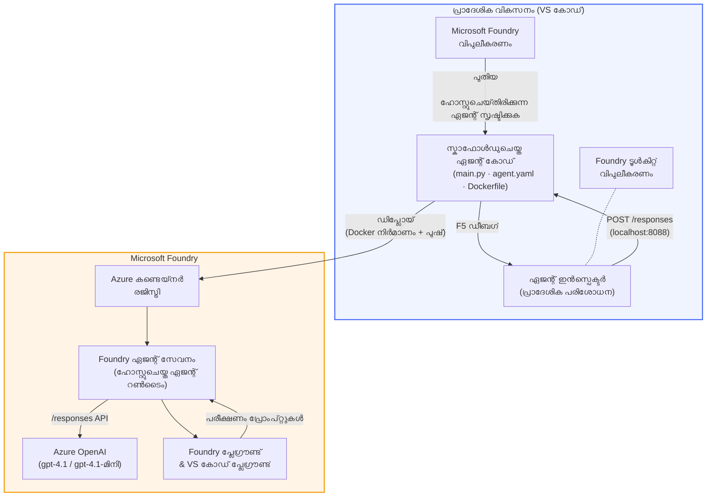

# ഫോൺഡ്രി ടൂൾകിറ്റ് + ഫോൺഡ്രി ഹോസ്റ്റഡ് ഏജന്റ്സ് വർക്‌ഷോപ്

[](https://www.python.org/)
[](https://github.com/microsoft/agents)
[](https://learn.microsoft.com/azure/ai-foundry/agents/concepts/hosted-agents/)
[](https://ai.azure.com/)
[](https://learn.microsoft.com/azure/ai-services/openai/)
[](https://learn.microsoft.com/cli/azure/install-azure-cli)
[](https://learn.microsoft.com/azure/developer/azure-developer-cli/install-azd)
[](https://www.docker.com/)
[](https://marketplace.visualstudio.com/items?itemName=ms-windows-ai-studio.windows-ai-studio)
[](LICENSE)

**Microsoft Foundry Agent Service**-ലേക്ക് **Hosted Agents** ആയി AI ഏജന്റുകളെ ബിൽഡ്, പരീക്ഷിച്ച്, ഡിപ്പ്ലോയ് ചെയ്യുക - എല്ലാം VS Code ഉപയോഗിച്ച് **Microsoft Foundry एक्स्टൻഷൻ** ഉം **Foundry Toolkit** ഉം ഉപയോഗിച്ച്.

> **Hosted Agents ഇപ്പോള്‍ പ്രിവ്യൂവിലാണ്.** പിന്തുണയുള്ള പ്രദേശങ്ങള്‍ പരിമിതമാണ് - [പ്രദേശത്തിന്റെ ലഭ്യത](https://learn.microsoft.com/azure/foundry/agents/concepts/hosted-agents#region-availability) കാണുക.

> ഓരോ ലാബിന്റെയും `agent/` ഫോൾഡർ **Foundry extension** യാൽ സ്വയമേവ സ്കാഫോൾഡ് ചെയ്യപ്പെടുന്നു - പിന്നീട് നിങ്ങൾ കോഡ് കസ്റ്റമൈസ് ചെയ്ത്, ലോക്കൽ ആയി ടെസ്റ്റ് ചെയ്ത്, ഡിപ്പ്ലോയ് ചെയ്യാം.

### 🌐 പലഭാഷാ പിന്തുണ

#### GitHub Action മുഖാന്തിരം പിന്തുണ (സ്വയംകരപ്പെട്ടതും എപ്പോഴും പുതിയതുമായത്)

<!-- CO-OP TRANSLATOR LANGUAGES TABLE START -->
[Arabic](../ar/README.md) | [Bengali](../bn/README.md) | [Bulgarian](../bg/README.md) | [Burmese (Myanmar)](../my/README.md) | [Chinese (Simplified)](../zh-CN/README.md) | [Chinese (Traditional, Hong Kong)](../zh-HK/README.md) | [Chinese (Traditional, Macau)](../zh-MO/README.md) | [Chinese (Traditional, Taiwan)](../zh-TW/README.md) | [Croatian](../hr/README.md) | [Czech](../cs/README.md) | [Danish](../da/README.md) | [Dutch](../nl/README.md) | [Estonian](../et/README.md) | [Finnish](../fi/README.md) | [French](../fr/README.md) | [German](../de/README.md) | [Greek](../el/README.md) | [Hebrew](../he/README.md) | [Hindi](../hi/README.md) | [Hungarian](../hu/README.md) | [Indonesian](../id/README.md) | [Italian](../it/README.md) | [Japanese](../ja/README.md) | [Kannada](../kn/README.md) | [Khmer](../km/README.md) | [Korean](../ko/README.md) | [Lithuanian](../lt/README.md) | [Malay](../ms/README.md) | [Malayalam](./README.md) | [Marathi](../mr/README.md) | [Nepali](../ne/README.md) | [Nigerian Pidgin](../pcm/README.md) | [Norwegian](../no/README.md) | [Persian (Farsi)](../fa/README.md) | [Polish](../pl/README.md) | [Portuguese (Brazil)](../pt-BR/README.md) | [Portuguese (Portugal)](../pt-PT/README.md) | [Punjabi (Gurmukhi)](../pa/README.md) | [Romanian](../ro/README.md) | [Russian](../ru/README.md) | [Serbian (Cyrillic)](../sr/README.md) | [Slovak](../sk/README.md) | [Slovenian](../sl/README.md) | [Spanish](../es/README.md) | [Swahili](../sw/README.md) | [Swedish](../sv/README.md) | [Tagalog (Filipino)](../tl/README.md) | [Tamil](../ta/README.md) | [Telugu](../te/README.md) | [Thai](../th/README.md) | [Turkish](../tr/README.md) | [Ukrainian](../uk/README.md) | [Urdu](../ur/README.md) | [Vietnamese](../vi/README.md)

> **സ്ഥലീയമായി ക്ലോണ്‍ ചെയ്യാന്‍ ഇഷ്ടപ്പെടുന്നുണ്ടോ?**
>
> ഈ റിപ്പോസിറ്ററിയില്‍ 50+ ഭാഷാ പരിഭാഷകള്‍ ഉള്‍പ്പെടുത്തിയിരിക്കുന്നു, ഇത് ഡൗൺലോഡ് വലുപ്പം വൻത്രം കൂട്ടുന്നു. പരിഭാഷകള്‍ കൂടാതെ ക്ലോണ്‍ ചെയ്യാന്‍, സ്പാർസ് ചെക്ക്ഔട്ട് ഉപയോഗിക്കുക:
>
> **Bash / macOS / Linux:**
> ```bash
> git clone --filter=blob:none --sparse https://github.com/microsoft-foundry/Foundry_Toolkit_for_VSCode_Lab.git
> cd Foundry_Toolkit_for_VSCode_Lab
> git sparse-checkout set --no-cone '/*' '!translations' '!translated_images'
> ```
>
> **CMD (Windows):**
> ```cmd
> git clone --filter=blob:none --sparse https://github.com/microsoft-foundry/Foundry_Toolkit_for_VSCode_Lab.git
> cd Foundry_Toolkit_for_VSCode_Lab
> git sparse-checkout set --no-cone "/*" "!translations" "!translated_images"
> ```
>
> കോഴ്സ് പൂർത്തിയാക്കുന്നതിന് ആവശ്യമായ എല്ലാ ഫയലുകളും ലഭിക്കുന്നുണ്ട്, കൂടാതെ ഡൗൺലോഡ് വേഗത വളരെ രൂക്ഷമായി കൂടും.
<!-- CO-OP TRANSLATOR LANGUAGES TABLE END -->

---

## ആർ‌കിടെക്ചർ


**ഫ്ലോ:** Foundry extension ഏജന്റ് സ്കാഫോൾഡ് ചെയ്യുന്നു → നിങ്ങൾ കോഡ് & നിർദ്ദേശങ്ങൾ കസ്റ്റമൈസ് ചെയ്യുന്നു → Agent Inspector ഉപയോഗിച്ച് ലോക്കലി ടെസ്റ്റ് ചെയ്യുന്നു → ഫോൺഡ്രിയിലേക്ക് ഡിപ്പ്ലോയ് ചെയ്യുന്നു (Docker ഇമേജ് ACR-ലേക്കായി പുഷ് ചെയ്യുന്നു) → പ്ലേഗ്രൗണ്ടിൽ പരിശോധിക്കുന്നു.

---

## നിങ്ങൾ നിർമ്മിക്കുന്നതു

| ലാബ് | വിവരണം | നില |
|-----|-------------|--------|
| **Lab 01 - Single Agent** | **"Explain Like I'm an Executive" ഏജന്റ്** നിർമ്മിക്കുക, ലോക്കലി ടെസ്റ്റ് ചെയ്ത്, ഫോൺഡ്രിയിലേക്ക് ഡിപ്പ്ലോയ് ചെയ്യുക | ✅ ലഭ്യമാണ് |
| **Lab 02 - Multi-Agent Workflow** | **"റിസ്യൂം → ജോബ് ഫിറ്റ് ഇവാലുവേറ്റർ"** - 4 ഏജന്റുകൾ സഹകരിച്ച് റിസ്യൂമെയ്‌റുടെ ഫിറ്റ് സ്കോർ ചെയ്യുകയും പഠന റോഡ്‌മാപ്പ് സൃഷ്ടിക്കുകയും ചെയ്യുന്നു | ✅ ലഭ്യമാണ് |

---

## എക്സിക്യുട്ടീവ് ഏജന്റിനെ പരിചയപ്പെടുക

ഈ വർക്‌ഷോപ്പിൽ നിങ്ങൾ നിർമ്മിക്കുന്നതു **"Explain Like I'm an Executive" ഏജന്റ്** ആണ് - ടെക്നിക്കൽ ജർഗൺ നീക്കം ചെയ്ത് എല്ലാവർക്കും മനസ്സിലാക്കാവുന്ന, ബോർഡ്റൂം-സെടുത്ത സംഗ്രഹങ്ങളായി ഓര്‍മ്മിപ്പിക്കുന്ന എഐ ഏജന്റ്. കാരണം സത്യത്തിൽ C-സ്യൂട്ടിലെ ആരും "v3.2-ൽ കൊണ്ടുവന്ന സിങ്ക്രണസ് കോളുകൾ മൂലം സൃഷ്ടമായ ത്രെഡ് പൂൾ എക്സോസ്റ്റ്ഷൻ"ക്കുറിച്ച് കേൾക്കാൻ ആഗ്രഹിക്കുന്നില്ല.

ഞാൻ ഈ ഏജന്റ് നിർമ്മിച്ചത് നിരവധി സംഭവങ്ങളുടെ ശേഷം, എന്റെ പാരിപാട്-നിർമ്മിത പോസ്റ്റ്-മോർട്ടം കിട്ടിയ മറുപടി *"അതെ... വെബ്സൈറ്റ് ഡൗൺ ആണോ അല്ലയോ?"* ആയപ്പോള്‍.

### ഇത് എങ്ങനെ പ്രവർത്തിക്കുന്നു

നിങ്ങൾക്ക് ഒരു ടെക്നിക്കൽ അപ്‌ഡേറ്റ് നൽകി. അത് തുടർന്ന് ഒരു എക്സിക്യുട്ടീവ് സംഗ്രഹം തിരിച്ച് നൽകുന്നു - മൂന്ന് ബുള്ളറ്റ് പോയിന്റുകൾ, ജർഗൺ ഇല്ല, സ്റ്റാക്ക് ട്രേസുകൾ ഇല്ല, ആസ്തിത്വമില്ലായ്മ ദുഃഖം ഇല്ല. വെറും **എന്താണ് സംഭവിച്ചത്**, **ബിസിനസ് സ്വാധീനം**, **അടുത്ത ചുവടു**.

### പ്രവർത്തനത്തിൽ കാണുക

**നിങ്ങൾ പറയുന്നു:**
> "API ലാറ്റൻസി ട്രെഡ് പൂൾ എക്സോസ്റ്റ്ഷൻ മൂലം കുറഞ്ഞത്, ഇത് v3.2-ൽ അവതരിപ്പിച്ച സിങ്ക്രണസ് കോളുകൾ മൂലമാണ്."

**ഏജന്റ് മറുപടി നൽകുന്നു:**

> **എക്സിക്യുട്ടീവ് സംഗ്രഹം:**
> - **എന്ത് സംഭവിച്ചു:** പുതിയ റീലീസ് കഴിഞ്ഞ് സിസ്റ്റം മന്ദഗതിയിൽ പോയി.
> - **ബിസിനസ് സ്വാധീനം:** ചില ഉപഭോക്താക്കൾക്ക് സേവനം ഉപയോഗിക്കുമ്പോൾ വൈകിപ്പിക്കൽ അനുഭവപ്പെട്ടു.
> - **അടുത്ത ചുവടു:** മാറ്റം റിസ്‌റ്റോർ ചെയ്തിട്ടുണ്ട്, മോർ ഡിപ്പ്ലോയ്‌മെന്റിന് മുൻപ് ഫിക്‌സ് തയ്യാറാക്കുന്നു.

### ഈ ഏജന്റ് എന്തുകൊണ്ട്?

ഇത് ഒരുപാട് സങ്കീർണമായ തുറവുകളില്ലാത്ത, ഏക ലക്ഷ്യമുള്ള ഏജന്റ് ആണ് - ഹോസ്റ്റഡ് ഏജന്റിന്റെ പ്രവാഹം ആരംഭം മുതൽ അവസാനം വരെ എളുപ്പത്തിൽ പഠിക്കാനായി. സത്യത്തിൽ? ഇത്തരമൊരു ഏജന്റ് എല്ലാ എഞ്ചിനീയറിംഗ് ടീമിനും തന്റെ പണിയിൽ വളരെ സഹായകരമാണ്.

---

## വർക്‌ഷോപ്പ് ഘടന

```
📂 Foundry_Toolkit_for_VSCode_Lab/
├── 📄 README.md                      ← You are here
├── 📂 ExecutiveAgent/                ← Standalone hosted agent project
│   ├── agent.yaml
│   ├── Dockerfile
│   ├── main.py
│   └── requirements.txt
└── 📂 workshop/
    ├── 📂 lab01-single-agent/        ← Full lab: docs + agent code
    │   ├── README.md                 ← Hands-on lab instructions
    │   ├── 📂 docs/                  ← Step-by-step tutorial modules
    │   │   ├── 00-prerequisites.md
    │   │   ├── 01-install-foundry-toolkit.md
    │   │   ├── 02-create-foundry-project.md
    │   │   ├── 03-create-hosted-agent.md
    │   │   ├── 04-configure-and-code.md
    │   │   ├── 05-test-locally.md
    │   │   ├── 06-deploy-to-foundry.md
    │   │   ├── 07-verify-in-playground.md
    │   │   └── 08-troubleshooting.md
    │   └── 📂 agent/                 ← Reference solution (auto-scaffolded by Foundry extension)
    │       ├── agent.yaml
    │       ├── Dockerfile
    │       ├── main.py
    │       └── requirements.txt
    └── 📂 lab02-multi-agent/         ← Resume → Job Fit Evaluator
        ├── README.md                 ← Hands-on lab instructions (end-to-end)
        ├── 📂 docs/                  ← Step-by-step tutorial modules
        │   ├── 00-prerequisites.md
        │   ├── 01-understand-multi-agent.md
        │   ├── 02-scaffold-multi-agent.md
        │   ├── 03-configure-agents.md
        │   ├── 04-orchestration-patterns.md
        │   ├── 05-test-locally.md
        │   ├── 06-deploy-to-foundry.md
        │   ├── 07-verify-in-playground.md
        │   └── 08-troubleshooting.md
        └── 📂 PersonalCareerCopilot/ ← Reference solution (multi-agent workflow)
            ├── agent.yaml
            ├── Dockerfile
            ├── main.py
            └── requirements.txt
```

> **കുറിപ്പ്:** ഓരോ ലാബിലും ഉള്ള `agent/` ഫോൾഡർ Microsoft Foundry extension `Microsoft Foundry: Create a New Hosted Agent` എന്ന കമാൻഡ് പാനൽ റണ്ണ് ചെയ്യുമ്പോൾ സൃഷ്ടിക്കുന്നതാണ്. ഫയലുകൾ തുടർന്ന് നിങ്ങളുടെ ഏജന്റിന്റെ നിർദ്ദേശങ്ങൾ, ഉപകരണങ്ങൾ, ക്രമീകരണങ്ങൾ ഉപയോഗിച്ച് കസ്റ്റമൈസ് ചെയ്യപ്പെടുന്നു. ലാബ് 01 വഴി തുടക്കം മുതൽ ഇത് നിങ്ങൾ വീണ്ടും എങ്ങനെ സൃഷ്ടിക്കാമെന്ന് പഠിക്കും.

---

## തുടക്കം കുറിക്കുക

### 1. റിപ്പോസിറ്ററി ക്ലോൺ ചെയ്യുക

```bash
git clone https://github.com/microsoft-foundry/Foundry_Toolkit_for_VSCode_Lab.git
cd Foundry_Toolkit_for_VSCode_Lab
```

### 2. Python വേർച്വൽ എൻവയോൺമെന്റ് സജ്ജമാക്കുക

```bash
python -m venv venv
```

അك്َടിവേറ്റ് ചെയ്യുക:

- **Windows (PowerShell):**
  ```powershell
  .\venv\Scripts\Activate.ps1
  ```
- **macOS / Linux:**
  ```bash
  source venv/bin/activate
  ```

### 3. ആശ്രിത കമ്പനികൾ ഇൻസ്റ്റാൾ ചെയ്യുക

```bash
pip install -r workshop/lab01-single-agent/agent/requirements.txt
```

### 4. എൻവയോൺമെന്റ് വേരിയബിളുകൾ കോൺഫിഗർ ചെയ്യുക

എജന്റ് ഫോൾഡറിൽ ഉള്ള ഉദാഹരണ `.env` ഫയൽ കോപ്പി ചെയ്ത് നിങ്ങളുടെ മൂല്യങ്ങൾ നൽകി പൂർത്തിയാക്കുക:

```bash
cp workshop/lab01-single-agent/agent/.env.example workshop/lab01-single-agent/agent/.env
```

`workshop/lab01-single-agent/agent/.env` എഡിറ്റ് ചെയ്യുക:

```env
AZURE_AI_PROJECT_ENDPOINT=https://<your-account>.services.ai.azure.com/api/projects/<your-project>
MODEL_DEPLOYMENT_NAME=<your-model-deployment-name>
```

### 5. വർക്‌ഷോപ്പ് ലാബുകൾ പിന്തുടരുക

ഓരോ ലാബും സ്വയം പരിപാലിതമായ മുകളിലത്തെ മൊഡ്യൂളുകൾ ഉൾക്കൊള്ളുന്നു. അടിസ്ഥാനങ്ങൾ പഠിക്കാൻ **Lab 01**-നു തുടങ്ങുക, അതിനു ശേഷം **Lab 02**-ൽ പോയി മൾട്ടി-ഏജന്റ് പ്രവാഹങ്ങൾ പഠിക്കാം.

#### Lab 01 - Single Agent ([പൂർണ്ണ നിർദ്ദേശങ്ങൾ](workshop/lab01-single-agent/README.md))

| # | മൊഡ്യൂൾ | ലിങ്ക് |
|---|--------|------|
| 1 | മുൻ‌തയ്യാരികൾക്കായി വായിക്കുക | [00-prerequisites.md](workshop/lab01-single-agent/docs/00-prerequisites.md) |
| 2 | Foundry Toolkit & Foundry extension ഇൻസ്റ്റാൾ ചെയ്യുക | [01-install-foundry-toolkit.md](workshop/lab01-single-agent/docs/01-install-foundry-toolkit.md) |
| 3 | Foundry പ്രോജക്ട് സൃഷ്ടിക്കുക | [02-create-foundry-project.md](workshop/lab01-single-agent/docs/02-create-foundry-project.md) |
| 4 | ഒരു ഹോസ്റ്റഡ് ഏജന്റ് സൃഷ്ടിക്കുക | [03-create-hosted-agent.md](workshop/lab01-single-agent/docs/03-create-hosted-agent.md) |
| 5 | നിർദ്ദേശങ്ങൾ & എൻവയോൺമെന്റ് കോൺഫിഗർ ചെയ്യുക | [04-configure-and-code.md](workshop/lab01-single-agent/docs/04-configure-and-code.md) |
| 6 | ലോക്കലായി ടെസ്റ്റ് ചെയ്യുക | [05-test-locally.md](workshop/lab01-single-agent/docs/05-test-locally.md) |
| 7 | ഫോൺഡ്രിയിലേക്ക് ഡിപ്പ്ലോയ് ചെയ്യുക | [06-deploy-to-foundry.md](workshop/lab01-single-agent/docs/06-deploy-to-foundry.md) |
| 8 | പ്ലേഗ്രൗണ്ടില്‍ പരിശോധന നടത്തുക | [07-verify-in-playground.md](workshop/lab01-single-agent/docs/07-verify-in-playground.md) |
| 9 | പ്രശ്‌നപരിഹാരങ്ങൾ | [08-troubleshooting.md](workshop/lab01-single-agent/docs/08-troubleshooting.md) |

#### Lab 02 - Multi-Agent Workflow ([പൂർണ്ണ നിർദ്ദേശങ്ങൾ](workshop/lab02-multi-agent/README.md))

| # | മൊഡ്യൂൾ | ലിങ്ക് |
|---|--------|------|
| 1 | മുൻ‌തയ്യാരികൾ (Lab 02) | [00-prerequisites.md](workshop/lab02-multi-agent/docs/00-prerequisites.md) |
| 2 | മൾട്ടി-ഏജന്റ് ആർ‌കിടെക്ചർ മനസ്സിലാക്കുക | [01-understand-multi-agent.md](workshop/lab02-multi-agent/docs/01-understand-multi-agent.md) |
| 3 | മൾട്ടി-ഏജന്റ് പ്രോജക്ട് സ്കാഫോൾഡ് ചെയ്യുക | [02-scaffold-multi-agent.md](workshop/lab02-multi-agent/docs/02-scaffold-multi-agent.md) |
| 4 | ഏജന്റുകളും എൻവയോൺമെന്റും കോൺഫിഗർ ചെയ്യുക | [03-configure-agents.md](workshop/lab02-multi-agent/docs/03-configure-agents.md) |
| 5 | ഓർക്കസ്ട്രേഷൻ പാറ്റേണുകൾ | [04-orchestration-patterns.md](workshop/lab02-multi-agent/docs/04-orchestration-patterns.md) |
| 6 | ലോക്കലായി ടെസ്റ്റ് ചെയ്യുക (മൾട്ടി-ഏജന്റ്) | [05-test-locally.md](workshop/lab02-multi-agent/docs/05-test-locally.md) |
| 7 | ഫൗണ്ടറിയിലേക്ക് വിന്യസിക്കുക | [06-deploy-to-foundry.md](workshop/lab02-multi-agent/docs/06-deploy-to-foundry.md) |
| 8 | പ്ലേഗ്രൗണ്ടിൽ പരിശോധന നടത്തുക | [07-verify-in-playground.md](workshop/lab02-multi-agent/docs/07-verify-in-playground.md) |
| 9 | പ്രശ്നപരിഹാരം (മൾട്ടി-ഏജന്റ്) | [08-troubleshooting.md](workshop/lab02-multi-agent/docs/08-troubleshooting.md) |

---

## പരിചരിക്കുവനായി

<table>
<tr>
    <td align="center"><a href="https://github.com/ShivamGoyal03">
        <br />
        <sub><b>ശിവം ഗോയൽ</b></sub>
    </a><br />
    </td>
</tr>
</table>

---

## ആവശ്യമായ അനുമതികൾ (വേഗതയുള്ള റഫറൻസ്)

| സാഹചര്യങ്ങൾ | ആവശ്യമായ വേഷങ്ങൾ |
|----------|---------------|
| പുതിയ ഫൗണ്ടറി പ്രോജക്ട് സൃഷ്ടിക്കുക | ഫൗണ്ടറി റിസോഴ്‌സിൽ **Azure AI ഉടമ** |
| നിലവിലുള്ള പ്രോജക്ടിലേക്ക് വിന്യസിക്കുക (പുതിയ റിസോഴ്‌സുകൾ) | സബ്‌സ്ക്രിപ്ഷനിൽ **Azure AI ഉടമ** + **സംയോജകൻ** |
| പൂർണമായി ക്രമീകരിച്ച പ്രോജക്ടിലേക്ക് വിന്യസിക്കുക | അക്കൗണ്ടിൽ **വായനക്കാരൻ** + പ്രോജക്ടിൽ **Azure AI ഉപയോക്താവ്** |

> **പ്രധാനമാണ്:** Azure `ഉടമ`യും `സംയോജകനും` *വികസന* (ഡാറ്റാ ആക്ഷൻ) അനുമതികൾ ഉൾപ്പെടുന്നില്ല, എന്നിരുന്നാലും *മാനേജ്‌മെന്റ്* അനുമതികൾ മാത്രമാണ് ഉള്ളത്. ഏജന്റുകൾ നിർമ്മിക്കുകയും വിന്യസിക്കുകയും ചെയ്യാൻ **Azure AI ഉപയോക്താവ്** അല്ലെങ്കിൽ **Azure AI ഉടമ** ആവശ്യമുണ്ട്.

---

## റഫറംബർങ്ങൾ

- [ക്വിക്ക്‌സ്റ്റാർട്ട്: നിങ്ങളുടെ ആദ്യ ഹോസ്റ്റുചെയ്ത ഏജന്റ് വിന്യസിക്കുക (VS കോഡ്)](https://learn.microsoft.com/azure/foundry/agents/quickstarts/quickstart-hosted-agent)
- [ഹോസ്റ്റുചെയ്ത ഏജന്റുകൾ എന്താണ്?](https://learn.microsoft.com/azure/foundry/agents/concepts/hosted-agents)
- [VS കോഡിൽ ഹോസ്റ്റുചെയ്ത ഏജന്റ് വർക്ക്‌ഫ്ലോകൾ സൃഷ്ടിക്കുക](https://learn.microsoft.com/azure/foundry/agents/how-to/vs-code-agents-workflow-pro-code)
- [ഹോസ്റ്റുചെയ്ത ഏജന്റ് വിന്യസിക്കുക](https://learn.microsoft.com/azure/foundry/agents/how-to/deploy-hosted-agent)
- [Microsoft Foundry-ക്കുള്ള RBAC](https://learn.microsoft.com/azure/foundry/concepts/rbac-foundry)
- [ആർക്കിടെക്ചർ റിവ്യൂ ഏജന്റ് സാമ്പിൾ](https://github.com/Azure-Samples/agent-architecture-review-sample) - MCP ടൂളുകൾ, എക്സ്കാലിഡ്രോ ഡ്രോയിംഗ്‌സ്, ഡ്യൂവൽ വിന്യാസം എന്നിവയുള്ള യഥാർത്ഥ ലോക ഹോസ്റ്റുചെയ്ത ഏജന്റ്

---

## ലൈസൻസ്

[MIT](../../LICENSE)

---

<!-- CO-OP TRANSLATOR DISCLAIMER START -->
**ഡിസ്‌ക്ലെയിമര്‍**:  
ഈ രേഖ AI വിവര്‍ത്തന സേവനമായ [Co-op Translator](https://github.com/Azure/co-op-translator) ഉപയോഗിച്ച് വിവര്‍ത്തനം ചെയ്തിരിക്കുന്നു. ഞങ്ങള്‍ കൃത്യതക്ക് ശ്രമിക്കുന്നിട്ടുള്ളെങ്കിലും, സ്വയംകൃതമായ വിവര്‍ത്തനങ്ങളില്‍ പിഴവുകളും അശുദ്ധികളും ഉണ്ടായിരിക്കാമെന്ന് ശ്രദ്ധിക്കുക. പ്രാഥമിക ഭാഷയിലെ ഒറിജിനല്‍ രേഖ വിശ്വസനീയമായ ഉറവിടം ആയി കണക്കാക്കണമെന്നും നിര്‍ബന്ധമായ വിവരം ലഭിക്കാനായി പ്രൊഫഷണല്‍ മനുഷ്യ വിവര്‍ത്തനം നിര്‍ദ്ദേശിക്കുന്നു. ഈ വിവര്‍ത്തനം ഉപയോഗിച്ചുണ്ടാകുന്ന തെറ്റുപറ്റലുകള്‍ക്കും വ്യാഖ്യാനക്കുറവുകള്‍ക്കും ഞങ്ങള്‍ ഉത്തരവാദിത്വം വഹിച്ചില്ല.
<!-- CO-OP TRANSLATOR DISCLAIMER END -->