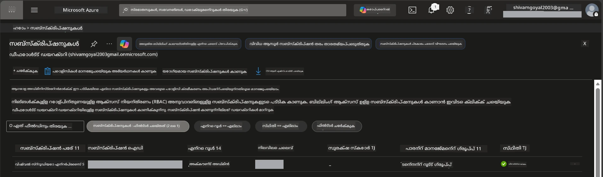

# Module 0 - മുൻകൂർ ആവശ്യങ്ങൾ

വർക്ക്‌ഷോപ്പ് ആരംഭിക്കുന്നതിന് മുൻപ്, താഴെ നൽകിയിരിക്കുന്ന ടൂളുകൾ, ആക്‌സസ്, പരിസ്ഥിതി എന്നിവ തയ്യാറാണോ എന്ന് സ്ഥിരീകരിക്കുക. താഴെ കൊടുത്തിരിക്കുന്ന എല്ലാ പടികൾ അനുഗമിക്കണം - മുന്നോട്ട് വെട്ടിക്കൂട്ടരുത്.

---

## 1. Azure അക്കൗണ്ട് & സബ്‌സ്‌ക്രിപ്ഷൻ

### 1.1 നിങ്ങളുടെ Azure സബ്‌സ്‌ക്രിപ്ഷൻ സൃഷ്ടിക്കുക അല്ലെങ്കിൽ സ്ഥിരീകരിക്കുക

1. ഒരു ബ്രൗസർ തുറന്ന് [https://azure.microsoft.com/free/](https://azure.microsoft.com/free/) ലേക്ക് പോകുക.
2. നിങ്ങൾക്ക് Azure അക്കൗണ്ട് ഇല്ലെങ്കിൽ, **Start free** ക്ലിക്ക് ചെയ്ത് സൈൻ അപ്പ് ഫ്ലോ അനുസരിക്കുക. ഐഡന്റിറ്റി സ്ഥിരീകരിക്കുവാൻ ഒരു മൈക്രോസോഫ്റ്റ് അക്കൗണ്ടും (അല്ലെങ്കിൽ പുതിയതായി സൃഷ്ടിക്കുക) ക്രഡിറ്റ് കാർഡും ആവശ്യമാണ്.
3. നിങ്ങൾക്ക് ഇതിനകം അക്കൗണ്ട് ഉണ്ടെങ്കിൽ, [https://portal.azure.com](https://portal.azure.com) ൽ സൈൻ ഇൻ ചെയ്യുക.
4. പോര്‍ട്ടലിൽ ഇടതു നാവിഗേഷനിൽ **Subscriptions** ബ്ലേഡ്‌ ക്ലിക്ക് ചെയ്യുക (അല്ലെങ്കിൽ മുകളിൽ ഉള്ള സെര്‍ച്ച് ബാറിൽ “Subscriptions” തിരയുക).
5. കുറഞ്ഞത് ഒരു **Active** സബ്‌സ്‌ക്രിപ്ഷൻ കാണുന്നതായി സ്ഥിരീകരിക്കുക. **Subscription ID** ശ്രദ്ധിക്കുക - പിന്നീട് ഇത് ആവശ്യമായേക്കാം.



### 1.2 ആവശ്യമായ RBAC റോളുകൾ മനസിലാക്കുക

[Hosted Agent](https://learn.microsoft.com/azure/foundry/agents/concepts/hosted-agents) ഡിപ്ലോയ്മെന്റ് standard Azure `Owner` ഉം `Contributor` ഉം ആയ റോളുകളിൽ ഉൾപ്പെടാത്ത **data action** അവകാശങ്ങൾ ആവശ്യമാണ്. നിങ്ങൾക്ക് താഴെപ്പറയുന്ന [റോൾ സംയോജങ്ങൾ](https://learn.microsoft.com/azure/foundry/concepts/rbac-foundry#built-in-roles) ഉണ്ടാകണം:

| സീനാരിയോ | ആവശ്യമായ റോളുകൾ | അവ നിയോഗിക്കേണ്ട സ്ഥലം |
|----------|-------------------|------------------------|
| പുതിയ Foundry പ്രോജക്റ്റ് സൃഷ്ടിക്കുക | Foundry റിസോഴ്‌സിൽ **Azure AI Owner** | Azure പോർട്ടലിൽ Foundry റിസോഴ്‌സ് |
| നിലവിലുള്ള പ്രോജക്റ്റിലേക്ക് (പുതിയ റിസോഴ്‍സുകൾ) ഡിപ്ലോയ് ചെയ്യുക | സബ്‌സ്‌ക്രിപ്ഷനിൽ **Azure AI Owner** + **Contributor** | Subscription + Foundry റിസോഴ്‌സ് |
| പൂർണമായി കോൺഫിഗർ ചെയ്ത പ്രോജക്റ്റിലേക്ക് ഡിപ്ലോയ് ചെയ്യുക | അക്കൗണ്ടിൽ **Reader** + പ്രോജക്റ്റിൽ **Azure AI User** | Azure പോർട്ടലിൽ അക്കൗണ്ട് + പ്രോജക്റ്റ് |

> **പ്രധാന ഘടകം:** Azure `Owner` ഉം `Contributor` ഉം *മാനേജ്‌മെന്റ്* അനുവാദങ്ങൾക്കാണ് (ARM പ്രവർത്തനങ്ങൾ). *data actions* പോലുള്ള `agents/write` gibi പ്രവർത്തനങ്ങൾക്ക് നിങ്ങൾക്ക് [**Azure AI User**](https://learn.microsoft.com/azure/foundry/concepts/rbac-foundry#built-in-roles) (അഥവാ ഉയർന്ന) റോളുകൾ വേണം. ഇവ [Module 2](02-create-foundry-project.md) ൽ നിയോഗിക്കും.

---

## 2. ലോക്കൽ ടൂളുകൾ ഇൻസ്റ്റാൾ ചെയ്യുക

താഴെ ഓരോ ടൂളും ഇൻസ്റ്റാൾ ചെയ്യുക. ഇൻസ്റ്റാളേഷൻ കഴിഞ്ഞ്, പരിശോധിക്കാൻ ചेक്അായി നിർദ്ദേശിച്ച കമാൻഡ് ഓടിക്കുക.

### 2.1 Visual Studio Code

1. [https://code.visualstudio.com/](https://code.visualstudio.com/) സന്ദർശിക്കുക.
2. നിങ്ങളുടെ OS (Windows/macOS/Linux) എന്നതിനുള്ള ഇൻസ്റ്റാളർ ഡൗൺലോഡ് ചെയ്യുക.
3. ഡിഫോൾട്ട് സെറ്റിംഗ്സോടെ ഇൻസ്റ്റാളർ പ്രവർത്തിപ്പിക്കുക.
4. VS Code തുറന്ന് അത് ഓപ്പൺ ആകുന്നുണ്ടെന്ന് സ്ഥിരീകരിക്കുക.

### 2.2 Python 3.10+

1. [https://www.python.org/downloads/](https://www.python.org/downloads/) സന്ദർശിക്കുക.
2. Python 3.10 അല്ലെങ്കിൽ അധികം (3.12+ ശുപാർശ ചെയ്യുന്നു) ഡൗൺലോഡ് ചെയ്യുക.
3. **Windows**: ഇൻസ്റ്റാളേഷനിൽ ആദ്യ സ്ക്രീനിൽ **"Add Python to PATH"** ഒപ്പം ചെക്ക് ചെയ്യുക.
4. ടെർമിനൽ തുറന്ന് പരിശോധിക്കുക:

   ```powershell
   python --version
   ```

   പ്രതീക്ഷിക്കപ്പെടുന്നത്: `Python 3.10.x` അല്ലെങ്കിൽ അതിൽ കൂടുതൽ പതിപ്പ്.

### 2.3 Azure CLI

1. [https://learn.microsoft.com/cli/azure/install-azure-cli](https://learn.microsoft.com/cli/azure/install-azure-cli) സന്ദർശിക്കുക.
2. നിങ്ങളുടെ OS അനുസരിച്ചുള്ള ഇൻസ്റ്റാളേഷൻ നിർദ്ദേശങ്ങൾ പാലിക്കുക.
3. പരിശോധിക്കുക:

   ```powershell
   az --version
   ```

   പ്രതീക്ഷിക്കപ്പെടുന്നത്: `azure-cli 2.80.0` അല്ലെങ്കിൽ കൂടുതൽ.

4. സൈൻ ഇൻ ചെയ്യുക:

   ```powershell
   az login
   ```

### 2.4 Azure Developer CLI (azd)

1. [https://learn.microsoft.com/azure/developer/azure-developer-cli/install-azd](https://learn.microsoft.com/azure/developer/azure-developer-cli/install-azd) സന്ദർശിക്കുക.
2. നിങ്ങളുടെ OS അനുസരിച്ചുള്ള ഇൻസ്റ്റാൾ നിർദ്ദേശങ്ങൾ പാലിക്കുക. Windows-ൽ:

   ```powershell
   winget install microsoft.azd
   ```

3. പരിശോധിക്കുക:

   ```powershell
   azd version
   ```

   പ്രതീക്ഷിക്കപ്പെടുന്നത്: `azd version 1.x.x` അല്ലെങ്കിൽ കൂടുതൽ.

4. സൈൻ ഇൻ ചെയ്യുക:

   ```powershell
   azd auth login
   ```

### 2.5 Docker Desktop (ഐച്ഛികം)

ഡോക്കർ കോൺറ്റെയ്‌നർ ഇമേജ് ലോക്കലായി നിർമ്മിച്ച് ടെസ്റ്റ് ചെയ്യാൻ ആഗ്രഹിക്കുന്നുവെങ്കിൽ മാത്രമേ Docker ആവശ്യമായി വരു. Foundry എക്സ്റ്റൻഷൻ ഡിപ്ലോയ്മെന്റ് സമയത്ത് കോൺറ്റെയ്‌നർ ബിൽഡുകൾ സ്വയം കൈകാര്യം ചെയ്യും.

1. [https://docs.docker.com/get-docker/](https://docs.docker.com/get-docker/) സന്ദർശിക്കുക.
2. നിങ്ങളുടെ OS-നായി Docker Desktop ഡൗൺലോഡ് ചെയ്ത് ഇൻസ്റ്റാൾ ചെയ്യുക.
3. **Windows:** ഇൻസ്റ്റാളേഷന് സമയത്ത് WSL 2 ബാക്ക്‌എൻഡ് തിരഞ്ഞെടുത്തിരിക്കുന്നതെന്ന് ഉറപ്പാക്കുക.
4. Docker Desktop ആരംഭിച്ച് സിസ്റ്റം ട്രേ ഐക്കൺ **"Docker Desktop is running"** എന്ന് കാണിക്കുക വരെ കാത്തിരിക്കുക.
5. ടെർമിനൽ തുറന്ന് പരിശോധിക്കുക:

   ```powershell
   docker info
   ```

   ഇത് തെറ്റുകൾ കൂടാതെ Docker സിസ്റ്റം വിവരങ്ങൾ പ്രിന്റ് ചെയ്യണം. നിങ്ങൾക്ക് `Cannot connect to the Docker daemon` എന്ന സന്ദേശം കാണുന്നെങ്കിൽ Docker പൂർണമായി ആരംഭിക്കാൻ കുറച്ച് സെക്കൻഡുകൾ കൂടി കാത്തിരിക്കുക.

---

## 3. VS Code വിപുലീകരണങ്ങൾ ഇൻസ്റ്റാൾ ചെയ്യുക

മൂന്ന് വിപുലീകരണങ്ങൾ നിങ്ങൾക്ക് വേണം. വർക്ക്ഷോപ്പ് ആരംഭിക്കുന്നതിന് മുമ്പ് ഇവ ഇൻസ്റ്റാൾ ചെയ്യുക.

### 3.1 Microsoft Foundry for VS Code

1. VS Code തുറക്കുക.
2. `Ctrl+Shift+X` അമർത്തി Extensions പാനൽ തുറക്കുക.
3. സെർച്ച് ബോക്സിൽ **"Microsoft Foundry"** എന്നു ടൈപ്പ് ചെയ്യുക.
4. **Microsoft Foundry for Visual Studio Code** (പബ്ലിഷർ: Microsoft, ഐഡി: `TeamsDevApp.vscode-ai-foundry`) കണ്ടെത്തുക.
5. **Install** ക്ലിക്ക് ചെയ്യുക.
6. ഇൻസ്റ്റാളേഷൻ കഴിഞ്ഞ്, Activity Bar (ഇടതു പാനൽ) ലെ **Microsoft Foundry** ഐക്കൺ കാണപ്പെടണം.

### 3.2 Foundry Toolkit

1. Extensions പാനലിൽ (`Ctrl+Shift+X`), **"Foundry Toolkit"** സെർച്ച് ചെയ്യുക.
2. **Foundry Toolkit** (പബ്ലിഷർ: Microsoft, ഐഡി: `ms-windows-ai-studio.windows-ai-studio`) കണ്ടെത്തുക.
3. **Install** ക്ലിക്ക് ചെയ്യുക.
4. Activity Bar-ൽ **Foundry Toolkit** ഐക്കൺ കാണണം.

### 3.3 Python

1. Extensions പാനലിൽ **"Python"** സെർച്ച് ചെയ്യുക.
2. **Python** (പബ്ലിഷർ: Microsoft, ഐഡി: `ms-python.python`) കണ്ടെത്തുക.
3. **Install** ക്ലിക്ക് ചെയ്യുക.

---

## 4. VS Code-ൽ നിന്ന് Azure-യിൽ സൈൻ ഇൻ ചെയ്യുക

[Microsoft Agent Framework](https://learn.microsoft.com/agent-framework/overview/) `DefaultAzureCredential` ഉപയോഗിച്ച് പ്രാമാണികീകരണം നടത്തുന്നു. VS Code-ൽ Azure-യിലേക്ക് സൈൻ ഇൻ ചെയ്തിരിക്കണം.

### 4.1 VS Code വഴി സൈൻ ഇൻ ചെയ്യുക

1. VS Code-യുടെ ഇടതുവശത്താഴ്‌ചുള്ള താഴെക്കേണിൽ **Accounts** ഐക്കൺ (പേഴ്സൺ സിലഹ്വറ്റ്) ക്ലിക്ക് ചെയ്യുക.
2. **Sign in to use Microsoft Foundry** (അല്ലെങ്കിൽ **Sign in with Azure**) ക്ലിക്ക് ചെയ്യുക.
3. ബ്രൗസർ വിൻഡോ തുറക്കുന്നതായി, സബ്‌സ്‌ക്രിപ്ഷൻ ആക്‌സസ് ഉള്ള Azure അക്കൗണ്ടിൽ സൈൻ ഇൻ ചെയ്യുക.
4. VS Code-ക്ക് മടങ്ങി വന്നു, നിങ്ങളുടെ അക്കൗണ്ട് നാമം ഇടതുവശത്തിന്റെ താഴെക്കേണിൽ കാണണം.

### 4.2 (ഐച്ഛികം) Azure CLI വഴി സൈൻ ഇൻ

Azure CLI നിങ്ങൾ ഇತ್ತೀಚേ ഇൻസ്റ്റാൾ ചെയ്തു CLI അടിസ്ഥാന auth ഇഷ്ടപ്പെടുന്നെങ്കിൽ:

```powershell
az login
```

സൈൻ ഇൻ ചെയ്യാൻ ബ്രൗസർ തുറക്കും. സൈൻ ഇൻ കഴിഞ്ഞ്, ശരിയായ സബ്‌സ്‌ക്രിപ്ഷൻ സജ്ജമാക്കുക:

```powershell
az account set --subscription "<your-subscription-id>"
```

പരിശോധിക്കുക:

```powershell
az account show --query "{name:name, id:id, state:state}" --output table
```

നിങ്ങളുടെ സബ്‌സ്‌ക്രിപ്ഷൻ നാമം, ഐഡി, സ്റ്റേറ്റ് = `Enabled` കാണണം.

### 4.3 (പകരം) സേർവീസ് പ്രിൻസിപ്പൽ authentication

CI/CD അല്ലെങ്കിൽ ഷെയർ ചെയ്ത പരിസ്ഥിതികൾക്കായി, താഴെ നൽകിയ പാരിസ്ഥിതിക വേരിയബിളുകൾ സജ്ജമാക്കുക:

```powershell
$env:AZURE_TENANT_ID = "<your-tenant-id>"
$env:AZURE_CLIENT_ID = "<your-client-id>"
$env:AZURE_CLIENT_SECRET = "<your-client-secret>"
```

---

## 5. പ്രിവ്യൂ പരിമിതികൾ

തുടങ്ങുന്നതിന് മുമ്പ് നിലവിലുള്ള പരിമിതികൾ അറിഞ്ഞിരിക്കുക:

- [**Hosted Agents**](https://learn.microsoft.com/azure/foundry/agents/concepts/hosted-agents) ഇപ്പോൾ **public preview** ആണ് - ഉത്പാദന പ്രവർത്തനങ്ങൾക്ക് ശുപാർശ ചെയ്തിട്ടില്ല.
- **പിന്തുണയുള്ള മേഖലകൾ സೀമിതമാണ്** - പുതിയ റിസോഴ്‌സുകൾ സൃഷ്ടിക്കുന്നതിന് മുമ്പായി [മേഖല ലഭ്യത](https://learn.microsoft.com/azure/foundry/agents/concepts/hosted-agents#region-availability) പരിശോധിക്കുക. പിന്തുണയില്ലാത്ത മേഖല തിരഞ്ഞെടുക്കുന്നതു deployment പരാജയപ്പെടും.
- `azure-ai-agentserver-agentframework` പാക്കേജ് പ്രീ-റിലീസ് (`1.0.0b16`) ആണ് - APIകൾ മാറായിരിക്കാം.
- സ്‌കെയിൽ പരിധികൾ: hosted agents 0-5 റെപ്ലിക്കാസുകൾ ഉൾപ്പെടെ പിന്തുണയ്ക്കുന്നു (സ്കെയിൽ-ടു-സീറോ ഉൾപ്പെടെ).

---

## 6. പ്രിഫ്‌ളൈറ്റ് ചെക്ക്‌ലിസ്റ്റ്

താഴെ എല്ലാ കാരണങ്ങളും പരിശോധിക്കുക. ഏതെങ്കിലും പടി പരാജയപ്പെട്ടാൽ മടങ്ങി അവ ശരിയാക്കുക, തുടർന്ന് തുടരുക.

- [ ] VS Code പിഴവുകളില്ലാതെ ഓപ്പൺ ആകുന്നു
- [ ] Python 3.10+ PATH-ൽ ഉണ്ട് (`python --version` `3.10.x` അല്ലെങ്കിൽ മുകളിൽ പ്രിന്റ് ചെയ്യുന്നു)
- [ ] Azure CLI ഇൻസ്റ്റാൾ ചെയ്തിട്ടുണ്ട് (`az --version` `2.80.0` അല്ലെങ്കിൽ മുകളിൽ പ്രിന്റ് ചെയ്യുന്നു)
- [ ] Azure Developer CLI ഇൻസ്റ്റാൾ ചെയ്തിട്ടുണ്ട് (`azd version` പതിപ്പിന്റെ വിവരങ്ങൾ പ്രിന്റ് ചെയ്യുന്നു)
- [ ] Microsoft Foundry എക്സ്റ്റൻഷൻ ഇൻസ്റ്റാൾ ചെയ്തിട്ടുണ്ട് (Activity Bar-ൽ ഐക്കൺ കാണാം)
- [ ] Foundry Toolkit എക്സ്റ്റൻഷൻ ഇൻസ്റ്റാൾ ചെയ്തിട്ടുണ്ട് (Activity Bar-ൽ ഐക്കൺ കാണാം)
- [ ] Python എക്സ്റ്റൻഷൻ ഇൻസ്റ്റാൾ ചെയ്തിട്ടുണ്ട്
- [ ] VS Code-ൽ Azure-യിൽ സൈൻ ഇൻ ചെയ്തിട്ടുണ്ട് (Accounts ഐക്കൺ പരിശോധിക്കുക, താഴെയുള്ള ഇടത്)
- [ ] `az account show` നിങ്ങളുടെ സബ്‌സ്‌ക്രിപ്ഷൻ വിവരങ്ങൾ കാണിക്കുന്നു
- [ ] (ഐച്ഛികം) Docker Desktop ഓണായി പ്രവർത്തിക്കുന്നുണ്ട് (`docker info` പിഴവുകൾ കൂടാതെ സിസ്റ്റം വിവരങ്ങൾ പ്രിന്റ് ചെയ്യുന്നു)

### ചെക്ക്‌പോയിന്റ്

VS Code-യുടെ Activity Bar തുറന്ന് **Foundry Toolkit** ഒപ്പം **Microsoft Foundry** സൈഡ്‌ബാർ വിഹിതങ്ങൾ കാണാനാവുന്നുണ്ടെന്ന് സ്ഥിരീകരിക്കുക. ഓരോന്നും ക്ലിക്ക് ചെയ്ത് പിഴവുകൾ കൂടാതെ ലോഡ് ആകുന്നുണ്ടോ എന്ന് പരിശോധിക്കുക.

---

**അടുത്തത്:** [01 - Install Foundry Toolkit & Foundry Extension →](01-install-foundry-toolkit.md)

---

<!-- CO-OP TRANSLATOR DISCLAIMER START -->
**വിമർശനം**:  
ഈ ദസ്താവേഷൻ AI വിവർത്തന സേവനം [Co-op Translator](https://github.com/Azure/co-op-translator) ഉപയോഗിച്ച് വിവർത്തനം ചെയ്‌തിരിക്കുന്നു. ഞങ്ങൾ കൃത്യതക്ക് ശ്രമിക്കുന്നുവെങ്കിലും, യന്ത്രം ചെയ്ത വിവർത്തനങ്ങളിൽ പിഴവുകൾ അല്ലെങ്കിൽ തെറ്റിദ്ധാരണകൾ ഉണ്ടാകാമെന്ന് ദയവായി മനസിലാക്കുക. ഭൂതകാലത്തെ ഭാഷയിൽ ഉള്ള ഒറിജിനൽ ദസ്താവേഷൻ അധികൃതവുമായ ഉറവിടമായി പരിഗണിക്കണം. പ്രധാനപ്പെട്ട വിവരങ്ങൾക്ക് പ്രൊഫഷണൽ മനുഷ്യ വിവർത്തനം നിർദ്ദേശിക്കുന്നു. ഈ വിവർത്തനം ഉപയോഗിച്ച് ഉണ്ടാകുന്ന οποതെങ്കിലും തെറ്റിദ്ധാരണകൾക്കോ തെറ്റായ വ്യാഖ്യാനങ്ങൾക്കോ ഞങ്ങൾ ഉത്തരവാദികളല്ല.
<!-- CO-OP TRANSLATOR DISCLAIMER END -->