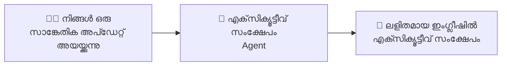

# മോഡ്യൂൾ 0 - പരിചയം

⏱️ ~10 മിനിറ്റ്

> [!WARNING]
> **മുൻവീക്ഷണം & ഹദയങ്ങൾ:** [Hosted Agents](https://learn.microsoft.com/azure/foundry/agents/concepts/hosted-agents) നിലവിൽ **പൊതു മുൻവീക്ഷണത്തിലാണ്** - ഉത്പാദന പ്രവൃത്തി ഭാരംക്കായി ശുപാർശ ചെയ്യപ്പെടുന്നില്ല. താഴെപ്പറയുന്ന കാര്യങ്ങൾ ശ്രദ്ധിക്കുക:
> - **സഹായമുള്ള പ്രദേശങ്ങൾ പരിമിതമാണ്** - വിഭവങ്ങൾ സൃഷ്ടിക്കുന്നതിന് മുമ്പ് [പ്രദേശം ലഭ്യത](https://learn.microsoft.com/azure/foundry/agents/concepts/hosted-agents#region-availability) പരിശോധിക്കുക. പിന്തുണയ്ക്കാത്ത പ്രദേശം തിരഞ്ഞെടുക്കുമ്പോൾ വിന്യാസം പിഴഞ്ഞുപോകും.
> - `azure-ai-agentserver-agentframework` പാക്കേജ് പ്രീ റിലീസിലാണ് - പതിപ്പുകൾക്കിടയിൽ APIs മാറാം.
> - സ്കെയിൽ പരിധികൾ: ഹോസ്റ്റഡ് ഏജന്റുകൾ 0–5 റിപ്ലിക്ക എന്നിവ (സ്കെയിൽ-ടു-സീറോ ഉൾപ്പെടെ) പിന്തുണയ്ക്കുന്നു.
> - ഈ വർക്ക്‍ഷോപ്പിൽ കാണിക്കുന്ന ചില സവിശേഷതകൾ സർവ്വീസ് GA യിലേക്ക് നീങ്ങുമ്പോൾ മാറാം.

## നിങ്ങൾ നിർമ്മിക്കുന്നതെന്ത്

ഈ വർക്ക്‌ഷോപ്പിൽ, നിങ്ങൾ **"Explain Like I'm an Executive"** ഏജന്റ് നിർമ്മിക്കുക - സങ്കീർണ്ണമായ സാങ്കേതിക അപ്ഡേറ്റുകൾ എടുത്ത് അവയെ ലളിതമായ ഇംഗ്ലീഷ് എക്സിക്യൂട്ടീവ് സംഗ്രഹങ്ങളായി പുനഃരചിക്കുന്നത് ഒരു ഹോസ്റ്റഡ് AI ഏജന്റ്.

```mermaid
flowchart LR
    A["🧑‍💻 നിങ്ങൾ ഒരു\nസാങ്കേതിക അപ്ഡേറ്റ് അയയ്ക്കുന്നു"] --> B["🤖 എക്‌സിക്യൂട്ടീവ് സംക്ഷേപം\nAgent"]
    B --> C["📝 ലളിതമായ ഇംഗ്ലീഷിൽ\nഎക്‍സിക്യൂട്ടീവ് സംക്ഷേപം"]
```

**ഏജന്റ് ഉപയോഗിക്കുന്നത്:**
- **Microsoft Agent Framework** - ഏജന്റ് ലൊജിക് & ഘടനയ്ക്ക്
- **Foundry Toolkit for VS Code** - സ്കാഫോൾഡ് ചെയ്യാൻ, പ്രാദേശികമായി പരീക്ഷിക്കാൻ, ഡിപ്പ്ലോയ്ചെയ്യാൻ
- **ഒരു AI മോഡൽ** (ഉദാ: `gpt-4.1-mini/gpt-5-mini`) - സംഗ്രഹങ്ങൾ സൃഷ്ടിക്കാൻ

ഈ ലാബിന്റെ അവസാനം, നിങ്ങൾ ഒരു പ്രവർത്തനക്ഷമമായ ഏജന്റ് കൈവശമായിരിക്കും, നിങ്ങൾ പ്രാദേശികമായി ഏജന്റ് ഇൻസ്‌പെക്ടർ വഴി പരീക്ഷിക്കാനും ഒരു മാറ്റമായുള്ള ഇച്ഛാനുസരിച്ചു ക്ലൗഡിലേക്ക് ഡിപ്പ്ലോയ്ചെയ്യാനും കഴിയും.

---

## ഹോസ്റ്റഡ് ഏജന്റുകൾ എന്താണ്?

**ഹോസ്റ്റഡ് ഏജന്റ്** എന്ന് പറയുന്നത് Microsoft Foundryയിൽ ഒരു മാനേജുചെയ്യപ്പെട്ട സർവീസായി പ്രവർത്തിക്കുന്ന AI ഏജന്റാണെന്ന്. നിങ്ങളുടെ സ്വന്തം ഇൻഫ്രാസ്‌ട്രക്ചർ മാനേജുചെയ്യുന്നതിന് പകരം, നിങ്ങൾ ഏജന്റ് കോഡ് ഒരു കണ്ടെയ്‌നറിൽ പാക്കേജ് ചെയ്യുന്നു, Foundry സ്കെയ്ലിംഗ്, ഹോസ്റ്റിംഗ്, സ്റ്റാൻഡേർഡ് HTTP എൻഡ്‌പോയിന്റ് വഴി അത് എക്‌സ്‌പോസ് ചെയ്യുന്നത് കൈകാര്യം ചെയ്യുന്നു.

| ആശയം | അതിന്റെ അർത്ഥം |
|---------|--------------|
| **ഏജന്റ്** | ഒരു ഉപയോഗकर्ता സന്ദേശം സ്വീകരിക്കുകയും, AI മോഡലിനെ വിളിക്കുകയും, ഘടനാപരമായ പ്രതികരണം തിരികെ നൽകുകയും ചെയ്യുന്ന നിങ്ങളുടെ പൈതൺ കോഡ് |
| **ഹോസ്റ്റഡ്** | Foundry നിങ്ങളുടെ കണ്ടെയ്ൻർ ഞബക്കുന്നു - VMകളും, Kubernetesഉം ഇൻഫ്രാ മാനേജുമെന്റും വേണ്ട |
| **പ്രതികരണങ്ങൾ പ്രോട്ടോക്കോൾ** | ഏജന്റുമായി ഇടപഴകാൻ ഏതൊരു ക്ലയന്റും വിളിക്കാവുന്ന സ്റ്റാൻഡേർഡ് HTTP API (`POST /responses`) |
| **ഏജന്റ് ഇൻസ്‌പെക്ടർ** | പ്രാദേശിക പരിശോധന UI (Foundry Toolkit-ലേക്ക് ഉൾപ്പെടുത്തിയിരിക്കുന്നത്) ഏജന്റുമായി ഡിപ്പ്ലോയ്മെന്റ് മുമ്പ് ചാറ്റ് ചെയ്യുവാൻ കഴിയും |

ഈ വർക്ക്‌ഷോപ്പിൽ, നിങ്ങൾ പൂർത്തിയായി ഹോസ്റ്റഡ് ഏജന്റ് ഉണ്ടാക്കും - അല്ലെങ്കിൽ നിങ്ങൾ ഇഷ്ടപ്പെട്ടാൽ പ്രാദേശിക പരിശോധനയിൽ തന്നെ നിർത്താം.

---

## നിങ്ങളുടെ പാത തിരഞ്ഞെടുക്കുക

> ⚠️ **തുടരുന്നതിന് മുമ്പ് ഒരു പാത തിരഞ്ഞെടുക്കുക.** നിങ്ങളുടെ തിരഞ്ഞെടുപ്പ് ഇൻസ്റ്റാൾ ചെയ്യേണ്ട ഉപകരണങ്ങളും ബാധകമായ മോഡ്യൂളുകളും നിർണ്ണയിക്കും. സബ്‌സ്‌ക്രിപ്ഷൻ ലഭിച്ചാൽ പാത B → പാത A-യിലേക്കു മാറ്റാം.

<strong>🅰️ പാത A - ആസ്യൂർ ക്ലൗഡ് (ആസ്യൂർ സബ്‌സ്‌ക്രിപ്ഷൻ ആവശ്യമാണ്)</strong>

| | വിശദാംശങ്ങൾ |
|---|---|
| **ആരെക്കായി?** | നിങ്ങൾക്കുള്ള ആസ്യൂർ സബ്‌സ്‌ക്രിപ്ഷൻ സജീവമാണ്, Foundry വിഭവങ്ങൾ സൃഷ്ടിക്കാൻ കഴിയും |
| **മോഡൽ** | Foundry വഴി ആസ്യൂർ OpenAI (ഉദാ: `gpt-4.1-mini/gpt-5-mini`) |
| **കവറുചെയ്യുന്ന മോഡ്യൂളുകൾ** | എല്ലാ മോഡ്യൂളുകളും (00–07) |
| **ക്ലൗഡിലേക്ക് ഡിപ്പ്ലോയ് ചെയ്യാൻ?** | ✅ ഉണ്ട് - പൂർണ്ണ എട്ട്-ടു-എന്റ് ഡിപ്പ്ലോയ്മെന്റ് |

<strong>🅱️ പാത B - പ്രാദേശിക / ഫ്രീ-ടീയർ (ആസ്യൂർ സബ്‌സ്‌ക്രിപ്ഷൻ ആവശ്യമില്ല)</strong>

| | വിശദാംശങ്ങൾ |
|---|---|
| **ആരെക്കായി?** | MVPമാർ, വിദ്യാർത്ഥികൾ, അല്ലെങ്കിൽ ആസ്യൂർ അഭിഗമനമില്ലാത്തവർ |
| **മോഡൽ** | **Foundry Local** (ഇടവേളയില്ല, നിങ്ങളുടെ യന്ത്രത്തിൽ പ്രവർത്തിക്കുന്നു) |
| **കവറുചെയ്യുന്ന മോഡ്യൂളുകൾ** | മോഡ്യൂളുകൾ 00–04 (ഡിപ്പ്ലോയ്മെന്റ് & ക്ലൗഡ് പരിശോധന ഒഴിവാക്കുക) |
| **ക്ലൗഡിലേക്ക് ഡിപ്പ്ലോയ് ചെയ്യാൻ?** | ❌ ഇല്ല - പ്രാദേശിക പരിശോദന മാത്രമേ ഏജന്റ് ഇൻസ്‌പെക്ടർ വഴി |

---

## എല്ലാ പാതകൾക്കും: ആവശ്യമായ ഉപകരണങ്ങൾ

താഴെയുള്ള ഓരോ ഉപകരണവും ഇൻസ്റ്റാൾ ചെയ്യുക. ഇൻസ്റ്റാൾ ചെയ്തതിനു ശേഷം പ്രവർത്തിക്കുന്നുണ്ടോ എന്ന് പരിശോധിക്കാൻ ചെക്ക് കമാൻഡ് റൺ ചെയ്യുക.

| # | ഉപകരണം | പതിപ്പ് | ഇൻസ്റ്റാൾ ചെയ്യുക | പരിശോധിക്കുക (പ്രതീക്ഷിത ഔട്ട്‌പുട്ട്) |
|---|------|---------|---------|---------------------------|
| 1 | **വിഷ്വൽ സ്റ്റുഡിയോ കോഡ്** | ഏറ്റവും പുതിയത് | [code.visualstudio.com](https://code.visualstudio.com/) | എററുകൾ കൂടാതെ തുറക്കും |
| 2 | **Python** | 3.12 അല്ലെങ്കിൽ അതിലുമധികം | [python.org/downloads](https://www.python.org/downloads/) | `python --version` $\rightarrow$ `Python 3.12.x` |
| 3 | **Foundry Toolkit for VS Code** | ഏറ്റവും പുതിയത് | എക്‌സ്‌റ്റൻഷൻ ഐഡി: `ms-windows-ai-studio.windows-ai-studio` | അക്ക്റ്റിവിറ്റി ബാറിൽ Foundry ഐക്കൺ |
| 4 | **Python extension for VS Code** | ഏറ്റവും പുതിയത് | എക്‌സ്‌റ്റൻഷൻ ഐഡി: `ms-python.python` | എക്‌സ്‌റ്റൻഷൻസ് പാനലിൽ ഇൻസ്റ്റാൾ ചെയ്തിട്ടുണ്ട് |

> [!TIP]
> **സ്ഥാപനത്തിനുള്ള പ്രൊ-ടിപ്പുകൾ:**
> - **Python PATH (Windows):** Python ഇൻസ്റ്റോളറിന്റെ ആദ്യ эк്  സ്ക്രീനിൽ എപ്പോഴും **"Add Python to PATH"** പരിശോധിക്കുക. ഇതില്ലെങ്കിൽ, ടർമിനലിൽ `python` തിരിച്ചറിയപ്പെടുകയില്ല.
> - **പല Python പതിപ്പുകൾ:** Python 3.10 ഉം 3.12 ഉം ഇരുവരും ഇൻസ്റ്റാൾ ചെയ്തിട്ടുണ്ടെങ്കിൽ, നിങ്ങളുടെ വെർച്വൽ എൻ‌വയോൺ‌മെന്റിന് ശരിയായ പതിപ്പ് ഉപയോഗിക്കുന്നതിന് `python3.12 -m venv .venv` ഉപയോഗിക്കുക.
> - **Docker WSL 2 (Windows):** Docker Desktop ഇൻസ്റ്റാളേഷൻ സമയത്ത്, **WSL 2 ബാക്ക്‌എൻഡ്** തിരഞ്ഞെടുക്കപ്പെട്ടിരിക്കുന്നുവെന്ന് ഉറപ്പാക്കുക. Docker Hyper-V ഉപയോഗിച്ച് കൂടുതൽ മന്ദഗതിയുള്ളതും Foundry കണ്ടെയ്ൻർ ബിൽഡിങ്ങിലും പ്രശ്നങ്ങൾ ഉണ്ടാകാമെന്നും ആണ്.
> - **Docker തുടങ്ങുന്നില്ല?** Docker Desktop പ്രവർത്തനമാരംഭിച്ചതിന് പിന്മേൽ 30–60 സെക്കന്റ് കാത്തിരിക്കുക. `docker info` റൺ ചെയ്യുക - "Cannot connect to the Docker daemon" എന്ന് കാണുകയുണ്ടെങ്കിൽ, Docker ഇപ്പോഴും തുടങ്ങുന്നു.
> - **VS Code എക്‌സ്‌റ്റൻഷനുകൾ ലോഡാകുന്നില്ല?** എക്‌സ്‌റ്റൻഷനുകൾ ഇൻസ്റ്റാൾ ചെയ്തതിന് ശേഷം, വിൻ‌ഡോ റീലോഡ് ചെയ്യുക: `Ctrl+Shift+P` → `Developer: Reload Window`.

> **Windows ഉപയോക്താക്കൾ:** Python ഇൻസ്റ്റാളേഷനിൽ **"Add Python to PATH"** ഔഷധം നോക്കുക.

**അടുത്തത്:** [01 - സെറ്റപ്പ് →](01-setup.md)

---

<!-- CO-OP TRANSLATOR DISCLAIMER START -->
**അറിയിപ്പ്**:
ഈ രേഖ AI പരിഭാഷാ സേവനം [Co-op Translator](https://github.com/Azure/co-op-translator) ഉപയോഗിച്ച് പരിഭാഷപ്പെടുത്തിയതാണ്. ഞങ്ങൾ കൃത്യതയ്ക്കായി ശ്രമിക്കുന്നുവെങ്കിലും, ഓട്ടോമേറ്റഡ് പരിഭാഷകളിൽ പിഴവുകൾ അല്ലെങ്കിൽ തെറ്റായ വിവരങ്ങൾ ഉണ്ടാകാൻ സാധ്യതയുണ്ട്. അതിന്റെ സ്വാഭാവിക ഭാഷയിലുള്ള അസൽ രേഖയാണ് പ്രാമാണികമായ ഉറവിടമായി പരിഗണിക്കേണ്ടത്. നിർണായകമായ വിവരങ്ങൾക്ക്, പ്രൊഫഷണൽ മനുഷ്യ പരിഭാഷ ശുപാർശ ചെയ്യുന്നു. ഈ പരിഭാഷ ഉപയോഗിച്ച് ഉണ്ടാകുന്ന തെറ്റിദ്ധാരണകൾ അല്ലെങ്കിൽ തെറ്റായ വ്യാഖ്യാനങ്ങൾക്കായി ഞങ്ങൾ ഉത്തരവാദികളല്ല.
<!-- CO-OP TRANSLATOR DISCLAIMER END -->