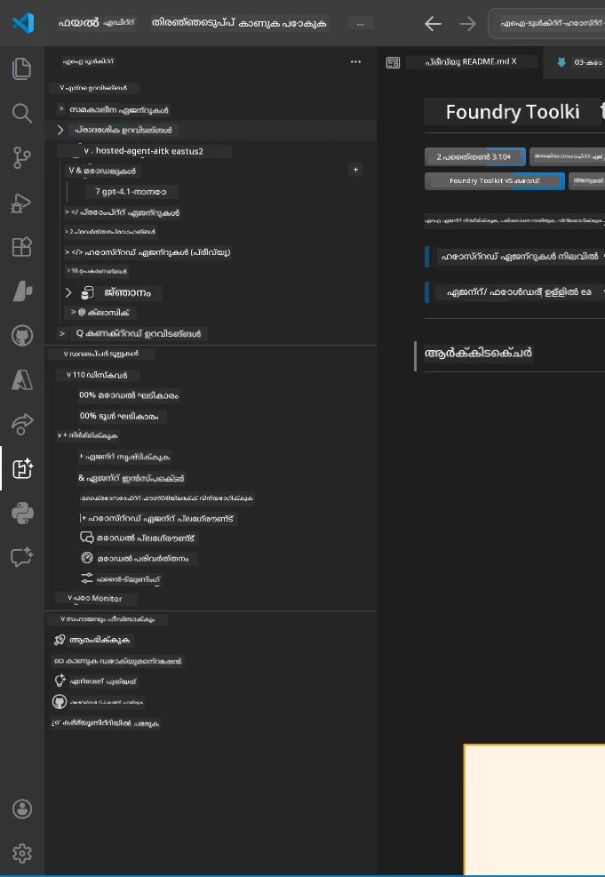
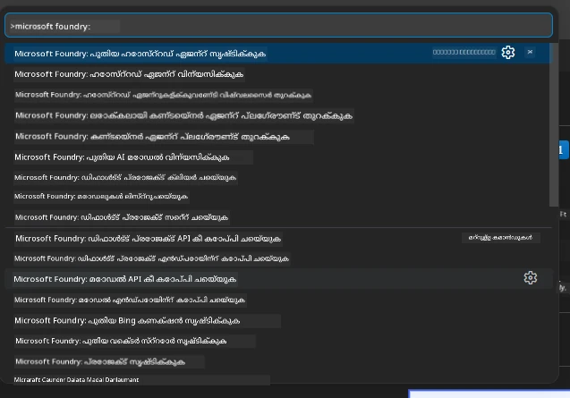

# Module 1 - ഫൗണ്ട്രീ ടൂൾകിറ്റ് & ഫൗണ്ട്രീ എക്‌സ്റ്റൻഷൻ ഇൻസ്റ്റാൾ ചെയ്യുക

ഈ മODULEൽ ഈ വർക്ഷോപ്പിനുള്ള പ്രധാന രണ്ട് VS കോഡ് എക്‌സ്റ്റൻഷനുകൾ ഇൻസ്റ്റാൾ ചെയ്യുകയും ഉറപ്പ് വരുത്തുകയും ചെയ്യുന്നതിനുള്ള വഴി ചുവടെ തന്നിരിക്കുന്നു. നിങ്ങൾ [Module 0](00-prerequisites.md) ൽ ഇതിനകം അവ ഇൻസ്റ്റാൾ ചെയ്തിട്ടുണ്ടെങ്കിൽ, അവ ശരിയായി പ്രവർത്തിക്കുന്നുവോ എന്നത് പരിശോധിക്കാൻ ഈ മODULEൽ ഉപയോഗിക്കുക.

---

## Step 1: Microsoft Foundry എക്‌സ്റ്റൻഷൻ ഇൻസ്റ്റാൾ ചെയ്യുക

**Microsoft Foundry for VS Code** എക്‌സ്റ്റൻഷൻ ഫൗണ്ട്രീ പ്രൊജക്ടുകൾ സൃഷ്ടിക്കാൻ, മോഡലുകൾ ഡിപ്പ്ലോയ് ചെയ്യാൻ, ഹോസ്റ്റുചെയ്ത ഏജന്റുകൾ സ്ഫോഫോൾഡ് ചെയ്യാൻ, VS കോഡിൽ നിന്ന് നേരിട്ട് ഡിപ്പ്ലോയ് ചെയ്യാനാണ് പ്രധാന ഉപകരണം.

1. VS കോഡ് തുറക്കുക.
2. `Ctrl+Shift+X` അമർത്തി **Extensions** പാനൽ തുറക്കുക.
3. മുകളിൽ ഉള്ള തിരയൽ ബോക്സിൽ **Microsoft Foundry** എന്ന് ടൈപ് ചെയ്യുക.
4. ഫലങ്ങളിൽ **Microsoft Foundry for Visual Studio Code** എന്ന് തുടങ്ങുന്ന ഫലം കണ്ടെത്തുക.
   - പ്രസാധകൻ: **Microsoft**
   - എക്‌സ്റ്റൻഷൻ ഐഡി: `TeamsDevApp.vscode-ai-foundry`
5. **Install** ബട്ടൺ ക്ലിക്ക് ചെയ്യുക.
6. ഇൻസ്റ്റലേഷൻ പൂർത്തിയാകുന്നതുവരെ കാത്തിരിക്കുക (ചെറിയ പ്രോഗ്രസ് സൂചക കാണാം).
7. ഇൻസ്റ്റലേഷൻ കഴിഞ്ഞാൽ, VS കോഡിന്റെ ഇടത് ഭാഗത്തെ **Activity Bar** (ഓർത്തിക്കൽ ഐക്കൺ ബാർ) നോക്കുക. ഒരു പുതിയ **Microsoft Foundry** ഐക്കൺ (വജ്രം/AI ഐക്കണു പോലുള്ളത്) കാണാം.
8. **Microsoft Foundry** ഐക്കൺ ക്ലിക്ക് ചെയ്ത് സൈഡ്ബാർ കാണുക. താഴെപ്രകാശിപ്പിക്കുന്ന വിഭാഗങ്ങൾ കാണണം:
   - **Resources** (അഥവാ Projects)
   - **Agents**
   - **Models**

> **ഐക്കൺ കാണാനില്ലെങ്കിൽ:** VS കോഡ് റീലോഡ് ചെയ്യാൻ ശ്രമിക്കുക (`Ctrl+Shift+P` → `Developer: Reload Window`).

---

## Step 2: ഫൗണ്ട്രീ ടൂൾകിറ്റ് എക്‌സ്റ്റൻഷൻ ഇൻസ്റ്റാൾ ചെയ്യുക

**Foundry Toolkit** എക്‌സ്റ്റൻഷൻ [**Agent Inspector**](https://learn.microsoft.com/azure/foundry/agents/how-to/vs-code-agents-workflow-pro-code) - ഏജന്റുകൾ ലോക്കലായി പരിശോധന ചെയ്യുന്നതിനും ഡീബഗ് ചെയ്യുന്നതിനുമായി ഉപയോഗിക്കുന്ന ദൃശ്യമേഖല - കൂടാതെ പ്ലേഗ്രൗണ്ട്, മോഡൽ മാനേജ്മെന്റ്, മൂല്യനിർണയ ഉപകരണങ്ങൾ എന്നിവ നൽകുന്നു.

1. Extensions പാനലിൽ (`Ctrl+Shift+X`), തിരയൽ ബോക്സ് ക്ളിയർ ചെയ്ത് **Foundry Toolkit** എന്ന് ടൈപ് ചെയ്യുക.
2. ഫലങ്ങളിൽ **Foundry Toolkit** കണ്ടെത്തുക.
   - പ്രസാധകൻ: **Microsoft**
   - എക്‌സ്റ്റൻഷൻ ഐഡി: `ms-windows-ai-studio.windows-ai-studio`
3. **Install** ക്ലിക്ക് ചെയ്യുക.
4. ഇൻസ്റ്റലേഷൻ കഴിഞ്ഞാൽ, Activity Barൽ **Foundry Toolkit** പുത്തൻ ഐക്കൺ (റൊബോട്ട്/സ്പാർക്കിള്‍ ഐക്കണു പോലുള്ളത്) കാണാം.
5. **Foundry Toolkit** ഐക്കൺ ക്ലിക്ക് ചെയ്ത് സൈഡ്ബാർ കാണുക. താഴെപ്പറയുന്ന ഓപ്ഷനുകളുമായി Foundry Toolkit വലപ്പുപ്രദർശനമാണ് കാണണം:
   - **Models**
   - **Playground**
   - **Agents**

---

## Step 3: രണ്ട് എക്‌സ്റ്റൻഷനുകളിൽ മാറ്റങ്ങളുണ്ടോ എന്ന് പരിശോധിക്കുക

### 3.1 Microsoft Foundry എക്‌സ്റ്റൻഷൻ ശരിയാണോ എന്ന് പരിശോധിക്കുക

1. Activity Barൽ **Microsoft Foundry** ഐക്കൺ ക്ലിക്ക് ചെയ്യുക.
2. Azureയിൽ ലോഗിൻ ചെയ്തിട്ടുണ്ടെങ്കിൽ (Module 0 മുതൽ), **Resources** വിഭവത്തിൽ നിങ്ങളുടെ പ്രൊജക്ടുകൾ കാണണം.
3. ലോഗിൻ ആവശ്യപ്പെട്ടാൽ, **Sign in** ക്ലിക്ക് ചെയ്ത് അനുമതി ലഭ്യമാക്കുക.
4. പിഴവുകളില്ലാതെ സൈഡ്ബാർ കാണാൻ ആയെന്ന് ഉറപ്പാക്കുക.

### 3.2 Foundry Toolkit എക്‌സ്റ്റൻഷൻ ശരിയാണോ എന്ന് പരിശോധിക്കുക

1. Activity Barൽ **Foundry Toolkit** ഐക്കൺ ക്ലിക്ക് ചെയ്യുക.
2. വലപ്പുപ്രദർശനം അല്ലെങ്കിൽ മെയിൻ പാനൽ പിഴവുകളില്ലാതെ തുറക്കുന്നത് സ്ഥിരീകരിക്കുക.
3. ഇതുവരെ ക്രമീകരണങ്ങൾ ആവശ്യമില്ല - [Module 5](05-test-locally.md) ൽ Agent Inspector ഉപയോഗിക്കും.

### 3.3 Command Palette വഴി പരിശോധിക്കുക

1. `Ctrl+Shift+P` അമർത്തി Command Palette തുറക്കുക.
2. **"Microsoft Foundry"** എന്ന് ടൈപ് ചെയ്യുക - താഴെപ്പറയുന്ന കമാൻഡുകൾ കാണണം:
   - `Microsoft Foundry: Create a New Hosted Agent`
   - `Microsoft Foundry: Deploy Hosted Agent`
   - `Microsoft Foundry: Open Model Catalog`
3. Command Palette بند ചെയ്യാൻ `Escape` അമർത്തുക.
4. വീണ്ടും Command Palette തുറന്ന് **"Foundry Toolkit"** ടൈപ്പ് ചെയ്യുക - താഴെപ്പറയുന്ന കമാൻഡുകൾ കാണണം:
   - `Foundry Toolkit: Open Agent Inspector`

> നിങ്ങളുടെ കമാൻഡുകൾ കാണേണ്ടത് ഇല്ലെങ്കിൽ, എക്‌സ്റ്റൻഷനുകൾ ശരിയായി ഇൻസ്റ്റാൾ ചെയ്തിട്ടില്ല.എങ്കിൽ അവ ഇൻസ്റ്റാൾ ചെയ്ത് വീണ്ടും ശ്രമിക്കുക.

---

## ഈ എക്‌സ്റ്റൻഷനുകൾ ഈ വർക്ഷോപ്പിൽ ചെയ്യുന്നത് എന്ത്?

| എക്‌സ്റ്റൻഷൻ | ഇത് ചെയ്യുന്നത് | നിങ്ങൾ ഉപയോഗിക്കുന്ന സമയങ്ങൾ |
|--------------|---------------|----------------------------|
| **Microsoft Foundry for VS Code** | ഫൗണ്ട്രീ പ്രോജക്ടുകൾ സൃഷ്ടിക്കുക, മോഡലുകൾ ഡിപ്പ്ലോയ് ചെയ്യുക, **[hosted agents](https://learn.microsoft.com/azure/foundry/agents/concepts/hosted-agents)** സ്ഫോഫോൾഡ് ചെയ്യുക (`agent.yaml`, `main.py`, `Dockerfile`, `requirements.txt` സ്വയമേധയാ സൃഷ്ടിക്കുന്നു), [Foundry Agent Service](https://learn.microsoft.com/azure/foundry/agents/overview) ലേക്ക് ഡിപ്പ്ലോയ്മെന്റ് | Modules 2, 3, 6, 7 |
| **Foundry Toolkit** | ഏജന്റ് ഇൻസ്പെക്ടർ - ലോക്കൽ ടെസ്റ്റിംഗിനും ഡീബഗിനും, പ്ലേഗ്രൗണ്ട്, മോഡൽ മാനേജ്മെന്റ് | Modules 5, 7 |

> **Foundry എക്‌സ്റ്റൻഷൻ ആണ് ഈ വർക്ഷോപ്പിലെ ഏറ്റവും വിനോദമായ ടൂൾ.** ഇത് എല്ലാ പ്രക്രിയകളും കൈകാര്യം ചെയ്യുന്നു: സ്ഫോഫോൾഡ് → ക്രമീകരിക്കുക → ഡിപ്പ്ലോയ് → പരിശോധിക്കുക. Foundry Toolkit ഇതെ補助ിക്കുന്നു ലോക്കൽ ടെസ്റ്റിംഗിനായി ദൃശ്യമായ Agent Inspector നൽകുന്നതിൽ.

---

### Checkpoint

- [ ] Activity Barിൽ Microsoft Foundry ഐക്കൺ കാണണം
- [ ] അതിൽ ക്ലിക്ക് ചെയ്തത് പിഴവുകളില്ലാതെ സൈഡ്ബാർ തുറക്കണം
- [ ] Activity Barൽ Foundry Toolkit ഐക്കൺ കാണണം
- [ ] അതിൽ ക്ലിക്ക് ചെയ്തത് പിഴവുകളില്ലാതെ സൈഡ്ബാർ തുറക്കണം
- [ ] `Ctrl+Shift+P`ൽ "Microsoft Foundry" ടൈപ് ചെയ്‌തുൽ ലഭ്യമായ കമാൻഡുകൾ കാണണം
- [ ] `Ctrl+Shift+P`ൽ "Foundry Toolkit" ടൈപ് ചെയ്‌തുൽ ലഭ്യമായ കമാൻഡുകൾ കാണണം

---

**മുൻപ്:** [00 - Prerequisites](00-prerequisites.md) · **അടുത്തത്:** [02 - Create Foundry Project →](02-create-foundry-project.md)

---

<!-- CO-OP TRANSLATOR DISCLAIMER START -->
**വിവാദസമ്മതം**:  
ഈ ഡോക്യുമെന്റ് AI വാക്കാന്തര്‍വ്യൂ സേവനം [Co-op Translator](https://github.com/Azure/co-op-translator) ഉപയോഗിച്ചാണ് വിവര്‍ത്തനം ചെയ്യപ്പെട്ടിരിക്കുന്നത്. നാം ശരിയായി വിവര്‍ത്തനം ചെയ്യാനുള്ള ശ്രമം നടത്തുന്നുണ്ടെങ്കിലും, ഓട്ടോമാറ്റഡ് വിവര്‍ത്തനങ്ങളില് ദോഷങ്ങളും പിശകുകളും ഉണ്ടാകാമെന്നുള്ള കാര്യം അവഗണിക്കരുത്. അതിന്റെ ജന്മഭൂമിയിലെ ഭാഷയിലുള്ള മൗലിക ഡോക്യുമെന്റാണ് അഥോറിറ്റേറ്റീവ് ഉറവിടമായിരിക്കുന്നത്. ഗൗരവമുള്ള വിവരങ്ങള്‍ക്കായി പ്രൊഫഷണല്‍ മനുഷ്യ വിവര്‍ത്തനം ശുപാര്‍ശ ചെയ്യപ്പെടുന്നു. ഈ വിവര്‍ത്തനം ഉപയോഗിക്കുന്നതിലൂടെ ഉണ്ടാവുന്ന തെറ്റിദ്ധാരണകള്‍ക്കും വ്യാഖ്യാനങ്ങള്‍ക്കും ഞങ്ങള് ഉത്തരവാദിത്വം സ്വീകരിക്കുന്നില്ല.
<!-- CO-OP TRANSLATOR DISCLAIMER END -->