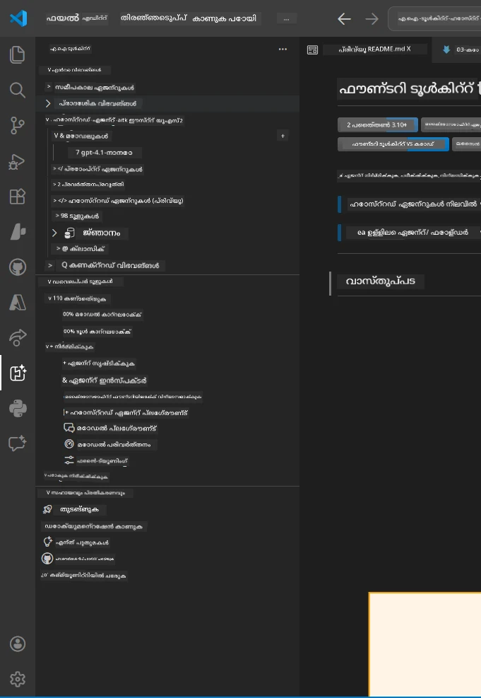
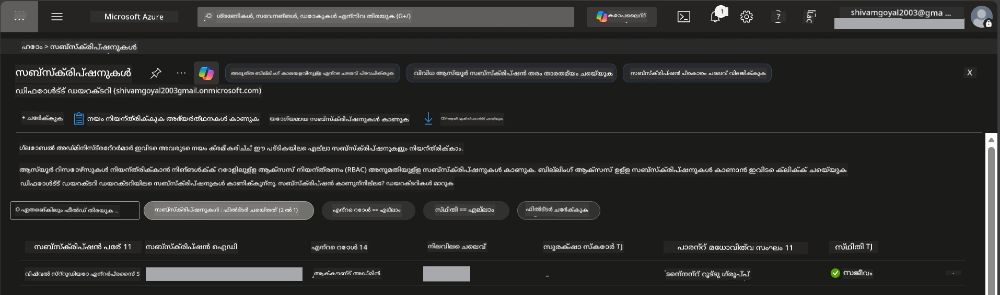
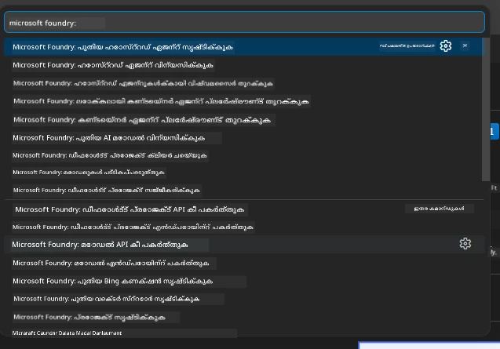
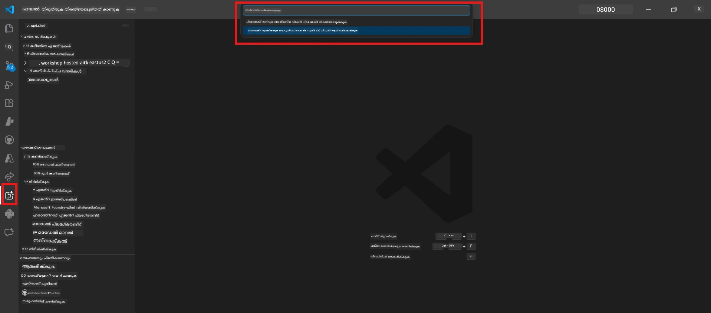
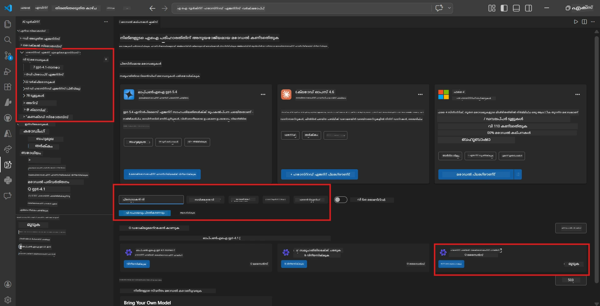
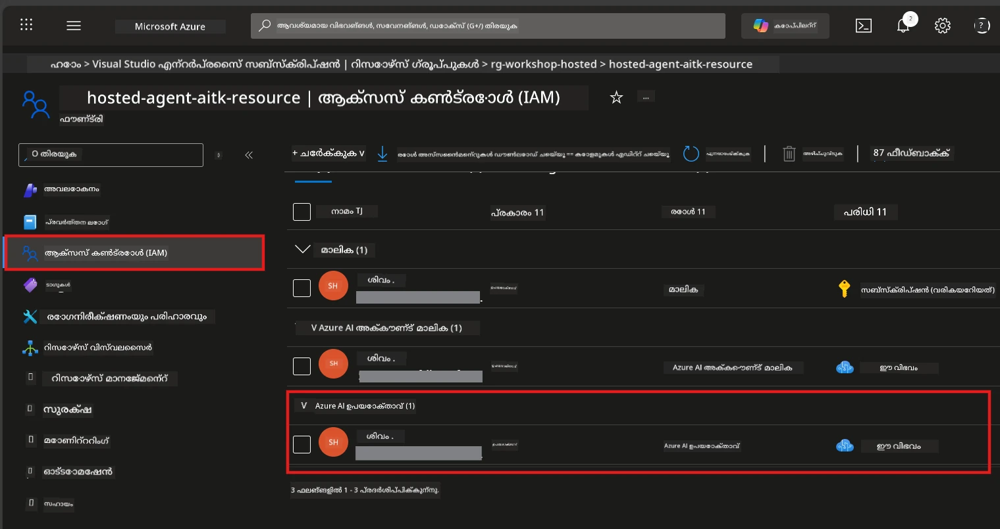

# ക്രമീകരണം: എക്സ്റ്റൻഷൻ, പ്രോജക്റ്റ് & മോഡൽ

⏱️ ~15 മിനിറ്റ്

ഈ മൊഡ്യൂളിൽ, നിങ്ങൾ ഫൗണ്ട്രി ടൂൾകിറ്റ് എക്സ്റ്റൻഷൻ ഇൻസ്റ്റാൾ ചെയ്ത് സത്യപ്പെടുത്തുകയും, ഒരു ഫൗണ്ട്രി പ്രോജക്റ്റ് നിർമ്മിച്ച് (അല്ലെങ്കിൽ കണക്ട് ചെയ്ത്) നിങ്ങളുടെ ഏജന്റ് ഉപയോഗിക്കുന്ന ഒരു മോഡൽ വിന്യസിക്കുകയും ചെയ്യും.

## ഘട്ടം 1: ഫൗണ്ട്രി ടൂൾകിറ്റ് ഇൻസ്റ്റാൾ ചെയ്യുക

**VS கோഡ്-നുള്ള ഫൗണ്ട്രി ടൂൾകിറ്റ്** ഈ വർക്ക്‌ഷോപ്പിന് പ്രധാന എക്സ്റ്റൻഷനാണ്. ഇത് പ്രോജക്റ്റ് സൃഷ്ടി, മോഡൽ വിന്യാസം, ഏജന്റ് സ്കഫോൾഡിംഗ്, ലോക്കൽ ടെസ്റ്റിങ് (ഏജന്റ് ഇൻസ്‌പെക്ടർ), ക്ലൗഡ് വിന്യാസം എന്നിവ VS Code-ൽ നിന്നെല്ലാം നൽകുന്നു.

1. VS Code തുറന്ന് `Ctrl+Shift+X` അമർത്തി **എക്സ്റ്റൻഷനുകൾ** പാനൽ തുറക്കുക.
2. **Foundry Toolkit** തിരയുക.
3. **Foundry Toolkit for VS Code** (പബ്ലിഷർ: Microsoft, ഐഡി: `ms-windows-ai-studio.windows-ai-studio`) ഇൻസ്റ്റാൾ ചെയ്യുക.
4. ഇൻസ്റ്റാളേഷൻ കഴിഞ്ഞ്, **Foundry Toolkit** ചിഹ്നം ആക്ടിവിറ്റി ബാറിൽ (ഇടതുപാടം) പ്രത്യക്ഷമാകുന്നു.

> *കുറിപ്പ്: പഴയ എക്സ്റ്റൻഷൻ പതിപ്പുകളിൽ ആക്ടിവിറ്റി ബാറിൽ "AI TOOLKIT" കാണിക്കാം. പ്രവർത്തന ശേഷി ഒട്ടുമിക്കന്നും ഒരുപോലെയാണ്.*



## ഘട്ടം 2: നിങ്ങളുടെ പ്രവേശനാനുസരിച്ച് ക്രമീകരിക്കുക

> **നിങ്ങളുടെ വഴി തിരഞ്ഞെടുക്കുക:** താഴെയുള്ള വിഭാഗം നിങ്ങളുടെ ക്രമീകരണമനുസരിച്ച് വിപുലീകരിക്കുക. നിങ്ങൾക്ക് നിർബന്ധമായും **ഒരു** വഴി മാത്രമേ പൂർത്തിയാക്കേണ്ടതുള്ളൂ.

<details>
<summary><strong>🅰️ വഴികാട്ടി A - ആസ്യൂർ ക്ലൗഡ് (ആസ്യൂർ സബ്സ്ക്രിപ്ഷൻ ആവശ്യം)</strong></summary>

### ആസ്യൂർ CLI

1. [learn.microsoft.com/cli/azure/install-azure-cli](https://learn.microsoft.com/cli/azure/install-azure-cli)-നിൽ നിന്ന് ഇൻസ്റ്റാൾ ചെയ്യുക.
2. സ്ഥിരീകരിക്കുക: `az --version` (2.80.0+ ആയിരിക്കണം).
3. സൈൻ ഇൻ ചെയ്യുക: `az login`

### അസ്ഥിരതാ ഓപ്ഷനുകൾ

[Microsoft Agent Framework](https://learn.microsoft.com/agent-framework/overview/) [`DefaultAzureCredential`](https://learn.microsoft.com/azure/developer/python/sdk/authentication/credential-chains#defaultazurecredential-overview) ഉപയോഗിക്കുന്നു, ഇത് പല അസ്ഥിരതാ മാർഗ്ഗങ്ങൾ പരിഗണിക്കുന്നു. നിങ്ങളുടെ പരിസ്ഥിതിക്ക് അനുയോജ്യമായത് തിരഞ്ഞെടുക്കുക:

#### ഓപ്ഷൻ 1: VS Code അക്കൗണ്ടുകൾ (വർക്ക്‌ഷോപ്പുകൾക്കായി ശിപാർശ ചെയ്യുന്നു)
1. VS Code-ൽ താഴേ വലത്തുവശത്ത് ഉള്ള **Accounts** ഐകോൺ (പേര്‌സൺ സില്വഹേറ്റ്) ക്ലിക്ക് ചെയ്യുക.
2. **Microsoft Foundry ഉപയോഗിക്കുവാനായി സൈന് ഇൻ ചെയ്യുക** (അല്ലെങ്കിൽ **Azure-യോടെ സൈന് ഇൻ ചെയ്യുക**) തിരഞ്ഞെടുക്കുക.
3. ഒരു ബ്രൗസർ തുറക്കുന്നു - നിങ്ങളുടെ സബ്സ്ക്രിപ്ഷൻ ഉൾപ്പെടുന്ന ആസ്യൂർ അക്കൗണ്ടിൽ സൈൻ ഇൻ ചെയ്യുക.
4. VS Code-ലേക്ക് മടങ്ങുക. ഇടത്തുവശത്ത് താഴെ നിങ്ങളുടെ അക്കൗണ്ട് പേര് പ്രത്യക്ഷപ്പെടും.

#### ഓപ്ഷൻ 2: ആസ്യൂർ CLI
```bash
az login
az account set --subscription "<your-subscription-id>"
```

#### ഓപ്ഷൻ 3: സർവീസ് പ്രിൻസിപ്പൽ (എന്റർപ്രൈസ്/CI)
ലോക്ക്ഡ് ഡൗൺ പരിസ്ഥിതികളിലോ CI/CD പൈപ്പ്‌ലൈൻമാരിലോ നിങ്ങളുടെ `.env` ഫയലിൽ താഴെ വാസ്തവം ചേർക്കുക:
```env
AZURE_TENANT_ID=<your-tenant-id>
AZURE_CLIENT_ID=<your-client-id>
AZURE_CLIENT_SECRET=<your-client-secret>
```

> **`DefaultAzureCredential` എങ്ങനെ പ്രവർത്തിക്കുന്നു:** ആദ്യം പരിസ്ഥിതി വേരിയബിളുകൾ പരിശോദിക്കുന്നു, പിന്നെ മാനേജുചെയ്ത തിരിച്ചറിയൽ, പിന്നെ VS Code സൈൻ ഇൻ, അതിന് ശേഷം ആസ്യൂർ CLI - ആദ്യം വിജയിക്കുന്നതുപയോഗിക്കുന്നു. [കറഡൻഷ്യൽ ചെയിൻ ഡോക്സ്](https://learn.microsoft.com/azure/developer/python/sdk/authentication/credential-chains#defaultazurecredential-overview) കാണുക.

### ആസ്യൂർ ഡെവലപ്പർ CLI (azd)

1. ഇൻസ്റ്റാൾ ചെയ്യുക: `winget install microsoft.azd` (Windows) അല്ലെങ്കിൽ [ഇൻസ്റ്റൾ ഡോക്സ്](https://learn.microsoft.com/azure/developer/azure-developer-cli/install-azd) കാണുക.
2. സ്ഥിരീകരിക്കുക: `azd version`
3. സൈൻ ഇൻ: `azd auth login`

### ഡോക്കർ ഡെസ്ക്ടോപ് (ഐച്ഛികം)

നിങ്ങൾക്ക് കോൺറ്റെയ്‌നറുകൾ ലോക്കലിൽ നിർമ്മിക്കേണ്ടതുണ്ടെങ്കിൽ മാത്രമേ ഡോക്കർ ആവശ്യമായിരിക്കുക. ഫൗണ്ട്രി എക്സ്റ്റൻഷൻ വിന്യാസത്തിനിടെ ഇൻസ്റ്റാളേഷൻ സ്വയം കൈകാര്യം ചെയ്യും.

1. [docs.docker.com/get-docker](https://docs.docker.com/get-docker/) -നിൽ നിന്ന് ഇൻസ്റ്റാൾ ചെയ്യുക.
2. സ്ഥിരീകരിക്കുക: `docker info`

### ആസ്യൂർ സബ്സ്ക്രിപ്ഷൻ & RBAC

1. [portal.azure.com](https://portal.azure.com)-ൽ സൈൻ ഇൻ ചെയ്യുക.
2. **Subscriptions**-ലേക്ക് പോയി കുറഞ്ഞതും ഒരു സജീവമായ സബ്സ്ക്രിപ്ഷൻ ഉറപ്പാക്കുക.
3. നിങ്ങളുടെ **Subscription ID** ശ്രദ്ധിക്കുക - ഇത് മോഡ്യൂൾ 01-ൽ ആവശ്യമാകും.



#### RBAC സ്ഥിതിവിവര പട്ടിക

[Hosted Agent](https://learn.microsoft.com/azure/foundry/agents/concepts/hosted-agents) വിന്യാസത്തിന് സാധാരണ Azure `Owner`യും `Contributor`ഉം കവർ ചെയ്യാത്ത **ഡാറ്റ പ്രവർത്തന** അനുമതികൾ ആവശ്യമാണ്. താഴെയുള്ള പട്ടികയിൽ നിങ്ങൾക്ക് ആവശ്യമായ റോളുകൾ തീരുമാനിക്കാം:

| സ്ഥിതി | ആവശ്യമായ റോളുകൾ | ഏത് ഇടത്താണ് നല്കേണ്ടത് |
|----------|---------------|----------------------|
| പുതിയ ഫൗണ്ട്രി പ്രോജക്റ്റ് സൃഷ്ടിക്കുക | ഫൗണ്ട്രി റിസോഴ്‌സിൽ **Azure AI Owner** | ആസ്യൂർ പോർട്ടലിലെ ഫൗണ്ട്രി റിസോഴ്‌സ് |
| നിലവിലുള്ള പ്രോജക്റ്റിലേക്ക് വിന്യാസം (പുതിയ റിസോഴ്‌സുകൾ) | സബ്സ്ക്രിപ്ഷനിൽ **Azure AI Owner** + **Contributor** | സബ്സ്ക്രിപ്ഷൻ + ഫൗണ്ട്രി റിസോഴ്‌സ് |
| പൂര്‍ണ്ണമായി ക്രമീകരിച്ച പ്രോജക്റ്റിലേക്ക് വിന್ಯಾಸം | അക്കൗണ്ടിൽ **Reader** + പ്രൊജക്റ്റിൽ **Azure AI User** | ആസ്യൂർ പോർട്ടലിലെ അക്കൗണ്ട് + പ്രോജക്റ്റ് |
| ലോക്കൽ ടെസ്റ്റിംഗിന് മാത്രം (വിന്യാസമില്ല) | പ്രോജക്റ്റിൽ **Azure AI User** | ആസ്യൂർ പോർട്ടലിലെ പ്രോജക്റ്റ് |

> **പ്രധാന പോയിന്റ്:** ആസ്യൂർ `Owner` & `Contributor` റോളുകൾ *മേധാവിത്വ* അനുമതികൾക്കായി മാത്രമാണ് (ARM ഓപ്പറേഷനുകൾ). ഏജന്റുകൾ സൃഷ്ടിക്കുന്നതിനും വിന്യസിക്കുന്നതിനും ആവശ്യമുള്ള `agents/write` പോലുള്ള *ഡാറ്റ പ്രവർത്തനങ്ങൾക്കായി* [**Azure AI User**](https://learn.microsoft.com/azure/foundry/concepts/rbac-foundry#built-in-roles) (അഥവാ അതിനുമിച്ചു മുകളിൽ) ആവശ്യമാണ്.

## ഫൗണ്ട്രി പ്രോജക്റ്റ് കണക്ട് ചെയ്യുക അല്ലെങ്കിൽ സൃഷ്ടിക്കുക



1. `Ctrl+Shift+P` അമർത്തുക → **Foundry Toolkit: Create Project** ടൈപ്പ് ചെയ്യുക → തെരഞ്ഞെടുത്ത് നിർവഹിക്കുക.
2. നിങ്ങളുടെ **ആസ്യൂർ സബ്സ്ക്രിപ്ഷൻ** ഡ്രോപ്‌ഡൗണിൽ നിന്ന് തിരഞ്ഞെടുക്കുക.
3. ഒരു **റിസോഴ്‌സ് ഗ്രൂപ്പ്** തിരഞ്ഞെടുക്കുക അല്ലെങ്കിൽ സൃഷ്ടിക്കുക (ഉദാ., `rg-hosted-agents-workshop`).
4. ഹോസ്റ്റഡ് ഏജന്റുകൾക്ക് പിന്തുണയുള്ള ഒരു **മേഖല** തിരഞ്ഞെടുക്കുക: `East US`, `West US 2`, അല്ലെങ്കിൽ `Sweden Central`. [മേഖല ലഭ്യത](https://learn.microsoft.com/azure/foundry/agents/concepts/hosted-agents#region-availability) കാണുക.
5. ഒരു പ്രോജക്റ്റ് പേര് നൽകുക (ഉദാ., `workshop-agents`).
6. പ്രൊവിഷനിംഗ് പൂർത്തിയാകാൻ 2–5 മിനിറ്റ് കാത്തിരിക്കൂ. പ്രഗതിശീലന അറിയിപ്പ് VS Code-ൽ പ്രത്യക്ഷപ്പെടും.
7. പൂർത്തിയായി കഴിഞ്ഞാൽ, നിങ്ങളുടെ പ്രോജക്റ്റ് **Foundry Toolkit** സൈഡ്‌ബാരിൽ **MY RESOURCES** വിഭാഗത്തിന് കീഴിൽ കാണാം.



## ഒരു മോഡൽ വിന്യസിക്കുക & RBAC നിയോഗിക്കുക

നിങ്ങളുടെ ഹോസ്റ്റഡ് ഏജന്റിന് പ്രതികരണങ്ങൾ സൃഷ്ടിക്കാനായി ഒരു AI മോഡൽ ആവശ്യമുണ്ട്.

#### മോഡൽ തിരഞ്ഞെടുപ്പ് മാട്രിക്സ്
നിങ്ങളുടെ ആവശ്യകതകൾ അനുസരിച്ച് നിങ്ങൾക്ക് വ്യത്യസ്ത മോഡൽ തരങ്ങളിൽ നിന്ന് തിരഞ്ഞെടുക്കാം:

| മോഡൽ | ഏറ്റവും നല്ലത് | ചെലവ് | കുറിപ്പുകൾ |
|-------|----------|------|-------|
| `gpt-4.1` | ഉയർന്ന നിലവാരമുള്ള, വിശദമായ പ്രതികരണങ്ങൾ | കൂടിയത് | മെച്ചപ്പെട്ട ഫലങ്ങൾ, അവസാന പരിശോധനയ്ക്ക് ശിപാർശചെയ്യുന്നു |
| `gpt-4.1-mini/gpt-5-mini` | വേഗത്തിലുള്ള ആവർത്തനം, കുറഞ്ഞ ചെലവ് | കുറവായത് | വർക്ക്‌ഷോപ്പ് വികസനത്തിനും വേഗം പരീക്ഷണത്തിനും നല്ലത് |
| `gpt-4.1-nano` | ലഘുവായ പ്രവർത്തനങ്ങൾ | ഏറ്റവും കുറഞ്ഞത് | ചെലവ് കുറഞ്ഞതും, എങ്കിലും ലളിതമായ പ്രതികരണങ്ങൾ നൽകുന്ന മോഡൽ |

1. `Ctrl+Shift+P` അമർത്തുക → **Foundry Toolkit: Open Model Catalog** (അല്ലെങ്കിൽ സൈഡ്‌ബാറിൽ DEVELOPER TOOLSക്കു കീഴിൽ **Model Catalog** ക്ലിക്ക് ചെയ്യുക).
2. കാറ്റലോഗിൽ **gpt-4.1** തിരയുക.
3. **OpenAI GPT-4.1-mini** (ഒരു മെച്ചപ്പെട്ട ഗുണമേന്മയ്ക്ക് `gpt-5-mini`) കണ്ടെത്തി **Deploy** ക്ലിക്ക് ചെയ്യുക.



4. വിന്യാസ കോൺഫിഗറേഷനിൽ:
   - **Deployment name:** ഡിഫാൾട്ട് അംഗീകരിക്കുക അല്ലെങ്കിൽ ഒരു കസ്റ്റം പേര് നൽകുക. **ഈ പേര് ഓർക്കുക.**
   - **Target:** **Deploy to Foundry Toolkit** തിരഞ്ഞെടുക്കുക → നിങ്ങളുടെ പ്രോജക്റ്റ് തിരഞ്ഞെടുക്കുക.
5. **Deploy** ക്ലിക്ക് ചെയ്ത് 1–3 മിനിറ്റ് കാത്തിരിക്കൂ.

> **ശിപാർശ:** വർക്ക്‌ഷോപ്പിനായി `gpt-4.1-mini/gpt-5-mini` ഉപയോഗിക്കുക - വേഗതയുള്ളത്, ചെലവ് കുറഞ്ഞത്, നല്ല ഫലങ്ങൾ ലഭിക്കുന്നു.

### നിങ്ങളുടെ മൂല്യങ്ങൾ ശ്രദ്ധിക്കൂ

വിന്യാസത്തിന് ശേഷം, ഈ രണ്ട് മൂല്യങ്ങളും ശ്രദ്ധിക്കുക (മോഡ്യൂൾ 03-ൽ ഇവ ആവശ്യമാകും):

| മൂല്യം | എവിടെയാണ് കണ്ടെത്തേണ്ടത് |
|-------|-----------------|
| **Project endpoint** | സൈഡ്‌ബാറിൽ നിങ്ങളുടെ പ്രോജക്റ്റ് ക്ലിക്ക് ചെയ്യുക → വിശദവിവരവ്യൂഹത്തിൽ URL കാണിക്കും (ഉദാ., `https://<account>.services.ai.azure.com/api/projects/<project>`) |
| **Model deployment name** | പ്രോജക്റ്റ് വിപുലീകരിക്കുകയും → **Models** → നിങ്ങളുടെ വിന്യസിച്ച മോഡലിനടുത്തുള്ള പേര് (ഉദാ., `gpt-4.1-mini/gpt-5-mini`) |

### RBAC റോൾ നൽകി

> ⚠️ **ഇത് ഏറ്റവും സാധാരണമായി മറക്കുന്ന ഘട്ടമാണ്.** ശരിയായ റോൾ ഇല്ലെങ്കിൽ, മോഡ്യൂൾ 05-ൽ വിന്യാസം പരാജയപ്പെടും.

#### എനിക്ക് ഏതു റോൾ വേണം?
നിങ്ങളുടെ സാഹചര്യമനുസരിച്ച്, താഴെയുള്ള റോൾ ഏകീകരണങ്ങൾ ആവശ്യമാണ്:

| സ്ഥിതി | ആവശ്യമായ റോളുകൾ | ഏത് ഇടത്താണ് നല്കേണ്ടത് |
|----------|---------------|----------------------|
| പുതിയ ഫൗണ്ട്രി പ്രോജക്റ്റ് സൃഷ്ടിക്കുക | ഫൗണ്ട്രി റിസോഴ്‌സിൽ **Azure AI Owner** | ആസ്യൂർ പോർട്ടലിലെ ഫൗണ്ട്രി റിസോഴ്‌സ് |
| നിലവിലുള്ള പ്രോജക്റ്റിലേക്ക് വിന്യാസം (പുതിയ റിസോഴ്‌സുകൾ) | സബ്സ്ക്രിപ്ഷനിൽ **Azure AI Owner** + **Contributor** | സബ്സ്ക്രിപ്ഷൻ + ഫൗണ്ട്രി റിസോഴ്‌സ് |
| പൂര്‍ണമായി ക്രമീകരിച്ച പ്രോജക്റ്റിലേക്ക് വിന്യാസം | അക്കൗണ്ടിൽ **Reader** + പ്രൊജക്റ്റിൽ **Azure AI User** | ആസ്യൂർ പോർട്ടലിലെ അക്കൗണ്ട് + പ്രോജക്റ്റ് |

**പ്രധാന പോയിന്റ്:** ആസ്യൂർ `Owner` & `Contributor` റോളുകൾ* മാനേജ്മെന്റ് അനുമതികൾക്കായി മാത്രമാണ്. ഏജന്റുകൾ സൃഷ്ടിക്കാനും വിന്യസിക്കാനും ആവശ്യമായ *ഡാറ്റ പ്രവർത്തനങ്ങൾക്കായി* **Azure AI User** (അഥവാ അതിനുമധികം) വേണം.

1. [portal.azure.com](https://portal.azure.com) തുറക്കുക.
2. നിങ്ങളുടെ **ഫൗണ്ട്രി പ്രോജക്റ്റിന്റെ** പേര് തിരയുക → ടൈപ്പ് **"Foundry Toolkit project"** ഉള്ള ഫലം ക്ലിക്ക് ചെയ്യുക (പാരന്റ് അക്കൗണ്ട് അല്ല).
3. ഇടതുവശത്തുള്ള നാവിഗേഷനിൽ **Access control (IAM)** ക്ലിക്ക് ചെയ്യുക.
4. **+ Add** → **Add role assignment** ക്ലിക്ക് ചെയ്യുക.
5. **Role tab:** **Azure AI User** തിരയുക, തിരഞ്ഞെടുക്കുക, **Next** ക്ലിക്ക് ചെയ്യുക.
6. **Members tab:** **User, group, or service principal** തിരഞ്ഞെടുക്കുക → **+ Select members** ക്ലിക്ക് ചെയ്യുക → നിങ്ങളെ കണ്ടെത്തി തിരഞ്ഞെടുക്കുക → **Select** ക്ലിക്ക് ചെയ്യുക.
7. **Review + assign** → വീണ്ടും **Review + assign** ക്ലിക്ക് ചെയ്യുക.
8. പ്രചരണം നടപ്പാക്കാൻ **1–2 മിനിറ്റുകൾ കാത്തിരിക്കുക**.

> **എന്തിന് ഈ റോൾ?** ആസ്യൂർ `Owner`/`Contributor`-കൾക്ക് മാനേജ്മെന്റ് അനുമതികൾ മാത്രമേ ലഭ്യമായുള്ളൂ. **Azure AI User** റോൾ `agents/write` ഡാറ്റ പ്രവർത്തനം അനുവദിക്കുന്നു, ഏജന്റുകൾ സൃഷ്ടിക്കാനും വിന്യസിക്കാനും ആവശ്യമായത്. [Foundry RBAC ഡോക്യുമെന്റുകൾ](https://learn.microsoft.com/azure/foundry/concepts/rbac-foundry#built-in-roles) കാണുക.



</details>

<details>
<summary><strong>🅱️ വഴികാട്ടി B - ലോക്കൽ / സൗജന്യ-തരം (ആസ്യൂർ സബ്സ്ക്രിപ്ഷൻ ആവശ്യമില്ല)</strong></summary>

### ഫൗണ്ട്രി ലോക്കൽ

ഫൗണ്ട്രി ലോക്കൽ ഉപയോഗിച്ച് നിങ്ങൾക്ക് നിങ്ങളുടെ സ്വന്തം മെഷീനിൽ AI മോഡലുകൾ പ്രവർത്തിപ്പിക്കാം - ക്ലൗഡ് അക്കൗണ്ട് ആവശ്യമില്ല. താഴെപറഞ്ഞ പദവികളിലൂടെ ഫൗണ്ട്രി ലോക്കൽ മോഡലുകൾ ഫൗണ്ട്രി ടൂൾകിറ്റ് മുഖേന ആക്സസ് ചെയ്യാം:

1. ഫൗണ്ട്രി ടൂൾകിറ്റ് എക്സ്റ്റന്​ഷന്​്റെ ഭാഗത്തേക്ക് പോകുക.
2. ഫൗണ്ട്രി ടൂൾകിറ്റ് നാവിഗേഷനിൽ **Developer Tools** > **Model Catalog** തിരഞ്ഞെടുക്കുക.
3. പുതിയ വിൻഡോയിലായി, നാവിഗേഷൻ ബാറിൽ നിന്നുള്ള **local** തിരഞ്ഞെടുക്കുക.
4. താഴേക്ക് സ്‌ക്രോൾ ചെയ്ത് **Phi 4 Mini** കാണുക, **add button** ക്ലിക്ക് ചെയ്യുക. മോഡൽ ഡൗൺലോഡ് ആവുന്നത് സൂചിപ്പിക്കുന്ന ഒരു പോപ്അപ്പ് കാണിക്കും.
5. മോഡൽ ഡൗൺലോഡ് ചെയ്തോ ഉടനെ അടുത്ത ഘട്ടത്തിലേക്ക് പോകാം.

</details>

### ✅ ചെക്പോയിന്റ്


- [ ] `Ctrl+Shift+P` → "Foundry Toolkit" ലഭ്യമായ കമാൻഡുകൾ കാണിക്കുന്നു
- [ ] ഫൗണ്ട്രി ടൂൾകിറ്റ് എക്സ്റ്റൻഷൻ ഇൻസ്റ്റാൾ ചെയ്ത് സൈഡ്‌ബാർ പിഴവുകൾ കൂടാതെ ലോഡ് ചെയ്യുന്നു
- [ ] VS Code ശരിയായി തുറക്കും, പ്രവർത്തിക്കും
- [ ] `python --version` 3.10+ കാണിക്കുന്നു
- [ ] ഫൗണ്ട്രി ടൂൾകിറ്റ് ഐകോൺ VS Code ആക്‌ടിവിറ്റി ബാറിൽ കാണാം
- [ ] **വഴികാട്ടി A:** `az login` വിജയിച്ച്, സബ്സ്ക്രിപ്ഷൻ സജീവമാണ്
- [ ] **വഴികാട്ടി B:** ഫൗണ്ട്രി ലോക്കൽ പ്രവർത്തിക്കുന്നു (`foundry local status`)
- [ ] **വഴികാട്ടി A:** ഫൗണ്ട്രി പ്രോജക്റ്റ് സൈഡ്‌ബാറിൽ കാണാമായിട്ടുണ്ട്, മോഡൽ വിന്യസിച്ചിട്ടുണ്ട്, Azure AI User റോൾ നൽകിയിട്ടുണ്ട്
- [ ] **വഴികാട്ടി B:** ഫൗണ്ട്രി ലോക്കൽ മോഡലുമായി പ്രവർത്തിക്കുന്നു
- [ ] നിങ്ങൾ നിങ്ങളുടെ **endpoint**യും **model deployment name**യും രേഖപ്പെടുത്തിയിട്ടുണ്ട്


**മുമ്പത്തെ:** [00 - മുൻഗണനകളും](00-prerequisites.md) · **അടുത്തത്:** [02 - ഹോസ്റ്റഡ് ഏജന്റ് സൃഷ്ടിക്കുക →](02-create-hosted-agent.md)

---

<!-- CO-OP TRANSLATOR DISCLAIMER START -->
**അറിയിപ്പ്**:
ഈ രേഖ AI പരിഭാഷാ സേവനം [Co-op Translator](https://github.com/Azure/co-op-translator) ഉപയോഗിച്ച് പരിഭാഷപ്പെടുത്തിയതാണ്. ഞങ്ങൾ കൃത്യതയ്ക്കായി ശ്രമിക്കുന്നുവെങ്കിലും, ഓട്ടോമേറ്റഡ് പരിഭാഷകളിൽ പിഴവുകൾ അല്ലെങ്കിൽ തെറ്റായ വിവരങ്ങൾ ഉണ്ടാകാൻ സാധ്യതയുണ്ട്. അതിന്റെ സ്വാഭാവിക ഭാഷയിലുള്ള അസൽ രേഖയാണ് പ്രാമാണികമായ ഉറവിടമായി പരിഗണിക്കേണ്ടത്. നിർണായകമായ വിവരങ്ങൾക്ക്, പ്രൊഫഷണൽ മനുഷ്യ പരിഭാഷ ശുപാർശ ചെയ്യുന്നു. ഈ പരിഭാഷ ഉപയോഗിച്ച് ഉണ്ടാകുന്ന തെറ്റിദ്ധാരണകൾ അല്ലെങ്കിൽ തെറ്റായ വ്യാഖ്യാനങ്ങൾക്കായി ഞങ്ങൾ ഉത്തരവാദികളല്ല.
<!-- CO-OP TRANSLATOR DISCLAIMER END -->