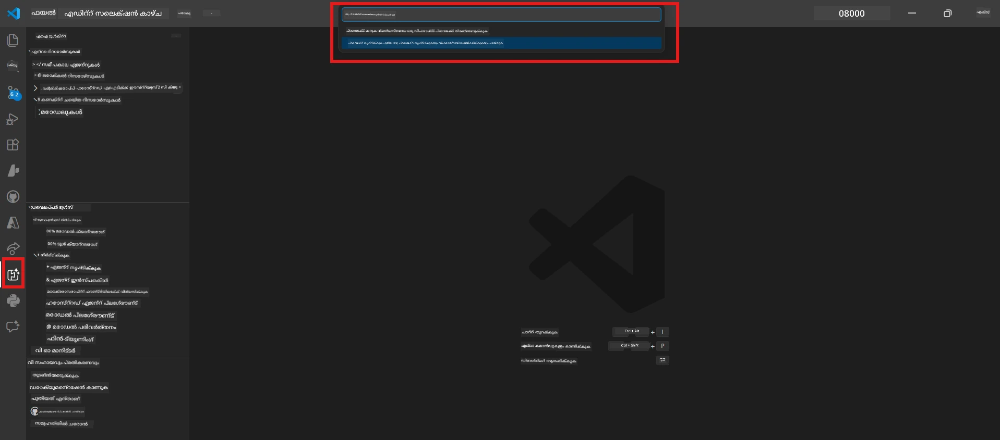
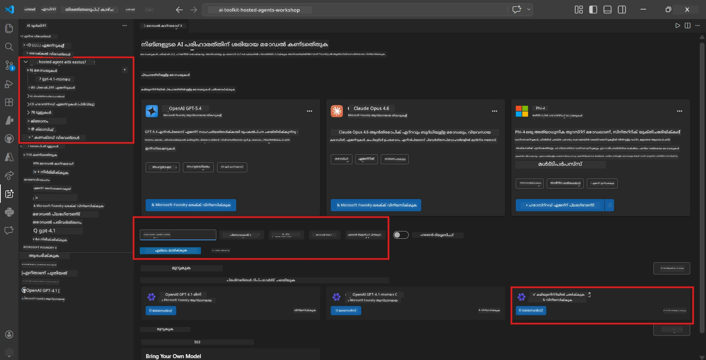
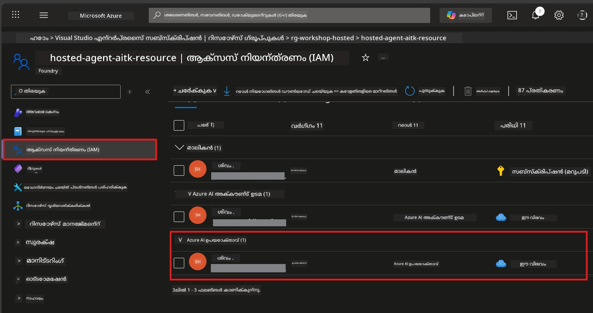

# Module 2 - ഫൗണ്ട്രി പ്രോജക്ട് സൃഷ്ടിക്കുകയും ഒരു മോഡൽ വിന്യസിക്കുകയും ചെയ്യുക

ഈ മോഡ്യൂളിൽ, നിങ്ങൾ മൈക്രോസോഫ്റ്റ് ഫൗണ്ട്രി പ്രോജക്ട് സൃഷ്ടിക്കുകയോ തിരഞ്ഞെടുക്കുകയോ ചെയ്ത് ഏജന്റ് ഉപയോഗിക്കുന്ന മോഡൽ വിന്യസിക്കുന്നു. ഓരോ ഘട്ടവും വ്യക്തമായി എഴുതപ്പെട്ടിട്ടുണ്ട് - അവ പരിച്ഛేదനക്രമത്തിൽ പിന്തുടരുക.

> നിങ്ങൾക്ക് ഇതിനകം വിന്യമാക്കിയ മോഡലോടുകൂടിയ ഫൗണ്ട്രി പ്രോജക്ട് ഉണ്ടെങ്കിൽ, [Module 3](03-create-hosted-agent.md)ലേക്ക് സ്കിപ്പ് ചെയ്യുക.

---

## ഘട്ടം 1: VS Code-ൽ നിന്ന് ഫൗണ്ട്രി പ്രോജക്ട് സൃഷ്ടിക്കുക

VS Code വിടാതെ മൈക്രോസോഫ്റ്റ് ഫൗണ്ട്രി എക്സ്റ്റൻഷൻ ഉപയോഗിച്ച് പ്രോജക്ട് സൃഷ്ടിക്കും.

1. **Command Palette** തുറക്കാൻ `Ctrl+Shift+P` അമർത്തുക.
2. ടൈപ്പ് ചെയ്യുക: **Microsoft Foundry: Create Project** പിന്നെ തിരഞ്ഞെടുക്കുക.
3. ഒരു ഡ്രോപ്ഡൗൺ വരും - ലിസ്റ്റിൽനിന്ന് നിങ്ങളുടെ **Azure subscription** തിരഞ്ഞെടുക്കുക.
4. **resource group** തിരഞ്ഞെടുക്കാൻ അല്ലെങ്കിൽ സൃഷ്ടിക്കാൻ ആവശ്യപ്പെടും:
   - പുതുതായി സൃഷ്ടിക്കാൻ: പേര് ടൈപ്പ് ചെയ്യുക (ഉദാ: `rg-hosted-agents-workshop`) പിന്നെ Enter അമർത്തുക.
   - നിലവിലുള്ളത് ഉപയോഗിക്കാൻ: ഡ്രോപ്ഡൗണിൽ നിന്ന് തിരഞ്ഞെടുക്കുക.
5. ഒരു **region** തിരഞ്ഞെടുക്കുക. **പ്രധാനം:** ഹോസ്റ്റുചെയ്ത ഏജന്റുകൾക്കുള്ള പിന്തുണയുള്ള ഒരു പ്രദേശം തിരഞ്ഞെടുക്കുക. [region availability](https://learn.microsoft.com/azure/foundry/agents/concepts/hosted-agents#region-availability) പരിശോധിക്കുക - സാധാരണ തിരഞ്ഞെടുത്ത മേഖലകൾ `East US`, `West US 2`, അല്ലെങ്കിൽ `Sweden Central` ആകും.
6. ഫൗണ്ട്രി പ്രോജക്ടിന് ഒരു **പേര്** നൽകുക (ഉദാ: `workshop-agents`).
7. Enter അമർത്തി പ്രൊവിഷണിംഗ് പൂർണമായാൽ കാത്തിരിക്കുക.

> **പ്രൊവിഷണിംഗ് 2-5 മിനിറ്റ് സമയമെടുക്കും.** VS Code-ന്റെ താഴെത്തടിയ വലത്തുഭാഗത്ത് പ്രോഗ്രസ്സ് അറിയിപ്പ് കാണാം. പ്രൊവിഷണിംഗ് നടക്കുമ്പോൾ VS Code അടക്കരുത്.

8. പൂർത്തിയായപ്പോൾ, **Microsoft Foundry** സൈഡ്‌ബാറിൽ നിങ്ങളുടെ പുതിയ പ്രോജക്ട് **Resources**ക്കു കീഴിൽ കാണിക്കും.
9. പ്രോജക്ട് പേര് ക്ലിക്ക് ചെയ്ത് ഇത് വിപുലീകരിച്ച് **Models + endpoints** ഒപ്പം **Agents** പോലെയുള്ള വിഭാഗങ്ങൾ കാണിക്കുന്നത് ഉറപ്പാക്കുക.



### മറ്റ് മാർഗം: ഫൗണ്ട്രി പോർട്ടൽ വഴി സൃഷ്ടിക്കുക

ബ്രൗസർ വഴി ചെയ്യാൻ ഇഷ്ടമെങ്കിൽ:

1. [https://ai.azure.com](https://ai.azure.com) തുറന്ന് സൈൻ ഇൻ ചെയ്യുക.
2. ഹോം പേജിൽ **Create project** ക്ലിക്ക് ചെയ്യുക.
3. പ്രോജക്ട് പേര് നൽകുക, നിങ്ങളുടെ സബ്സ്ക്രിപ്ഷൻ, റിസോഴ്‌സ് ഗ്രൂപ്പ്, പ്രദേശം തിരഞ്ഞെടുക്കുക.
4. **Create** ക്ലിക്ക് ചെയ്ത് പ്രൊവിഷണിംഗ് ക്ഷണിക്കുകയും കാത്തിരിക്കൂ.
5. സൃഷ്ടിച്ചതിനുശേഷം VS Code-ൽ മടക്കുക - റിഫ്രെഷ് ചെയ്താൽ ഫൗണ്ട്രി സൈഡ്‌ബാറിൽ പ്രോജക്ട് കാണണം (റിഫ്രെഷ് ഐക്കൺ ക്ലിക്ക് ചെയ്യുക).

---

## ഘട്ടം 2: ഒരു മോഡൽ വിന്യസിക്കുക

നിങ്ങളുടെ [hosted agent](https://learn.microsoft.com/azure/foundry/agents/concepts/hosted-agents) പ്രതികരണങ്ങൾ സൃഷ്ടിക്കാൻ Azure OpenAI മോഡൽ ആവശ്യമാണ്. നിങ്ങളെ നന്ദിയോടെ [ഇപ്പോൾ വിന്യസിക്കും](https://learn.microsoft.com/azure/ai-foundry/openai/how-to/create-resource#deploy-a-model).

1. **Command Palette** തുറക്കാൻ `Ctrl+Shift+P` അമർത്തുക.
2. ടൈപ്പ് ചെയ്യുക: **Microsoft Foundry: Open [Model Catalog](https://learn.microsoft.com/azure/ai-foundry/openai/concepts/models)** ഒപ്പം തിരഞ്ഞെടുക്കുക.
3. Model Catalog ഇൻ VS Code തുറക്കും. **gpt-4.1** കണ്ടെത്താൻ ബ്രൗസ് ചെയ്യുക അല്ലെങ്കിൽ സെർച്ച് ബാർ ഉപയോഗിക്കുക.
4. **gpt-4.1** മോഡൽ കാർഡ് ക്ലിക്ക് ചെയ്യുക (കാമ്യം കുറഞ്ഞ ചെലവിനായി `gpt-4.1-mini` തിരഞ്ഞെടുക്കാം).
5. **Deploy** ക്ലിക്ക് ചെയ്യുക.


6. വിന്യാസ ക്രമീകരണത്തിൽ:
   - **Deployment name**: ഡീഫോൾടായത് (ഉദാ: `gpt-4.1`) പോലെ bırakുക അല്ലെങ്കിൽ ഇഷ്ടമൊരു പേര് നൽകുക. **ഈ പേര് ഓർക്കുക** - Module 4-ൽ ആവശ്യമാണ്.
   - **Target**: **Deploy to Microsoft Foundry** തിരഞ്ഞെടുക്കുക, ഇപ്പോഴത്തെ പ്രോജക്ട് തിരഞ്ഞെടുക്കുക.
7. **Deploy** ക്ലിക്ക് ചെയ്ത് വിന്യാസത്തിനായി കാത്തിരിക്കുക (1-3 മിനിറ്റ്).

### മോഡൽ തിരഞ്ഞെടുക്കൽ

| മോഡൽ | ഏറ്റവും അനുയോജ്യം | ചെലവ് | കുറിപ്പുകൾ |
|-------|-----------------|-------|------------|
| `gpt-4.1` | ഉയർന്ന നിലവാരമുള്ള, നയൻതരം ആയ പ്രതികരണങ്ങൾ | ഉയര്‍ന്നതും | മികച്ച ഫലം, ആఖ്യാതപരിശോധനയ്ക്ക് ശുപാർശ ചെയ്യുന്നു |
| `gpt-4.1-mini` | വേഗത്തിലുള്ള പുനരവലോകനം, കുറഞ്ഞ ചെലവ് | കുറവുള്ളത് | വർക്ക്‌ഷോപ്പ് വികസനത്തിനും വേഗം പരിശോധിക്കുന്നതിനും നല്ലത് |
| `gpt-4.1-nano` | ലഘുഭാരമുള്ള പ്രവൃത്തികൾ | ഏറ്റവും കുറഞ്ഞത് | ഏറ്റവും ചെലവുകുറഞ്ഞത്, പക്ഷേ ലളിതമായ പ്രതികരണങ്ങൾ നൽകും |

> **ഈ വർക്ക്‌ഷോപ്പിന് ശുപാർശ:** വികസനത്തിനും പരിശോധനക്കും `gpt-4.1-mini` ഉപയോഗിക്കുക. അത് വേഗം, വില കുറഞ്ഞതും, വ്യായാമങ്ങൾക്ക് നല്ല ഫലങ്ങൾ നൽകുകയും ചെയ്യുന്നു.

### മോഡൽ വിന്യാസം സ്ഥിരീകരിക്കുക

1. **Microsoft Foundry** സൈഡ്‌ബാറിൽ നിങ്ങളുടെ പ്രോജക്ട് വികസിപ്പിക്കുക.
2. **Models + endpoints** (അല്ലെങ്കിൽ സമാന വിഭാഗം) താഴെ നോക്കുക.
3. നിങ്ങൾ വിന്യമാക്കിയ മോഡൽ (ഉദാ., `gpt-4.1-mini`) **Succeeded** അല്ലെങ്കിൽ **Active** നിലയിലുള്ളത് കാണണം.
4. മോഡൽ വിന്യാസം ക്ലിക്ക് ചെയ്ത് വിശദാംശങ്ങൾ കാണുക.
5. താഴെക്കൊടുത്ത രണ്ട് മൂല്യങ്ങൾ **കുറിപ്പെടുക** - Module 4-ൽ ആവശ്യമാണ്:

   | ക്രമീകരണം | എവിടെ കണ്ടെത്താം | ഉദാഹരണ മൂല്യം |
   |------------|-----------------|----------------|
   | **Project endpoint** | ഫൗണ്ട്രി സൈഡ്‌ബാറിലുണ്ടായ പ്രോജക്ടിന്റെ പേര് ക്ലിക്ക് ചെയ്യുക. വിശദാംശങ്ങളിൽ എൻഡ്‌പോയിന്റ് URL കാണാം. | `https://<account>.services.ai.azure.com/api/projects/<project>` |
   | **Model deployment name** | വിന്യമാക്കിയ മോഡലിന്റെ പక్కത്തുള്ള പേര് | `gpt-4.1-mini` |

---

## ഘട്ടം 3: ആവശ്യമായ RBAC റോളുകൾ നിയോഗിക്കുക

ഇതാണ് **മിക്കവാറും നഷ്ടപ്പെടുന്ന ഘട്ടം**. ശരിയായ റോളുകൾ ഇല്ലാതെ Module 6-ൽ വിന്യാസം അനുമതിപ്രശ്‌നം കൊണ്ടു പരാജയപ്പെടും.

### 3.1 ദയവായി നിങ്ങക്കു Azure AI User റോളും നൽകിയിരിക്കുക

1. ബ്രൗസർ തുറന്ന് [https://portal.azure.com](https://portal.azure.com) സന്ദർശിക്കുക.
2. മുകളിൽ സേർച്ച് ബാറിൽ നിങ്ങളുടെ **Foundry project** പേര് ടൈപ്പ് ചെയ്ത് ഫലങ്ങളിൽ ക്ലിക്ക് ചെയ്യുക.
   - **പ്രധാനപ്പെട്ടത്:** പ്രോജക്ട് റിസോഴ്‌സ് (പ്രകാരം: "Microsoft Foundry project") സന്ദർശിക്കുക, അതിന്റെ മാതൃ അക്കൗണ്ട്/ഹബ് റിസോഴ്‌സ് അല്ല.
3. പ്രോജക്ടിന്റെ ഇടതുവശം നാവിഗേഷനിൽ **Access control (IAM)** ക്ലിക്ക് ചെയ്യുക.
4. മുകളിൽ **+ Add** ബട്ടൺ → **Add role assignment** തിരഞ്ഞെടുക്കുക.
5. **Role** ടാബിൽ [**Azure AI User**](https://learn.microsoft.com/azure/foundry/concepts/rbac-foundry#built-in-roles) തിരയിച്ച് തിരഞ്ഞെടുക്കുക. **Next** ക്ലിക്ക് ചെയ്യുക.
6. **Members** ടാബിൽ:
   - **User, group, or service principal** തിരഞ്ഞെടുക്കുക.
   - **+ Select members** ക്ലിക്ക് ചെയ്യുക.
   - നിങ്ങളുടെ പേര് അല്ലെങ്കിൽ ഇമെയിൽ സെർച്ച് ചെയ്ത്, സ്വന്തം പേര് തിരഞ്ഞെടുക്കുക, **Select** ക്ലിക്ക് ചെയ്യുക.
7. **Review + assign** ക്ലിക്ക് ചെയ്ത് പിന്നീട് സ്ഥിരീകരിക്കുക.



### 3.2 (ഐച്ഛികം) Azure AI Developer റോളും നൽകുക

പദ്ധതിയിൽ അധിക റിസോഴ്‌സുകൾ സൃഷ്ടിക്കാനോ വിന്യാസങ്ങൾ പ്രോഗ്രാമാറ്റിക്കായി നിയന്ത്രിക്കാനോ ആവശ്യമുണ്ടെങ്കിൽ:

1. മുകളിലുള്ള ഘട്ടങ്ങൾ ആവർത്തിക്കുക, ഘട്ടം 5-ൽ **Azure AI Developer** തിരഞ്ഞെടുക്കുക.
2. ഇത് അബ്സല്യൂട്ട് ലെവലിൽ **Foundry resource (account)**, വെറും പ്രോജക്ട് ലെവൽ മാത്രമല്ല.

### 3.3 നിങ്ങളുടെ റോളുകൾ പരിശോധിക്കുക

1. പ്രോജക്ടിൻറെ **Access control (IAM)** പേജിലേക്കു പോവുക, **Role assignments** ടാബ് ക്ലിക്ക് ചെയ്യുക.
2. നിങ്ങളുടെ പേര് തിരയുക.
3. പ്രോജക്ട് സ്‌കോപ്പിൽ കുറഞ്ഞത് **Azure AI User** കാണണം.

> **ഇതിന്റെ പ്രാധാന്യം:** [`Azure AI User`](https://learn.microsoft.com/azure/foundry/concepts/rbac-foundry#built-in-roles) റോളിൽ `Microsoft.CognitiveServices/accounts/AIServices/agents/write` ഡാറ്റ ആക്ഷൻ ഉണ്ട്. ഇത് ഇല്ലെങ്കിൽ, വിന്യാസ സമയത്ത് താഴെപ്പറയുന്ന പിശക് കാണും:
>
> ```
> Error: lacks the required data action 
> Microsoft.CognitiveServices/accounts/AIServices/agents/write 
> to perform POST /api/projects/{projectName}/assistants operation.
> ```
>
> കൂടുതൽ വിശദാംശങ്ങൾക്ക് [Module 8 - Troubleshooting](08-troubleshooting.md) കാണുക.

---

### ചെക്ക്പോയിന്റ്

- [ ] ഫൗണ്ട്രി പ്രോജക്ട് നിലവിലുണ്ട്, VS Code-ല്‍ Microsoft Foundry സൈഡ്‌ബാറിൽ കാണുന്നു
- [ ] കുറഞ്ഞത് ഒരു മോഡൽ വിന്യമാക്കിയിട്ടുണ്ട് (ഉദാ: `gpt-4.1-mini`) നില **Succeeded**
- [ ] നിങ്ങൾ **project endpoint** URLയും **model deployment name** ഉം കുറിപ്പുപെടുത്തിയിട്ടുണ്ട്
- [ ] നിങ്ങൾക്ക് പ്രോജക്ട് ലെവലിൽ **Azure AI User** റോളും നിയോഗിച്ചിട്ടുണ്ട് (Azure Portal → IAM → Role assignments-ൽ സ്ഥിരീകരിക്കുക)
- [ ] പ്രോജക്ട് ഹോസ്റ്റുചെയ്ത ഏജന്റുകൾക്ക് [പിന്തുണയുള്ള പ്രദേശത്തിലാണ്](https://learn.microsoft.com/azure/foundry/agents/concepts/hosted-agents#region-availability)

---

**മുന്‍പ്:** [01 - Install Foundry Toolkit](01-install-foundry-toolkit.md) · **അടുത്തത്:** [03 - Create a Hosted Agent →](03-create-hosted-agent.md)

---

<!-- CO-OP TRANSLATOR DISCLAIMER START -->
**അस्वീകരണം**:  
ഈ രേഖ AI വിവർത്തന സേവനം [Co-op Translator](https://github.com/Azure/co-op-translator) ഉപയോഗിച്ച് വിവർത്തനം ചെയ്തതാണ്. ഞങ്ങൾ കൃത്യതയ്ക്കായി ശ്രമിച്ചുവെങ്കിലും, സ്വയം പ്രവർത്തിക്കുന്ന വിവർത്തനങ്ങളിൽ പിഴവുകളോ അക്രിയക്ഷമതകളോ ഉണ്ടാകാമെന്ന് ദയവായി ശ്രദ്ധിക്കുക. മാതൃഭാഷയിലെ മൂല രേഖ പരിഗണിക്കേണ്ടതാണ് പ്രാമാണികമായ ഉറവിടം. പ്രധാന വിവരങ്ങൾക്ക്, പ്രൊഫഷണൽ മാനവ വിവർത്തനം ശുപാർശ ചെയ്യുന്നു. ഈ വിവർത്തനം ഉപയോഗിച്ചുണ്ടാകാവുന്ന തെറ്റിദ്ധാരണകൾക്കോ അധ്വാനക്കുറവുകൾക്കോ ഞങ്ങൾ ഉത്തരവാദിത്വം വഹിക്കുന്നില്ല.
<!-- CO-OP TRANSLATOR DISCLAIMER END -->