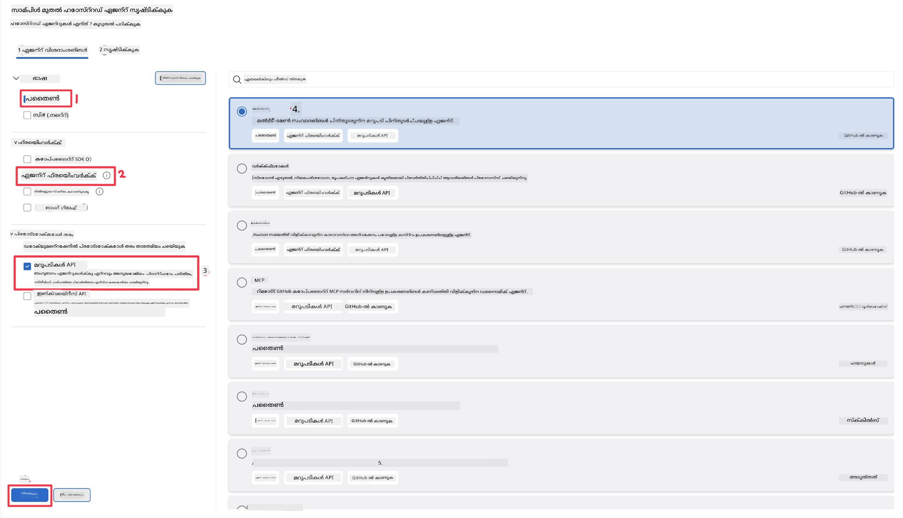
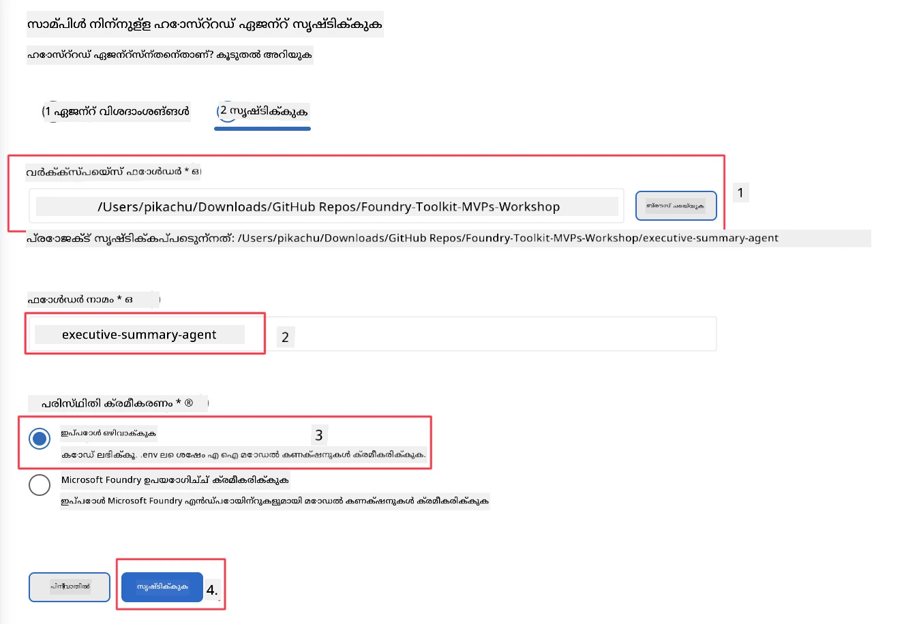

# മോഡ്യൂൾ 2 - പുതിയ ഹോസ്റ്റഡ് ഏജന്റ് സൃഷ്ടിക്കുക

⏱️ ~5 മിനിറ്റ്

ഈ മോഡ്യൂളിൽ, നിങ്ങൾ ഫൗണ്ടറി ടൂൾകിറ്റ് ഉപയോഗിച്ച് **ഹോസ്റ്റഡ് ഏജന്റ് പ്രോജക്ട് സ്കാഫോൾഡ് ചെയ്യുന്നു**. സ്കാഫോൾഡ് പൂർണ്ണമായ പ്രോജക്ട് ഘടന സൃഷ്ടിക്കുന്നു - `agent.yaml`, `main.py`, `Dockerfile`, `requirements.txt`, ಮತ್ತು VS കോഡ് ഡീബഗ് കോൺഫിഗറേഷൻ - ഇതിലൂടെ നിങ്ങൾ ഏജന്റിന്റെ ക്രിയാശీలതയെ റോഡ്മാപ്പ് ചെയ്യാൻ കേന്ദ്രീകരിക്കാം.

> **പ്രധാന ആശയം:** ഈ ലാബിലെ `agent/` ഫോള്ഡർ ഫൗണ്ടറി ടൂൾകിറ്റിന്റെ ഉദാഹരണമാണ്. നിങ്ങൾ ഈ ഫയലുകൾ നുഴഞ്ഞുകയറാതെ എഴുതേണ്ടതില്ല.

### സ്കാഫോൾഡ് വിസാർഡ് ഫ്ലോ

```mermaid
flowchart LR
    A["Command Palette:
    Create new Hosted Agent"] --> B["Language:
    Python"]
    B --> C["API type:
    Response API"]
    C --> D["Template:
    Basic - Agent Framework"]
    D --> E["മോഡൽ തെരഞ്ഞെടുത്തുക"]
    E --> F["Workspace folder
    & agent name"]
    F --> G["ഉൽപാദിപ്പിച്ച പ്രോജക്ട്"]

    style A fill:#4A90D9,color:#fff
    style B fill:#7B68EE,color:#fff
    style C fill:#7B68EE,color:#fff
    style D fill:#7B68EE,color:#fff
    style E fill:#7B68EE,color:#fff
    style F fill:#7B68EE,color:#fff
    style G fill:#27AE60,color:#fff
```



---

## ഘട്ടം 1: Create Hosted Agent വിസാർഡ് തുറക്കുക

1. `Ctrl+Shift+P` അമർത്തി **കമാൻഡ് പാലറ്റ്** തുറക്കുക.
2. ടൈപ്പ് ചെയ്യുക: **Foundry Toolkit: Create new Hosted Agent** തുടർന്ന് തിരഞ്ഞെടുക്കുക.

> **മാറ്റു മാർഗം: Foundry പോർട്ടൽ വഴി സൃഷ്ടിക്കുക**
> നിങ്ങളുടെ ബ്രൗസർ ഉപയോഗിക്കാനാഗ്രഹിക്കുന്നുവെങ്കിൽ, [https://ai.azure.com](https://ai.azure.com) ൽ പ്രോജക്ട് സൃഷ്ടിക്കാം. പ്രോജക്ട് പ്രൊവിഷൻ ചെയ്ത ശേഷം VS കോഡിലേക്ക് തിരിച്ചുപോകുക, Foundry Toolkit സൈഡ്ബാറിൽ നിന്നാണ് അതുമായി കണക്റ്റ് ചെയ്യുക.

> **മറ്റൊരു മാർഗം:** Foundry Toolkit സൈഡ്ബാറിലെ **Hosted Agents (Preview)**യുടെ അടുത്തുള്ള **+** ഐക്കൺ ക്ലിക്ക് ചെയ്യുക.

## ഘട്ടം 2: ക്രമീകരണങ്ങൾ തെരഞ്ഞെടുത്തു



1. ഇടത് നാവിഗേഷൻ/ഓപ്ഷൻസ് വിഭാഗത്തിൽ താഴെ കൊടുത്തവ തിരഞ്ഞെടുക്കുക:

| മെനു | തെരഞ്ഞെടുപ്പ് | കുറിപ്പുകൾ |
|--------|-----------|-------|
| **ഭാഷ** | Python | C# കൂടി പിന്തുണയ്ക്കും |
| **ഫ്രെയിംവർക്ക്** | Agent Framework | Agent Framework SDK ഉപയോഗിച്ച് എളുപ്പത്തിലുള്ള ആരംഭം |
| **API തരം** | Response API | `POST /responses` - സംഭാഷണാത്മകം, പ്ലാറ്റ്ഫോം-നിർവഹിത ചരിത്രം കൂടെ |
| **ടെംപ്ലേറ്റ്** | Basic | Agent Framework SDK ഉപയോഗിച്ച് എളുപ്പത്തിലുള്ള ആരംഭം |

2. തിരഞ്ഞെടുക്കുക, തുടർന്ന് **Next** ക്ലിക്ക് ചെയ്യുക



3. അടുത്ത വിൻഡോയിൽ താഴെ കൊടുത്തവ തിരഞ്ഞെടുക്കുക:

| മെനു | തെരഞ്ഞെടുപ്പ് | കുറിപ്പുകൾ |
|--------|-----------|-------|
| **വര്‍ക്ക്സ്പേസ് ഫോൾഡർ** | ലക്ഷ്യ ഫോൾഡർ തിരഞ്ഞെടുക്കുക | ഉദാഹരണം, `/workspace/Foundry_Toolkit_for_VSCode_Lab/` അല്ലെങ്കിൽ ഈ റെപ്പോയിലെ ഒരു സബ്‌ഫോൾഡർ |
| **ഏജന്റ് പേര്** | പേര് നൽകുക | ഉദാഹരണം, `executive-summary-agent` |
| **പരിസ്ഥിതി ക്രമീകരണം** | ഇപ്പോൾ ക്രമീകരണം ഒഴിവാക്കുക |  |

നമ്മുടെ ഏജന്റ് സൃഷ്ടിക്കാൻ **create** ക്ലിക്ക് ചെയ്യുക. ഹോസ്റ്റഡ് ഏജന്റ് പേരുമായി പുതിയൊരു ഫോൾഡർ സൃഷ്ടിക്കും.

## ഘട്ടം 3: സൃഷ്ടിച്ചതിന്റെ പരിശോധന നടത്തുക

സ്കാഫോൾഡിംഗ് പൂർത്തിയായതിനു ശേഷം, എക്സ്പ്ലോററിൽ (`Ctrl+Shift+E`) താഴെ കാണുന്ന ഫയലുകൾ ഉണ്ടെന്ന് പരിശോധിക്കുക:

```
📂 my-agent/
├── .env                ← Environment variables (placeholders)
├── .vscode/
│   ├── launch.json     ← Debug config (F5 → run + Agent Inspector)
│   └── tasks.json      ← VS Code task definitions
├── agent.yaml          ← Agent definition (kind: hosted)
├── Dockerfile          ← Container config for deployment
├── main.py             ← Agent entry point (your main code)
└── requirements.txt    ← Python dependencies
```

### പ്രധാന ഫയലുകൾ വിശദീകരണം

| ഫയൽ | ഉപയോഗം |
|------|---------|
| `agent.yaml` | ഏജന്റിനെ `kind: hosted` എന്നായി പ്രഖ്യാപിക്കുന്നു, പരിസ്ഥിതി വേരിയബിളുകൾ മാപ്പ് ചെയ്യുന്നു, `/responses` പ്രോട്ടോക്കോൾ നിർവചിക്കുന്നു |
| `main.py` | `FoundryChatClient` സൃഷ്ടിക്കുന്നു → നിർദേശം ചേർത്ത് `Agent` ആയി പൊതിഞ്ഞ് → `ResponsesHostServer` വഴി പോർട്ട് 8088ൽ സർവ് ചെയ്യുന്നു |
| `Dockerfile` | `python:3.12-slim` ഉപയോഗിക്കുന്നു, ആശ്രിതങ്ങൾ ഇൻസ്റ്റാൾ ചെയ്യുന്നു, പോർട്ട് 8088 തുറക്കുന്നു, `main.py` ഓടിക്കുന്നു |
| `requirements.txt` | `agent-framework-foundry`, `agent-framework-foundry-hosting`, `mcp`, `debugpy` |

> **പ്രധാനമാണ്:** സ്കാഫോൾഡ് ചെയ്ത ഏജന്റ് ഫോൾഡർ നേരിട്ട് VS കോഡിൽ തുറക്കുക (`agent/` ഫോൾഡർ തന്നെയാണ്) അതിലൂടെ `.vscode/launch.json` മിത്സ `tasks.json` നിയമാനുസൃതമായി F5 ഡീബഗ് ചെയ്യാൻ സഹായിക്കും.

---

### ✅ പരിശോധിക്കൽ പോയിന്റ്

- [ ] സ്കാഫോൾഡ് ചെയ്ത പ്രോജക്ട് എല്ലാ പ്രതീക്ഷിക്കുന്ന ഫയലുകളും ചേർത്ത് ഉണ്ടാക്കിയത്
- [ ] `agent.yaml` ല്`kind: hosted` ഉം `protocol: responses` ഉം കാണുന്നു
- [ ] `main.py` ആൻറേജ്, FoundryChatClient, ResponsesHostServer എന്നിവ ഇറക്കുമതി ചെയ്യുന്നു
- [ ] ഏജന്റ് ഫോൾഡർ VS കോഡിൽ വർക്ക്‌സ്പേസ് റൂട്ടായി തുറന്നിട്ടുണ്ട്

---

**മുമ്പ്:** [01 - Setup](01-setup.md) · **അടുത്തത്:** [03 - ക്രമീകരിച്ചും കോഡ് ചെയ്ത് →](03-configure-and-code.md)

---

<!-- CO-OP TRANSLATOR DISCLAIMER START -->
**അറിയിപ്പ്**:
ഈ രേഖ AI പരിഭാഷാ സേവനം [Co-op Translator](https://github.com/Azure/co-op-translator) ഉപയോഗിച്ച് പരിഭാഷപ്പെടുത്തിയതാണ്. ഞങ്ങൾ കൃത്യതയ്ക്കായി ശ്രമിക്കുന്നുവെങ്കിലും, ഓട്ടോമേറ്റഡ് പരിഭാഷകളിൽ പിഴവുകൾ അല്ലെങ്കിൽ തെറ്റായ വിവരങ്ങൾ ഉണ്ടാകാൻ സാധ്യതയുണ്ട്. അതിന്റെ സ്വാഭാവിക ഭാഷയിലുള്ള അസൽ രേഖയാണ് പ്രാമാണികമായ ഉറവിടമായി പരിഗണിക്കേണ്ടത്. നിർണായകമായ വിവരങ്ങൾക്ക്, പ്രൊഫഷണൽ മനുഷ്യ പരിഭാഷ ശുപാർശ ചെയ്യുന്നു. ഈ പരിഭാഷ ഉപയോഗിച്ച് ഉണ്ടാകുന്ന തെറ്റിദ്ധാരണകൾ അല്ലെങ്കിൽ തെറ്റായ വ്യാഖ്യാനങ്ങൾക്കായി ഞങ്ങൾ ഉത്തരവാദികളല്ല.
<!-- CO-OP TRANSLATOR DISCLAIMER END -->