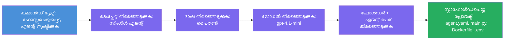

# മോഡ്യൂൾ 3 - പുതിയ ഹോസ്റ്റഡ് ഏജന്റ് സൃഷ്ടിക്കുക (ഫൗണ്ട്രി വിപുലീകരണം ഓട്ടോ-സ്കാഫോൾഡ് ചെയ്തിരിക്കുന്നു)

ഈ മോഡ്യൂളിൽ, നിങ്ങൾ മൈക്രോസോഫ്റ്റ് ഫൗണ്ട്രി വിപുലീകരണം ഉപയോഗിച്ച് **പുതിയ [ഹോസ്റ്റഡ് ഏജന്റ്](https://learn.microsoft.com/azure/foundry/agents/concepts/hosted-agents) പ്രോജക്ട് സ്കാഫോൾഡ് ചെയ്യുന്നു**. വിപുലീകരണം പൂർണ്ണമായ പ്രോജക്ട് ഘടന നിങ്ങൾക്കായി സൃഷ്ടിക്കുന്നു - അതിൽ `agent.yaml`, `main.py`, `Dockerfile`, `requirements.txt`, `.env` ഫയൽ, കൂടാതെ VS കോഡ് ഡീബഗ് കോൺഫിഗറേഷൻ ഉൾപ്പെടുന്നു. സ്കാഫോൾഡിങ്ങിന് ശേഷം, നിങ്ങളുടെ ഏജന്റിന്റെ നിർദ്ദേശങ്ങൾ, ടൂളുകൾ, കോൺഫിഗറേഷനുകൾ എന്നിവയുമായി ഈ ഫയലുകൾ നിങ്ങൾ അ Valladolid ചെയ്യുന്നു.

> **പ്രധാന ആശയം:** ഈ ലബിൽ `agent/` ഫോൾഡർ ഫൗണ്ട്രി വിപുലീകരണം ഈ സ്കാഫോൾഡ് കമാൻഡ് പ്രവർത്തിപ്പിക്കുമ്പോൾ ജനറേറ്റ് ചെയ്യുന്ന ഉദാഹരണമാണ്. നിങ്ങൾ തന്നെ ഈ ഫയലുകൾ നൂതനമായി എഴുതുകയില്ല - വിപുലീകരണം അവ സൃഷ്ടിക്കുന്നു, ശേഷം നിങ്ങൾ അവ മാറ്റം വരുത്തുന്നു.

### സ്കാഫോൾഡ് വിജാർഡ് പ്രവাহം


---

## ഘട്ടം 1: ഹോസ്റ്റഡ് ഏജന്റ് സൃഷ്ടിക്കൽ വിജാർഡ് തുറക്കുക

1. **കോൺട്രോൾ+Shift+P** അമർത്തി **കമാൻഡ് പാലറ്റർ** തുറക്കുക.
2. ടൈപ്പ് ചെയ്യുക: **Microsoft Foundry: Create a New Hosted Agent** തിരഞ്ഞെടുക്കുക.
3. ഹോസ്റ്റഡ് ഏജന്റ് സൃഷ്ടിക്കൽ വിജാർഡ് ആരംഭിക്കും.

> **വൈകര്യമാർഗം:** മൈക്രോസോഫ്റ്റ് ഫൗണ്ട്രി സൈഡ്‌ബാറിൽ നിന്നും നിങ്ങൾക്ക് ഈ വിജാർഡ് എത്താം → **Agents** ന്റെ സമീപം ഉള്ള **+** ഐക്കൺ ക്ലിക്ക് ചെയ്യുക അല്ലെങ്കിൽ റൈറ്റ്-ക്ലിക്ക് ചെയ്ത് **Create New Hosted Agent** തിരഞ്ഞെടുക്കുക.

---

## ഘട്ടം 2: നിങ്ങളുടെ ടീംപ്ലേറ്റ് തിരഞ്ഞെടുക്കുക

വിജാർഡിൽ നിങ്ങൾക്ക് ഒരു ടീംപ്ലേറ്റ് തിരഞ്ഞെടുക്കാൻ പറയപ്പെടും. നിങ്ങൾക്ക് താഴെ പറ്റിയ ഓപ്ഷനുകൾ കാണും:

| Template | Description | When to use |
|----------|-------------|-------------|
| **Single Agent** | സ്വന്തം മോഡൽ, നിർദ്ദേശങ്ങൾ, ഒപ്ഷണൽ ടൂളുകൾ ഉള്ള ഒരു ഏജന്റ് | ഈ വർക്‌ഷോപ്പ് (ലാബ് 01) |
| **Multi-Agent Workflow** | അനേകം ഏജന്റുകൾ പരമ്പരയിൽ സഹകരിക്കുന്നതു | ലാബ് 02 |

1. **Single Agent** തിരഞ്ഞെടുക്കുക.
2. **Next** ക്ലിക്ക് ചെയ്യുക (അല്ലെങ്കിൽ തിരഞ്ഞെടുപ്പ് സ്വയം മുന്നോട്ട് പോകും).

---

## ഘട്ടം 3: പ്രോഗ്രാമിംഗ് ഭാഷ തിരഞ്ഞെടുക്കുക

1. **Python** തിരഞ്ഞെടുക്കുക (ഈ വർക്‌ഷോപ്പിന് ശുപാർശ ചെയ്യപ്പെട്ടത്).
2. **Next** ക്ലിക്ക് ചെയ്യുക.

> **C#** (.NET തിരഞ്ഞെടുക്കുമ്പോൾ) പിന്തുണ ലഭ്യമാണ്. സ്കാഫോൾഡ് ഘടന സമാനമാണ് (`main.py` വകരം `Program.cs` ഉപയോഗിക്കുന്നു).

---

## ഘട്ടം 4: നിങ്ങളുടെ മോഡൽ തിരഞ്ഞെടുക്കുക

1. വിജാർഡ് നിങ്ങളുടെ ഫൗണ്ട്രി പ്രോജക്ടിൽ ഡിപ്ലോയ്മെന്റ് ചെയ്ത മോഡലുകൾ കാണിക്കും (മോഡ്യൂൾ 2-ൽ നിന്നുള്ളത്).
2. നിങ്ങൾ ഡിപ്ലോയ്മെന്റ് ചെയ്ത മോഡൽ തിരഞ്ഞെടുക്കുക - ഉദാ: **gpt-4.1-mini**.
3. **Next** ക്ലിക്ക് ചെയ്യുക.

> മോഡലുകൾ ഒന്നും കാണാതെപോവുകയെങ്കിൽ, [മോഡ്യൂൾ 2](02-create-foundry-project.md) തിരിച്ച് പോയി ഒന്ന് ഡിപ്ലോയുചെയ്യുക.

---

## ഘട്ടം 5: ഫോൾഡർ ലൊക്കേഷൻയും ഏജന്റ് നാമവും തിരഞ്ഞെടുക്കുക

1. ഒരു ഫയൽ ഡയലോഗ് തുറക്കും - പ്രോജക്ട് സൃഷ്ടിക്കാനുള്ള **ടാർഗെറ്റ് ഫോൾഡർ** തിരഞ്ഞെടുക്കുക. ഈ വർക്‌ഷോപ്പിൽ:
   - പുതിയതായി തുടങ്ങുമ്പോൾ: ഏത് ഫോൾഡറും തിരഞ്ഞെടുക്കാം (ഉദാ: `C:\Projects\my-agent`)
   - വർക്‌ഷോപ്പ് റീപോയുടെ ഉള്ളിലാണെങ്കിൽ: `workshop/lab01-single-agent/agent/` എന്ന സബ്ഫോൾഡറിൽ പുതിയ ഫോൾഡർ സൃഷ്ടിക്കുക
2. ഹോസ്റ്റഡ് ഏജന്റിന് ഒരു **നാമം** നൽകുക (ഉദാ: `executive-summary-agent` അല്ലെങ്കിൽ `my-first-agent`).
3. **Create** ക്ലിക്ക് ചെയ്യുക (അല്ലെങ്കിൽ Enter അമർത്തുക).

---

## ഘട്ടം 6: സ്കാഫോൾഡിംഗ് പൂർത്തിയാണ്‌ വരെ കാത്തിരിക്കുക

1. VS കോഡ് സ്കാഫോൾഡ് ചെയ്ത പ്രോജക്ടോടെ ഒരു **പുതിയ വിൻഡോ** തുറക്കും.
2. പ്രോജക്ട് പൂർണ്ണമായ് ലോഡ് ആയതിനായി കുറച്ചുനേരം കാത്തിരിക്കുക.
3. എക്‌സ്‌പ്ലോറർ പാനലിൽ (`Ctrl+Shift+E`) താഴെ കാണുന്ന ഫയലുകൾ കാണണം:

```
📂 my-first-agent/
├── .env                ← Environment variables (auto-generated with placeholders)
├── .vscode/
│   └── launch.json     ← Debug configuration (F5 to run + Agent Inspector)
├── agent.yaml          ← Agent definition (kind: hosted)
├── Dockerfile          ← Container configuration for deployment
├── main.py             ← Agent entry point (your main code file)
└── requirements.txt    ← Python dependencies
```

> **ഈ ഘടന ഇതേപോലെ `agent/` ഫോൾഡറിലാണുള്ളത്** ഈ ലബിൽ. ഫൗണ്ട്രി വിപുലീകരണം ഈ ഫയലുകൾ സ്വയം സൃഷ്ടിക്കുന്നു - നിങ്ങൾക്കു അവ കൈയ്യൊഴിയേണ്ടതില്ല.

> **വർക്‌ഷോപ്പ് കുറിപ്പ്:** ഈ വർക്‌ഷോപ്പ് റീപോയിൽ `.vscode/` ഫോൾഡർ **വർക്ക്സ്പേസ് റൂട്ടില്** ആണ് (ഓരോ പ്രോജക്ടിലും അല്ല). ഇതിൽ ഒരു പങ്കുവെച്ച `launch.json` മറ്റും 있고 രണ്ട് ഡീബഗ് കോൺഫിഗറേഷനുകൾ ഉണ്ട് - **"Lab01 - Single Agent"**യും **"Lab02 - Multi-Agent"** ഉം - ഓരോ ലാബിന്റെയും `cwd` മൈന്യമായി കാണിക്കുന്നു. F5 അമർത്തുമ്പോൾ നിങ്ങൾക്ക് ഉപയോഗിക്കുന്ന ലാബിനനുസരിച്ച് കോൺഫിഗറേഷൻ തിരഞ്ഞെടുക്കുക.

---

## ഘട്ടം 7: ഓരോ സൃഷ്ടിച്ച ഫയലും മനസ്സിലാക്കുക

വിജാർഡ് സൃഷ്ടിച്ച ഓരോ ഫയലും പരിശോധിക്കാൻ കുറച്ച് സമയം എടുക്കുക. അവ മനസ്സിലാക്കുന്നത് മോഡ്യൂൾ 4 (അനുകൂലനം) വേണ്ടി പ്രധാനമാണ്.

### 7.1 `agent.yaml` - ഏജന്റ് നിർവ്വചനം

`agent.yaml` തുറക്കൂ. ഇതുപോലെയാണ് കാണിക്കുക:

```yaml
# yaml-language-server: $schema=https://raw.githubusercontent.com/microsoft/AgentSchema/refs/heads/main/schemas/v1.0/ContainerAgent.yaml

kind: hosted
name: my-first-agent
description: >
  A hosted agent deployed to Microsoft Foundry Agent Service.
metadata:
  authors:
    - Microsoft
  tags:
    - Azure AI AgentServer
    - Microsoft Agent Framework
    - Hosted Agent
protocols:
  - protocol: responses
    version: v1
environment_variables:
  - name: AZURE_AI_PROJECT_ENDPOINT
    value: ${PROJECT_ENDPOINT}
  - name: AZURE_AI_MODEL_DEPLOYMENT_NAME
    value: ${MODEL_DEPLOYMENT_NAME}
dockerfile_path: Dockerfile
resources:
  cpu: '0.25'
  memory: 0.5Gi
```

**പ്രധാന ഫീല്ഡുകൾ:**

| Field | Purpose |
|-------|---------|
| `kind: hosted` | ഇത് ഒരു ഹോസ്റ്റഡ് ഏജന്റ് ആണ് (കണ്ടെയ്‌നർ അടിസ്ഥാനത്തിലുള്ളത്, [Foundry Agent Service](https://learn.microsoft.com/azure/foundry/agents/overview) ൽ ഡിപ്ലോയുചെയ്യുന്നു) എന്ന് പ്രഖ്യാപിക്കുന്നു |
| `protocols: responses v1` | ഏജന്റ് OpenAI- അനുയോജ്യമായ `/responses` HTTP എന്റ്പോയിന്റ് തുറക്കുന്നു |
| `environment_variables` | `.env` മൂല്യങ്ങളെ ഡിപ്ലോയ്മെന്റ് സമയത്ത് കണ്ടെയ്‌നർ എൻ‌വയറൺമെന്റ് വ്യറിയബിളുകളുമായി മാപ്പ് ചെയ്യുന്നു |
| `dockerfile_path` | കണ്ടെയ്‌നർ ഇമേജ് പണിയാൻ ഉപയോഗിക്കുന്ന Dockerfile ന്റെ കാലാക്ഷണം നൽകുന്നു |
| `resources` | കണ്ടെയ്‌നറിന് CPU, മെമ്മറി അലോക്കേഷൻ (0.25 CPU, 0.5Gi മെമ്മറി) നൽകുന്നു |

### 7.2 `main.py` - ഏജന്റിന്റെ പ്രവേശന പോയിന്റ്

`main.py` തുറക്കൂ. ഇതാണ് പ്രധാന Python ഫയൽ, ഇവിടെ നിങ്ങളുടെ ഏജന്റ് ലോഗിക്കാണ് ഉള്ളത്. സ്കാഫോൾഡിൽ ഉൾപ്പെടുന്നത്:

```python
from agent_framework.azure import AzureAIAgentClient
from azure.ai.agentserver.agentframework import from_agent_framework
from azure.identity.aio import DefaultAzureCredential
```

**പ്രധാന ഇറക്കുമതികൾ:**

| Import | Purpose |
|--------|--------|
| `AzureAIAgentClient` | നിങ്ങളുടെ ഫൗണ്ട്രി പ്രോജക്റ്റുമായി കണക്ട്ചെയ്യുകയും `.as_agent()` മുഖേന ഏജന്റുകൾ സൃഷ്ടിക്കുകയും ചെയ്യുന്നു |
| [`DefaultAzureCredential`](https://learn.microsoft.com/azure/developer/python/sdk/authentication/credential-chains#defaultazurecredential-overview) | ഓതന്റിക്കേഷൻ കൈകാര്യം ചെയ്യുന്നു (Azure CLI, VS Code സൈൻ-ഇൻ, മാനേജ്ഡ് ഐഡന്റിറ്റി അല്ലെങ്കിൽ സർവീസ് പ്രിൻസിപ്പൽ) |
| `from_agent_framework` | ഏജന്റിനെ ഒരു HTTP സെർവർ ആയി മറച്ച് `/responses` എന്റ്പോയിന്റ് തുറക്കുന്നു |

പ്രധാന പ്രവാഹം:
1. ക്രെഡൻഷ്യൽ സൃഷ്ടിക്കുക → ക്ലയന്റ് സൃഷ്ടിക്കുക → `.as_agent()` വിളിച്ച് ഏജന്റ് (അസിങ്ക് കോൺടെക്സ്റ്റ് മാനേജർ) നേടുക → സെർവറായി മറച്ച് → ഓടിക്കുക

### 7.3 `Dockerfile` - കണ്ടെയ്‌നർ ഇമേജ്

```dockerfile
FROM python:3.14-slim

WORKDIR /app

COPY ./ .

RUN pip install --upgrade pip && \
    if [ -f requirements.txt ]; then \
        pip install -r requirements.txt; \
    else \
        echo "No requirements.txt found" >&2; exit 1; \
    fi

EXPOSE 8088

CMD ["python", "main.py"]
```

**പ്രധാന വിവരം:**
- `python:3.14-slim` അടിസ്ഥാന ചിത്രം ഉപയോഗിക്കുന്നു.
- എല്ലാ പ്രോജക്ട് ഫയലുകളും `/app` ലേക്ക് കപ്പി ചെയ്യുന്നു.
- `pip` അപ്ഗ്രേഡ് ചെയ്യുന്നു, `requirements.txt` നിന്ന് ഡിപെൻഡൻസികൾ ഇൻസ്റ്റാൾ ചെയ്യുന്നു; ആ ഫയൽ ഇല്ലെങ്കിൽ ഉടന്‍ ഫെയിൽ ചെയ്യും.
- **8088 പോർട്ട് തുറക്കുന്നു** - ഹോസ്റ്റഡ് ഏജന്റുകൾക്കായി ആവശ്യമായ പോർട്ട് ആണ്. മാറ്റരുത്.
- `python main.py` ഉപയോഗിച്ച് ഏജന്റ് ആരംഭിക്കുന്നു.

### 7.4 `requirements.txt` - ആശ്രിതങ്ങൾ

```
agent-framework-azure-ai==1.0.0rc3
agent-framework-core==1.0.0rc3
azure-ai-agentserver-agentframework==1.0.0b16
azure-ai-agentserver-core==1.0.0b16
debugpy
agent-dev-cli
```

| Package | Purpose |
|---------|---------|
| `agent-framework-azure-ai` | മൈക്രോസോഫ്റ്റ് ഏജന്റ് ഫ്രെയിംവർക്ക് Azure AI സംയോജനം |
| `agent-framework-core` | ഏജന്റുകൾ നിർമ്മിക്കാൻ കോർ റൺടൈം (ഉള്ളിൽ `python-dotenv` ഉൾപ്പെട്ടിരിക്കുന്നത്) |
| `azure-ai-agentserver-agentframework` | Foundry Agent Service നുള്ള ഹോസ്റ്റഡ് ഏജന്റ് സെർവർ റൺടൈം |
| `azure-ai-agentserver-core` | കോർ ഏജന്റ് സർവർ അഭ്യാസങ്ങൾ |
| `debugpy` | Python ഡീബഗ് സപ്പോർട്ട് (VS Code-ലിൽ F5 ഡീബഗ് ചെയ്യാൻ) |
| `agent-dev-cli` | ഏജന്റുകൾ ടെസ്റ്റ് ചെയ്യാൻ ലോക്കൽ ഡെവലപ്പ്മെന്റ് CLI (ഡീബഗ്/റൺ കോൺഫിഗറേഷനിൽ ഉപയോഗിക്കുന്നു) |

---

## ഏജന്റ് പ്രോട്ടോക്കോൾ മനസ്സിലാക്കുക

ഹോസ്റ്റഡ് ഏജന്റുകൾ **OpenAI Responses API** പ്രോട്ടോക്കോൾ വഴി സംവദിക്കുന്നു. പ്രവർത്തനസമയം (ലോക്കലിലായോ ക്ലൗഡിലായോ) ഏജന്റ് ഒരു ഏക HTTP എന്റ്പോയിന്റ് തുറക്കുന്നു:

```
POST http://localhost:8088/responses
Content-Type: application/json

{
  "input": "Your prompt here",
  "stream": false
}
```

ഫൗണ്ട്രി ഏജന്റ് സർവർ ഈ എന്റ്പോയിന്റിൽ നിന്ന് ഉപയോക്തൃ പ്രൊംപ്റ്റുകൾ അയച്ച് ഏജന്റ് പ്രതികരണങ്ങൾ സ്വീകരിക്കുന്നു. ഇത് OpenAI API ഉപയോഗിക്കുന്നതും സമാനമാണ്, അതിനാൽ നിങ്ങളുടെ ഏജന്റ് OpenAI Responses ഫോർമാറ്റ് സംസാരിക്കുന്ന സമസ്ത ക്ലയന്റുകളുമായി പൊരുത്തപ്പെടും.

---

### ചെക്ക്പോയിന്റ്

- [ ] സ്കാഫോൾഡ് വിജാർഡ് വിജയകരമായി പൂർത്തിയായി, **പുതിയ VS കോഡ് വിൻഡോ** തുറന്നു
- [ ] എല്ലാ 5 ഫയലുകളും കാണുന്നുണ്ടോ: `agent.yaml`, `main.py`, `Dockerfile`, `requirements.txt`, `.env`
- [ ] `.vscode/launch.json` ഫയൽ നിലവിലുണ്ടോ (F5 ഡീബഗ് സപ്പോർട്ട് - ഈ വർക്‌ഷോപ്പിൽ വർക്ക്സ്പേസ് റൂട്ടിൽ ലാബ്-സ്പെസിഫിക് കോൺഫിഗുകളോടെ)
- [ ] ഓരോ ഫയലും നിങ്ങൾ വായിച്ച് അവയുടെ ഉദ്ദേശം മനസ്സിലാക്കി
- [ ] `8088` പോർട്ട് ആവശ്യമാണ് എന്നും `/responses` എന്റ്പോയിന്റാണ് പ്രോട്ടോക്കോൾ എന്നുമറിയും

---

**മുമ്പു:** [02 - Create Foundry Project](02-create-foundry-project.md) · **അടുത്തത്:** [04 - Configure & Code →](04-configure-and-code.md)

---

<!-- CO-OP TRANSLATOR DISCLAIMER START -->
**സ്പഷ്ടികരണം**:  
ഈ ദസ്താവേകം AI വിവർത്തന സേവനം [Co-op Translator](https://github.com/Azure/co-op-translator) ഉപയോഗിച്ച് വിവർത്തനം ചെയ്തതാണ്. നാം ശരിതത്ത്വത്തിന് ശ്രമിക്കുന്നുണ്ടെങ്കിലും, സ്വയം പ്രവർത്തിക്കുന്ന ഭാഷാപ്രവർത്തനങ്ങളിൽ പിശകുകൾ അല്ലെങ്കിൽ തെറ്റായ വിവരങ്ങൾ ഉണ്ടാകാവുന്നതായിരിക്കും. മഥ്യഭാഷയിൽ ഉള്ള ഈ രേഖ മാനദണ്ഡമായ ഉറവിടം ആയി കണക്കാക്കണം. നിർണായകമായ വിവരങ്ങൾക്ക് പ്രൊഫഷണൽ മാനവ വിവർത്തനം നിർദ്ദേശിക്കുന്നു. ഈ വിവർത്തനം ഉപയോഗിക്കുന്നതിൽ നിന്നുള്ള തെറ്റിദ്ധാരണകൾക്കോ തെറ്റായ വ്യാഖ്യാനങ്ങൾക്കോ ഞങ്ങൾ ഉത്തരവാദിയല്ല.
<!-- CO-OP TRANSLATOR DISCLAIMER END -->