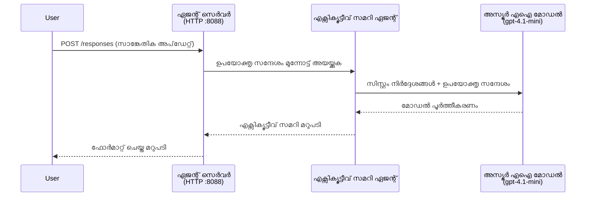
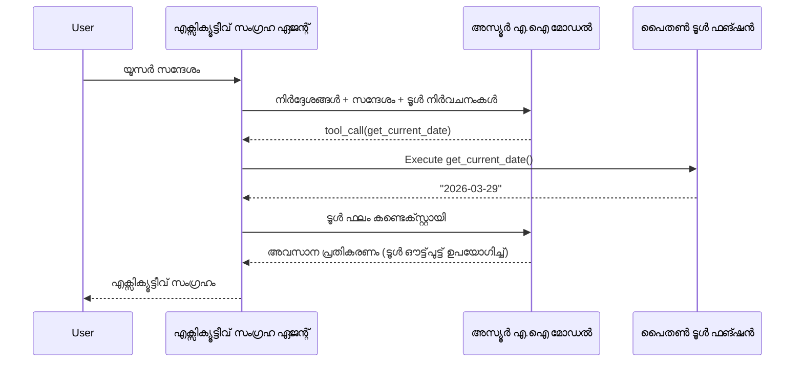

# Module 4 - നിർദ്ദേശങ്ങൾ ക്രമീകരിക്കുക, പരിസ്ഥിതി & ആശ്രിതങ്ങൾ ഇൻസ്റ്റാൾ ചെയ്യുക

ഈ മോഡ്യൂളിൽ, നിങ്ങൾ Module 3-ൽ നിന്നുള്ള ഓട്ടോ-സ്‌കാഫോൾഡഡ് ഏജന്റ് ഫയലുകളെ വ്യക്തിഗതമാക്കും. ജനറിക് സ്‌കാഫോൾഡിനെ **നിങ്ങളുടെ** ഏജന്റായി മാറ്റുന്നത് ഇവിടെ ആണ് - നിർദ്ദേശങ്ങൾ എഴുതുക, പരിസ്ഥിതി ചാരങ്ങൾ സെറ്റ് ചെയ്യുക, ആഗ്രഹമുണ്ടെങ്കിൽ ഉപകരണങ്ങൾ ചേർക്കുക, ആശ്രിതങ്ങൾ ഇൻസ്റ്റാൾ ചെയ്യുക.

> **ഓർമ്മപ്പെടുത്തൽ:** Foundry എക്‌സ്‌റ്റൻഷൻ നിങ്ങളുടെ പ്രോജക്ട് ഫയലുകൾ സ്വയം സൃഷ്ടിച്ചു. ഇപ്പോൾ നിങ്ങൾ അവ മാറ്റം വരുത്തുന്നു. ഒരു വ്യക്തിഗതമാക്കിയ ഏജന്റിന്റെ പൂര്‍ണമായി പ്രവർത്തിക്കുന്ന ഉദാഹരണം കാണാൻ [`agent/`](../../../../../workshop/lab01-single-agent/agent) ഫോൾഡർ കാണുക.

---

## ഘടകങ്ങൾ എങ്ങനെ ഒത്തുചേരുന്നു

### അഭ്യർത്ഥന ജീവിതചക്രം (ഒറ്റ ഏജന്റ്)


> **ഉപകരണങ്ങളോടെ:** ഏജന്റിന് ഉപകരണങ്ങൾ രജിസ്റ്റർ ചെയ്തിട്ടുണ്ടെങ്കിൽ, മോഡലിന് നേരിട്ടുള്ള പൂർത്തീകരണത്തിനുപകരം ഉപകരണ-കോൾ നൽകാം. ഫ്രെയിംവർക്ക് ഉപകരണം ലൊക്കലായി പ്രവർത്തിപ്പിച്ച് ഫലം മോഡലിലേക്ക് ഫീഡ് ചെയ്ത്, മോഡൽ അവസാന പ്രതികരണം സൃഷ്‌ടിക്കും.


---

## ഘടകം 1: പരിസ്ഥിതി ചാരങ്ങൾ ക്രമീകരിക്കുക

സ്കാഫോൾഡ് ഒരു `.env` ഫയൽ പ്ലെയ്‌സ്‌ഹോൾഡർ മൂല്യങ്ങളോടെ സൃഷ്ടിച്ചു. നിങ്ങൾക്ക് Module 2-ൽ നിന്നുള്ള യഥാർത്ഥ മൂല്യങ്ങൾ പൂരിപ്പിക്കേണ്ടതാണ്.

1. നിങ്ങളുടെ സ്കാഫോൾഡഡ് പ്രോജക്ടിൽ, **`.env`** ഫയൽ തുറക്കുക (പ്രോജക്ട് റൂട്ടിലാണ്).
2. പ്ലെയ്‌സ്‌ഹോൾഡർ മൂല്യങ്ങളെ യഥാർത്ഥ Foundry പ്രോജക്ട് വിവരങ്ങളാൽ മാറ്റുക:

   ```env
   PROJECT_ENDPOINT=https://<your-account>.services.ai.azure.com/api/projects/<your-project>
   MODEL_DEPLOYMENT_NAME=gpt-4.1-mini
   ```

3. ഫയൽ സേവ് ചെയ്യുക.

### ഇവയെ എവിടെ കണ്ടെത്താം

| മൂല്യം | എവിടെ കണ്ടെത്താം |
|-------|---------------|
| **Project endpoint** | VS Code-ൽ **Microsoft Foundry** സൈഡ്ബാർ തുറക്കുക → നിങ്ങളുടെ പ്രോജക്ടിൽ ക്ലിക്ക് ചെയ്യുക → ഡീറ്റെയിൽ വ്യൂവിൽ എന്റ്പോയിന്റ് URL കാണാം. ഇത് ഇങ്ങനെ കാഴ്ചപ്പെടും: `https://<account-name>.services.ai.azure.com/api/projects/<project-name>` |
| **Model deployment name** | Foundry സൈഡ്ബാറിൽ നിങ്ങളുടെ പ്രോജക്ട് വിപുലീകരിക്കുക → **Models + endpoints** എന്നിവ നോക്കുക → ഡിപ്ലോയുചെയ്ത മോഡൽയുടെ വശം പേരാണ് (ഉദാ: `gpt-4.1-mini`) |

> **സുരക്ഷ:** `.env` ഫയൽ വേഴ്ഷൻ നിയന്ത്രണത്തിലേക്ക് കമ്മിറ്റ് ചെയ്യരുത്. ഇത് ഡിഫോൾട്ടായി `.gitignore` ൽ ഉൾപ്പെടുത്തി. ഉണ്ടായില്ലെങ്കിൽ ചേർക്കുക:
> ```
> .env
> ```

### പരിസ്ഥിതി ചാരങ്ങളുടെ പ്രവാഹം

മാപ്പിംഗ് ചെയിൻ: `.env` → `main.py` (`os.getenv` വഴി വായിക്കുന്നു) → `agent.yaml` (ഡിപ്ലോയ്മെന്റ് സമയത്ത് കൺറ്റെയ്‌നർ പരിസ്ഥിതി ചാരങ്ങളുമായി മാപ്പ് ചെയ്യുന്നു).

`main.py`-യിൽ, സ്കാഫോൾഡ് ഈ മൂല്യങ്ങൾ ഇങ്ങനെ വായിക്കുന്നു:

```python
PROJECT_ENDPOINT = os.getenv("AZURE_AI_PROJECT_ENDPOINT") or os.getenv("PROJECT_ENDPOINT")
MODEL_DEPLOYMENT_NAME = os.getenv("AZURE_AI_MODEL_DEPLOYMENT_NAME", os.getenv("MODEL_DEPLOYMENT_NAME", "gpt-4.1-mini"))
```

`AZURE_AI_PROJECT_ENDPOINT`യും `PROJECT_ENDPOINT`ഉം ഇരുവശവും സ്വീകരിക്കപ്പെടുന്നു (`agent.yaml` `AZURE_AI_*` പ്രിഫിക്സ് ഉപയോഗിക്കുന്നു).

---

## ഘടകം 2: ഏജന്റ് നിർദ്ദേശങ്ങൾ എഴുതുക

ഇതാണ് ഏറ്റവും പ്രധാനപ്പെട്ട വ്യക്തിഗതമാക്കൽ ഘടകം. നിർദ്ദേശങ്ങൾ നിങ്ങളുടെ ഏജന്റിന്റെ വ്യക്തിത്വം, പെരുമാറ്റം, ഔട്ട്‌പുട്ട് ഫോർമാറ്റ്, സുരക്ഷാ നിർബന്ധങ്ങൾ നിർവചിക്കുന്നു.

1. നിങ്ങളുടെ പ്രോജക്ടിലെ `main.py` തുറക്കുക.
2. നിർദ്ദേശങ്ങൾ സ്ട്രിംഗ് കണ്ടെത്തുക (സ്കാഫോൾഡ് ഒരു ഡീഫോൾട്ട് / ജനറിക് നിർദ്ദേശം ഉൾപ്പെടുത്തിയിട്ടുണ്ട്).
3. അതിനെ വിശദമായ, ഘടനാപരമായ നിർദ്ദേശങ്ങളാൽ മാറ്റുക.

### നല്ല നിർദ്ദേശങ്ങളിൽ ഉൾപ്പെടുന്നത്

| ഘടകം | ഉദ്ദേശ്യം | ഉദാഹരണം |
|-----------|---------|---------|
| **ഭൂമിക** | ഏജന്റ് ആരാണെന്നും എന്ത് ചെയ്യുമെന്നും | "നിങ്ങൾ ഒരു എക്സിക്യൂട്ടീവ് സമാരി ഏജന്റാണ്" |
| **പ്രേക്ഷകർ** | പ്രതികരണങ്ങൾ ആര്ക്ക് വേണ്ടി ആണ് | "പരിസര സാങ്കേതിക പശ്ചാത്തലം കുറവുള്ള سینിയർ ലീഡർമാർ" |
| **ഇൻപുട്ട് നിർവചനം** | ഏതുവിധം പ്രോംപ്റ്റുകൾ കൈകാര്യം ചെയ്യുന്നു | "സാങ്കേതിക അപകട റിപ്പോർട്ടുകൾ, പ്രവർത്തന അപ്‌ഡേറ്റുകൾ" |
| **ഔട്ട്‌പുട്ട് ഫോർമാറ്റ്** | പ്രതികരണങ്ങളുടെ കൃത്യ ഘടന | "Executive Summary: - എന്ത് സംഭവിച്ചു: ... - ബിസിനസ്സ് ազդեցി: ... - അടുത്ത പടി: ..." |
| **നിയമങ്ങൾ** | നിയന്ത്രണങ്ങളും നിരസിക്കൽ നിബന്ധനകളും | "കൂടുതൽ വിവരങ്ങൾ ചേർക്കരുത്" |
| **സുരക്ഷ** | തുടക്കം തെറ്റായ ഉപയോഗം തടയൽ | "ഇൻപുട്ട് വ്യക്തമല്ലെങ്കിൽ വിശദീകരണം അഭ്യർത്ഥിക്കുക" |
| **ഉദാഹരണങ്ങൾ** | പെരുമാറ്റം കൈകാര്യം ചെയ്യാൻ ഇൻപുട്ട്/ഔട്ട്‌പുട്ട് ജോഡികൾ | വ്യത്യസ്ത ഇന്പുട്ടുകളുള്ള 2-3 ഉദാഹരണങ്ങൾ ഉൾപ്പെടുത്തുക |

### ഉദാഹരണം: എക്സിക്യൂട്ടീവ് സമാരി ഏജന്റ് നിർദ്ദേശങ്ങൾ

വർക്ക്ഷോപ്പിലെ [`agent/main.py`](../../../../../workshop/lab01-single-agent/agent/main.py) ഉപയോഗിച്ചിട്ടുള്ള നിർദ്ദേശങ്ങൾ ഇതാണ്:

```python
AGENT_INSTRUCTIONS = """You are an "Explain Like I'm an Executive" agent.

Purpose:
Your job is to translate complex technical or operational information into
clear, concise, and outcome-focused summaries that can be easily understood
by non-technical executives.

Audience:
Senior leaders with limited technical background who care about impact,
risk, and what happens next.

What you must do:
- Rephrase the input so it is understandable to a non-technical audience
- Prioritize clarity, brevity, and outcomes over technical accuracy
- Remove technical jargon, logs, metrics, stack traces, and deep root-cause details
- Translate technical causes into simple cause-and-effect statements
- Explicitly call out business impact
- Always include a clear next step or action
- Maintain a neutral, factual, and calm executive tone
- Do NOT add new facts or speculate beyond the input

Standard Output Structure (always use this wording):

Executive Summary:
- What happened: <plain-language description>
- Business impact: <clear, non-technical impact>
- Next step: <clear action or mitigation>

Rules:
- Keep responses under 100 words
- Do NOT add facts beyond the input
- If input is unclear, ask for clarification
"""
```

4. `main.py`-യിൽ നിലവിലുള്ള നിർദ്ദേശ സ്ട്രിംഗ് നിങ്ങളുടെ സ്വന്തം നിർദ്ദേശങ്ങളാൽ മാറ്റുക.
5. ഫയൽ സേവ് ചെയ്യുക.

---

## ഘടകം 3: (ഐച്ഛികം) തന്മാത്ര ഉപകരണങ്ങൾ ചേർക്കുക

ഹോസ്റ്റുചെയ്‌ത ഏജന്റുകൾക്ക് **ലൊക്കൽ പൈത്തൺ ഫംഗ്ഷനുകൾ** [tools](https://learn.microsoft.com/azure/foundry/agents/concepts/tool-catalog) ആയി പ്രവർത്തിപ്പിക്കാൻ കഴിയും. പ്രോംപ്റ്റ് മാത്രം ഉള്ള ഏജന്റുകളെക്കാൾ കോഡ് അടിസ്ഥാനമാക്കിയുള്ള ഹോസ്റ്റുചെയ്‌ത ഏജന്റുകൾക്ക് ഇതൊരു പ്രധാന പ്രയോജനം ആണ് - നിങ്ങളുടെ ഏജന്റ് ആകുന്ന തരത്തിൽ സർവർ-സൈഡ് ലജിക്ക് ഓടിക്കാം.

### 3.1 ഒരു ഉപകരണ ഫംഗ്ഷൻ നിർവചിക്കുക

`main.py`-ൽ ഒരു ഉപകരണ ഫംഗ്ഷൻ ചേർക്കുക:

```python
from agent_framework import tool

@tool
def get_current_date() -> str:
    """Returns the current date in YYYY-MM-DD format."""
    from datetime import date
    return str(date.today())
```

`@tool` ഡെക്കോറേറ്റർ ഒരു സാധാരണ പൈത്തൺ ഫംഗ്ഷനെ ഏജന്റ് ഉപകരണമായി മറിക്കുന്നു. ഡോക്സ്ട്രിംഗ് മോഡൽ കാണുന്ന ഉപകരണം വിവരണമായി മാറുന്നു.

### 3.2 ഏജന്റിനൊപ്പം ഉപകരണം രജിസ്റ്റർ ചെയ്യുക

`.as_agent()` കോൺടെക്സ്‌ട് മാനേജറിൽ ഏജന്റ് സൃഷ്ടിക്കുമ്പോൾ, `tools` പാരാമീറ്ററായി ഉപകരണം നൽകുക:

```python
async with AzureAIAgentClient(
    project_endpoint=PROJECT_ENDPOINT,
    model_deployment_name=MODEL_DEPLOYMENT_NAME,
    credential=credential,
).as_agent(
    name="my-agent",
    instructions=AGENT_INSTRUCTIONS,
    tools=[get_current_date],
) as agent:
    server = from_agent_framework(agent)
    await server.run_async()
```

### 3.3 ഉപകരണം കോൾ എങ്ങനെ പ്രവർത്തിക്കുന്നു

1. ഉപഭോക്താവ് പ്രോംപ്റ്റ് അയയ്ക്കും.
2. മോഡൽ ഉപകരണം വേണമെന്ന നിർണ്ണയം ചെയ്യും (പ്രോംപ്റ്റ്, നിർദ്ദേശങ്ങൾ, ഉപകരണ വിവരണങ്ങൾ അടിസ്ഥാനമാക്കി).
3. ഉപകരണം ആവശ്യമെങ്കിൽ, ഫ്രെയിംവർക്ക് ഓരവശ്യ പൈത്തൺ ഫംഗ്ഷൻ ലൊക്കലായി (കൺറ്റെയ്‌നറിനുള്ളിൽ) കോൾ ചെയ്യും.
4. ഉപകരണത്തിന്റെ തിരികെ മൂല്യം മോഡലിലേക്ക് കോൺടെകസ്റ്റായി അയയ്ക്കും.
5. മോഡൽ അവസാന പ്രതികരണം തയാറാക്കും.

> **ഉപകരണങ്ങൾ സർവർ-സൈഡിൽ പ്രവർത്തിക്കുന്നു** - അവ നിങ്ങളുടെ കൺറ്റെയ്‌നറിനുള്ളിൽ പ്രവർത്തിക്കുക, ഉപയോക്താവിന്റെ ബ്രൗസർ അല്ല മോഡലിൽ അല്ല. അതായത് ഡാറ്റാബേസുകൾ, APIകൾ, ഫയൽ സിസ്റ്റങ്ങൾ, അല്ലെങ്കിൽ ഏതെങ്കിലും Python ലൈബ്രറിയിലേക്കുള്ള ആക്‌സസ് നിങ്ങൾക്കുണ്ട്.

---

## ഘടകം 4: ഒരു വെർച്വൽ എന്വയോൺമെന്റ് സൃഷ്ടിച്ച് സജീവമാക്കുക

ആശ്രിതങ്ങൾ ഇൻസ്റ്റാൾ ചെയ്യുന്നതിനുമുൻപ്, വേർതിരിച്ച് പൈത്തൺ പരിസരം സൃഷ്ടിക്കുക.

### 4.1 വെർച്വൽ എന്വയോൺമെന്റ് സൃഷ്ടിക്കുക

VS Code-ൽ ടെർമിനൽ തുറന്ന് (`` Ctrl+` ``) ഓടിക്കുക:

```powershell
python -m venv .venv
```

ഇതിലൂടെ നിങ്ങളുടെ പ്രോജക്ട് ഡയറക്ടറിയിൽ `.venv` ഫോൾഡർ സൃഷ്ടിക്കും.

### 4.2 വെർച്വൽ എന്വയോൺമെന്റ് സജീവമാക്കുക

**PowerShell (Windows):**

```powershell
.\.venv\Scripts\Activate.ps1
```

**കമാൻഡ് പ്രൊംപ്റ്റ് (Windows):**

```cmd
.venv\Scripts\activate.bat
```

**macOS/Linux (Bash):**

```bash
source .venv/bin/activate
```

ടെർമിനൽ പ്രോംപ്റ്റിന്റെ ആരംഭത്തിൽ `(.venv)` കാണണം, ഇത് വെർച്വൽ എന്വയോൺമെന്റ് സജീവമാണെന്ന് സൂചിപ്പിക്കുന്നു.

### 4.3 ആശ്രിതങ്ങൾ ഇൻസ്റ്റാൾ ചെയ്യുക

വെർച്വൽ എന്വയോൺമെന്റ് സജീവമാക്കിയ ശേഷം ആവശ്യമായ പാക്കേജുകൾ ഇൻസ്റ്റാൾ ചെയ്യുക:

```powershell
pip install -r requirements.txt
```

ഇത് ഇൻസ്റ്റാൾ ചെയ്യും:

| പാക്കേജ് | ഉദ്ദേശ്യം |
|---------|---------|
| `agent-framework-azure-ai==1.0.0rc3` | [Microsoft Agent Framework](https://learn.microsoft.com/agent-framework/overview/) അറിയിക്കുന്ന Azure AI ഇന്റഗ്രേഷൻ |
| `agent-framework-core==1.0.0rc3` | ഏജന്റുകൾ നിർമ്മിക്കാൻ കോർ റൺടൈം (അതിൽ `python-dotenv` ഉൾപ്പെടുന്നു) |
| `azure-ai-agentserver-agentframework==1.0.0b16` | [Foundry Agent Service](https://learn.microsoft.com/azure/foundry/agents/overview) ഹോസ്റ്റുചെയ്‌ത ഏജന്റ് സർവർ റൺടൈം |
| `azure-ai-agentserver-core==1.0.0b16` | കോർ ഏജന്റ് സർവർ അബ്സ്ട്രാക്ഷനുകൾ |
| `debugpy` | Python ഡികഗഗിങ് (VS Code-ൽ F5 ഡീബഗ്ഗിംഗ് അനുവദിക്കുന്നു) |
| `agent-dev-cli` | ഏജന്റുകൾ ടെസ്റ്റ് ചെയ്യുന്നതിനുള്ള ലോക്കൽ ഡെവലപ്പ്മെന്റ് CLI |

### 4.4 ഇൻസ്റ്റാൾ ചെയ്തതിന്റെ സ്ഥിരീകരണം

```powershell
pip list | Select-String "agent-framework|agentserver"
```

ആഗ്രഹിക്കപ്പെട്ട ഔട്ട്‌പുട്ട്:
```
agent-framework-azure-ai   1.0.0rc3
agent-framework-core       1.0.0rc3
azure-ai-agentserver-agentframework 1.0.0b16
azure-ai-agentserver-core  1.0.0b16
```

---

## ഘടകം 5: പ്രാമാണീകരണം പരിശോധിക്കുക

ഏജന്റ് [`DefaultAzureCredential`](https://learn.microsoft.com/azure/developer/python/sdk/authentication/credential-chains#defaultazurecredential-overview) ഉപയോഗിക്കുന്നു, ഇത് താഴെ പറഞ്ഞിതരത്തിലുള്ള ഒന്നിലധികം ഓത്തന്റിക്കേഷൻ മെത്തഡുകൾ പരീക്ഷിക്കുന്നു:

1. **Environment variables** - `AZURE_CLIENT_ID`, `AZURE_TENANT_ID`, `AZURE_CLIENT_SECRET` (സർവ്വീസ് പ്രിൻസിപ്പൽ)
2. **Azure CLI** - നിങ്ങളുടെ `az login` സെഷൻ കണ്ടെത്തും
3. **VS Code** - നിങ്ങൾ VS Code-ൽ സൈൻ ഇൻ ചെയ്ത അക്കൗണ്ട് ഉപയോഗിക്കും
4. **Managed Identity** - Azure-ൽ ഓടുമ്പോൾ (ഡിപ്ലോയ്മെന്റ് സമയത്ത്) ഉപയോഗിക്കുന്നു

### 5.1 ലോക്കൽ ഡെവലപ്പ്മെന്റിനുള്ള പരിശോധന

ഇതിൽ ഏതെങ്കിലും ഒരു മാർഗ്ഗം വേണം പ്രവർത്തിക്കേണ്ടത്:

**വികല്പം A: Azure CLI (ശിപാർശചെയ്തത്)**

```powershell
az account show --query "{name:name, id:id}" --output table
```

ആശംസിക്കപ്പെടുന്നത്: നിങ്ങളുടെ സബ്സ്ക്രിപ്ഷൻ നാമവും ഐഡിയും കാണിക്കൽ.

**വികല്പം B: VS Code സൈൻ-ഇൻ**

1. VS Code-ലുള്ള ഇടത്ത് താഴെ കാണുന്ന **Accounts** ചിഹ്നം കാണുക.
2. നിങ്ങളുടെ അക്കൗണ്ട് പേര് കാണിച്ചാൽ, നിങ്ങൾ ഓത്തന്റിക്കേറ്റഡ് ആയിരിക്കുന്നു.
3. അല്ലെങ്കിൽ, ചിഹ്നത്തിൽ ക്ലിക്ക് ചെയ്തു → **Sign in to use Microsoft Foundry** തിരഞ്ഞെടുക്കുക.

**വികല്പം C: സർവ്വീസ് പ്രിൻസിപ്പൽ (CI/CD)**

```powershell
$env:AZURE_TENANT_ID = "<your-tenant-id>"
$env:AZURE_CLIENT_ID = "<your-client-id>"
$env:AZURE_CLIENT_SECRET = "<your-client-secret>"
```

### 5.2 സാധാരണ ഓത്ത് പ്രശ്നം

നിങ്ങൾ പല Azure അക്കൗണ്ടുകളിലും സൈൻ ഇൻ ചെയ്തിട്ടുണ്ടെങ്കിൽ, ശരിയായ സബ്സ്ക്രിപ്ഷൻ തിരഞ്ഞെടുക്കപ്പെട്ടിട്ടുണ്ടെന്ന് ഉറപ്പാക്കുക:

```powershell
az account set --subscription "<your-subscription-id>"
```

---

### ചെക്ക്പോയിന്റ്

- [ ] `.env` ഫയലിൽ യഥാർത്ഥ `PROJECT_ENDPOINT`വും `MODEL_DEPLOYMENT_NAME`വുമുണ്ട് (പ്ലെയ്‌സ്‌ഹോൾഡറല്ല)
- [ ] `main.py`-ൽ ഏജന്റ് നിർദ്ദേശങ്ങൾ വ്യക്തിഗതമാക്കിട്ടുണ്ടെന്ന് - ഇതിൽ റോളും, പ്രേക്ഷകരും, ഔട്ട്‌പുട്ട് ഫോർമാറ്റും, നിയമങ്ങളും, സുരക്ഷാ നിയന്ത്രണങ്ങളും നിർവചിച്ചിരിക്കുന്നു
- [ ] (ഐച്ഛികം) അവാർഡ് ഉപകരണങ്ങൾ നിർവചനവും രജിസ്ട്രേഷനും ചെയ്തിരിക്കുന്നു
- [ ] വെർച്വൽ എന്വയോൺമെന്റ് സൃഷ്ടിച്ച് സജീവമാക്കിയിട്ടുണ്ട് (`(.venv)` ടെർമിനൽ പ്രോംപ്റ്റിൽ കാണുന്നു)
- [ ] `pip install -r requirements.txt` സാദ്ധ്യമാകാതെ പിഴവ് കൂടാതെ പൂർത്തി
- [ ] `pip list | Select-String "azure-ai-agentserver"` പാക്കേജ് ഇൻസ്റ്റാൾ ചെയ്തതായി കാണിക്കുന്നു
- [ ] ഓത്തന്റിക്കേഷൻ സാധുവാണ് - `az account show` നിങ്ങളുടെ സബ്സ്ക്രിപ്ഷൻ കാണിക്കുന്നു അല്ലെങ്കിൽ നിങ്ങൾ VS Code-ലിൽ സൈൻ ഇൻ ചെയ്തു

---

**മുൻപ്:** [03 - Create Hosted Agent](03-create-hosted-agent.md) · **അടുത്തത്:** [05 - Test Locally →](05-test-locally.md)

---

<!-- CO-OP TRANSLATOR DISCLAIMER START -->
**ഡിസ്ക്ലെയിമര്‍**:  
ഈ ഡോക്യുമെന്റ് AI വിവര്‍ത്തന സേവനം [Co-op Translator](https://github.com/Azure/co-op-translator) ഉപയോഗിച്ചു വിവര്‍ത്തനം ചെയ്തതാണ്. ഞങ്ങള്‍ കൃത്യതയ്ക്കായി ശ്രമിക്കുന്നുറപ്പിച്ചിട്ടും, സ്വയംമാറ്റം വാക്കില്‍ പിഴവുകളും അച്ചടക്കം എന്നിവ ഉണ്ടാകാമെന്ന് ദയവായി ശ്രദ്ധിക്കുക. ഈ ഡോക്യുമെന്റിന്റെ മാതൃഭാഷയില്‍ ഉള്ള പ്രാഥമിക പ്രമാണം അധിഷ്ഠിത സ്രോതസ്സായി കണക്കാക്കണം. നിര്‍ണായകമായ വിവരങ്ങള്‍ക്കായി പ്രൊഫഷണല്‍ മനുഷ്യ വിവര്‍ത്തനം നിര്‍ദ്ദേശിക്കുന്നു. ഈ വിവര്‍ത്തനത്തിന്റെ ഉപയോഗത്തില്‍ നിന്നുണ്ടാകുന്ന ഏതൊരു തെറ്റിദ്ധാരണകള്‍ക്കും ഞങ്ങള്‍ ഉത്തരവാദിത്വം സ്വീകാര്യനല്ല.
<!-- CO-OP TRANSLATOR DISCLAIMER END -->