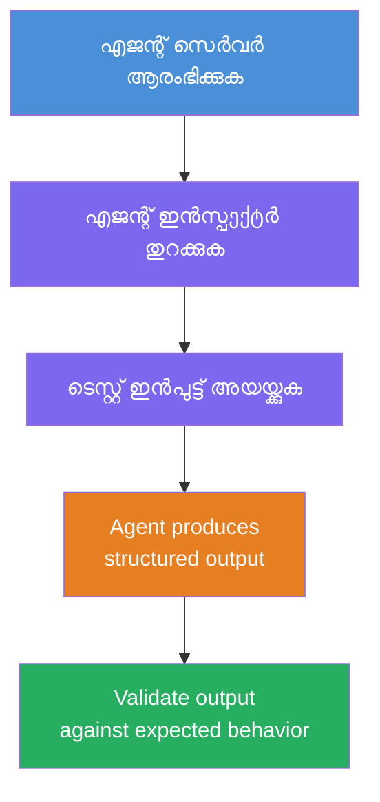
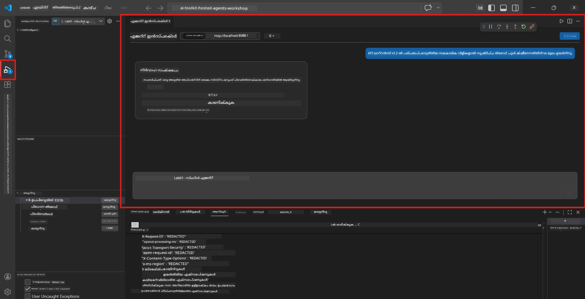
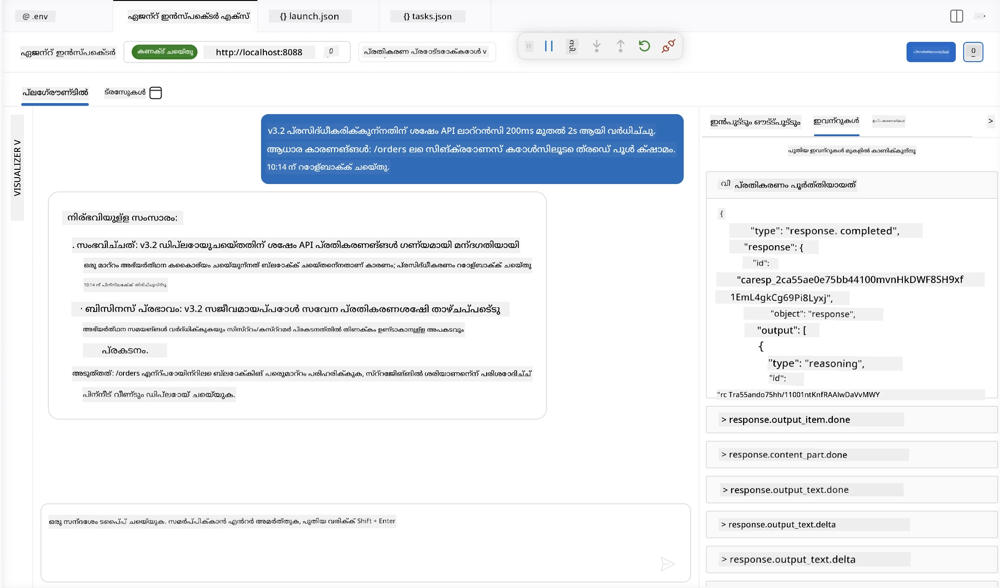

# മോഡ്യൂൾ 4 - പ്രാദേശികമായി ടെസ്റ്റ് ചെയ്യുക

⏱️ ~10 മിനിറ്റ്

ഈ മോഡ്യൂളിൽ, നിങ്ങൾ നിങ്ങളുടെ ഏജന്റിനെ പ്രാദേശികമായി ഓടിച്ച് അത് ശരിയായി പ്രവർത്തിക്കുന്നുണ്ടെന്ന് **സന്തോഷകരമായ പോത്ത് ഫംഗ്ഷണൽ ടെസ്റ്റുകൾ** ഉപയോഗിച്ച് സ്ഥിരീകരിക്കും. ഏജന്റ് ഇൻസ്പെക്ടർ (വിജ്വൽ UI) അല്ലെങ്കിൽ നേരിട്ട് HTTP കോളുകൾ ഉപയോഗിച്ച് ഏജന്റ് സ്രഷ്ടിക്കുന്ന അടിസ്ഥാന ഘടകങ്ങൾ ക്രമത്തിൽ, കൃത്യമായ പ്രതികരണങ്ങൾ ഉണ്ട് എന്ന് സ്ഥിരീകരിക്കും.

### പ്രാദേശിക പരിശോധനയുടെ പ്രവാഹം



---

## ഓപ്പോഷൻ 1: F5 അമർത്തുക - ഏജന്റ് ഇൻസ്പെക്ടറിലൂടെ ഡീബഗ് ചെയ്യുക (ശുപാർശ ചെയ്യുന്നു)

### ഡീബഗർ ആരംഭിക്കുക

1. **executive-summary-agent/** ഫോൾഡർ നേരിട്ട് VS Code-ൽ തുറക്കുക (`File → Open Folder`).
2. **Run and Debug** പാനൽ തുറക്കുക (`Ctrl+Shift+D`).
3. ഡ്രോപ്പ്ഡൗണിൽ നിന്ന് **Debug Local Agent Server** തിരഞ്ഞെടുക്കുക.
4. **F5** അമർത്തുക (അല്ലെങ്കിൽ ▶ സ്റ്റാർട്ട് ഡീബഗിംഗ് ക്ലിക്ക് ചെയ്യുക).

> ⚠️ **അത്യന്താപേക്ഷിതം: നിങ്ങളുടെ Python Interpreter തിരഞ്ഞെടുക്കുക**
> "ModuleNotFoundError" ലഭിക്കുന്നതിനോ ഡീബഗർ ആരംഭിക്കാൻ പരാജയപ്പെടുന്നതിനോ പക്ഷം, നിങ്ങളുടെ വർച്ച്വൽ environment ഉപയോഗിക്കാൻ VS Code-ന് അറിയിക്കണം:
  > 1. `Ctrl+Shift+P` അമർത്തുക → **Python: Select Interpreter** টাইപ്പ് ചെയ്യുക.
  > 2. നിങ്ങളുടെ പ്രോജക്ടിലെ `.venv` ഫോൾഡറിൽ കാണപ്പെടുന്ന ഇൻടർപ്രിറ്റർ തിരഞ്ഞെടുക്കുക (ഉദാഹരണത്തിന്, Windows-ൽ `.\.venv\Scripts\python.exe`).
  > 3. ഡീബഗ് സെഷൻ വീണ്ടും തുടങ്ങുക.
> എങ്കിലും പിശകുകൾ ഉണ്ടെങ്കിൽ, `tasks.json` ഫയൽ മനുഷ്യത്വത്തിൽ താഴെപറയുന്നവിധം അപ്ഡേറ്റ് ചെയ്യുക:
  > 1. `.vscode/tasks.json` ഫയലിലേക്ക് പോകുക
  > 2. `Run Agent/Workflow HTTP Server` എന്ന നിർദ്ദേശം അടയാളപ്പെടുത്തുന്ന കമാൻഡിലേക്ക് പോവുക
  > 3. കമാൻഡ് മൂല്യം ഇങ്ങനെ അപ്ഡേറ്റ് ചെയ്യുക: `"value": "${workspaceFolder}/.venv/bin/python",`

### സംഭവിക്കുന്നത്

1. HTTP സർവർ `http://localhost:8088/responses`-ൽ ആരംഭിക്കുന്നു.
2. **Agent Inspector** പാനൽ ഓട്ടോമാറ്റിക്കായി തുറക്കുന്നു - പരീക്ഷണത്തിനുള്ള വിസ്വൽ ചാറ്റ് ഇന്റർഫേസ്.
3. `main.py`-ൽ ബ്രേക്ക്‌പോയിന്റുകൾ പ്രവർത്തനക്ഷമമാണ്.

ടെർമിനലിൽ ശ്രദ്ധിക്കുക:
```
Starting executive summary hosted agent
Executive agent server running on http://localhost:8088
```

> **Agent Inspector തുറന്നില്ലെങ്കിൽ:** `Ctrl+Shift+P` അമർത്തുക → **Foundry Toolkit: Open Agent Inspector** തിരഞ്ഞെടുക്കുക.



> *സ്ക്ക്രീൻഷോട്ട് പഴയ 'AI TOOLKIT' ബ്രാന്ഡിംഗ് മുൻപ് ഉണ്ടായ എക്സ്റ്റൻഷൻ പതിപ്പ് കാണിച്ചേക്കാം.*

---

## ഓപ്പോഷൻ 2: ടെർമിനൽ വഴി പരിശോധന (വൈകിപകരം)

ഒരൊറ്റ ടെർമിനലിൽ ഏജന്റിനെ തുടങ്ങുക, മറ്റൊന്നിൽ അഭ്യർത്ഥനകൾ അയയ്ക്കുക:

```bash
# ടർമിനൽ 1: ഏജന്റ് ആരംഭിക്കുക
cd executive-summary-agent/
source .venv/bin/activate
python main.py
```

```bash
# ടെർമിനൽ 2: ടെസ്റ്റ് (കർൽ) അയക്കുക
curl -sS -X POST http://localhost:8088/responses \
  -H "Content-Type: application/json" \
  -d '{"input": "The API latency increased due to thread pool exhaustion caused by sync calls in v3.2.", "stream": false}'
```

---

## السيناريयो ടെസ്റ്റുകൾ: സന്തോഷകരമായ പാത പ്രവൃത്തി പരിശോധന

താഴെ കൊടുത്തിരിക്കുന്ന **മൂന്ന് തന്നെ** السينാരിഒ പുലർത്തുക. ഇതിലൂടെ നിങ്ങളുടെ ഏജന്റ് യഥാർത്ഥอินപുട്ടുകള്ക്ക് ശരിയായ, ഘടനാപരമായ ഔട്ട്പുട്ട് നൽകുകയാണ് എന്നു സ്ഥിരീകരിക്കും.



### السينാരിയോ 1: IT സംഭവം - API ലാറ്റൻസി സ്പൈക്ക്

**ഇൻപുട്ട്:**
```
The API latency increased from 200ms to 2s after deploying v3.2.
Root cause: thread pool starvation from synchronous calls in /orders.
Rolled back at 10:14.
```

** പ്രതീക്ഷിക്കുന്ന പെരുമാറ്റം:**
- ✅ "Executive Summary" ഘടന പാലിക്കുന്നു (എന്താണ് സംഭവിച്ചത് / ബിസിനസ് ബാധ / അടുത്ത നടപടി)
- ✅ സാങ്കേതിക പദങ്ങൾ ഇല്ല (പൂച്ചപ്പുള്ള പൂളുകൾ ഇല്ല, "/orders" ഇല്ല, "v3.2" ഇല്ല)
- ✅ ബിസിനസ്സിന്റെ ബാധ വ്യക്തമായി പറയുന്നു (ഉദാ: ഉപഭോക്താക്കൾക്ക് വൈകിപ്പ് അനുഭവപ്പെട്ടു)
- ✅ അടുത്ത നടപടി ഉൾക്കൊള്ളുന്നു (ഉദാ: ഫിക്സ് ദൈർഘ്യമാക്കി, നിരീക്ഷണം നടന്നു)

---

### السينാരിയോ 2: ഡാറ്റ പൈപ്പ്‌ലൈൻ - ETL പരാജയവും

**ഇൻപുട്ട്:**
```
The nightly ETL job failed because the upstream schema changed. APAC dashboards show missing data.
```

** പ്രതീക്ഷിക്കുന്ന പെരുമാറ്റം:**
- ✅ ഡാറ്റ റിഫ്രെഷ് പരാജയം സാദ്ധ്യവുമുള്ള ലളിതമായ ഭാഷയിൽ സംഗ്രഹിക്കുന്നു
- ✅ APAC ഡാഷ്ബോർഡ് ബാധ പരാമർശിക്കുന്നു
- ✅ പരിഹാരപരമായ അടുത്ത നടപടിയുണ്ട്
- ✅ "ETL", "സ്കീമ", അല്ലെങ്കിൽ മറ്റ് സാങ്കേതിക പദങ്ങൾ പരാമർശിക്കുന്നില്ല

---

### السينാരിയോ 3: സുരക്ഷ - വെളിപ്പെടുത്തിയ ക്രെഡൻഷ്യൽ

**ഇൻപുട്ട്:**
```
Static analysis flagged a hardcoded secret in the repository.
The secret may have been exposed in commit history.
```

** പ്രതീക്ഷിക്കുന്ന പെരുമാറ്റം:**
- ✅ ക്രെഡൻഷ്യൽ/സുരക്ഷാ പ്രശ്നം എക്സിക്യൂട്ടീവ് സൗഹൃദമായ ഭാഷയിൽ വിവരിക്കുന്നു
- ✅ സാധ്യതയുള്ള അപകടം (അനധികൃതത്താൽ പ്രവേശനം) വ്യക്തമാക്കുന്നു
- ✅ പരിഹാര നടപടി വ്യക്തമാക്കുന്നു (ക്രെഡൻഷ്യൽ റൊട്ടേഷൻ, ഓഡിറ്റ്)
- ✅ "സ്റ്റാറ്റിക് അനാലസിസ്", "കമ്മിറ്റ് ഹിസ്റ്ററി", "ഹാർഡ്‌കോഡഡ്" പോലുള്ള പദങ്ങൾ ഉൾക്കൊള്ളുന്നില്ല

---

## സ്ഥിരീകരണ മാനദണ്ഡങ്ങൾ

ഓരോ സീനാരിയോയിലും പരിശോധിക്കുക:

| # | മാനദണ്ഡം | പാസ്സ് ചെയ്‌തു എന്ന അവസ്ഥ |
|---|----------|---------------|
| 1 | **ഘടന** | "Executive Summary" ഫോർമാറ്റിൽ മൂന്ന് ബുള്ളറ്റുകളും ഉൾകൊള്ളുന്നു |
| 2 | **ലളിതമായ ഭാഷ** | സാങ്കേതിക ജാർഗൺ ഇല്ല; ഒരു എക്സിക്യൂട്ടീവ് മനസ്സിലാക്കാത്തത് സംബന്ധിച്ച് |
| 3 | **കൃത്യത** | ഇൻപുട്ട് പ്രതിഫലിപ്പിക്കുന്നു - വ്യാജ വിവരങ്ങൾ ഇല്ല |
| 4 | **സംക്ഷിപ്തം** | പ്രതികരണം 100 വാക്കുകൾക്കുള്ളിൽ |
| 5 | **അടുത്ത നടപടി** | വ്യക്തമാക്കിയ പ്രവർത്തി അല്ലെങ്കിൽ പരിഹാരം |

---

## ഡീബഗിംഗ് മാർഗ്ഗനിർദ്ദേശങ്ങൾ

| പ്രശ്നം | പരിഹാരമാർഗം |
|-------|-----|
| ഏജന്റ് ആരംഭിക്കില്ല | `.env` മൂല്യങ്ങൾ പരിശോധിക്കുക, venv പ്രവർത്തനക്ഷമമാണെന്ന് ഉറപ്പാക്കുക, `pip install -r requirements.txt` ഓടിക്കുക |
| ശൂന്യമായ അല്ലെങ്കിൽ സാധാരണ പ്രതികരണം | `main.py`യിലെ നിർദ്ദേശങ്ങൾ പരിശോധിക്കുക - ഔട്ട്പുട്ട് ഫോർമാറ്റ് വ്യക്തമാക്കിയത് ഉറപ്പാക്കുക |
| പ്രതികരണം ജാർഗൺ ഉൾക്കൊള്ളുന്നു | "സാങ്കേതിക പദങ്ങൾ നീക്കംചെയ്യുക" നിയമങ്ങൾ ശക്തിപ്പെടുത്തുക |
| ഏജന്റ് ഇൻസ്പെക്ടർ തുറന്നില്ല | `Ctrl+Shift+P` → **Foundry Toolkit: Open Agent Inspector** |
| ട്രർമിനലിൽ മോഡൽ പിശകുകൾ | `AZURE_AI_MODEL_DEPLOYMENT_NAME` കൃത്യമായി (കേസ്സെൻസിറ്റീവ്) പൊരുത്തപ്പെടുത്തുക |

---

### ✅ ചെക്ക്‌പോയിന്റ്

- [ ] ഏജന്റ് പ്രാദേശികമായി പിശകുകൾ ഇല്ലാതെ ആരംഭിക്കുന്നു
- [ ] ഏജന്റ് ഇൻസ്പെക്ടർ തുറക്കുന്നു, ചാറ്റ് ഇന്റർഫേസ് കാണിക്കുന്നു (F5 ഉപയോഗിച്ചാൽ)
- [ ] **Scenario 1** (IT സംഭവം) - ഘടനാപരമായ Executive Summary, ജാർഗൺ ഇല്ല
- [ ] **Scenario 2** (ഡാറ്റ പൈപ്പ്‌ലൈൻ) - അനുയോജ്യമായ സംഗ്രഹം ബിസിനസ് ബാധയോടെ
- [ ] **Scenario 3** (സുരക്ഷാ അലേർട്ട്) - ചേർന്ന അപകട ആശയവിനിമയം
- [ ] എല്ലാ പ്രതികരണങ്ങളും നിർവചിച്ച ഔട്ട്പുട്ട് ഘടന പാലിക്കുന്നു

> **നിങ്ങളുടെ പ്രതികരണങ്ങൾ സംരക്ഷിക്കുക** (കോപ്പി അല്ലെങ്കിൽ സ്ക്ക്രീൻഷോട്ട് എടുക്കുക) - Module 06-ലുള്ള ക്ലൗഡ് ഫലങ്ങളുമായി താരതമ്യം ചെയ്യനാകും.

---

**മുൻപ്:** [03 - Configure & Code](03-configure-and-code.md) · **അടുത്തത്:** [05 - Deploy to Foundry →](05-deploy-to-foundry.md)

---

<!-- CO-OP TRANSLATOR DISCLAIMER START -->
**അറിയിപ്പ്**:
ഈ രേഖ AI പരിഭാഷാ സേവനം [Co-op Translator](https://github.com/Azure/co-op-translator) ഉപയോഗിച്ച് പരിഭാഷപ്പെടുത്തിയതാണ്. ഞങ്ങൾ കൃത്യതയ്ക്കായി ശ്രമിക്കുന്നുവെങ്കിലും, ഓട്ടോമേറ്റഡ് പരിഭാഷകളിൽ പിഴവുകൾ അല്ലെങ്കിൽ തെറ്റായ വിവരങ്ങൾ ഉണ്ടാകാൻ സാധ്യതയുണ്ട്. അതിന്റെ സ്വാഭാവിക ഭാഷയിലുള്ള അസൽ രേഖയാണ് പ്രാമാണികമായ ഉറവിടമായി പരിഗണിക്കേണ്ടത്. നിർണായകമായ വിവരങ്ങൾക്ക്, പ്രൊഫഷണൽ മനുഷ്യ പരിഭാഷ ശുപാർശ ചെയ്യുന്നു. ഈ പരിഭാഷ ഉപയോഗിച്ച് ഉണ്ടാകുന്ന തെറ്റിദ്ധാരണകൾ അല്ലെങ്കിൽ തെറ്റായ വ്യാഖ്യാനങ്ങൾക്കായി ഞങ്ങൾ ഉത്തരവാദികളല്ല.
<!-- CO-OP TRANSLATOR DISCLAIMER END -->