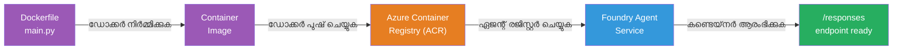
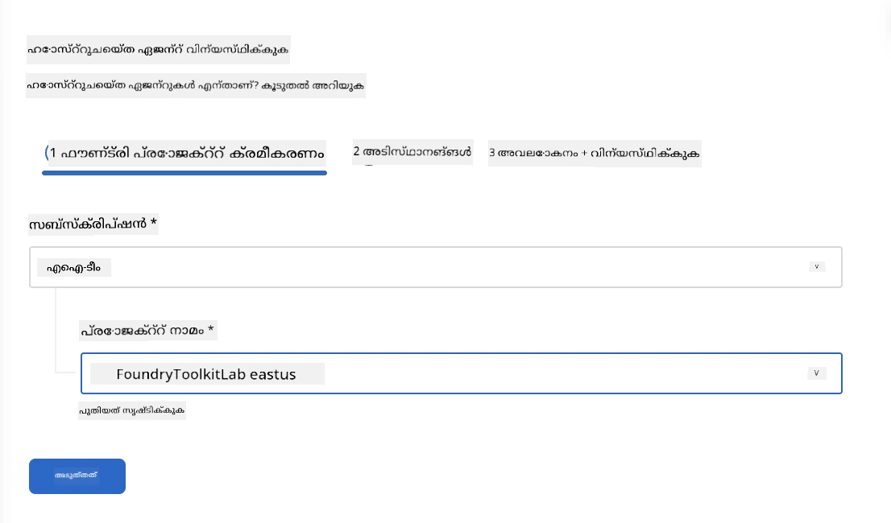
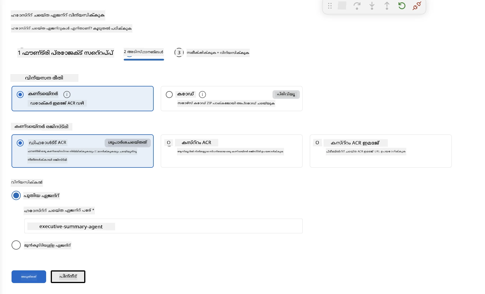
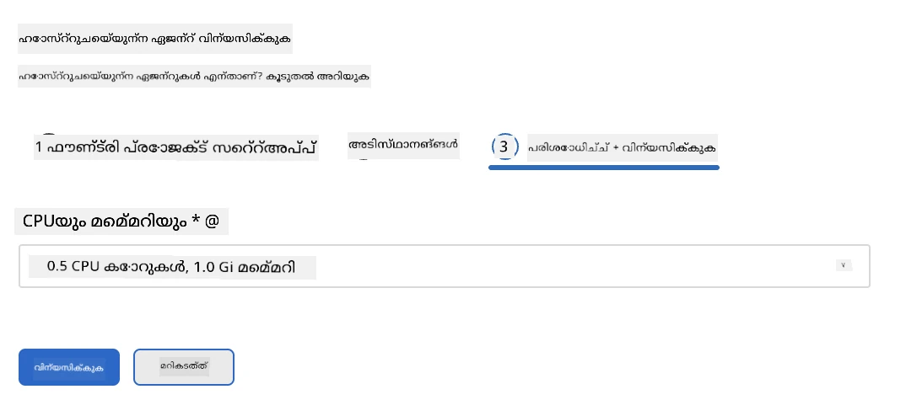
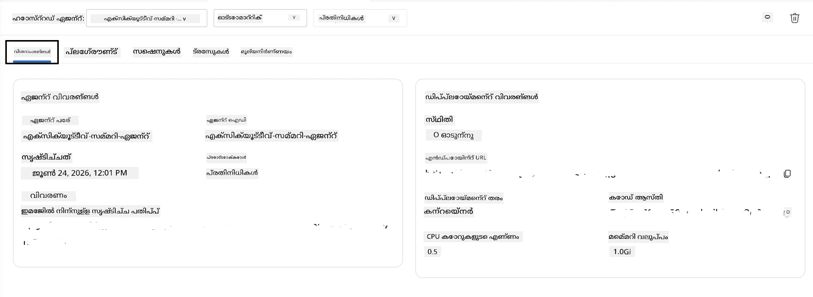

# മോഡ്യൂൾ 5 - ഫൗൻഡ്രി ഏജന്റ് സർവീസിലേയ്ക്ക് ഡിപ്ലോയ്ചെയ്യുക

⏱️ ~10 മിനിറ്റ്

> ⚠️ **പാതി ബി ഉപയോക്താക്കളേ:** ഈ മോഡ്യൂൾ ഫൗണ്ട്രി സബ്‌സ്‌ക്രിപ്ഷൻ ആവശ്യപ്പെടുന്നു. നിങ്ങൾ ഫൗണ്ട്രി ലോക്കൽ ഉപയോഗിക്കുന്നുവെങ്കിൽ, [മോഡ്യൂൾ 07 - സംക്ഷേപം](07-summary.md) എന്നതിനോട് മുന്നോട്ടുപോകുക. നിങ്ങൾ ലൊക്കൽ ഡെവലപ്പ്മെന്റ് വർക്ക്‌ഫ്ലോ വിജയകരമായി പൂർത്തിയാക്കിയിട്ടുണ്ട്!

ഈ മോഡ്യൂളിൽ, നിങ്ങൾ ലൊക്കലി പരീക്ഷിച്ച ഏജന്റിനെ മൈക്രോസോഫ്റ്റ് ഫൗണ്ട്രിയിലേക്ക് **ഹോസ്റ്റഡ് ഏജന്റ്** ആയി ഡിപ്ലോയ്ചെയ്യുന്നു. ഡിപ്ലോയ്മെന്റ് ഒരു കോണ്ടെയ്‌നർ ഇമേജ് നിർമിക്കുന്നു, അതിനെ അജൂറ് കോണ്ടെയ്‌നർ രജിസ്ട്രിയിലേക്ക് പുഷ് ചെയ്യുന്നു, ഫൗണ്ട്രിയുടെ മാനേജ് ചെയ്ത ഇൻഫ്രാസ്ട്രക്ചറിൽ ഏജന്റ് തുടങ്ങിയ്ക്കുന്നു.

### ഡിപ്ലോയ്മെന്റ് പൈപ്പ്‌ലൈൻ

---

## മുൻ‌രേഖകൾ പരിശോധന

ഡിപ്ലോയ് ചെയ്യുന്നതിനു മുൻപ് പരിശോധിക്കുക:

- [ ] ഏജന്റ് [മോഡ്യൂള 04](04-test-locally.md) ലെ 3 ലൊക്കൽ സീനാറിയോകളിൽ എല്ലാം കടന്നുപോകുന്നു
- [ ] നിങ്ങൾക്ക് പ്രൊജക്ട് ലെവലിൽ **അജ്യൂർ എഐ യൂസർ** റോൾ ഉണ്ട് ([മോഡ്യൂൾ 01, RBAC മോഡ്യൂൾ നൽകുക](01-setup.md#deploy-a-model--assign-rbac))
- [ ] VS കോഡിൽ അജ്യൂറിൽ സൈൻ ഇൻ ചെയ്തിട്ടുണ്ട് (അക്കൗണ്ട് ഐക്കൺ നിങ്ങളുടെ പേര് കാണിക്കുന്നു)

---

## ഘട്ടം 1: ഡിപ്ലോയ്മെന്റ് തുടങ്ങി

### ഓപ്ഷൻ A: ഏജന്റ് ഇൻസ്പെക്ടറിൽ നിന്നു ഡിപ്ലോയ് ചെയ്യുക (ശുപാർശമുഖ്യം)

ഏജന്റ് ഇൻസ്പെക്ടർ തുറന്നിട്ടുണ്ടെങ്കിൽ (ടെസ്റ്റിങ്ങിൽ നിന്നു):
1. മേൽവശ വലത് മൂലയിൽ ഉള്ള **Deploy** ബട്ടൺ അടങ്ങിയിരിക്കുന്ന ക്ലൗഡ് ഐക്കൺ (↑) ക്ലിക്ക് ചെയ്യുക.

### ഓപ്ഷൻ B: കമാൻഡ് പളറ്റിൽ നിന്നു ഡിപ്ലോയ് ചെയ്യുക

1. `Ctrl+Shift+P` അമർത്തുക → **Foundry Toolkit: Deploy Hosted Agent** തിരഞ്ഞെടുക്കുക.

---

## ഘട്ടം 2: ഡിപ്ലോയ്മെന്റ് ക്രമീകരിക്കുക

വിസാർഡ് നിങ്ങളെ സഹായിക്കാൻ ചോദിക്കും:

| അഭ്യർത്ഥന | തിരഞ്ഞെടുപ്പ് |
|--------|-----------|
| **സബ്‌സ്‌ക്രിപ്ഷൻ** | നിങ്ങളുടെ അജ്യൂർ സബ്‌സ്‌ക്രിപ്ഷൻ |
| **ലക്ഷ്യ പ്രൊജക്ട്** | നിങ്ങളുടെ ഫൗണ്ട്രി പ്രൊജക്ട് (ഉദാ, `workshop-agents`) |

നിങ്ങളുടെ ഏജന്റ് ക്രമീകരിക്കാൻ **next** ക്ലിക്ക് ചെയ്യുക.

| അഭ്യർത്ഥന | തിരഞ്ഞെടുപ്പ് |
|--------|-----------|
| **ഡിപ്ലോയ്മെന്റ് രീതി** | കോണ്ടെയ്‌നർ |
| **കോണ്ടെയ്‌നർ രജിസ്ട്രി** | **ഡിഫോൾട്ട് ACR** (മൈക്രോസോഫ്റ്റ് ഫൗണ്ട്രി നിങ്ങൾക്കായി ഒന്ന് സൃഷ്ടിക്കുകയും മാനേജ് ചെയ്യുകയും ചെയ്യുന്നു) |
| **ഡിപ്ലോയിമെന്റ്** | പുതിയ ഏജന്റ് (പേര്, `executive-summary-agent`) |

നിങ്ങളുടെ ഏജന്റ് പരിശോധനയ്ക്കും ഡിപ്ലോയ്മെന്റിനും **next** ക്ലിക്ക് ചെയ്യുക.

| അഭ്യർത്ഥന | തിരഞ്ഞെടുപ്പ് |
|--------|-----------|
| **CPU & മെമ്മറി** | **0.25 CPU കോറുകൾ, 0.5 Gi മെമ്മറി** (വർക്ക്‌ഷോപ്പിനായി മതിയായതാണ്) |

---

## ഘട്ടം 3: ഡിപ്ലോയ്മെന്റും മേൽനോട്ടവും

1. **Deploy** ക്ലിക്ക് ചെയ്യുക.
2. **Output** പാനൽ ശ്രദ്ധിക്കുക (ഡ്രോപ്ഡൗണിൽ നിന്നു **Microsoft Foundry** തെരഞ്ഞെടുക്കുക).
3. ഡിപ്ലോയ്മെന്റ് ഈ ഘട്ടങ്ങളിൽ കടന്നുപോകും:
   - **Docker build** - നിങ്ങളുടെ Dockerfile ഉപയോഗിച്ച് കോണ്ടെയ്‌നർ നിർമ്മിക്കുന്നു
   - **Docker push** - ഇമേജ് ACR ലേക്ക് പുഷ് ചെയ്യുന്നു (ആദ്യ ഡിപ്ലോയ്മെന്റിൽ 1–3 മിനിറ്റ്)
   - **Agent registration** - ഫൗണ്ട്രിയിൽ ഹോസ്റ്റഡ് ഏജന്റ് സൃഷ്ടിക്കുന്നു
   - **Container start** - സിസ്റ്റം മാനേജഡ് ഐഡന്റിറ്റിയോടൊപ്പം തുടങ്ങുന്നു

4. പൂർത്തിയായാൽ, ഒരു അറിയിപ്പ് കാണിക്കും:
   > **my-agent വിജയകരമായി ഡിപ്ലോയുചെയ്തു.** `View logs` `Run agent`

5. **Run agent** ക്ലിക്ക് ചെയ്ത് ഏജന്റ് പ്ലേഗ്രൗണ്ട് തുറക്കുക.

### ഡിപ്ലോയ്മെന്റ് നില നിലകൾ

| നില | അർത്ഥം |
|--------|---------|
| **Running** | കോണ്ടെയ്‌നർ റെഡി, ഏജന്റ് പ്രതികരിക്കുന്നു |
| **Pending** | കോണ്ടെയ്‌നർ ആരംഭിക്കുന്നു - 30–60 സെക്കൻഡു കൂടി കാത്തിരിക്കുക |
| **Failed** | ലോഗുകൾ പരിശോധിക്കുക (തെറ്റുകൾ തിരുത്തൽ കാണുക) |

---

## സാധാരണ ഡിപ്ലോയ്മെന്റ് പിശകുകൾ

| പിശക് | മുഖ്യ കാരണം | പരിഹാരം |
|-------|-----------|-----|
| `agents/write` അനുമതി മട്ടിയില്ല | പ്രൊജക്ട് ലെവലിൽ **അജ്യൂർ എഐ യൂസർ** റോളില്ലായ്മ | [മോഡ്യൂൾ 01, RBAC അനുവദിക്കുക](01-setup.md#deploy-a-model--assign-rbac) |
| Docker പ്രവർത്തിക്കുന്നില്ല | Docker Desktop ആരംഭിച്ചിട്ടില്ല | Docker Desktop ആരംഭിച്ച് `docker info` പരിശോധിക്കുക |
| ACR അനുമതി പ്രശ്നം | മാനേജഡ് ഐഡന്റിറ്റി ഇമേജ് പുൾ ചെയ്യാൻ കഴിയുന്നില്ല | [മോഡ്യൂൾ 08 - തെറ്റുപതിയറുത്തൽ](08-troubleshooting.md) കാണുക |

---

### ✅ ചെക്ക്‌പോയിന്റ്

- [ ] ഡിപ്ലോയ്മെന്റ് പിശകുകൾ കൂടാതെ പൂർത്തിയായി
- [ ] ഫൗണ്ട്രി സൈഡ്‌ബാറിൽ **Hosted Agents (Preview)**-ന്റെ കീഴിൽ ഏജന്റ് കാണപ്പെടുന്നു
- [ ] കോണ്ടെയ്‌നർ നില **Running** എന്ന് കാണിക്കുന്നു
- [ ] ഏജന്റ് പ്ലേഗ്രൗണ്ട് ടാബ് തുറന്ന് ഏജന്റിന്റെ വിശദാംശങ്ങളും എന്‍ഡ്‌പോയിന്റ് URLയും കാണിക്കുന്നു

---

**മുമ്പത്തെ:** [04 - ലൊക്കലായി പരീക്ഷിക്കുക](04-test-locally.md) · **അടുത്തത്:** [06 - പ്ലേഗ്രൗണ്ടിൽ ശരിവെക്കുക →](06-verify-in-playground.md)

---

<!-- CO-OP TRANSLATOR DISCLAIMER START -->
**അറിയിപ്പ്**:
ഈ രേഖ AI പരിഭാഷാ സേവനം [Co-op Translator](https://github.com/Azure/co-op-translator) ഉപയോഗിച്ച് പരിഭാഷപ്പെടുത്തിയതാണ്. ഞങ്ങൾ കൃത്യതയ്ക്കായി ശ്രമിക്കുന്നുവെങ്കിലും, ഓട്ടോമേറ്റഡ് പരിഭാഷകളിൽ പിഴവുകൾ അല്ലെങ്കിൽ തെറ്റായ വിവരങ്ങൾ ഉണ്ടാകാൻ സാധ്യതയുണ്ട്. അതിന്റെ സ്വാഭാവിക ഭാഷയിലുള്ള അസൽ രേഖയാണ് പ്രാമാണികമായ ഉറവിടമായി പരിഗണിക്കേണ്ടത്. നിർണായകമായ വിവരങ്ങൾക്ക്, പ്രൊഫഷണൽ മനുഷ്യ പരിഭാഷ ശുപാർശ ചെയ്യുന്നു. ഈ പരിഭാഷ ഉപയോഗിച്ച് ഉണ്ടാകുന്ന തെറ്റിദ്ധാരണകൾ അല്ലെങ്കിൽ തെറ്റായ വ്യാഖ്യാനങ്ങൾക്കായി ഞങ്ങൾ ഉത്തരവാദികളല്ല.
<!-- CO-OP TRANSLATOR DISCLAIMER END -->