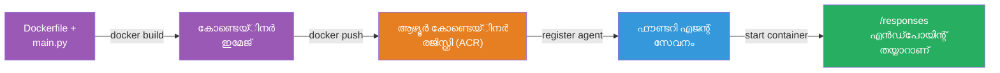
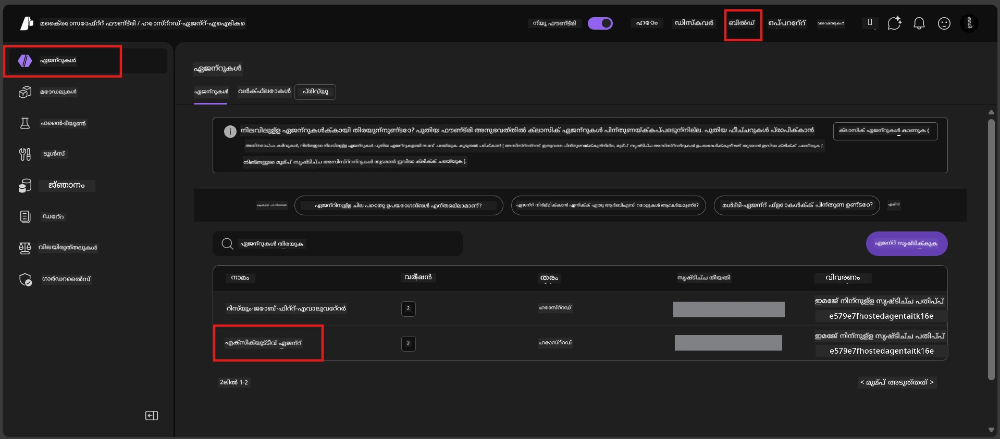

# Module 6 - Foundry Agent Service-ലേക്ക് ഡിപ്ലോയ്മെന്റ്

ഈ മോഡ്യൂളിൽ, നിങ്ങൾ എക്‌സ്പ്ലോറർ-ഇൽ ടെസ്റ്റ് ചെയ്ത നിങ്ങളുടെ ഏജന്റ് Microsoft Foundry ലേക്ക് [**Hosted Agent**](https://learn.microsoft.com/azure/foundry/agents/concepts/hosted-agents) ആയി ഡിപ്ലോയ് ചെയ്യുന്നു. ഡിപ്ലോയ്മെന്റ് പ്രക്രിയ നിങ്ങളുടെ പ്രോജക്റ്റിൽ നിന്ന് Docker കണ്ടെയ്‌നർ ഇമേജ് നിർമ്മിക്കുകയും അത് [Azure Container Registry (ACR)](https://learn.microsoft.com/azure/container-registry/container-registry-intro) ലേക്ക് പുഷ് ചെയ്യുകയും പിന്നീട് [Foundry Agent Service](https://learn.microsoft.com/azure/foundry/agents/overview) ല്‍ ഒരു hosted agent പതിപ്പ് സൃഷ്ടിക്കുകയും ചെയ്യുന്നു.

### ഡിപ്ലോയ്മെന്റ് പൈപ്പ്‌ലൈൻ


---

## മുൻ‌ഗണന പരിശോധനം

ഡിപ്ലോയ്മെന്റ് നടത്തുന്നതിനു മുന്‍പ് താഴെപ്പറയുന്ന എല്ലാ കാര്യങ്ങളും പരിശോധിക്കുക. ഇവയെ അവഗണിക്കുന്നത് ഡിപ്ലോയ്മെന്റ് പരാജയപ്പെടാൻ സാധാരണകാരണമെന്ന് കാണപ്പെടുന്നു.

1. **എജന്റ് ലൊക്കൽ സ്മോക്ക് ടെസ്റ്റുകൾ കടന്നുപോകുന്നു:**
   - [Module 5](05-test-locally.md) ൽ ഉള്ള 4 ടെസ്റ്റുകൾ വിജയകരമായി പൂർത്തിയാക്കി, ഏജന്റ് ശരിയായി പ്രതികരിച്ചു.

2. **നിങ്ങൾക്കുണ്ട് [Azure AI User](https://learn.microsoft.com/azure/foundry/concepts/rbac-foundry#built-in-roles) റോൾ:**
   - ഇത് [Module 2, Step 3](02-create-foundry-project.md) ൽ നൽകിയിട്ടുണ്ട്. ഉറപ്പില്ലെങ്കിൽ ഇപ്പോൾ പരിശോധിക്കുക:
   - Azure Portal → നിങ്ങളുടെ Foundry **project** resource → **Access control (IAM)** → **Role assignments** tab → നിങ്ങളുടെ പേര് തിരയുക → **Azure AI User** ലിസ്റ്റിൽ ഉണ്ടെന്ന് സ്ഥിരീകരിക്കുക.

3. **VS Code-ൽ നിങ്ങൾ Azure-യിൽ സൈൻ ഇൻ ചെയ്തിട്ടുണ്ട്:**
   - VS Code-യുടെ താഴെ ഇടത് ഭാഗത്ത് അക്കൗണ്ടുകൾ ഐക്കൺ പരിശോധിക്കുക. നിങ്ങളുടെ അക്കൗണ്ട് പേര് കാണണം.

4. **(ഐച്ഛികം) Docker Desktop ഓണാക്കിയിട്ടുണ്ട്:**
   - Docker ഫൊണ്ടറി ഇടപെടൽ ലൊക്കൽ ബിൽഡ് ആവശ്യപ്പെടുന്ന എക്സ്റ്റൻഷൻ പ്രവർത്തിക്കുന്നപ്പോൾ മാത്രം ആവശ്യമാണ്. സാധാരണ, എക്സ്റ്റൻഷൻ ഡिप്ലോയ്മെന്റ് സമയത്ത് കണ്ടെയ്‌നർ ബിൽഡുകൾ സ്വയം കൈകാര്യം ചെയ്യുന്നു.
   - Docker ഇൻസ്റ്റാൾ ചെയ്തിട്ടുണ്ടെങ്കിൽ അത് ഓണാണെന്ന് പരിശോധിക്കുക: `docker info`

---

## Step 1: ഡിപ്പ്ലോയ്മെന്റ് ആരംഭിക്കുക

ഡിപ്ലോയ്മെന്റ് രണ്ടായുള്ള പ്രദേശങ്ങൾ ഉണ്ട് - രണ്ടു വഴി ഒറ്റ ലക്ഷ്യത്തിലേക്കാണ്.

### ഓപ്ഷൻ A: Agent Inspector-നിന്ന് ഡിപ്ലോയ്മെന്റ് (ശുപാർശ)

ഡിബഗ്ഗറും (F5) Agent Inspector തുറന്നിട്ടുള്ളപ്പോൾ:

1. Agent Inspector പാനലിന്റെ **മുകളിൽ വലത് കോർണർ** നോക്കുക.
2. **Deploy** ബട്ടൺ ക്ലിക്ക് ചെയ്യുക (മേഘം ഐക്കൺ, മുകൾക്കൊഴിഞ്ഞുള്ള അമ്പ് ↑).
3. ഡിപ്ലോയ്മെന്റ് വിഡ്സാർഡ് തുറക്കും.

### ഓപ്ഷൻ B: Command Palette-ൽ നിന്ന് ഡിപ്ലോയ്മെന്റ്

1. `Ctrl+Shift+P` അമർത്തി **Command Palette** തുറക്കുക.
2. ടൈപ്പ് ചെയ്യുക: **Microsoft Foundry: Deploy Hosted Agent** തിരഞ്ഞെടുക്കുക.
3. ഡിപ്ലോയ്മെന്റ് വിഡ്സാർഡ് തുറക്കും.

---

## Step 2: ഡിപ്ലോയ്മെന്റ് ക്രമീകരിക്കുക

ഡിപ്ലോയ്മെന്റ് വിഡ്സാർഡ് ക്രമീകരണം നടത്താൻ സഹായിക്കും. ഓരോ പ്രോമ്പ്റ്റും പൂരിപ്പിക്കുക:

### 2.1 ലക്ഷ്യ പ്രോജക്റ്റ് തിരഞ്ഞെടുക്കുക

1. നിങ്ങളുടെ Foundry പ്രോജക്റ്റുകൾ ഒരു ഡ്രോപ്ഡൗൺ കാണിക്കും.
2. Module 2-ൽ बनाएക്കപ്പെട്ട പ്രോജക്റ്റ് തിരഞ്ഞെടുക്കുക (ഉദാഹരണം: `workshop-agents`).

### 2.2 കണ്ടെയ്‌നർ ഏജന്റ് ഫയൽ തിരഞ്ഞെടുക്കുക

1. ഏജന്റ് എൻട്രി പോയിന്റ് തിരഞ്ഞെടുക്കാൻ ആവശ്യപ്പെടും.
2. **`main.py`** (Python) തിരഞ്ഞെടുക്കുക – വിഡ്സാർഡ് നിങ്ങളുടെ ഏജന്റ് പ്രോജക്റ്റ് തിരിച്ചറിയാൻ ഇത് ഉപയോഗിക്കുന്നു.

### 2.3 സ്രോതസുകൾ ക്രമീകരിക്കുക

| ക്രമീകരണം | ശിപാർശ ചെയ്ത മൂല്യം | കുറിപ്പുകൾ |
|---------|------------------|-------|
| **CPU** | `0.25` | ഡീഫോൾട്ട്, workshop-ക്കു മതിയാകുന്നു. പ്രൊഡക്ഷൻ വേർക്ക്‌ലോഡുകൾക്കു വർദ്ധിപ്പിക്കുക |
| **Memory** | `0.5Gi` | ഡീഫോൾട്ട്, workshop-ക്കു മതിയാകുന്നു |

ഇവ `agent.yaml`-ല ഉള്ള മൂല്യങ്ങൾക്ക് ഒത്തിരിക്കുന്നു. ഡീഫോൾട്ട് സ്വീകരിക്കാൻ കഴിയും.

---

## Step 3: സ്ഥിരീകരിച്ച് ഡിപ്ലോയ് ചെയ്യുക

1. വിഡ്സാർഡ് ഡിപ്ലോയ്മെന്റ് സാരാംശം കാണിക്കും:
   - ലക്ഷ്യ പ്രോജക്റ്റ് പേര്
   - ഏജന്റ് പേര് (`agent.yaml`-നിന്ന്)
   - കണ്ടെയ്‌നർ ഫയൽ, സ്രോതസുകൾ
2. സാരാംശം പരിശോധിച്ച് **Confirm and Deploy** (അഥവാ **Deploy**) ക്ലിക്ക് ചെയ്യുക.
3. പ്രോഗ്രസ് VS Code-യിൽ കാണുക.

### ഡിപ്ലോയ്മെന്റ് പ്രക്രിയ (പടി പടിയായി)

ഡിപ്ലോയ്മെന്റ് മൾട്ടി-സ്റ്റെപ്പ് പ്രക്രിയയാണ്. VS Code **Output** പാനലിൽ (ഡ്രോപ്ഡൗൺilih: "Microsoft Foundry" തിരഞ്ഞെടുക്കുക) കാണുക:

1. **Docker ബിൽഡ്** - VS Code നിങ്ങളുടെ `Dockerfile`-ൽ നിന്നും Docker കണ്ടെയ്‌നർ ഇമേജ് നിർമ്മിക്കുന്നു. Docker ലെയർ സന്ദേശങ്ങൾ കാണാം:
   ```
   Step 1/6 : FROM python:<version>-slim
   Step 2/6 : WORKDIR /app
   ...
   Successfully built abc123def456
   ```

2. **Docker പുഷ്** - ഇമേജ് നിങ്ങളുടെ Foundry പ്രോജക്റ്റുമായി ബന്ധപ്പെടുന്ന **Azure Container Registry (ACR)**-യിലേക്ക് പുഷ് ചെയ്യും. ആദ്യ ഡിപ്ലോയ്‌മെന്റ് 1-3 മിനിറ്റ് എത്താം (ബേസ് ഇമേജ് >100MB).

3. **ഏജന്റ് രജിസ്ട്രേഷൻ** - Foundry Agent Service പുതിയ hosted agent (അഥവാ നിലവിലുള്ള ഏജന്റ് ഉണ്ടെങ്കിൽ പുതിയ പതിപ്പ്) സൃഷ്ടിക്കുന്നു. `agent.yaml`-ഇല നിന്നുള്ള മെടഡേറ്റ ഉപയോഗിക്കും.

4. **കണ്ടെയ്‌നർ ആരംഭിക്കൽ** - കണ്ടെയ്‌നർ Foundryയുടെ മാനേജ്ഡ് പ്ലാറ്റ്ഫോമിൽ ആരംഭിക്കും. എണ്ണം [system-managed identity](https://learn.microsoft.com/azure/foundry/agents/concepts/agent-identity) അനുവദിക്കുകയും `/responses` endpoint വെളിപ്പെടുത്തുകയും ചെയ്യും.

> **ആദ്യ ഡിപ്ലോയ്മെന്റ് ബുദ്ധിമുട്ട് അനുഭവപ്പെടാം** (Docker എല്ലാ ലെയറുകളും പുഷ് ചെയ്യണം). തുടര്‍ന്ന് ഡിപ്ലോയ്മെന്റുകൾ വേഗത്തിലാകും കാരണം Docker മാറ്റമില്ലാത്ത ലെയറുകൾ ക്യാഷ് ചെയ്യും.

---

## Step 4: ഡിപ്ലോയ്മെന്റ് നില പരിശോധിക്കുക

ഡിപ്ലോയ്മെന്റ് കമാൻഡ് പൂർത്തിയായ ശേഷം:

1. Activity Bar-ൽ Foundry ഐക്കൺ ക്ലിക്ക് ചെയ്ത് **Microsoft Foundry** സൈഡ്‌ബാർ തുറക്കുക.
2. നിങ്ങളുടെ പ്രോജക്റ്റ് കീഴിൽ **Hosted Agents (Preview)** വിഭാഗം വ്യാപിപ്പിക്കുക.
3. നിങ്ങളുടെ ഏജന്റ് പേര് കാണണം (ഉദാഹാ: `ExecutiveAgent` അല്ലെങ്കിൽ `agent.yaml`-ല്‍ നിന്നുള്ള പേര്).
4. **ഏജന്റ് പേരിൽ ക്ലിക്ക് ചെയ്യുക** അത് വ്യാപിപ്പിക്കാൻ.
5. ഒരു അല്ലെങ്കിൽ കൂടുതൽ **പതിപ്പുകൾ** കാണും (ഉദാഹാ: `v1`).
6. പതിപ്പ് ക്ലിക്ക് ചെയ്താൽ **Container Details** കാണും.
7. **Status** ഫീൽഡ് പരിശോധിക്കുക:

   | നില | അർത്ഥം |
   |--------|---------|
   | **Started** അല്ലെങ്കിൽ **Running** | കണ്ടെയ്‌നർ പ്രവർത്തിക്കുന്നുണ്ട്, ഏജന്റ് സജ്ജമാണ് |
   | **Pending** | കണ്ടെയ്‌നർ ആരംഭിക്കുകയാണ് (30-60 സെക്കന്റ് കാത്തിരിക്കുക) |
   | **Failed** | കണ്ടെയ്‌നർ ആരംഭിക്കുന്നത് പരാജയപ്പെട്ടു (ലോഗ് പരിശോധിക്കുക - താഴെ തെളിവുകൾ കാണുക) |



> **"Pending" 2 മിനിറ്റ് കൂടുതൽ കണ്ടാൽ:** കണ്ടെയ്‌നർ ബേസ് ഇമേജ് പുള്ളിംഗ് ചെയ്യാൻ വന്നിരിക്കാം. കുറച്ച് കൂടുതൽ കാത്തിരിക്കുക. തുടർന്നും Pending ആണെങ്കിൽ കണ്ടെയ്‌നർ ലോഗ്സ് പരിശോധിക്കുക.

---

## പൊതുവായ ഡിപ്ലോയ്മെന്റ് പിഴവുകളും പരിഹാരങ്ങളും

### പിഴവ് 1: അനുമതി നിരസിച്ചു - `agents/write`

```
Error: lacks the required data action 
Microsoft.CognitiveServices/accounts/AIServices/agents/write 
to perform POST /api/projects/{projectName}/assistants operation.
```

**മൂലകാരണം:** നിങ്ങൾക്ക് `Azure AI User` റോളോ **project** ലെവലിൽ ഇല്ല.

**പടി പടി പരിഹാരമാർഗം:**

1. [https://portal.azure.com](https://portal.azure.com) തുറക്കുക.
2. സെർച്ച് ബാറിൽ നിങ്ങളുടെ Foundry **project** പേര് ടൈപ്പ് ചെയ്ത് ക്ലിക്ക് ചെയ്യുക.
   - **ഗുരുതരമായ:** നിങ്ങൾ **project** resource (ടൈപ്പ്: "Microsoft Foundry project") ക്കു പോകണം, parent account/hub resource-ൽ അല്ല.
3. ഇടത് നാവിഗേഷൻയിൽ **Access control (IAM)** ക്ലിക്ക് ചെയ്യുക.
4. **+ Add** → **Add role assignment** ക്ലിക്ക് ചെയ്യുക.
5. **Role** ടാബിൽ [**Azure AI User**](https://learn.microsoft.com/azure/foundry/concepts/rbac-foundry#built-in-roles) തിരയൂ, തിരഞ്ഞെടുക്കൂ. **Next**.
6. **Members** ടാബിൽ **User, group, or service principal** തിരഞ്ഞെടുക്കുക.
7. **+ Select members** → നിങ്ങളുടെ പേര്/ഇമെയിൽ കണ്ടെത്തി സെലക്ട് → **Select**.
8. **Review + assign** → വീണ്ടും **Review + assign**.
9. 1-2 മിനിറ്റ് കാത്തുനോക്കുക റോളിന്റെ വ്യാപനം നടക്കും.
10. **Step 1-ൽ നിന്നും ഡിപ്ലോയ്മെന്റ് വീണ്ടും ശ്രമിക്കുക**.

> റോൾ **project** സ്കോപ്പിൽ ആയിരിക്കണം, അക്കൗണ്ട് സ്കോപ്പിലേക്ക് മാത്രം അല്ല. ഇതാണ് ഡിപ്ലോയ്മെന്റ് പരാജയപ്പെടാൻ പ്രധാന കാരണം.

### പിഴവ് 2: Docker ഓണാകുന്നില്ല

```
Error: Docker build failed / Cannot connect to Docker daemon
```

**പരിഹാരം:**
1. Docker Desktop ആരംഭിക്കുക (സ്റ്റാർട്ട് മെനുവിൽ നിന്ന്).
2. "Docker Desktop is running" കാണും വരെ കാത്തിരിക്കുക (30-60 സെക്കന്റ്).
3. ഉറപ്പാക്കുക: ടെർമിനലിൽ `docker info` റൺ ചെയ്യുക.
4. **Windows-specific:** Docker Desktop സജ്ജീകരണങ്ങളിൽ WSL 2 බැക്ക്എൻഡ് സജീവമാക്കുക → **General** → **Use the WSL 2 based engine**.
5. ഡിപ്ലോയ്മെന്റ് വീണ്ടും ശ്രമിക്കുക.

### പിഴവ് 3: ACR ന്റെ അനുമതി - `AcrPullUnauthorized`

```
Error: AcrPullUnauthorized
```

**മൂലകാരണം:** Foundry പ്രോജക്റ്റിന്റെ മാനേജ്ഡ് ഐഡന്റിറ്റി container registry-ല്‍ pull access കൈവിടുന്നില്ല.

**പരിഹാരം:**
1. Azure Portal-ൽ നിങ്ങളുടെ **[Container Registry](https://learn.microsoft.com/azure/container-registry/container-registry-intro)** പോകുക (Foundry പ്രോജക്റ്റിന്റെ റിസോഴ്‌സ് ഗ്രൂപ്പിനുണ്ടായിരിക്കും).
2. **Access control (IAM)** → **Add** → **Add role assignment**.
3. **[AcrPull](https://learn.microsoft.com/azure/container-registry/container-registry-roles)** റോൾ തിരഞ്ഞെടുക്കുക.
4. Members-ൽ **Managed identity** → Foundry പ്രോജക്റ്റിന്റെ managed identity തെരഞ്ഞെടുത്തു.
5. **Review + assign**.

> സാധാരണ Foundry എക്സ്റ്റൻഷൻ ഇത് സ്വയം ക്രമീകരിക്കുന്നു. പിഴവ് കാണിക്കുമ്പോൾ പരാമർശിച്ച ക്രമീകരണം ദോഷം സംഭവിച്ചുവെന്ന് സൂചിപ്പിക്കുന്നു.

### പിഴവ് 4: കണ്ടെയ്‌നർ പ്ലാറ്റ്ഫോം പൊരുത്തക്കേട് (Apple Silicon)

Apple Silicon Mac (M1/M2/M3) -ൽ നിന്നു ഡിപ്ലോയ്മെന്റ് നടത്തുമ്പോൾ, കണ്ടെയ്‌നർ `linux/amd64` ന് ആവശ്യമാണ്:

```bash
docker build --platform linux/amd64 -t myagent:v1 .
```

> Foundry എക്സ്റ്റൻഷൻ മിക്കവാറും ഈ ക്രമീകരണം സ്വയം കൈകാര്യം ചെയ്യും.

---

### ചെക്പോയിന്റ്

- [ ] ഡിപ്ലോയ്മെന്റ് കമാൻഡ് VS Code-ൽ പിശകുകൾ കൂടാതെ പൂർത്തിയായി
- [ ] ഏജന്റ് Foundry സൈഡ്ബാറിലെ **Hosted Agents (Preview)**-യില്‍ കാണാം
- [ ] ഏജന്റിൽ ക്ലിക്ക് ചെയ്തു → പതിപ്പ് തിരഞ്ഞെടുത്തു → **Container Details** കണ്ടു
- [ ] കണ്ടെയ്‌നർ നില **Started** അല്ലെങ്കിൽ **Running** കാണിക്കുന്നു
- [ ] (പിശകുകൾ ഉണ്ടെങ്കിൽ) പിഴവ് കണ്ടെത്തി, പരിഹാരം പ്രയോഗിച്ചു, ഡിപ്ലോയ്മെന്റ് വീണ്ടും വിജയിച്ചു

---

**Previous:** [05 - Test Locally](05-test-locally.md) · **Next:** [07 - Verify in Playground →](07-verify-in-playground.md)

---

<!-- CO-OP TRANSLATOR DISCLAIMER START -->
**ഡിസ്ക്ലെയ്മർ**:  
ഈ ഡോക്യുമെന്റ് AI വിവർത്തന സേവനമായ [Co-op Translator](https://github.com/Azure/co-op-translator) ഉപയോഗിച്ചാണ് വിവർത്തനം ചെയ്തത്. നാം നിബന്ധനകൾ പാലിക്കാൻ ശ്രമിച്ചിട്ടாலும், സ്വയം പ്രവർത്തിക്കുന്ന വിവർത്തനങ്ങളിൽ പിഴവുകളും കൃത്യതയില്ലാത്തതുമായ വിഷയങ്ങളും ഉണ്ടായിരിക്കും. മൂല രേഖയുടെ യഥാർത്ഥ ഭാഷതലയിൽ ഉള്ളത് പ്രാമാണിക ഉറവിടമായി കണക്കാക്കുന്നതാണ് ഉചിതം. നിർണായക വിവരങ്ങൾക്ക്, പ്രൊഫഷണൽ മനുഷ്യ വിവർത്തനം നിർദേശിക്കുകയും ചെയ്യുന്നു. ഈ വിവർത്തനം ഉപയോഗിച്ചതിൽ നിന്നാകുന്ന യാതൊരു തെറ്റിദ്ധാരണകൾക്കും ഞങ്ങൾ ഉത്തരവാദികളല്ല.
<!-- CO-OP TRANSLATOR DISCLAIMER END -->