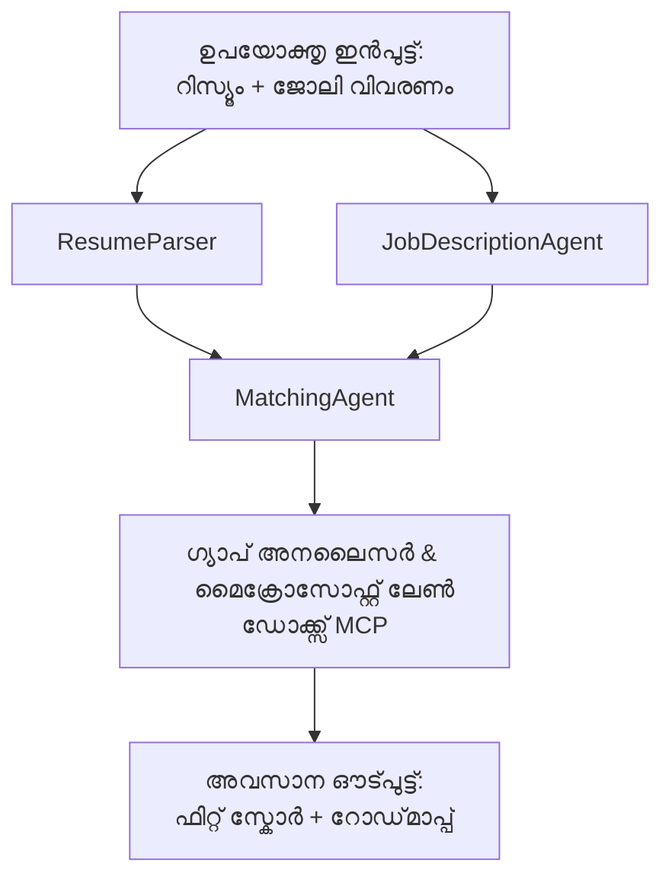

# PersonalCareerCopilot - റിസ്യൂം → ജോബ് ഫിറ്റ് മൂല്യനിർണ്ണയകൻ

ഒരു മൾട്ടി-ഏജന്റ് വർക്‌ഫ്ലോ, ഇത് ഒരു റിസ്യൂം ഒരു ജോബ് വിവരണത്തോട് എത്രമാത്രം ഒത്തുപോകുന്നുവെന്ന് വിലയിരുത്തുന്നു, പിന്നീട് അഭാവങ്ങൾ കുറക്കാൻ വ്യക്തിഗത പഠന റോഡ്‌മാപ്പ് സൃഷ്ടിക്കുന്നു.

---

## ഏജന്റുകൾ

| ഏജന്റ് | റോൾ | ഉപകരണങ്ങൾ |
|-------|------|-------|
| **ResumeParser** | റിസ്യൂം ടെക്സ്റ്റിൽ നിന്നും ഘടനാപരമായ സ്കിൽസ്, പരിചയം, സർട്ടിഫിക്കേഷനുകൾ എടുക്കുന്നു | - |
| **JobDescriptionAgent** | ജോബ് ഡിസ്ക്രിപ്ഷനിൽ നിന്നും ആവശ്യമായ/ ഇഷ്ടാനുസൃത സ്കിൽസ്, പരിചയം, സർട്ടിഫിക്കേഷനുകൾ എടുക്കുന്നു | - |
| **MatchingAgent** | പ്രൊഫൈൽ vs ആവശ്യകതകൾ ലഘുലേഖ → ഫിറ്റ് സ്കോർ (0-100) + പൊരുത്തപ്പെട്ട/അസാധാരണ സ്കിൽസ് | - |
| **GapAnalyzer** | Microsoft Learn റിസോഴ്‌സുകളുമായി വ്യക്തിഗത പഠന റോഡ് മാപ്പ് സൃഷ്ടിക്കുന്നു | `search_microsoft_learn_for_plan` (MCP) |

## വർക്‌ഫ്ലോ


---

## വേഗത്തിലുള്ള ആരംഭം

### 1. പരിസ്ഥിതി സജ്ജമാക്കുക

```powershell
cd workshop\lab02-multi-agent\PersonalCareerCopilot
python -m venv .venv
.\.venv\Scripts\Activate.ps1          # Windows PowerShell
# source .venv/bin/activate            # മാക്ഓഎസ് / ലിനക്സ്
pip install -r requirements.txt
```

### 2. ക്രെഡൻഷ്യലുകൾ ക്രമീകരിക്കുക

ഉദാഹരണ env ഫയൽ പകർത്ത് നിങ്ങളുടെ Foundry പ്രോജക്ട് വിവരങ്ങൾ പൂരിപ്പിക്കുക:

```powershell
cp .env.example .env
```

`.env` എഡിറ്റ് ചെയ്യുക:

```env
PROJECT_ENDPOINT=https://<your-account>.services.ai.azure.com/api/projects/<your-project>
MODEL_DEPLOYMENT_NAME=gpt-4.1-mini
```

| മൂല്യം | എവിടെ കണ്ടെത്താം |
|-------|-----------------|
| `PROJECT_ENDPOINT` | VS Code-ൽ Microsoft Foundry സൈഡ്‌ബാർ → നിങ്ങളുടെ പ്രോജക്ടിൽ റൈറ്റ്-ക്ലിക്ക് → **Copy Project Endpoint** |
| `MODEL_DEPLOYMENT_NAME` | Foundry സൈഡ്‌ബാർ → പ്രോജക്ട് വ്യാപിപ്പിക്കുക → **Models + endpoints** → ഡിപ്ലോയ്മെന്റ് നാമം |

### 3. ലോക്കലായി പ്രവർത്തിപ്പിക്കുക

```powershell
python -m debugpy --listen 127.0.0.1:5679 -m agentdev run main.py --verbose --port 8088
```

അഥവാ VS Code ടാസ്ക്ക് ഉപയോഗിക്കുക: `Ctrl+Shift+P` → **Tasks: Run Task** → **Run Lab02 HTTP Server**.

### 4. ഏജന്റ് ഇൻസ്പെക്ടറോടെ ടെസ്റ്റ് ചെയ്യുക

ഏജന്റ് ഇൻസ്പെക്ടർ തുറക്കുക: `Ctrl+Shift+P` → **Foundry Toolkit: Open Agent Inspector**.

ഈ ടെസ്റ്റ് പ്രോംപ്റ്റ് പേസ്റ്റ് ചെയ്യുക:

```
Resume:
Jane Doe
Senior Software Engineer with 5 years of experience in Python, Django, and AWS.
Built microservices handling 10K+ requests/second. Led a team of 4 developers.
Certifications: AWS Solutions Architect Associate.
Education: B.S. Computer Science, State University.

Job Description:
Senior Cloud Engineer at Contoso Ltd.
Required: Python, Azure, Kubernetes, Terraform, CI/CD pipelines.
Preferred: Go, monitoring (Prometheus/Grafana), cost optimization.
Experience: 5+ years in cloud infrastructure.
Certifications: Azure Solutions Architect Expert preferred.
```

**ആശംസിക്കപ്പെടുന്നത്:** ഒരു ഫിറ്റ് സ്കോർ (0-100), പൊരുത്തമുള്ള/അസാധാരണ സ്കിൽസ്, Microsoft Learn URLs ഉള്ള വ്യക്തിഗത പഠന റോഡ്‌മാപ്പ്.

### 5. Foundry-യിലേക്ക് ഡിപ്ലോയ് ചെയ്യുക

`Ctrl+Shift+P` → **Microsoft Foundry: Deploy Hosted Agent** → നിങ്ങളുടെ പ്രോജക്ട് തിരഞ്ഞെടുക്കുക → സ്ഥിരീകരിക്കുക.

---

## പ്രോജക്ട് ഘടന

```
PersonalCareerCopilot/
├── .env.example        ← Template for environment variables
├── .env                ← Your credentials (git-ignored)
├── agent.yaml          ← Hosted agent definition (name, resources, env vars)
├── Dockerfile          ← Container image for Foundry deployment
├── main.py             ← 4-agent workflow (instructions, MCP tool, WorkflowBuilder)
└── requirements.txt    ← Python dependencies
```

## പ്രധാന ഫയലുകൾ

### `agent.yaml`

Foundry ഏജന്റ് സർവീസിനായി ഹോസ്റ് ചെയ്ത ഏജന്റ് നിർവചിക്കുന്നു:
- `kind: hosted` - മാനേജ്ഡ് കണ്ടെയ്‌നറായി പ്രവർത്തിക്കുന്നു
- `protocols: [responses v1]` - `/responses` HTTP എന്റ്പോയിന്റ് പ്രദർശിപ്പിക്കുന്നു
- `environment_variables` - `PROJECT_ENDPOINT` మరియు `MODEL_DEPLOYMENT_NAME` ഡിപ്ലോയ്മെന്റ് സമയത്ത് ഇഞ്ചെക്ട് ചെയ്യുന്നു

### `main.py`

ഉൾക്കൊള്ളുന്നു:
- **ഏജന്റ് നിർദ്ദേശങ്ങൾ** - നാല് `*_INSTRUCTIONS` സ്ഥിരാങ്കങ്ങൾ, ഓരോ ഏജന്റിനും ഒറ്റ ഒറ്റ
- **MCP ഉപകരണം** - `search_microsoft_learn_for_plan()` `https://learn.microsoft.com/api/mcp` നെ Streamable HTTP വഴി വിളിക്കുന്നു
- **ഏജന്റ് സൃഷ്ടി** - `create_agents()`  പ്രാസംഘികൻ, `AzureAIAgentClient.as_agent()` ഉപയോഗിച്ച്
- **Workflow ഗ്രാഫ്** - `create_workflow()` `WorkflowBuilder` ഉപയോഗിച്ച് ഏജന്റുകളെ ഫാൻ-ഔട്ട്/ഫാൻ-ഇൻ/ക്രമമിട്ട പതിപ്പുകളിൽ ബന്ധിപ്പിക്കുന്നു
- **സെർവർ ആരംഭിക്കൽ** - `from_agent_framework(agent).run_async()`  പോർട്ട് 8088ൽ പ്രവർത്തിപ്പിക്കുന്നു

### `requirements.txt`

| പാക്കേജ് | പതിപ്പ് | ഉദ്ദേശ്യം |
|---------|---------|---------|
| `agent-framework-azure-ai` | `1.0.0rc3` | Microsoft Agent Framework-ന് Azure AI എന്റഗ്രേഷൻ |
| `agent-framework-core` | `1.0.0rc3` | കോർ റൺടൈം (WorkflowBuilder ഉൾപ്പെടെ) |
| `azure-ai-agentserver-agentframework` | `1.0.0b16` | ഹോസ്റ്റഡ് ഏജന്റ് സെർവർ റൺടൈം |
| `azure-ai-agentserver-core` | `1.0.0b16` | കോർ ഏജന്റ് സെർവർ അബ്സ്ട്രാക്ഷൻസ് |
| `debugpy` | ഏറ്റവും പുതിയത് | Python ഡീബഗിംഗ് (VS Code F5) |
| `agent-dev-cli` | `--pre` | ലോക്കൽ ഡെവ് CLI + ഏജന്റ് ഇൻസ്പെക്ടർ ബാക്ക്‌എൻഡ് |

---

## പ്രശ്നപരിഹാരം

| പ്രശ്നം | പരിഹാരം |
|-------|-----|
| `RuntimeError: Missing required environment variable(s)` | `.env` സൃഷ്ടിച്ച് `PROJECT_ENDPOINT` മതി `MODEL_DEPLOYMENT_NAME` ചേർക്കുക |
| `ModuleNotFoundError: No module named 'agent_framework'` |.Virtual environment സജീവമാക്കി `pip install -r requirements.txt` പ്രവർത്തിപ്പിക്കുക |
| ഔട്ട്പുട്ടിൽ Microsoft Learn URLs ഇല്ല | ഇന്റർനെറ്റ് കണക്ഷൻ പരിശോധിക്കുക `https://learn.microsoft.com/api/mcp` വരെ |
| ഒരു മാത്രം gap കാർഡ് (ശിച്ഛിതം) | `GAP_ANALYZER_INSTRUCTIONS`-ൽ `CRITICAL:` ബ്ലോക്ക് ഉൾപ്പെടുത്തിയിട്ടുണ്ടെന്ന് ഉറപ്പാക്കുക |
| പോർട്ട് 8088 ഉപയോഗത്തിലുണ്ട് | മറ്റു സെർവറുകൾ നിർത്തുക: `netstat -ano \| findstr :8088` |

വിശദമായ പ്രശ്നപരിഹാരത്തിനായി, [Module 8 - Troubleshooting](../docs/08-troubleshooting.md) കാണുക.

---

**പൂർണ്ണ പിന്തുടരല്‍:​** [Lab 02 Docs](../docs/README.md) · **വീണ്ടും പോകാൻ:** [Lab 02 README](../README.md) · [വർക്‌ഷോപ്പ് ഹോം](../../../README.md)

---

<!-- CO-OP TRANSLATOR DISCLAIMER START -->
**അസ്‌പഷ്ടത**:
ഈ ദസ്താവേਜ਼ം AI വിവർത്തന സേവനം [Co-op Translator](https://github.com/Azure/co-op-translator) ഉപയോഗിച്ച് വിവർത്തനം ചെയ്തതാണ്. നാം കൃത്യതയിലേക്കായി ശ്രമിക്കുന്നുവെങ്കിലും, പുഞ്ചിരിയോടെ ഓട്ടോമാറ്റിക് വിവർത്തനങ്ങളിൽ പിഴവുകളും അസവിശ്വസനീയതയും ഉണ്ടാകാമെന്നു ശ്രദ്ധിക്കുക. ആദ്യ ദസ്താവേസ് ഭാഷയിലുള്ള പ്രഭാവി ഉറവിടമെന്നുണ്ടാക്കിയിരിക്കണം. നിർണ്ണായക വിവരംക്കായി, പ്രൊഫഷണൽ മനുഷ്യ വിവർത്തനം നിർദ്ദേശിക്കുന്നു. ഈ വിവർത്തനം ഉപയോഗിക്കുന്നതിൽ നിന്നും ഉളവാകുന്ന തെറ്റിദ്ധാരണകൾക്ക് ഞങ്ങൾ ഉത്തരവാദികളല്ല.
<!-- CO-OP TRANSLATOR DISCLAIMER END -->