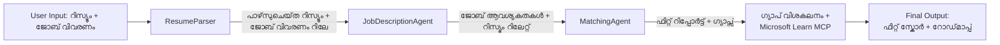

# PersonalCareerCopilot - റിസൂം → ജോബ് ഫിറ്റ് ഈവാലുവേറ്റർ

ഒരു വർക്ക്‌ഫ്ലോ-ഫസ്റ്റ് മൾട്ടി-എജന്റ് ആപ്പ്, ഒരു റിസൂം ജോലി വിവരണത്തിന് എത്രത്തോളം അനുയോജ്യമാണെന്ന് വിലയിരുത്തുന്നു, തുടർന്ന് ഇടവേളകൾ പൂരിപ്പിക്കാൻ വ്യക്തിഗത പഠന റോഡ്മാപ്പ് ജനനമാക്കുന്നു.

---

## ഏജന്റുകൾ

| ഏജന്റ് | പങ്ക് | ഉപകരണങ്ങൾ |
|-------|------|-------|
| **ResumeParser** | റിസൂം എഴുത്തിൽ നിന്നുള്ള ഘടനാപരമായ കഴിവുകൾ, അനുഭവം, സർട്ടിഫിക്കേഷനുകൾ ആർജിക്കുന്നു | - |
| **JobDescriptionAgent** | ഒരു ജോബ് വിവരണത്തിൽ ആവശ്യമായ/ആഗ്രഹിക്കുന്ന കഴിവുകൾ, അനുഭവം, സർട്ടിഫിക്കേഷനുകൾ ആർജിക്കുന്നു | - |
| **MatchingAgent** | പ്രൊഫൈൽ vs ആവശ്യകതകൾ താരതമ്യം ചെയ്യുന്ന → ഫിറ്റ് സ്കോർ (0-100) + പൊരുത്തപ്പെട്ട/അകലം ഉള്ള കഴിവുകൾ | - |
| **GapAnalyzer** | Microsoft Learn സ്രോതസുകളുമായി വ്യക്തിഗത പഠന റോഡ്മാപ്പ് നിർമ്മിക്കുന്നു | `search_microsoft_learn_for_plan` (MCP) |

## വർക്ക്‌ഫ്ലോ


```mermaid
flowchart LR
    UserInput["User Input: റിസ്യൂം + ജോബ് വിവരണം"] --> ResumeParser
    ResumeParser -- "പാഴ്‌സുചെയ്‌ത റിസ്യൂം + ജോബ് വിവരണം റിലേ" --> JobDescriptionAgent
    JobDescriptionAgent -- "ജോബ് ആവശ്യകതകൾ + റിസ്യൂം റിലേറ്റ്" --> MatchingAgent
    MatchingAgent -- "ഫിറ്റ് റിപ്പോർട്ട് + ഗ്യാപ്സ്" --> GapAnalyzerMCP["ഗ്യാപ് വിശകലനം +\nMicrosoft Learn MCP"]
    GapAnalyzerMCP --> FinalOutput["Final Output:\nഫിറ്റ് സ്കോർ + റോഡ്‌മാപ്പ്"]
```

---

## വേഗത്തിൽ ആരംഭിക്കുക

### 1. പരിസ്ഥിതി സജ്ജമാക്കുക

ഈ ഫോൾഡർ വർക്ക്‌ഫ്ലോ അടിസ്ഥാനമായ Lab 02 സ്കാഫോൾഡിനുള്ള റഫറൻസ് നടപ്പാക്കലാണ്. ഇതിന്റെ `main.py` നിലവിലുള്ള പ്രൊംപ്റ്റ് ബ്ലോക്കുകളും `WorkflowBuilder` നും ഉപയോഗിച്ച് നാലു ഏജന്റുകളെ തമ്മിൽ ബന്ധിപ്പിക്കുന്നു.

```powershell
cd workshop\lab02-multi-agent\PersonalCareerCopilot
python -m venv .venv
.\.venv\Scripts\Activate.ps1          # Windows PowerShell
# source .venv/bin/activate            # macOS / ലിനക്സ്
pip install -r requirements.txt
```

### 2. ക്രെഡൻഷ്യലുകൾ ക്രമീകരിക്കുക

ഈ ഫോൾഡറിൽ `.env` ഫയൽ സൃഷ്ടിക്കുക:

```powershell
copy .env .env.bak 2>$null; echo $null > .env
```

`.env` എഡിറ്റ് ചെയ്യുക:

```env
FOUNDRY_PROJECT_ENDPOINT=https://<your-account>.services.ai.azure.com/api/projects/<your-project>
AZURE_AI_MODEL_DEPLOYMENT_NAME=gpt-4.1-mini
```

| തരം | എവിടെ കണ്ടെത്താം |
|-------|------------------|
| `FOUNDRY_PROJECT_ENDPOINT` | Foundry Toolkit സൈഡ്‌ബാറിൽ → നിങ്ങളുടെ പ്രോജക്ട് റൈറ്റ്-ക്ലിക്ക് → **Copy Project Endpoint** |
| `AZURE_AI_MODEL_DEPLOYMENT_NAME` | Foundry സൈഡ്‌ബാർ → പ്രോജക്‌ട് വിപുലീകരിച്ച് → **Models + endpoints** → ഡിപ്ലോയ്‌മെന്റ് നാമം |

### 3. ലോക്കലായി ഓടിക്കുക

```powershell
python -m debugpy --listen 127.0.0.1:5679 main.py --port 8088
```

അല്ലെങ്കിൽ VS കോഡ് ടാസ്ക് ഉപയോഗിക്കുക: `Ctrl+Shift+P` → **Tasks: Run Task** → **Run Agent HTTP Server**.

F5 ഡീബഗ് ചെയ്യാനായി, **Debug Local Agent HTTP Server** ഉപയോഗിക്കുക.

### 4. ഏജന്റ് ഇൻസ്‌പെക്ടർ ഉപയോഗിച്ച് പരീക്ഷിക്കുക

ഏജന്റ് ഇൻസ്‌പെക്ടർ തുറക്കുക: `Ctrl+Shift+P` → **Foundry Toolkit: Open Agent Inspector**.

ഈ ടെസ്റ്റ് പ്രൊംപ്റ്റ് പേസ്റ്റ് ചെയ്യുക:

```
Resume:
Jane Doe
Senior Software Engineer with 5 years of experience in Python, Django, and AWS.
Built microservices handling 10K+ requests/second. Led a team of 4 developers.
Certifications: AWS Solutions Architect Associate.
Education: B.S. Computer Science, State University.

Job Description:
Senior Cloud Engineer at Contoso Ltd.
Required: Python, Azure, Kubernetes, Terraform, CI/CD pipelines.
Preferred: Go, monitoring (Prometheus/Grafana), cost optimization.
Experience: 5+ years in cloud infrastructure.
Certifications: Azure Solutions Architect Expert preferred.
```

**പ്രതീക്ഷിക്കപ്പെടുന്നത്:** ഫിറ്റ് സ്കോർ (0-100), പൊരുത്തപ്പെട്ട/അകലം ഉള്ള കഴിവുകൾ, Microsoft Learn URLs ഉൾപ്പെടുത്തിയ വ്യക്തിഗത പഠന റോഡ്മാപ്പ്.

### 5. Foundryയിൽ ഡിപ്ലോയ് ചെയ്യുക

`Ctrl+Shift+P` → **Foundry Toolkit: Deploy Hosted Agent** → നിങ്ങളുടെ പ്രോജക്ട് തിരഞ്ഞെടുക്കുക → സ്ഥിരീകരിക്കുക.

---

## പ്രോജക്ട് ഘടന

```
PersonalCareerCopilot/
├── .env                ← Your credentials (git-ignored)
├── agent.yaml          ← Hosted agent definition (name, resources, env vars)
├── Dockerfile          ← Container image for Foundry deployment
├── main.py             ← 4-agent workflow (instructions, MCP tool, WorkflowBuilder)
└── requirements.txt    ← Python dependencies
```

## പ്രധാന ഫയലുകൾ

### `agent.yaml`

Foundry ഏജന്റ് സർവീസ്‌ക്കായുള്ള ഹോസ്റ്റുചെയ്ത ഏജന്റ് നിർവചിക്കുന്നു:
- `kind: hosted` - മാനേജഡ് കണ്ടൈനറായി ഓടുന്നു
- `protocols` - `responses` പ്രോട്ടോക്കോൾ `version: 1.0.0` ഉപയോഗിച്ച് `/responses` HTTP എൻഡ്‌പോയിന്റ് പ്രദർശിപ്പിക്കുന്നു
- `environment_variables` - `AZURE_AI_MODEL_DEPLOYMENT_NAME` ഇവിടെ പ്രഖ്യാപിച്ചിരിക്കുന്നു; `FOUNDRY_PROJECT_ENDPOINT` ഡിപ്ലോയ് സമയത്ത് സ്വയം ചേർക്കുന്നു

### `main.py`

ഉൾക്കൊള്ളുന്നു:
- **എജന്റ് നിർദ്ദേശങ്ങൾ** - നാല് `*_INSTRUCTIONS` സ്ഥിരങ്ങളായും, ഓരോ ഏജന്റിനും ഒന്ന്
- **MCP ഉപകരണം** - `search_microsoft_learn_for_plan()`  `https://learn.microsoft.com/api/mcp` വഴി Streamable HTTP വിളിക്കുന്നു
- **എജന്റ് സൃഷ്ടി** - നാല് `Agent()` + `AgentExecutor()` ഘടകങ്ങൾ ഒരെണ്ണം `FoundryChatClient` പങ്കുവെച്ച്
- **വർക്‌ഫ്ലോ ഗ്രാഫ്** - `WorkflowBuilder` ഏജന്റുകൾ സീക്വൻഷ്യൽ പൈപ്പ്‌ലൈൻ ആയി ബന്ധിപ്പിക്കുന്നു: ResumeParser → JD Agent → MatchingAgent → GapAnalyzer
- **സർവർ തുടങ്ങുക** - `ResponsesHostServer` പോർട്ട് 8088 ൽ പ്രവർത്തിക്കുന്നു

### `requirements.txt`

| പാക്കേജ് | ഉദ്ദേശ്യം |
|---------|----------|
| `agent-framework-foundry` | കോർ റൺടൈം: `Agent`, `AgentExecutor`, `WorkflowBuilder`, `@tool`, `FoundryChatClient` |
| `agent-framework-foundry-hosting` | `ResponsesHostServer` + Foundry ഹോസ്റ്റിംഗ് ഇന്റഗ്രേഷൻ |
| `mcp<2,>=1.24.0` | GapAnalyzer ന് MCP ക്ലയന്റ് (`streamable_http_client`) |
| `debugpy` | Python ഡീബഗ്ഗിംഗ് (VS കോഡിൽ F5) |

---

## പ്രശ്‌ന പരിഹാരം

| പ്രശ്‌നങ്ങൾ | പരിഹാരം |
|-------|-----|
| `KeyError: 'FOUNDRY_PROJECT_ENDPOINT'` അല്ലെങ്കിൽ `KeyError: 'AZURE_AI_MODEL_DEPLOYMENT_NAME'` | `.env` സൃഷ്ടിച്ച് `FOUNDRY_PROJECT_ENDPOINT`യും `AZURE_AI_MODEL_DEPLOYMENT_NAME`യും സജ്ജമാക്കുക |
| `ModuleNotFoundError: No module named 'agent_framework'` | വി.എൻ.ഇ.വി ടീവിൽ ആക്റ്റിവേറ്റ് ചെയ്തു `pip install -r requirements.txt` ഓടിക്കുക |
| ഔട്ട്പുട്ടിൽ Microsoft Learn URLs ഇല്ല | `https://learn.microsoft.com/api/mcp`  യിലേക്ക് ഇന്റർനെറ്റ് കണക്ടിവിറ്റി പരിശോധിക്കുക |
| ഒരു മാത്രം ഗ്യാപ് കാർഡ് ഉള്ളത് (കുറഞ്ഞത്) | `GAP_ANALYZER_INSTRUCTIONS` ൽ `CRITICAL:` ബ്ലോക്ക് ഉൾപ്പെടുത്തിയിട്ടുണ്ടെന്ന് ഉറപ്പാക്കുക |
| പോർട്ട് 8088 ഉപയോഗത്തിലാണ് | മറ്റ് സർവറുകൾ നിർത്തുക: `netstat -ano \| findstr :8088` |

വിശദമായ പ്രശ്‌ന പരിഹാരത്തിന്, [Module 8 - Troubleshooting](../docs/08-troubleshooting.md) കാണുക.

---

**പൂർണ്ണ വാക്ക്‌തുറ: [Lab 02 Docs](../docs/README.md) · **തിരികെ:** [Lab 02 README](../README.md) · [Workshop Home](../../../README.md)

---

<!-- CO-OP TRANSLATOR DISCLAIMER START -->
**അറിയിപ്പ്**:
ഈ രേഖ AI പരിഭാഷാ സേവനം [Co-op Translator](https://github.com/Azure/co-op-translator) ഉപയോഗിച്ച് പരിഭാഷപ്പെടുത്തിയതാണ്. ഞങ്ങൾ കൃത്യതയ്ക്കായി ശ്രമിക്കുന്നുവെങ്കിലും, ഓട്ടോമേറ്റഡ് പരിഭാഷകളിൽ പിഴവുകൾ അല്ലെങ്കിൽ തെറ്റായ വിവരങ്ങൾ ഉണ്ടാകാൻ സാധ്യതയുണ്ട്. അതിന്റെ സ്വാഭാവിക ഭാഷയിലുള്ള അസൽ രേഖയാണ് പ്രാമാണികമായ ഉറവിടമായി പരിഗണിക്കേണ്ടത്. നിർണായകമായ വിവരങ്ങൾക്ക്, പ്രൊഫഷണൽ മനുഷ്യ പരിഭാഷ ശുപാർശ ചെയ്യുന്നു. ഈ പരിഭാഷ ഉപയോഗിച്ച് ഉണ്ടാകുന്ന തെറ്റിദ്ധാരണകൾ അല്ലെങ്കിൽ തെറ്റായ വ്യാഖ്യാനങ്ങൾക്കായി ഞങ്ങൾ ഉത്തരവാദികളല്ല.
<!-- CO-OP TRANSLATOR DISCLAIMER END -->