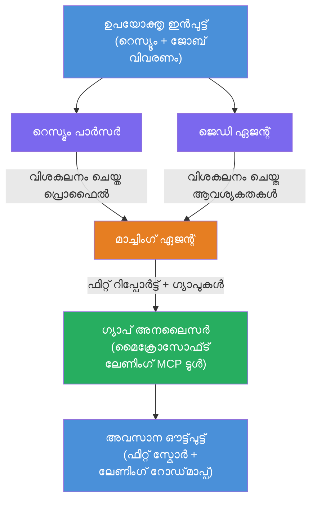

# ലാബ് 02 - മള്‍ട്ടി-എജന്റ് വർക്‌ഫ്ലോ: റിസ്യൂം → ജോബ് ഫിറ്റ് ഇവാലുവേറ്റർ

---

## നിങ്ങൾ നിർമ്മിക്കാൻ പോകുന്നത്

ഒരു **റിസ്യൂം → ജോബ് ഫിറ്റ് ഇവാലുവേറ്റർ** - നാല് വിദഗ്ദ്ധ എജന്റുകൾ ഒരുമിച്ച് പ്രവർത്തിച്ച് ഒരു ഉദ്യോഗാർത്ഥിയുടെ റിസ്യൂം ഒരു തൊഴിൽ വിവരണത്തിന് എത്രത്തോളം അനുയോജ്യമാണ് എന്ന് വിലയിരുത്തുകയും, അശേഷികളെ നിവர്ത്തിക്കാൻ വ്യക്തിഗത പഠന റോഡ്‌മാപ് സൃഷ്ടിക്കുകയും ചെയ്യുന്ന ഒരു മള്‍ട്ടി-എജന്റ് വർക്‌ഫ്ലോ.

### എജന്റുകൾ

| എജന്റ് | പാട് |
|--------|------|
| **റിസ്യൂം പാർസർ** | റിസ്യൂം ടെക്സ്റ്റിൽ നിന്നുള്ള ഘടനയാക്കി മനസ്സിലാക്കുന്ന കഴിവുകൾ, അനുഭവം, സർട്ടിഫിക്കേഷനുകൾ |
| **ജോബ് ഡിസ്ക്രിപ്ഷൻ എജന്റ്** | JD-യിൽ നിന്നുള്ള ആവശ്യമായ/ആവശ്യ്തമായ കഴിവുകൾ, അനുഭവം, സർട്ടിഫിക്കേഷനുകൾ പുറകെചുമക്കുന്നു |
| **മാച്ചിംഗ് എജന്റ്** | പ്രൊഫൈൽ വിമർശനം ആവശ്യങ്ങളോട് → ഫിറ്റ് സ്‌കോർ (0-100) + പൊരുത്തമുള്ള/കാണാതെ പോയ കഴിവുകൾ |
| **ഗ്യാപ് അനലൈസർ** | വിഭവങ്ങൾ, സമയം, ത്വരിത വിജയ പ്രോജക്റ്റുകൾ ഉൾപ്പെടുന്ന വ്യക്തിഗത പഠന റോഡ്‌മാപ് സമാഹരിക്കുന്നു |

### ഡെമോ പ്രവാഹം

ഒരു **റിസ്യൂം + ജോബ് ഡിസ്ക്രിപ്ഷൻ** അപ്‌ലോഡ് ചെയ്യുക → **ഫിറ്റ് സ്‌കോർ + കാണാത്ത കഴിവുകൾ** ലഭിക്കുക → **വ്യക്തിഗത പഠന റോഡ്‌മാപ്** സ്വീകരിക്കുക.

### വർക്‌ഫ്ലോ ആർക്കിടെക്ചർ

> പർപ്പിൾ = സമാന്തര എജന്റുകൾ | ഓറഞ്ച് = സമാഹരണ പോയിന്റ് | ഗ്രീൻ = ഉപകരണങ്ങളുള്ള അവസാന എജന്റ്. വിശദമായ ചിത്രങ്ങൾക്കും ഡാറ്റാ ഫ്ലോയിനും [Module 1 - Understand the Architecture](docs/01-understand-multi-agent.md)യും [Module 4 - Orchestration Patterns](docs/04-orchestration-patterns.md)യും കാണുക.

### ഉൾപ്പെടുത്തിയ വിഷയങ്ങൾ

- **WorkflowBuilder** ഉപയോഗിച്ച് മൾട്ടി-എജന്റ് വർക്‌ഫ്ലോ നിർമ്മിക്കൽ
- എജന്റ് പാടുകളും ഓർക്കസ്ട്രേഷൻ പ്രവാഹവും (സമാന്തര + കാഴ്ചപ്പാടുകൾ)
- എജന്റുകൾ തമ്മിലുള്ള കമ്മ്യൂണിക്കേഷൻ മാതൃകകൾ
- Agent Inspector ഉപയോഗിച്ച് പ്രാദേശിക പരിശോധന
- Foundry Agent Service-ലേക്ക് മള്‍ട്ടി-എജന്റ് വർക്‌ഫ്ലോ ഡിപ്ലോയ്മെന്റ്

---

## മുൻപരിചയങ്ങൾ

മുൻപ് ലാബ് 01 പൂര്‍ത്തിയാക്കുക:

- [Lab 01 - Single Agent](../lab01-single-agent/README.md)

---

## ആരംഭിക്കുക

പൂർണ്ണ സജ്ജീകരണ നിർദ്ദേശങ്ങളും കോഡ് വാക്ക്‌ത്രു, പരിശോദന കമാൻഡുകളും ഇവിടെ കാണുക:

- [Lab 2 Docs - Prerequisites](docs/00-prerequisites.md)
- [Lab 2 Docs - Full Learning Path](docs/README.md)
- [PersonalCareerCopilot run guide](PersonalCareerCopilot/README.md)

## ഓർക്കസ്ട്രേഷൻ മാതൃകകൾ (ഏജന്റിൽ പകരങ്ങൾ)

ലാബ് 2 ഡിഫോൾട്ട് **parallel → aggregator → planner** പ്രവാഹം ഉൾക്കൊള്ളുന്നു, കൂടാതെ ശക്തമായ ഏജന്റികുള്ള പെരുമാറ്റം കാണിക്കാൻ മറ്റു പാറ്റേണുകളും ഡോക്യൂമെന്റുകളിൽ വിശദീകരിച്ചിരിക്കുന്നു:

- **Fan-out/Fan-in with weighted consensus**
- **Reviewer/critic പാസ് ചില്ലുന്ന മുന്നറിയിപ്പ്**
- **Conditional router** (ഫിറ്റ് സ്‌കോറിനും കാണാത്ത കഴിവുകൾക്കും അടിസ്ഥാനമാക്കിയുള്ള മാർഗ തിരഞ്ഞെടുപ്പ്)

കൂടുതൽ വിവരങ്ങൾക്ക് [docs/04-orchestration-patterns.md](docs/04-orchestration-patterns.md) കാണുക.

---

**മുൻപ്:** [Lab 01 - Single Agent](../lab01-single-agent/README.md) · **വീട്‌വേണ്ടി:** [Workshop Home](../../README.md)

---

<!-- CO-OP TRANSLATOR DISCLAIMER START -->
**കുറിപ്പു**:  
ഈ փաստագիրը AI അനുവാദ സേവനം [Co-op Translator](https://github.com/Azure/co-op-translator) ഉപയോഗിച്ച് വിവർത്തനം ചെയ്തതാണ്. നാം തികച്ചും കൃത്യതയ്ക്ക് ശ്രമിച്ചെങ്കിലും, യന്ത്ര വിവർത്തനങ്ങളിൽ പിശകുകൾ അല്ലെങ്കിൽ തെറ്റായവ ഉണ്ടായേക്കാമെന്ന് ദയവായി ശ്രദ്ധിക്കുക. അതിന്റെ മാതൃഭാഷയിൽ ഉള്ള ഒറിജിനൽ ഡോക്യുമെന്റ് അധികാരപരമായ ഉറവിടമായിരിക്കും. അത്യന്താപേക്ഷിത വിവരങ്ങൾക്ക് പ്രൊഫഷണൽ മനുഷ്യാനുവാദം ശിപാർശ ചെയ്യുന്നു. ഈ വിവർത്തനം ഉപയോഗിച്ചതിൽ നിന്നും ഉളള ഏതൊരു തെറ്റിദ്ധാരണയ്ക്കും ഞങ്ങൾ ബാധ്യസ്ഥരല്ല.
<!-- CO-OP TRANSLATOR DISCLAIMER END -->