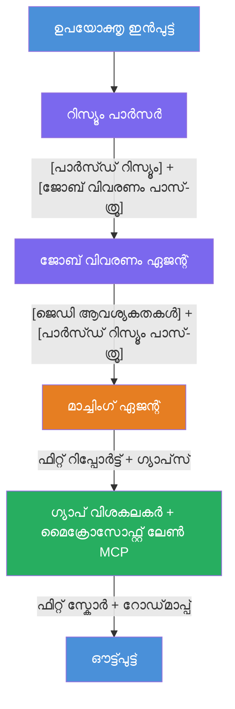

# ലാബ് 02 - മൾട്ടി-എജന്റ് വർക്ക്‌ഫ്ലോ: റിസൂം → ജോബ് ഫിറ്റ് ഇവാലുവേറ്റർ

## അവലോകനം

ഈ പ്രായോഗിക ലാബിൽ, നിങ്ങൾ VS കോഡിൽ Foundry Toolkit ഉപയോഗിച്ച് **വർക്ക്‌ഫ്ലോ-ഫസ്റ്റ് മൾട്ടി-എജന്റ് ആപ്പ്** നിർമ്മിക്കുകയും അത് Microsoft Foundry Agent Service-ലേക്ക് വിന്യസിക്കുകയും ചെയ്യും.

**നിങ്ങൾ നിർമ്മിക്കുന്നതെന്ത്:** റിസൂം → ജോബ് ഫിറ്റ് ഇവാലുവേറ്റർ, ഒരു റിസൂംയും ജോബ് വിവരണവും പാർസ് ചെയ്തുകൊണ്ട്, ഇരയുടെ പൊരുത്തം സ്കോർ ചെയ്യുകയും Microsoft Learn ഉറവിടങ്ങൾ ഉപയോഗിച്ച് വ്യക്തിഗത പഠന റോഡ്‌മാപ് ലഭ്യമാക്കുകയും ചെയ്യുന്നു.

---

## ആർക്കിടെക്ചർ

```mermaid
flowchart TD
    A["ഉപയോക്തൃ ഇൻപുട്ട്"] --> B["റിസ്യൂം പാർസർ"]
    B -->|"[പാർസ്ഡ് റിസ്യൂം] + [ജോബ് വിവരണം പാസ്-ത്രൂ]"| C["ജോബ് വിവരണം ഏജന്റ്"]
    C -->|"[ജെഡി ആവശ്യകതകൾ] + [പാർസ്ഡ് റിസ്യൂം പാസ്-ത്രൂ]"| D["മാച്ചിംഗ് ഏജന്റ്"]
    D -->|ഫിറ്റ് റിപ്പോർട്ട് + ഗ്യാപ്‌സ്| E["ഗ്യാപ് വിശകലകർ + മൈക്രോസോഫ്റ്റ് ലേൺ MCP"]
    E -->|ഫിറ്റ് സ്കോർ + റോഡ്‌മാപ്പ്| F["ഔട്ട്പുട്ട്"]

    style A fill:#4A90D9,color:#fff
    style B fill:#7B68EE,color:#fff
    style C fill:#7B68EE,color:#fff
    style D fill:#E67E22,color:#fff
    style E fill:#27AE60,color:#fff
    style F fill:#4A90D9,color:#fff
```

**ഇത് എങ്ങനെ പ്രവർത്തിക്കുന്നു:**
1. ഉപയോക്താവ് ഒരു റിസൂംയും ജോബ് വിവരണവും പേസ്റ്റ് ചെയ്യുന്നു.
2. **ResumeParser** റിസൂം പാർസ് ചെയ്ത് ജോബ് വിവരണം യഥാർത്ഥമായി `[JOB DESCRIPTION PASS-THROUGH]` വിഭാഗത്തിൽ പകർത്തുന്നു.
3. **JD Agent** പാസ്-ത്രൂവിൽ നിന്നും ഘടനാപരമായ ആവശ്യകതകൾ ഏറ്റെടുക്കുന്നു, തുടർന്ന് `[PARSED RESUME]` എന്നത് `[PARSED RESUME PASS-THROUGH]` ആയി മുൻപോട്ട് അയയ്ക്കുന്നു.
4. **MatchingAgent** `[PARSED RESUME PASS-THROUGH]` നെ `[JD REQUIREMENTS]` നെതിരെ താരതമ്യം ചെയ്ത് ഫിറ്റ് സ്കോർ സൃഷ്ടിക്കുന്നു.
5. **GapAnalyzer** ഗ്യാപ്‌സിനെ പ്രായോഗികമായ റോഡ്‌മാപിലേക്ക് മാറ്റുകയും MCP വഴിയുള്ള യഥാർത്ഥ Microsoft Learn ലിങ്കുകൾ കൊണ്ടുവരുകയും ചെയ്യുന്നു.

---

## മുൻ‌ആവശ്യങ്ങൾ

ആദ്യം ലാബ് 01 പൂർത്തിയാക്കുക:

- [Lab 01 - Single Agent](../lab01-single-agent/README.md)

---

## ഭാഗം 1: ഘടകങ്ങൾ ക്രമത്തിൽ വായിക്കുക

പൂർണ്ണ പഠന പാത ഇവിടെ കാണുക:

- [Lab 2 Docs - Prerequisites](docs/00-prerequisites.md)
- [Lab 2 Docs - Full Learning Path](docs/README.md)
- [PersonalCareerCopilot run guide](PersonalCareerCopilot/README.md)

---

## ഭാഗം 2: വർക്ക്‌ഫ്ലോ നിർമ്മിക്കുകയും പരീക്ഷിക്കുകയും ചെയ്യുക

1. Foundry Toolkit വിസർഡ് ഉപയോഗിച്ച് വർക്ക്‌ഫ്ലോ അടിസ്ഥാന പ്രോജക്ട് സ്‌കാഫോൾഡ് ചെയ്യുക.
2. `PersonalCareerCopilot/main.py` ൽ നിന്നും പ്രോംപ്റ്റ് ബ്ലോക്കുകളും വർക്ക്‌ഫ്ലോ ഗ്രാഫും കോപ്പി ചെയ്ത് നിങ്ങളുടെ വർക്ക്‌സ്പേസിലേക്ക് പേസ്റ്റ് ചെയ്യുക.
3. ഏജന്റ് ഇൻസ്പക്ടർ ഉപയോഗിച്ച് ലോക്കലായി പ്രവർത്തിപ്പിച്ച് നാല് ഏജന്റുമെല്ലാം കൂടാതെ MCP ടൂൾ ശരിയാണ് എന്ന് സ്ഥിരീകരിക്കുക.
4. ലോക്കൽ ടെസ്റ്റിംഗ് വിജയിച്ചാൽ ഹോസ്റ്റ് ചെയ്ത ഏജന്റ് Foundry ലേക്ക് വിന്യസിക്കുക.

---

## ഓർക്കസ്ട്രേഷനു പാറ്റേണുകൾ

ലാബ് 02-ൽ ഡിഫോൾട്ട് **ഫാൻ-ഔട്ട് → ഫാൻ-ഇൻ → സീക്വൻഷ്യൽ** ഫ്ലോ ഉൾക്കൊള്ളിച്ചിരിക്കുന്നു, കൂടാതെ പ്രത്യേക പരീക്ഷണങ്ങൾക്കായി ബദൽ ഓർക്കസ്ട്രേഷൻ പാറ്റേണുകളും ഡോക്സിൽ വെച്ചിരിക്കുന്നു.

- **ഭാരമേറ്റ നിയന്ത്രിത ഫാൻ-ഔട്ട്/ഫാൻ-ഇൻ**
- **അവസാന റോഡ്‌മാപിനു മുമ്പുള്ള റിവ്യൂവർ/ക്രിറ്റിക് പാസ്**
- **ഫിറ്റ് സ്കോറും അഭാവപ്പെട്ട കഴിവുകളും അടിസ്ഥാനമാക്കി കൺഡീഷണൽ റൂട്ടർ**

നോക്കുക [docs/04-orchestration-patterns.md](docs/04-orchestration-patterns.md).

---

**മുൻപ്:** [Lab 01 - Single Agent](../lab01-single-agent/README.md) · **വേർക്ക്‌ഷോപ്പ് ഹോം:** [Workshop Home](../../README.md)

---

<!-- CO-OP TRANSLATOR DISCLAIMER START -->
**അറിയിപ്പ്**:
ഈ രേഖ AI പരിഭാഷാ സേവനം [Co-op Translator](https://github.com/Azure/co-op-translator) ഉപയോഗിച്ച് പരിഭാഷപ്പെടുത്തിയതാണ്. ഞങ്ങൾ കൃത്യതയ്ക്കായി ശ്രമിക്കുന്നുവെങ്കിലും, ഓട്ടോമേറ്റഡ് പരിഭാഷകളിൽ പിഴവുകൾ അല്ലെങ്കിൽ തെറ്റായ വിവരങ്ങൾ ഉണ്ടാകാൻ സാധ്യതയുണ്ട്. അതിന്റെ സ്വാഭാവിക ഭാഷയിലുള്ള അസൽ രേഖയാണ് പ്രാമാണികമായ ഉറവിടമായി പരിഗണിക്കേണ്ടത്. നിർണായകമായ വിവരങ്ങൾക്ക്, പ്രൊഫഷണൽ മനുഷ്യ പരിഭാഷ ശുപാർശ ചെയ്യുന്നു. ഈ പരിഭാഷ ഉപയോഗിച്ച് ഉണ്ടാകുന്ന തെറ്റിദ്ധാരണകൾ അല്ലെങ്കിൽ തെറ്റായ വ്യാഖ്യാനങ്ങൾക്കായി ഞങ്ങൾ ഉത്തരവാദികളല്ല.
<!-- CO-OP TRANSLATOR DISCLAIMER END -->