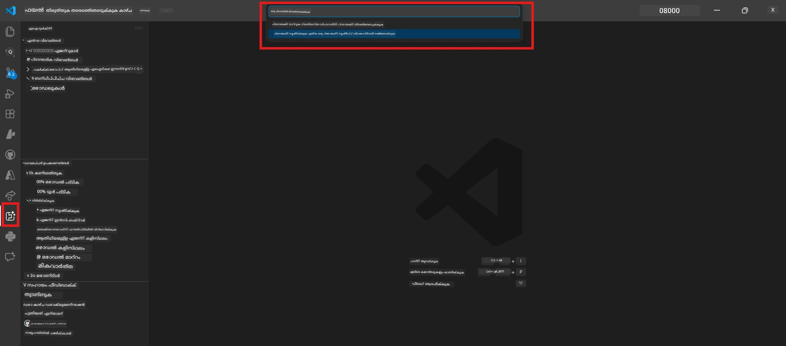

# Module 0 - മുൻകൂർ ആവശ്യങ്ങൾ

ലാബ് 02 ആരംഭിക്കുന്നതിന് മുമ്പ്, താഴെപ്പറയുന്നവ നിങ്ങൾ പൂർത്തിയാക്കിയിട്ടുണ്ടെന്ന് ഉറപ്പാക്കുക. ഈ ലാബ് നേരിട്ട് ലാബ് 01-ന്റെ അടിസ്ഥാനത്തിലാണ് നിർമ്മിച്ചിരിക്കുന്നത് - അത് ഒഴിവാക്കിയിടരുത്.

---

## 1. ലാബ് 01 പൂർത്തിയാക്കുക

ലാബ് 02 فرضിക്കുന്നു നിങ്ങൾ ഇതിനകം:

- [x] [Lab 01 - Single Agent](../../lab01-single-agent/README.md) എന്ന ലാബിന്റെ എല്ലാ 8 മെയിൻ ഘട്ടങ്ങളും പൂർത്തിയാക്കിയിട്ടുണ്ട്
- [x] ഫൗണ്ട്രി ഏജന്റ് സർവീസിലേക്ക് ഒരു സിംപിൾ ഏജന്റ് വിജയകരമായി വിന്യസിച്ചു
- [x] ഏജന്റ് ലോക്കൽ ഏജന്റ് ഇൻസ്പെക്ടറിലും ഫൗണ്ട്രി പ്ലേഗ്രൗണ്ടിലും പ്രവർത്തിക്കുന്നതായി സ്ഥിരീകരിച്ചു

നിങ്ങൾക്ക് ലാബ് 01 പൂർത്തിയാക്കിയിട്ടില്ലെങ്കിൽ, പിന്മാറി അതു ഇപ്പോൾ പൂർത്തിയാക്കുക: [Lab 01 Docs](../../lab01-single-agent/docs/00-prerequisites.md)

---

## 2. നിലവിലുള്ള സജ്ജീകരണം പരിശോധിക്കുക

ലാബ് 01-ൽ ഉപയോഗിച്ച ടൂളുകൾ എല്ലാം ഇപ്പോഴും ഇൻസ്റ്റാൾ ചെയ്തും പ്രവർത്തിച്ചും ഉണ്ടാകണം. ഈ വേഗത്തിലുള്ള പരിശോധനകൾ നടത്തുക:

### 2.1 ആസ്യൂർ CLI

```powershell
az account show --query "{name:name, id:id}" --output table
```

എക്സ്പക്ട് ചെയ്യുന്നത്: നിങ്ങളുടെ സബ്സ്ക്രിപ്ഷൻ പേര് ಮತ್ತು ഐഡി കാണിക്കും. ഇത് പരാജയപ്പെടുന്നുവെങ്കിൽ, [`az login`](https://learn.microsoft.com/cli/azure/authenticate-azure-cli-interactively) പ്രവർത്തിക്കുക.

### 2.2 VS കോഡ് എക്സ്റ്റെൻഷനുകൾ

1. `Ctrl+Shift+P` അമർത്തി → **"Microsoft Foundry"** എന്ന് ടൈപ്പ് ചെയ്ത് → കമാൻഡുകൾ കാണുന്നു എന്ന് സ്ഥിരീകരിക്കുക (ഉദാ., `Microsoft Foundry: Create a New Hosted Agent`).
2. `Ctrl+Shift+P` അമർത്തി → **"Foundry Toolkit"** എന്ന് ടൈപ്പ് ചെയ്ത് → കമാൻഡുകൾ കാണുന്നു എന്ന് নিশ্চিতിക്കുക (ഉദാ., `Foundry Toolkit: Open Agent Inspector`).

### 2.3 ഫൗണ്ട്രി പ്രോജക്ടും മോഡലും

1. VS Code Activity Bar-ൽ ഉള്ള **Microsoft Foundry** ഐക്കൺ ക്ലിക്ക് ചെയ്യുക.
2. നിങ്ങളുടെ പ്രോജക്ട് ലിസ്റ്റിൽ ഉണ്ടെന്ന് ഉറപ്പാക്കുക (ഉദാ., `workshop-agents`).
3. പ്രോജക്ട് വിപുലീകരിച്ച് → വിജയകരമായി വിന്യസിച്ച ഒരു മോഡൽ ഉണ്ടെന്ന് പരിശോധിക്കുക (ഉദാ., `gpt-4.1-mini`) നില **Succeeded** ആണ്.

> **നിങ്ങളുടെ മോഡൽ വിന്യാസം കാലഹരണപ്പെട്ടുവെങ്കിൽ:** ചില ഫ്രീ-ടയർ വിന്യസനങ്ങൾ സ്വയം കാലഹരണപ്പെടുന്നു. വീണ്ടും വിന്യസിക്കാൻ [Model Catalog](https://learn.microsoft.com/azure/foundry/foundry-models/concepts/models-sold-directly-by-azure) ( `Ctrl+Shift+P` → **Microsoft Foundry: Open Model Catalog**) കാണുക.



### 2.4 RBAC റോളുകൾ

നിങ്ങളുടെ ഫൗണ്ട്രി പ്രോജക്ടിൽ നിങ്ങൾക്ക് **Azure AI User** ഉണ്ടെന്ന് സ്ഥിരീകരിക്കുക:

1. [Azure Portal](https://portal.azure.com) → നിങ്ങളുടെ ഫൗണ്ട്രി **project** resource → **Access control (IAM)** → **[Role assignments](https://learn.microsoft.com/azure/foundry/concepts/rbac-foundry)** ടാബ്.
2. നിങ്ങളുടെ പേര് തിരഞ്ഞ് → **[Azure AI User](https://aka.ms/foundry-ext-project-role)** ലിസ്റ്റിൽ ഉണ്ടെന്ന് ഉറപ്പാക്കുക.

---

## 3. മൾട്ടി-ഏജന്റ് ആശയങ്ങൾ മനസിലാക്കുക (ലാബ് 02-ന്റെ പുതിയ ഭാഗങ്ങൾ)

ലാബ് 02-ൽ ലാബ് 01-ൽ ഉൾപ്പെടുത്തിയിട്ടില്ലാത്ത ആശയങ്ങൾ പരിചയപ്പെടുത്തുന്നു. തുടക്കം കുറിക്കുമ്ബോള്‍ ഇവ വായിച്ചു മനസിലാക്കുക:

### 3.1 മൾട്ടി-ഏജന്റ് വർക്‌ഫ്ലോ란െന്താണ്?

ഒരെളുപ്പം όλα കൈകാര്യം ചെയ്യുന്ന ഏജന്റ് എന്നതിനുശേഷം, **മൾട്ടി-ഏജന്റ് വർക്‌ഫ്ലോ** പല വിശിഷ്ടമായ ഏജന്റുകളിലൂടെ ജോലി വിഭജിക്കുന്നു. ഓരോ ഏജന്റിനും:

- സ്വന്തം **നിർദ്ദേശങ്ങൾ** (സിസ്റ്റം പ്രോമ്പ്റ്റ്)
- സ്വന്തം **പങ്ക്** (എന്തിന്റെ ഉത്തരവാദിത്തം)
- തിരഞ്ഞെടുക്കാവുന്ന **ടൂളുകൾ** (കൊള്ളാവുന്ന ഫങ്‌ഷനുകൾ)

ഏജന്റുകൾ തമ്മിൽ കമ്യൂണിക്കേറ്റ് ചെയ്യുന്നത് ഒരു **ഓർക്കസ്ട്രേഷൻ ഗ്രാഫ്** വഴിയാണ്, ഇത് അവരിലേക്ക് വിവരങ്ങൾ എങ്ങനെ ഒഴുകിക്കയറിയും തീരുമാനിക്കുന്നു.

### 3.2 WorkflowBuilder

`agent_framework`-ലെ [`WorkflowBuilder`](https://learn.microsoft.com/agent-framework/workflows/agents-in-workflows) ക്ലാസ് ഏജന്റുകളെ തമ്മിൽ കൂട്ടിച്ചേർക്കുന്ന SDK ഘടകമാണ്:

```python
from agent_framework import WorkflowBuilder

workflow = (
    WorkflowBuilder(
        name="MyWorkflow",
        start_executor=agent_a,
        output_executors=[agent_d],
    )
    .add_edge(agent_a, agent_b)
    .add_edge(agent_a, agent_c)
    .add_edge(agent_b, agent_d)
    .add_edge(agent_c, agent_d)
    .build()
)
```

- **`start_executor`** - ആദ്യ ഏജന്റ്, ഉപയോക്തൃ ഇൻപുട്ട് സ്വീകരിക്കുന്നു
- **`output_executors`** - ഫൈനൽ പ്രതികരണം നൽകുന്ന ഏജന്റ്(കൾ)
- **`add_edge(source, target)`** - `target`-ന് `source`ന്റെ output ലഭിക്കണമെന്ന് നിർവ്വചിക്കുന്നു

### 3.3 MCP (മോഡൽ കോൺടെക്സ് പ്രോട്ടോക്കോൾ) ടൂളുകൾ

ലാബ് 02 ഒരു **MCP ടൂൾ** ഉപയോഗിക്കുന്നു, ഇത് മൈക്രോസോഫ്റ്റ് ലേണിങ് എപിഐ വിളിച്ച് പഠന വിഭവങ്ങൾ നേടുന്നു. [MCP (Model Context Protocol)](https://modelcontextprotocol.io/introduction) ഒരു സ്റ്റാൻഡേർഡൈസ്ഡ് പ്രോട്ടോക്കോൾ ആണ് AI മോഡലുകളെ ബാഹ്യ ഡാറ്റാ സ്രോതസുകളുമായി ഇട്ടുകൂട്ടുന്നതിനും ടൂളുകളുമായി ബന്ധിപ്പിക്കുന്നതിനും.

| പദം | വിവരണം |
|------|-------|
| **MCP സെർവർ** | [MCP പ്രോട്ടോക്കോൾ](https://learn.microsoft.com/azure/foundry/agents/how-to/tools/model-context-protocol) വഴി ടൂളുകൾ / വിഭവങ്ങൾ എക്സ്പോസ് ചെയ്യുന്ന സേവനം |
| **MCP ക്ലയന്റ്** | MCP സെർവറുമായി ബന്ധിപ്പിച്ച് ടൂളുകൾ വിളിക്കുന്ന നിങ്ങളുടെ ഏജന്റ് കോഡ് |
| **[Streamable HTTP](https://learn.microsoft.com/agent-framework/agents/tools/hosted-mcp-tools)** | MCP സെർവറുമായി കമ്യൂണിക്കേറ്റ് ചെയ്യാൻ ഉപയോഗിക്കുന്ന ട്രാൻസ്പോർട്ട് മാർഗം |

### 3.4 ലാബ് 02 ലാബ് 01-നിന്ന് വ്യത്യാസപ്പെടുന്നത്

| ഘടകം | ലാബ് 01 (ഒറ്റ ഏജന്റ്) | ലാബ് 02 (മൾട്ടി ഏജന്റ്) |
|--------|-------------------|-------------------------|
| ഏജന്റുകൾ | 1 | 4 (വിശിഷ്ട പാങ്കൾ) |
| ഓർക്കസ്ട്രേഷൻ | ഇല്ല | WorkflowBuilder (സമാന്തരവും അനുക്രമവുമുള്ള) |
| ടൂളുകൾ | ഐച്ഛിക `@tool` ഫങ്‌ഷൻ | MCP ടൂൾ (ബാഹ്യ API വിളി) |
| സങ്കീർണം | ലളിതം, പ്രോമ്പ്റ്റ് → പ്രതികരണം | റിസ്യൂം + ജോബ് ഡിസ്ക്രിപ്ഷൻ → ഫിറ്റ് സ്കോർ → റോഡ്แมപ്പ് |
| കോൺടെക്സ് ഫ്ലോ | നേരിട്ട് | ഏജന്റ്-തോട്-ഏജന്റ് കൈമാറ്റം |

---

## 4. ലാബ് 02-ന്റെ വർക്ക്‌ഷോപ്പ് റിപോസിറ്ററി ഘടന

ലാബ് 02 ഫയലുകൾ എവിടെയാണ് എന്ന് അറിയുക:

```
workshop/
└── lab02-multi-agent/
    ├── README.md                       ← Lab overview
    ├── docs/                           ← You are here
    │   ├── README.md                   ← Learning path index
    │   ├── 00-prerequisites.md         ← This file
    │   ├── 01-understand-multi-agent.md
    │   ├── ...
    │   └── 08-troubleshooting.md
    └── PersonalCareerCopilot/          ← The agent project
        ├── agent.yaml                  ← Agent definition
        ├── main.py                     ← 4-agent workflow code
        ├── Dockerfile                  ← Container configuration
        └── requirements.txt            ← Python dependencies
```

---

### പരിശോധനാ പോയിന്റ്

- [ ] ലാബ് 01 പൂർത്തിയായി (എല്ലാ 8 ഘട്ടങ്ങളും, ഏജന്റ് വിന്യസിച്ചു സ്ഥിരീകരിച്ചു)
- [ ] `az account show` നിങ്ങളുടെ സബ്സ്ക്രിപ്ഷൻ ഫലം നൽകുന്നു
- [ ] Microsoft Foundryയും Foundry Toolkit എക്സറ്റെൻഷനുകളും ഇൻസ്റ്റാൾ ചെയ്തും പ്രവര്‍ത്തിക്കുന്നതായും
- [ ] ഫൗണ്ട്രി പ്രോജക്ടിൽ വിന്യസിച്ച മോഡൽ ഉണ്ട് (ഉദാ., `gpt-4.1-mini`)
- [ ] നിങ്ങൾക്ക് പ്രോജക്ടിൽ **Azure AI User** റോളുണ്ടു
- [ ] മൾട്ടി-ഏജന്റ് ആശയങ്ങൾ, WorkflowBuilder, MCP, ഏജന്റ് ഓർക്കസ്ട്രേഷൻ എന്നിവ വായിച്ച് മനസിലാക്കി

---

**അടുത്തത്:** [01 - മൾട്ടി-ഏജന്റ് ആർക്കിടെക്ചർ മനസിലാക്കുക →](01-understand-multi-agent.md)

---

<!-- CO-OP TRANSLATOR DISCLAIMER START -->
**പരാമർശം**:  
ഈ രേഖ [Co-op Translator](https://github.com/Azure/co-op-translator) എന്ന AI പരിഭാഷാന്ധ്രസേവനം ഉപയോഗിച്ച് പരിഭാഷപ്പെടുത്തിയതാണ്. ഞങ്ങൾ കൃത്യതയ്ക്ക് പരിശ്രമിച്ചാലും, ഓട്ടോമേറ്റഡ് പരിഭാഷയിൽ പിശകുകൾ അല്ലെങ്കിൽ അപാകതകൾ ഉണ്ടാകാമെന്ന് ശ്രദ്ധിക്കുക. മൂലറെഴുത്ത് ഭാഷയിലെ അതാണ് ഔദ്യോഗിക സ്രോതസെന്നു കരുതണം. ഗൗരവമുള്ള വിവരങ്ങൾക്ക് പ്രൊഫഷണൽ മാനുഷിക പരിഭാഷ ശിപാർശ ചെയ്യപ്പെടുന്നു. ഈ പരിഭാഷ ഉപയോഗിച്ചതിനാല്‍ ഉണ്ടായ任何误解ങ്ങൾക്കും തെറ്റായ വ്യാഖ്യാനങ്ങൾക്കും ഞങ്ങൾ ഉത്തരവാദികളല്ല.
<!-- CO-OP TRANSLATOR DISCLAIMER END -->