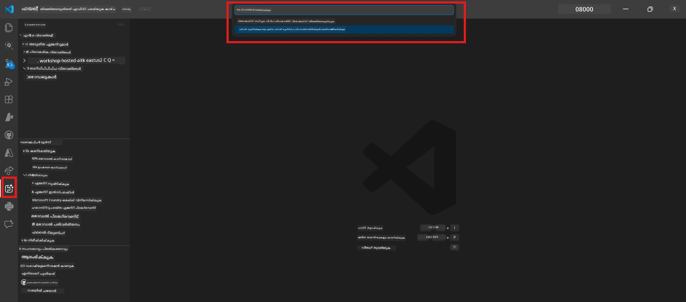

# Module 0 - പരിചയം

⏱️ ~10 മിനിറ്റ്

> [!WARNING]
> **ഉപരിതലവും പരിധികളും:** [Hosted Agents](https://learn.microsoft.com/azure/foundry/agents/concepts/hosted-agents) ഇപ്പോൾ **പബ്ലിക് പ്രിവ്യൂ** ഘട്ടത്തിലാണ് - പ്രൊഡക്ഷൻ വർക്ക്‌ലോഡുകൾക്ക് ശിപാർശ ചെയ്യില്ല. ഈ വർക്ക്‌ഷോപ്പിൽ കാണിച്ച ചില സവിശേഷതകൾ സർവീസ് GA ആയി മാറുന്നതിനൊപ്പം മാറാം.

## നിങ്ങൾ നിർമ്മിക്കുന്നതു

ഈ ലാബിൽ, ലാബ് 01 ലെ സിംഗിൾ-ഏജന്റ് കഴിവുകൾ എക്സ്റ്റെൻഡ് ചെയ്ത് **മൾട്ടി-ഏജന്റ് പ്രവർത്തനക്രമം** - റിസൂമെ → ജോലി ഫിറ്റ് മൂല്യനിർണ്ണയകാരൻ - നിർമ്മിക്കുന്നു.

നിങ്ങൾ ഒരു **റിസൂമെ**യും ഒരു **ജോലി വിവരണം**യും പേസ്റ്റ് ചെയ്യും. നാല് പ്രത്യേക ഏജന്റുകൾ ഇൻപുട്ട് ക്രമസമാനമായി പ്രോസസ്സ് ചെയ്തു, შემდეგ തിരിച്ചുനൽകരുന്നു:
- ഫിറ്റ് സ്കോർ (0–100യും സ്കോർ ബ്രീക്സ്ഡൗൺഉം)
- സ്കിൽ, സർട്ടിഫിക്കേഷൻ ഗ്യാപ് ലിസ്റ്റ്
- ഓരോ ഗ്യാപിനും യാഥാർത്ഥ്യ Microsoft Learn ലിങ്കുകളുള്ള വ്യക്തിഗത പഠന റോഡ്‌മാപ്പ്

**പ്രവൃത്തി ക്രമം ഉപയോഗിക്കുന്നു:**
- **Microsoft Agent Framework** - ക്രമസമാന പൈപ്പ്‌ലൈൻ ഓർകസ്ട്രേഷനിനുള്ള `WorkflowBuilder`
- **Foundry Toolkit for VS Code** - സ്കാഫോൾഡ്, ലൊക്കലി ടെസ്റ്റ്, ഡിപ്ലോയ്
- **ഒരു AI മോഡൽ** (ഉദാഹരണം, `gpt-4.1-mini`) - നാല് ഏജന്റുകൾക്കും    
- **Microsoft Learn MCP സർവർ** - ഓരോ സ്കിൽ ക്യാപിനും യഥാർത്ഥ പഠന റിസോഴ്‌സ് ലിങ്കുകൾ നൽകുന്നു

---

## നിങ്ങളുടെ വഴി തിരഞ്ഞെടുക്കുക

> ⚠️ **ലാബ് 01-ൽ നിങ്ങൾ ഉപയോഗിച്ച വഴിയിൽ തുടരുമെന്ന് ഉറപ്പാക്കുക.**

<details open>
<summary><strong>🅰️ വഴി എ - Azure ക്ലൗഡ് (Azure സബ്സ്ക്രിപ്‌ഷൻ ആവശ്യമാണ്)</strong></summary>

| | വിശദാംശങ്ങൾ |
|---|---|
| **ഇതിന് ആരാണ്?** | നിങ്ങൾ Azure സബ്സ്ക്രിപ്‌ഷൻ ഉപയോഗിച്ച് ലാബ് 01 പൂർത്തിയാക്കിയവർ |
| **മോഡൽ** | Foundry വഴി Azure OpenAI (ഉദാ: `gpt-4.1-mini`) |
| **കാലം‌ക്രമം ഉൾപ്പെട്ടു** | എല്ലാ ഘട്ടങ്ങളും (00–09) |
| **ക്ലൗഡിലേക്ക് ഡിപ്ലോയ് ചെയ്യണോ?** | ✅ ഒരുമിച്ചുള്ള പൂർണ്ണ ഡിപ്ലോയ്മെന്റ് |

</details>

<details open>
<summary><strong>🅱️ വഴി ബി - Foundry Local (Azure സബ്സ്ക്രിപ്‌ഷൻ ആവശ്യമില്ല)</strong></summary>

| | വിശദാംശങ്ങൾ |
|---|---|
| **ഇതിന് ആരാണ്?** | നിങ്ങൾ Foundry Local ഉപയോഗിച്ച് ലാബ് 01 പൂർത്തിയാക്കിയവർ |
| **മോഡൽ** | Foundry Local (ഫ്രീ, നിങ്ങളുടെ മെഷീനിൽ പ്രവർത്തിക്കുന്നു) |
| **കാലം‌ക്രമം ഉൾപ്പെടുത്തി** | മോഡ്യൂളുകൾ 00–05 (06–07 ഒഴിവാക്കിയിട്ടുണ്ട് - ഡിപ്ലോയ് & ക്ലൗഡ് വെരിഫൈ) |
| **ക്ലൗഡിലേക്ക് ഡിപ്ലോയ് ചെയ്യണോ?** | ❌ ഇല്ല - ലൊക്കൽ ടെസ്റ്റിംഗ് മാത്രം Agent Inspector വഴി |

</details>

---

## ലാബ് 01 പരിശോധന

ലാബ് 02 നേരിട്ട് ലാബ് 01-ൽ അധിഷ്ഠിതമാണ്. ഇവിടെ തുടങ്ങുന്നതിനു മുമ്പ് ലാബ് 01 പൂർത്തിയാക്കുക.

ഇനി വരെ ലാബ് 01 ചെയ്തത് ഇല്ലേ? ഇവിടെ തുടങ്ങുക: [Lab 01 - Introduction](../../lab01-single-agent/docs/00-prerequisites.md)

<details open>
<summary><strong>🅰️ വഴി എ - Azure ക്ലൗഡ്</strong></summary>

```powershell
az account show --query "{name:name, id:id}" --output table
```

ഇത് പരാജയപ്പെട്ടാൽ, `az login` നടത്തുക. ശേഷം VS Code-ൽ സ്ഥിരീകരിക്കുക:

1. `Ctrl+Shift+P` → **Foundry Toolkit** ടൈപ്പ് ചെയ്യുക → കമാൻഡുകൾ കാണുന്നു എന്ന് ഉറപ്പാക്കുക.
2. **Foundry Toolkit** ഐക്കൺ അമർത്തുക → നിങ്ങളുടെ പ്രോജക്റ്റും ഡിപ്ലോയ്മെന്റ് മോഡലും **Succeeded** എന്ന് കാണിക്കും.



> **RBAC:** ലാബ് 01-ൽ നിങ്ങൾ **Foundry User** ആയി അസൈൻ ചെയ്തു. ആവശ്യമുണ്ടെങ്കിൽ പുനഃഅസൈൻ ചെയ്യാൻ [Lab 01, Module 1](../../lab01-single-agent/docs/01-setup.md#deploy-a-model--assign-rbac) കാണുക. റോളിന് മുമ്പ് പേരിട്ടത് **Azure AI User** ആണ് - അതേ അനുമതികൾ.

</details>

<details open>
<summary><strong>🅱️ വഴി ബി - Foundry Local</strong></summary>

```powershell
Invoke-WebRequest -Uri "http://localhost:5273/v1/health" -UseBasicParsing | Select-Object StatusCode
```

പ്രതീക്ഷിക്കുക: `StatusCode: 200`. അല്ലെങ്കിൽ, Foundry Toolkit സൈഡ്ബാറിൽ നിന്ന് Foundry Local വീണ്ടും തുടങ്ങുക.

> എല്ലാ ഇൻഫറൻസ് നിങ്ങളുടെ മെഷീനിലാണ് നടക്കുന്നത്. പുറത്തേക്കുള്ള ഏക വിളി MCP ടൂൾ വഴി `https://learn.microsoft.com/api/mcp` ആണ്.

</details>

---

## ലാബ് 02-ൽ有什么新内容

| | ലാബ് 01 | ലാബ് 02 |
|--|--------|--------|
| ഏജന്റുകൾ | 1 | 4 (WorkflowBuilder ഉപയോഗിച്ച് ശാഖകളായി) |
| സ്കാഫോൾഡ് ടെംപ്ലേറ്റ് | അടിസ്ഥാന - ഏജന്റ് ഫ്രെയിംവർക്ക് | പ്രവർത്തനക്രമങ്ങൾ - ഏജന്റ് ഫ്രെയിംവർക്ക് |
| പുതിയ പാക്കേജ് | - | `mcp` |
| ഓർക്കസ്ട്രേഷൻ | ഒറ്റ സംഭാഷണ ഏജന്റ് | ക്രമസമാന പൈപ്പ്‌ലൈൻ (WorkflowBuilder) |
| പുതിയ ടൂൾ | - | `search_microsoft_learn_for_plan` (MCP) |

---

**അടുത്തത്:** [01 - ആർക്കിടെക്ചർ മനസ്സിലാക്കുക →](01-understand-multi-agent.md)

---

<!-- CO-OP TRANSLATOR DISCLAIMER START -->
**അറിയിപ്പ്**:
ഈ രേഖ AI പരിഭാഷാ സേവനം [Co-op Translator](https://github.com/Azure/co-op-translator) ഉപയോഗിച്ച് പരിഭാഷപ്പെടുത്തിയതാണ്. ഞങ്ങൾ കൃത്യതയ്ക്കായി ശ്രമിക്കുന്നുവെങ്കിലും, ഓട്ടോമേറ്റഡ് പരിഭാഷകളിൽ പിഴവുകൾ അല്ലെങ്കിൽ തെറ്റായ വിവരങ്ങൾ ഉണ്ടാകാൻ സാധ്യതയുണ്ട്. അതിന്റെ സ്വാഭാവിക ഭാഷയിലുള്ള അസൽ രേഖയാണ് പ്രാമാണികമായ ഉറവിടമായി പരിഗണിക്കേണ്ടത്. നിർണായകമായ വിവരങ്ങൾക്ക്, പ്രൊഫഷണൽ മനുഷ്യ പരിഭാഷ ശുപാർശ ചെയ്യുന്നു. ഈ പരിഭാഷ ഉപയോഗിച്ച് ഉണ്ടാകുന്ന തെറ്റിദ്ധാരണകൾ അല്ലെങ്കിൽ തെറ്റായ വ്യാഖ്യാനങ്ങൾക്കായി ഞങ്ങൾ ഉത്തരവാദികളല്ല.
<!-- CO-OP TRANSLATOR DISCLAIMER END -->