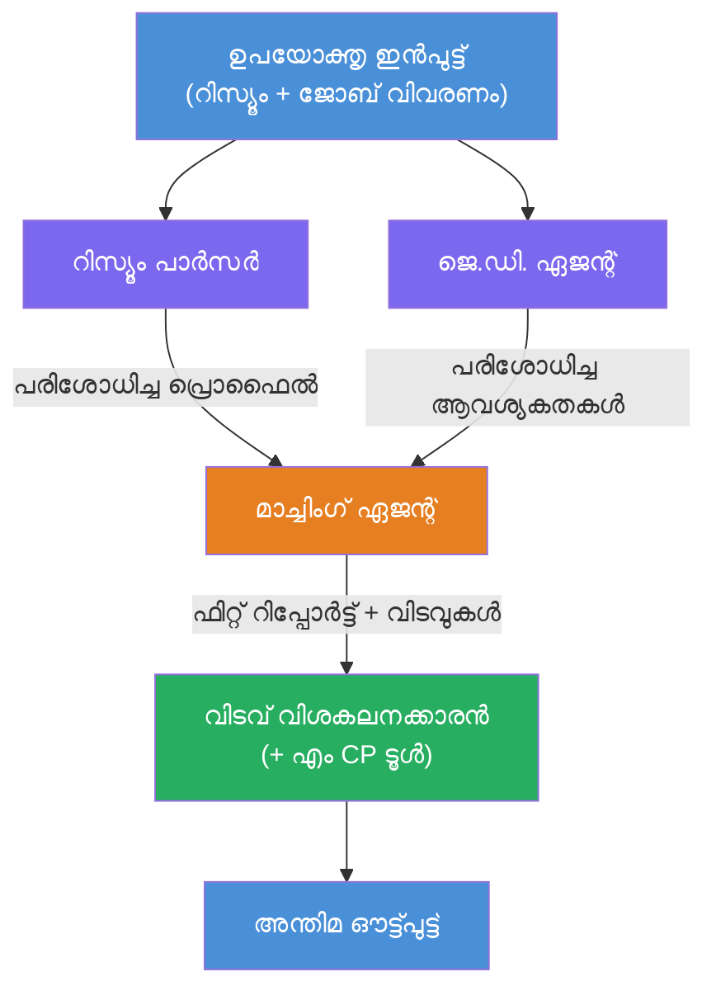
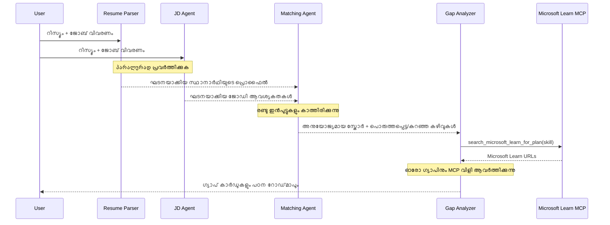
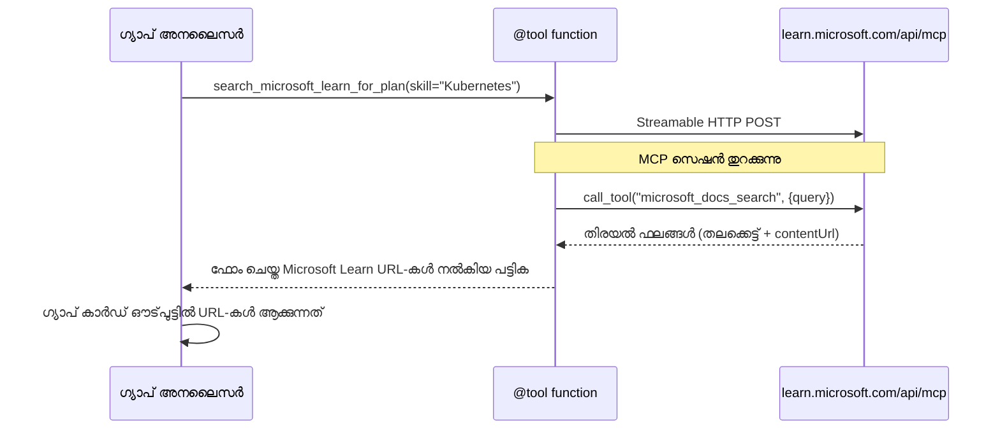

# Module 1 - മൾട്ടി-എജന്റ് ആർക്കിടെക്ചർ മനസിലാക്കുക

ഈ മൂഡ്യൂളിൽ, നിങ്ങൾ Resume → Job Fit Evaluator ആർക്കിടെക്ചർ കോഡ് എഴുതുന്നതിന് മുമ്പ് പഠിക്കുന്നു. ഓർക്കസ്ട്രേഷൻ ഗ്രാഫ്, ഏജന്റ് റോളുകൾ, ഡാറ്റ ഫ്ലോ എന്നിവ മനസിലാക്കുന്നത് [മൾട്ടി-എജന്റ് വർക്ക്‌ഫ്ലോകൾ](https://learn.microsoft.com/azure/architecture/ai-ml/idea/multiple-agent-workflow-automation) ഡിബഗിംഗിനും വികസിപ്പിക്കാനും വളരെ പ്രധാനമാണ്.

---

## ഈ പ്രശ്നം പരിഹരിക്കുന്നത്

ഒരു റിസ്യൂമെയെ ജോബ് വിവരണത്തോട് സജ്ജീകരിക്കുക നിരവധി വ്യത്യസ്ത കഴിവുകൾ ഉൾക്കൊള്ളുന്നു:

1. **പാർസിംഗ്** - ഘടനാപരമായ ഡാറ്റ അസംഘടിത ടെക്‌സ്റ്റിൽ നിന്ന് (റിസ്യൂമെ)
2. **പരിശോധന** - ജോബ് വിവരണത്തിൽ നിന്നും ആവശ്യകതകൾ പുറത്ത് എടുക്കുക
3. **തുലന** - രണ്ട് തമ്മിലുള്ള പൊരുത്തത്തിന് സ്കോർ നല്കുക
4. **പ്ലാനിംഗ്** - കണ്ടെത്തിയ ദേഹലേഷ്ടങ്ങൾ അടയ്ക്കാൻ പഠന റോഡ്‌മാപ്പ് നിർമ്മിക്കുക

ഒരു ഏജന്റ് നാല് പ്രവർത്തനങ്ങളും ഒരു പ്രോംപ്റ്റിൽ ചെയ്യുമ്പോൾ സാധാരണയായി സംഭവിക്കുന്നത്:
- അസംപൂർണമായ എക്സ്ട്രാക്ഷൻ (സ്കോർ ആകാൻ പാര്സിംഗ് പൂർണമാക്കാൻ വേഗത്തിൽ കടക്കുന്നു)
- സ്വല്പമായ സ്കോറിംഗ് (സാക്ഷ്യ പൂരിതമായ വേഗതിരിവുകൾ ഇല്ല)
- പൊതുവായ റോഡ്‌മാപ്പുകൾ (നിങ്ങളുടെ പ്രത്യേക ദേഹലേഷ്ടങ്ങൾക്കു വേണ്ടിയല്ല)

**നാലു പ്രത്യേക ഏജന്റുകളായി തിരിച്ചിരിപ്പിക്കുന്നത്** ഓരോ ഏജന്റും അതിന്റെ ചുമതലയിലുള്ള നിർദേശങ്ങൾ പിന്തുടർന്ന് പ്രവർത്തിക്കുകയാണെങ്കിൽ എല്ലാ ഘട്ടങ്ങളിലും ഉയർന്ന ഗുണനിലവാരമുള്ള ഫലങ്ങൾ ഉത്പാദിപ്പിക്കുന്നു.

---

## നാലു ഏജന്റുകൾ

ഒന്ന് ഒരു പൂർത്തിയായ [Microsoft Foundry](https://learn.microsoft.com/azure/foundry/agents/concepts/hosted-agents) ഏജെന്റാണ്, `AzureAIAgentClient.as_agent()` വഴി സൃഷ്ടിചെയ്യുന്നത്. ഇവക്ക് ഒരേ മോഡൽ ഡിപ്ലോയ്‌മെന്റ് ഉണ്ട്, പക്ഷേ വ്യത്യസ്ത നിർദേശങ്ങളും (ഓപ്ഷണലായി) വ്യത്യസ്ത ടൂളുകളും.

| # | ഏജന്റ് പേര് | റോളുകൾ | ഇൻപുട്ട് | ഔട്ട്‌പുട്ട് |
|---|-------------|---------|---------|------------|
| 1 | **ResumeParser** | റിസ്യൂമെ ടെക്‌സ്‌റ്റിൽ നിന്ന് ഘടനാപരമായ പ്രൊഫൈൽ എടുക്കുക | വരുന്ന രാ റിസ്യൂമെ ടെക്‌സ്‌റ്റ് (ഉപയോക്താവിൽ നിന്നും) | കാൻഡിഡേറ്റ് പ്രൊഫൈൽ, ടെക്നിക്കൽ സ്കിൽസ്, സോഫ്റ്റ് സ്കിൽസ്, സർട്ടിഫിക്കേഷനുകൾ, ഡൊമൈൻ അനുഭവം, നേട്ടങ്ങൾ |
| 2 | **JobDescriptionAgent** | ജോബ് വിവരണത്തിൽ നിന്നുള്ള ഘടനാപരമായ ആവശ്യകതകൾ എടുക്കുക | വരുന്ന രാ ജോബ് വിവരണം (ഉപയോക്താവിൽ നിന്നും, ResumeParser വഴിയൊഴുക്ക്) | റോൾ അവലോകനം, ആവശ്യമായ കഴിവുകൾ, ഇഷ്ടപ്പെട്ട കഴിവുകൾ, അനുഭവം, സർട്ടിഫിക്കേഷനുകൾ, വിദ്യാഭ്യാസം, ഉത്തരവാദിത്തങ്ങൾ |
| 3 | **MatchingAgent** | സാക്ഷ്യപൂരിതമായ പൊരുത്ത സ്കോർ കണക്കുകൂട്ടുക | ResumeParser + JobDescriptionAgent ൽ നിന്നുള്ള ഔട്ട്‌പുട്ടുകൾ | പൊരുത്ത സ്കോർ (0-100 ബ്രേക്ക്ഡൗണിനോടുകൂടി), പൊരുത്തമുള്ള കഴിവുകൾ, അപൂർണ്ണ കഴിവുകൾ, ദേഹലേഷ്ടങ്ങൾ |
| 4 | **GapAnalyzer** | വ്യക്തിഗത പഠന റോഡ്‌മാപ്പ് നിർമ്മിക്കുക | MatchingAgent ൽ നിന്നുള്ള ഔട്ട്‌പുട്ട് | ദേഹലേഷ്ട കാർഡുകൾ (ഓരോ കഴിവിനും), പഠന ക്രമം, സമയരേഖ, Microsoft Learn ലെ വിഭവങ്ങൾ |

---

## ഓർക്കസ്ട്രേഷൻ ഗ്രാഫ്

വർക്ക്‌ഫ്ലോ **സമാന്തര ഫാൻ-ഔട്ട്** ഉപയോഗിച്ച് തുടങ്ങുകയും തുടർന്ന് **അനുക്രമ aggregation** നടത്തുകയും ചെയ്യുന്നു:


> **ലിജൻഡ്:** പർപ്പിൾ = സമാന്തര ഏജന്റുകൾ, ഓറഞ്ച് = കൂറ്റൻ aggregation പോയിൻ്റ്, ഗ്രീൻ = അവസാന ഏജന്റ് ടൂളുകളോടുകൂടി

### ഡാറ്റാ എങ്ങനെ ഒഴുകുന്നു


1. **ഉപയോക്താവ് അയയ്ക്കുന്നത്** ഒരു സന്ദേശം, അത് റിസ്യൂമെയും ജോബ് വിവരണവും ചേർന്നതാണ്.
2. **ResumeParser** പൂർണ്ണ ഉപയോക്താവിന്റെ ഇൻപുട്ട് സ്വീകരിച്ച് ഘടനാപരമായ പ്രൊഫൈൽ എടുക്കുന്നു.
3. **JobDescriptionAgent** ഉപയോക്താവ് നൽകുന്ന ഡാറ്റ ഏറ്റുവാങ്ങി ഘടനാപരമായ ആവശ്യകതകൾ എടുക്കുന്നു (സമാന്തരമായി).
4. **MatchingAgent** ResumeParser-നും JobDescriptionAgent-നും നിന്നുള്ള ഔട്ട്‌പുട്ടുകൾ ഏറ്റുവാങ്ങുന്നു (രണ്ട് പൂർത്തിയാകാൻ കാത്ത് പിന്നീട് പ്രവർത്തിക്കുന്നു).
5. **GapAnalyzer** MatchingAgent-ന്റെ ഔട്ട്‌പുട്ട് സ്വീകരിച്ച്, മൈക്രോസോഫ്റ്റ് ലേണിന്റെ MCP ടൂൾ കോളുചെയ്‌തു ദേഹലേഷ്ടങ്ങൾക്ക് യാഥാർത്ഥ്യമായ പഠന വിഭവങ്ങൾ കണ്ടെത്തുന്നു.
6. **അവസാന ഫലം** GapAnalyzer-ന്റെ മറുപടിയാണ്, പൊരുത്ത സ്കോർ, ദേഹലേഷ്ട് കാർഡുകൾ, പൂർണ്ണമായൊരു പഠന റോഡ്‌മാപ്പ് ഉൾക്കൊള്ളുന്നു.

### സമാന്തര ഫാൻ-ഔട്ട് എങ്ങനെ പ്രയോജനപ്പെടുന്നു

ResumeParser, JobDescriptionAgent ഉം സമാന്തരത്തിൽ പ്രവർത്തിക്കുന്നു, കാരണം ഏതുകിലും മറ്റനുഭവം ആശ്രയിക്കുന്നതല്ല.
- ആകെ വൈകിയ സമയം കുറയ്ക്കുന്നു (രണ്ടും ഒരേ സമയം പ്രവർത്തിക്കുന്നു)
- സ്വാഭാവികമായ വിഭജനം (റിസ്യൂമെ പാഴ്‌സ് ചെയ്തതും ജോബ് വിവരണം പാഴ്‌സ് ചെയ്തതും സ്വതന്ത്ര പ്രവർത്തനങ്ങൾ)
- സാധാരണ മൾട്ടി-ഏജന്റ് പാറ്റേൺ തെളിയിക്കുന്നു: **ഫാൻ-ഔട്ട് → അഗ്രിഗേറ്റ് → ആക്റ്റ്**

---

## WorkflowBuilder കോഡിൽ

മുകളിൽ കാണുന്ന ഗ്രാഫ് [`WorkflowBuilder`](https://learn.microsoft.com/agent-framework/workflows/agents-in-workflows) API കോൾസ് `main.py`യിൽ ഇങ്ങനെ മത്സ്യമാണ്:

```python
from agent_framework import WorkflowBuilder

workflow = (
    WorkflowBuilder(
        name="ResumeJobFitEvaluator",
        start_executor=resume_parser,       # ഉപയോക്തൃ ഇൻപുട്ട് സ്വീകരിക്കുന്ന ആദ്യ ഏജൻറ്
        output_executors=[gap_analyzer],     # പുറംവലിക്കപ്പെടുന്ന അന്തിമ ഏജൻറ്
    )
    .add_edge(resume_parser, jd_agent)      # ResumeParser → JobDescriptionAgent
    .add_edge(resume_parser, matching_agent) # ResumeParser → MatchingAgent
    .add_edge(jd_agent, matching_agent)      # JobDescriptionAgent → MatchingAgent
    .add_edge(matching_agent, gap_analyzer)  # MatchingAgent → GapAnalyzer
    .build()
)
```

**എഡ്ജുകൾ വിശകലനം:**

| എഡ്ജ് | അര്‍ഥം |
|--------|---------|
| `resume_parser → jd_agent` | JobDescriptionAgent ResumeParser-ന്റെ ഔട്ട്‌പുട്ട് ലഭിക്കുന്നു |
| `resume_parser → matching_agent` | MatchingAgent ResumeParser-ന്റെ ഔട്ട്‌പുട്ട് സ്വീകരിക്കുന്നു |
| `jd_agent → matching_agent` | MatchingAgent JD Agent-ന്റെ ഔട്ട്‌പുട്ടും സ്വീകരിക്കുന്നു (രണ്ടിലും കാത്തിരിക്കുന്നു) |
| `matching_agent → gap_analyzer` | GapAnalyzer MatchingAgent-ന്റെ ഔട്ട്‌പുട്ട് സ്വീകരിക്കുന്നു |

`matching_agent`-യ്ക്ക് **രണ്ട് വരവെട്ടുകൾ** ഉണ്ട് (`resume_parser`, `jd_agent`), അങ്ങനെ വെച്ച് ഫ്രീംവർക്ക് രണ്ട് പൂർത്തിയാകാൻ കാത്ത് ശേഷം MatchingAgent പ്രവർത്തിപ്പിക്കുന്നു.

---

## MCP ടൂൾ

GapAnalyzer-യ്ക്ക് ഒരു ടൂൾ ഉണ്ടു: `search_microsoft_learn_for_plan`. ഇത് **[MCP ടൂൾ](https://learn.microsoft.com/agent-framework/agents/tools/hosted-mcp-tools)** ആണു, Microsoft Learn API-യെ വിളിച്ച് തിരഞ്ഞെടുത്ത പഠന വിഭവങ്ങൾ നേടുന്നു.

### تعمل كيفية عمله

```python
@tool
async def search_microsoft_learn_for_plan(
    skill: str, role: str = "", max_results: int = 5
) -> str:
    """Search Microsoft Learn MCP and return curated official links."""
    # https://learn.microsoft.com/api/mcpന്_Streamable HTTP മുഖേന_ചേർക്കുന്നു
    # MCP_സർവറിൽ 'microsoft_docs_search' ഉപകരണം വിളിക്കുന്നു
    # ഫോർമാറ്റ് ചെയ്ത Microsoft Learn URL ലിസ്റ്റ്_തിരിച്ച്_റിട്ടേൺ_ചെയ്യുന്നു
```

### MCP കോളിന്റെ പ്രവാഹം


1. GapAnalyzer ഒരു സ്‌കിൽക്കായി പഠന വിഭവങ്ങൾ വേണ്ടെന്ന് തീരുമാനം (ഉദാ:, "Kubernetes")
2. ഫ്രെയിംവർക്ക് കോളു ചെയുന്നു `search_microsoft_learn_for_plan(skill="Kubernetes")`
3. ഫംഗ്ഷൻ തുറക്കുന്നു [Streamable HTTP](https://learn.microsoft.com/agent-framework/agents/tools/hosted-mcp-tools) കണക്ഷൻ `https://learn.microsoft.com/api/mcp` ലേക്ക്
4. MCP സെർവറിൽ `microsoft_docs_search` ടൂൾ കോൾ ചെയ്യുന്നു
5. MCP സെർവർ തിരഞ്ഞെടുത്ത ഫലങ്ങൾ നൽകുന്നു (ശീർഷകം + URL)
6. ഫംഗ്ഷൻ ഫലങ്ങൾ ഫോർമാറ്റ് ചെയ്ത് സ്‌ട്രിംഗായി തിരിച്ചുകൊടുക്കുന്നു
7. GapAnalyzer ഒറ്റച്ച് URLs ഗ്യാപ് കാർഡ് ഔട്ട്‌പുട്ടിൽ ഉപയോഗിക്കുന്നു

### MCP ലോഗുകൾ പ്രതീക്ഷിക്കുന്നു

ടൂൾ പ്രവർത്തിക്കുമ്പോൾ കാണുന്നത്:

```
GET https://learn.microsoft.com/api/mcp → 405 (Method Not Allowed)
POST https://learn.microsoft.com/api/mcp → 200
DELETE https://learn.microsoft.com/api/mcp → 405 (Method Not Allowed)
```

**ഇവ സാധാരണമാണ്.** MCP ക്ലയന്റ് GET, DELETE പ്രാരമ്പത്തിൽ പ്രോബുകൾ നടത്തുന്നു - 405 റിസ്പോൺസ് ഇത്തരം പെരുമാറ്റത്തിനുള്ള സാധാരണമാണ്. ടൂൾ എടുക്കുന്നത് POST ഉപയോഗിച്ച് 200 റിട്ടേൺ ചെയ്യുന്നു. POST തകരാറുണ്ടെങ്കിൽ മാത്രം ശ്രദ്ധിക്കുക.

---

## ഏജന്റ് സൃഷ്ടി പാറ്റേൺ

ഓരോ ഏജेन्टും സൃഷ്ടിക്കുന്നത് **[`AzureAIAgentClient.as_agent()`](https://learn.microsoft.com/python/api/overview/azure/ai-agents-readme)** ആസിങ്ക് കോൺടെക്സ്റ്റ് മാനേജർ വഴി ആണ്. ഇത് ഫൗണ്ടറി SDK പാറ്റേൺ ആണ് ഏജന്റുകൾ സ്വയമേഹം ക്ലീൻ അപ് ചെയ്യാൻ:

```python
async with (
    get_credential() as credential,
    AzureAIAgentClient(
        project_endpoint=PROJECT_ENDPOINT,
        model_deployment_name=MODEL_DEPLOYMENT_NAME,
        credential=credential,
    ).as_agent(
        name="ResumeParser",
        instructions=RESUME_PARSER_INSTRUCTIONS,
    ) as resume_parser,
    # ... ഓരോ ഏജന്റിനുമുള്ള ആവർത്തനം ...
):
    # എല്ലാം 4 ഏജന്റുകൾ ഇവിടെ നിലവിലുണ്ട്
    workflow = create_workflow(resume_parser, jd_agent, matching_agent, gap_analyzer)
```

**പ്രധാന കാര്യങ്ങൾ:**
- ഓരോ ഏജന്റിനും തനതു `AzureAIAgentClient` ഇൻസ്റ്റൻസ് ഉണ്ട് (SDK ഏജന്റ് പേര് ക്ലയന്റിലേക്ക് സ്കോപ്പുചെയ്‌ക്കണം)
- എല്ലാ ഏജന്റുകളും ഒരേ `credential`, `PROJECT_ENDPOINT`, `MODEL_DEPLOYMENT_NAME` പങ്കിടുന്നു
- `async with` ബ്ലോക്ക് എല്ലാ ഏജന്റുകളും സർവർ ഷട്ട് ഡൗൺ ആയപ്പോൾ അപ്രകാരമാണ് ക്ലീൻ ചെയ്യുക ഉറപ്പാക്കുന്നു
- GapAnalyzer-ന് കൂടാതെ `tools=[search_microsoft_learn_for_plan]` ലഭിക്കുന്നു

---

## സർവർ ആരംഭിക്കൽ

ഏജന്റുകൾ സൃഷ്ടിച്ച് workflow നിർമ്മിച്ചതിനു ശേഷം, സർവർ തുടങ്ങുന്നു:

```python
from azure.ai.agentserver.agentframework import from_agent_framework

agent = create_workflow(resume_parser, jd_agent, matching_agent, gap_analyzer)
await from_agent_framework(agent).run_async()
```

`from_agent_framework()` workflow HTTP സർവറായി വൃത്തിയാക്കുന്നു, 8088 പോര്ട്ടിൽ `/responses` എൻഡ്‌പോയിന്റ് തുറക്കുന്നു. ഇത് Lab 01-ന്റെ സമാന പാറ്റേൺ ആണ്, എന്നാൽ ഇവിടെ "ഏജന്റ്" മുഴുവൻ [workflow ഗ്രാഫ്](https://learn.microsoft.com/agent-framework/workflows/as-agents) ആണു.

---

### ചെക്പോയിന്റ്

- [ ] നിങ്ങൾ 4-ഏജന്റ് ആർക്കിടെക്ചർ, ഓരോ ഏജന്റിന്റെ റോളുകൾ മനസിലാക്കുന്നു
- [ ] ഡാറ്റ ഫ്ലോ ട്രേസ് ചെയ്യാൻ കഴിയും: User → ResumeParser → (സമാന്തരമായി) JD Agent + MatchingAgent → GapAnalyzer → ഔട്ട്‌പുട്ട്
- [ ] എന്തുകൊണ്ട് MatchingAgent രണ്ട് ഏജന്റ് (ResumeParser, JD Agent) വരവുകൾക്ക് കാത്തിരിക്കുകയാണ് മനസ്സിലാക്കുന്നു
- [ ] MCP ടൂൾ എന്താണ് ചെയ്യുന്നത്, എങ്ങനെ വിളിക്കും, GET 405 ലോഗുകൾ സാധാരണയാണ് എന്ന് മനസ്സിലാക്കുന്നു
- [ ] `AzureAIAgentClient.as_agent()` പാറ്റേൺ ഓർക്കുന്നു, ഓരോ ഏജന്റിനും തനതു ക്ലയന്റ് ഇൻസ്റ്റൻസ് ഉണ്ടായിരിക്കാനുള്ള കാരണവും
- [ ] `WorkflowBuilder` കോഡ് വായിക്കുകയും ദൃശ്യ ഗ്രാഫുമായി നിരയാതരുമാക്കുകയും ചെയ്യാൻ കഴിയും

---

**മുമ്പത്:** [00 - Prerequisites](00-prerequisites.md) · **അടുത്തത്:** [02 - Scaffold the Multi-Agent Project →](02-scaffold-multi-agent.md)

---

<!-- CO-OP TRANSLATOR DISCLAIMER START -->
**അസാധുവായ നിയമക്കുറിപ്പ്**:  
ഈ പ്രമാണം AI വിവർത്തന സേവനം [Co-op Translator](https://github.com/Azure/co-op-translator) ഉപയോഗിച്ച് പരിഭാഷപ്പെടുത്തിയതാണ്. നമുക്ക് ശരിയായ പരിഭാഷ നൽകാൻ ശ്രമിക്കുന്നുവെങ്കിലും, സ്വയമേവ പെരുമാറിയ വിവർത്തനങ്ങളിൽ പിഴവുകൾ ഉണ്ടായിരിക്കാമെന്നത് ദയവായി തിരിച്ചറിഞ്ഞു കൊണ്ടിരിക്കണം. യഥാർത്ഥ പ്രമാണം അതിന്റെ സ്വദേശഭാഷയിൽ മാത്രമേ പ്രാധാന്യമുള്ള ഉറവിടമായിരിക്കുക. നിർണായക വിവരങ്ങൾക്ക്, പ്രൊഫഷണൽ മനുഷ്യ വിവർത്തനം ശുപാർശ ചെയ്യുന്നു. ഈ പരിഭാഷ ഉപയോഗിച്ചതിൽനിന്നുണ്ടാകാവുന്ന തെറ്റിദ്ധാരണകൾക്കോ തെറ്റായ വ്യാഖ്യാനങ്ങൾക്കോ ഞങ്ങൾ ഉത്തരവാദികൾ അല്ല.
<!-- CO-OP TRANSLATOR DISCLAIMER END -->